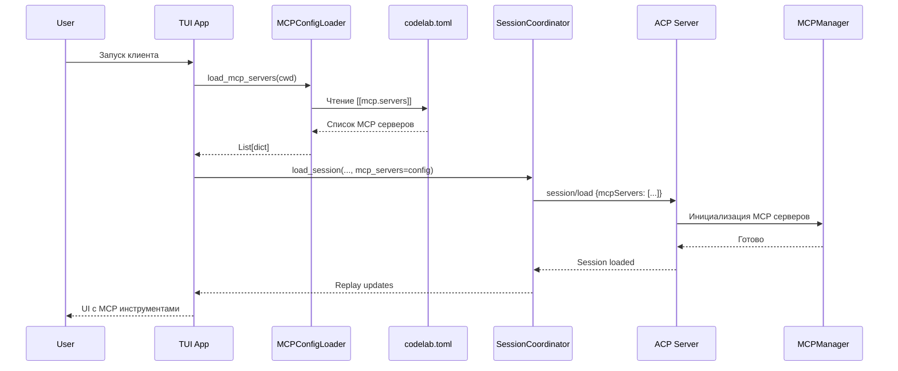
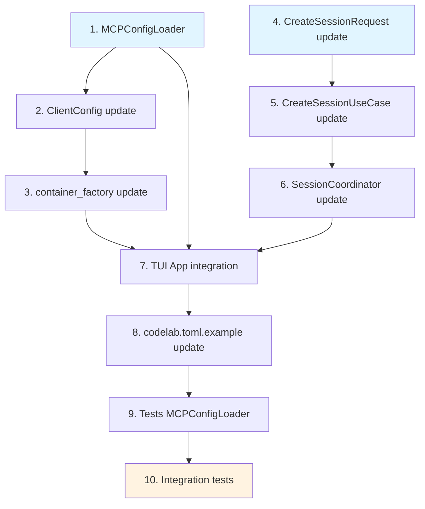

# План реализации: MCP конфигурация из TOML на стороне клиента

## Обзор

Клиент ACP загружает конфигурацию MCP серверов из TOML файлов (`codelab.toml`, `codelab.local.toml`, и т.д.) и передает её серверу через ACP протокол при создании/загрузке сессии.

## Архитектурное решение



## Принятые решения

| Параметр | Решение |
|----------|---------|
| Архитектура | **Вариант A** — клиент читает TOML и передает серверу |
| MCPConfigLoader | **Независимый** от серверных модулей |
| Merge стратегия | **Override по `name`** |
| Env var expansion | **Во всех строковых полях** (`command`, `args[]`, `url`, `headers[].value`, `env[].value`) |
| Невалидные серверы | **Silent skip с warning** в лог |

## Поддерживаемый TOML формат

```toml
[[mcp.servers]]
name = "filesystem"
type = "stdio"
command = "npx"
args = ["-y", "@modelcontextprotocol/server-filesystem", "/project"]

[[mcp.servers]]
name = "github"
type = "http"
url = "https://api.githubcopilot.com/mcp/"
headers = [
  { name = "Authorization", value = "Bearer ${GITHUB_TOKEN}" }
]

[[mcp.servers]]
name = "custom"
type = "stdio"
command = "python"
args = ["-m", "my_mcp_server", "--stdio"]
env = [
  { name = "API_KEY", value = "${MY_API_KEY}" },
  { name = "DEBUG", value = "true" }
]
```

## План задач

| # | Задача | Файлы | Сложность |
|---|--------|-------|-----------|
| 1 | **MCPConfigLoader** — новый класс для чтения MCP серверов из TOML | `client/infrastructure/mcp_config_loader.py` (new) | 🔵 Medium |
| 2 | **ClientConfig** — добавить поле `mcp_servers` | `client/infrastructure/client_config.py` | 🟢 Easy |
| 3 | **container_factory** — передать `mcp_servers` в контейнер | `client/infrastructure/container_factory.py` | 🟢 Easy |
| 4 | **CreateSessionRequest** — добавить поле `mcp_servers` | `client/application/dto.py` | 🟢 Easy |
| 5 | **CreateSessionUseCase** — передать `mcpServers` в `session/new` | `client/application/use_cases.py` | 🟢 Easy |
| 6 | **SessionCoordinator.create_session()** — добавить параметр | `client/application/session_coordinator.py` | 🟢 Easy |
| 7 | **TUI App** — загрузить MCP конфиг при старте, передать в coordinator | `client/tui/app.py` | 🔵 Medium |
| 8 | **codelab.toml.example** — добавить примеры MCP секций | `codelab/codelab.toml.example` | 🟢 Easy |
| 9 | **Тесты MCPConfigLoader** | `tests/client/infrastructure/test_mcp_config_loader.py` (new) | 🔵 Medium |
| 10 | **Тесты интеграционные** | `tests/client/tui/`, `tests/client/application/` (update) | 🟡 Hard |

## Порядок выполнения

```
1 → 2 → 3 → 4 → 5 → 6 → 7 → 8 → 9 → 10
```

Шаги 1-3 можно делать параллельно с 4-6. Шаг 7 зависит от всех предыдущих.

---

## Детализация задач

### Задача 1: MCPConfigLoader

**Новый файл:** `codelab/src/codelab/client/infrastructure/mcp_config_loader.py`

**Ответственность:**
- Чтение TOML chain (аналогично `TUIConfigStore._load_from_toml_chain()`)
- Парсинг секции `[[mcp.servers]]`
- Env var expansion для `${VAR}` во всех строковых полях
- Валидация и нормализация конфигурации
- Возврат `list[dict[str, Any]]` в формате ACP протокола

**Интерфейс:**
```python
class MCPConfigLoader:
    def __init__(self, project_root: Path | None = None)
    def load_mcp_servers(self) -> list[dict[str, Any]]
```

**Логика:**
1. Найти TOML файлы в цепочке: `~/.codelab/codelab.toml` → `~/.codelab/auth.toml` → `./codelab.toml` → `./codelab.local.toml`
2. Загрузить и объединить все `[[mcp.servers]]` секции
3. Merge с **override по `name`**
4. Раскрыть env vars в `${VAR}` паттернах во всех строковых полях
5. Валидация: silent skip если missing `name` или (`command` для stdio / `url` для http)
6. Вернуть список словарей в формате ACP протокола

**Env var expansion:**
- `command` — прямая строка
- `args[]` — каждый элемент массива
- `url` — прямая строка
- `headers[].value` — строка в словаре
- `env[].value` — строка в словаре

---

### Задача 2: ClientConfig

**Файл:** `codelab/src/codelab/client/infrastructure/client_config.py`

**Изменения:**
- Добавить поле `mcp_servers: list[dict[str, Any]] = field(default_factory=list)` в `ClientConfig`

---

### Задача 3: container_factory

**Файл:** `codelab/src/codelab/client/infrastructure/container_factory.py`

**Изменения:**
- Добавить параметр `mcp_servers: list[dict[str, Any]] | None = None` в `create_client_container()`
- Передать `mcp_servers` в `ClientConfig`

---

### Задача 4: CreateSessionRequest

**Файл:** `codelab/src/codelab/client/application/dto.py`

**Изменения:**
- Добавить поле `mcp_servers: list[dict[str, Any]] | None = None` в `CreateSessionRequest` (аналогично `LoadSessionRequest`)

---

### Задача 5: CreateSessionUseCase

**Файл:** `codelab/src/codelab/client/application/use_cases.py`

**Изменения:**
- В `execute()` добавить передачу `mcpServers` в параметры `session/new`
- Аналогично тому как это сделано в `LoadSessionUseCase`

---

### Задача 6: SessionCoordinator.create_session()

**Файл:** `codelab/src/codelab/client/application/session_coordinator.py`

**Изменения:**
- Добавить параметр `mcp_servers: list[dict[str, Any]] | None = None` в `create_session()`
- Передать в `CreateSessionRequest`

---

### Задача 7: TUI App Integration

**Файл:** `codelab/src/codelab/client/tui/app.py`

**Изменения:**
- В `on_mount()` или при инициализации:
  - Создать `MCPConfigLoader(project_root=Path(self._cwd))`
  - Загрузить MCP серверы: `mcp_servers = loader.load_mcp_servers()`
  - Логировать количество загруженных MCP серверов
  - Хранить загруженные MCP серверы как `self._mcp_servers`

- В `_load_selected_session_history()`:
  - Заменить `mcp_servers=[]` на `mcp_servers=self._mcp_servers`

---

### Задача 8: codelab.toml.example

**Файл:** `codelab/codelab.toml.example`

**Изменения:**
- Добавить секцию с примерами MCP серверов после `[tui]` секции
- Включить примеры stdio и http транспортов
- Добавить комментарии о безопасности (не хранить API keys в TOML)

---

### Задача 9: Тесты MCPConfigLoader

**Новый файл:** `codelab/tests/client/infrastructure/test_mcp_config_loader.py`

**Тестовые сценарии:**
1. Загрузка MCP серверов из TOML файла
2. Env var expansion в MCP конфигурации
3. TOML chain merge для MCP серверов (override по name)
4. Валидация MCP конфигурации (missing name/command/url)
5. Пустой список при отсутствии MCP секции
6. Silent skip невалидных серверов с warning

---

### Задача 10: Интеграционные тесты

**Файлы:**
- `codelab/tests/client/tui/test_config.py` — обновить
- `codelab/tests/client/application/test_session_coordinator.py` — обновить
- `codelab/tests/client/application/test_use_cases.py` — обновить

**Тестовые сценарии:**
1. TUI App → MCPConfigLoader → SessionCoordinator → MCP серверы
2. CreateSessionUseCase передает mcpServers в session/new
3. LoadSessionUseCase передает mcpServers в session/load

---

## Зависимости задач



**Параллельные группы:**
- **Группа 1:** Задачи 1, 4 (независимые)
- **Группа 2:** Задачи 2, 5, 6 (зависят от группы 1)
- **Группа 3:** Задача 3 (зависит от 2)
- **Группа 4:** Задача 7 (зависит от 1, 3, 6)
- **Группа 5:** Задачи 8, 9, 10 (последовательно после 7)

---

## Проверка

После реализации:

```bash
cd codelab
uv run ruff check .
uv run ty check
uv run python -m pytest
```

Или из корня:

```bash
make check
```
