# Архитектура ACP Protocol — Детальное руководство

## Оглавление

1. [Введение](#введение)
2. [Обзор системы](#обзор-системы)
3. [Архитектура на уровне компонентов](#архитектура-на-уровне-компонентов)
4. [Потоки данных](#потоки-данных)
5. [Двухуровневая история в codelab.server](#двухуровневая-история)
6. [Background Receive Loop в codelab.client](#background-receive-loop)
7. [Критические архитектурные решения](#критические-архитектурные-решения)
8. [Расширение и интеграция](#расширение-и-интеграция)

---

## Введение

ACP (Agent Client Protocol) — стандартный протокол взаимодействия между LLM-агентами и клиентами для выполнения задач с инструментами.

Проект реализован как **монорепозиторий** с двумя независимыми Python-компонентами:
- **[codelab/](codelab/)** — серверная реализация протокола с LLM-агентом и управлением сессиями
- **[codelab/](codelab/)** — клиентская реализация с TUI интерфейсом на базе Clean Architecture

---

## Обзор системы

### Диаграмма высокоуровневой архитектуры

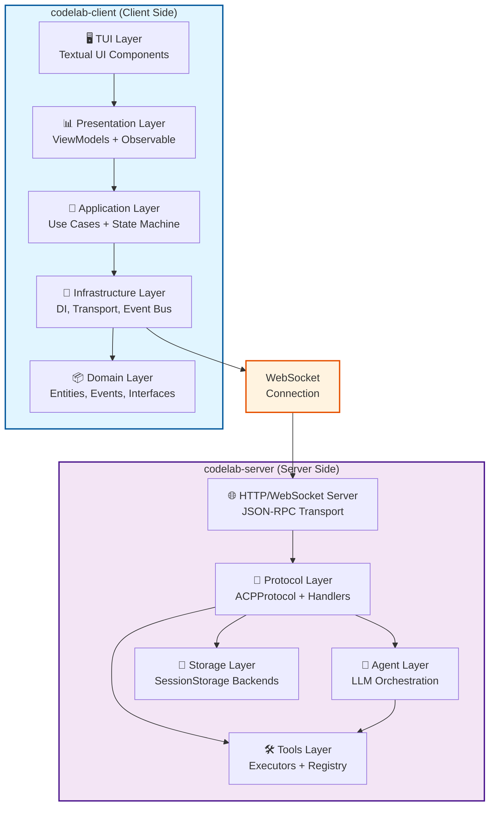

### Таблица компонентов

| Компонент | Слой | Ответственность | Файлы |
|-----------|------|-----------------|-------|
| **TUI** | Presentation | Textual компоненты, User Interaction | `codelab/src/codelab/client/tui/` |
| **ViewModels** | Presentation | MVVM паттерн, Observable state | `codelab/src/codelab/client/presentation/` |
| **Use Cases** | Application | Business scenarios, DTOs | `codelab/src/codelab/client/application/` |
| **DIContainer** | Infrastructure | Dependency Injection | [`codelab/src/codelab/client/infrastructure/di_container.py`](codelab/src/codelab/client/infrastructure/di_container.py:33) |
| **BackgroundReceiveLoop** | Infrastructure | Единственный receive() на WebSocket | [`codelab/src/codelab/client/infrastructure/services/background_receive_loop.py`](codelab/src/codelab/client/infrastructure/services/background_receive_loop.py:22) |
| **MessageRouter** | Infrastructure | Маршрутизация сообщений | [`codelab/src/codelab/client/infrastructure/services/message_router.py`](codelab/src/codelab/client/infrastructure/services/message_router.py:26) |
| **EventBus** | Infrastructure | Pub/Sub система событий | [`codelab/src/codelab/client/infrastructure/events/bus.py`](codelab/src/codelab/client/infrastructure/events/bus.py) |
| **ACPProtocol** | Protocol | Диспетчер методов ACP | [`codelab/src/codelab/server/protocol/core.py`](codelab/src/codelab/server/protocol/core.py:39) |
| **Handlers** | Protocol | Обработчики методов (auth, session, prompt) | [`codelab/src/codelab/server/protocol/handlers/`](codelab/src/codelab/server/protocol/handlers/) |
| **PromptOrchestrator** | Protocol | Главный оркестратор prompt-turn | [`codelab/src/codelab/server/protocol/handlers/prompt_orchestrator.py`](codelab/src/codelab/server/protocol/handlers/prompt_orchestrator.py:32) |
| **AgentOrchestrator** | Agent | Управление LLM-агентом | [`codelab/src/codelab/server/agent/orchestrator.py`](codelab/src/codelab/server/agent/orchestrator.py:18) |
| **ToolRegistry** | Tools | Регистрация и управление инструментами | [`codelab/src/codelab/server/tools/registry.py`](codelab/src/codelab/server/tools/registry.py) |
| **Storage** | Storage | Persistence для сессий | [`codelab/src/codelab/server/storage/`](codelab/src/codelab/server/storage/) |
| **HttpServer** | Transport | WebSocket endpoint и JSON-RPC | [`codelab/src/codelab/server/http_server.py`](codelab/src/codelab/server/http_server.py) |

---

## Архитектура на уровне компонентов

### codelab-server: Внутренняя структура

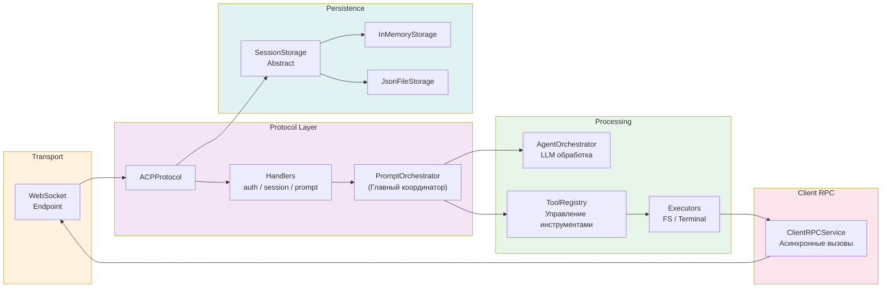

### codelab-client: Clean Architecture в 5 слоев

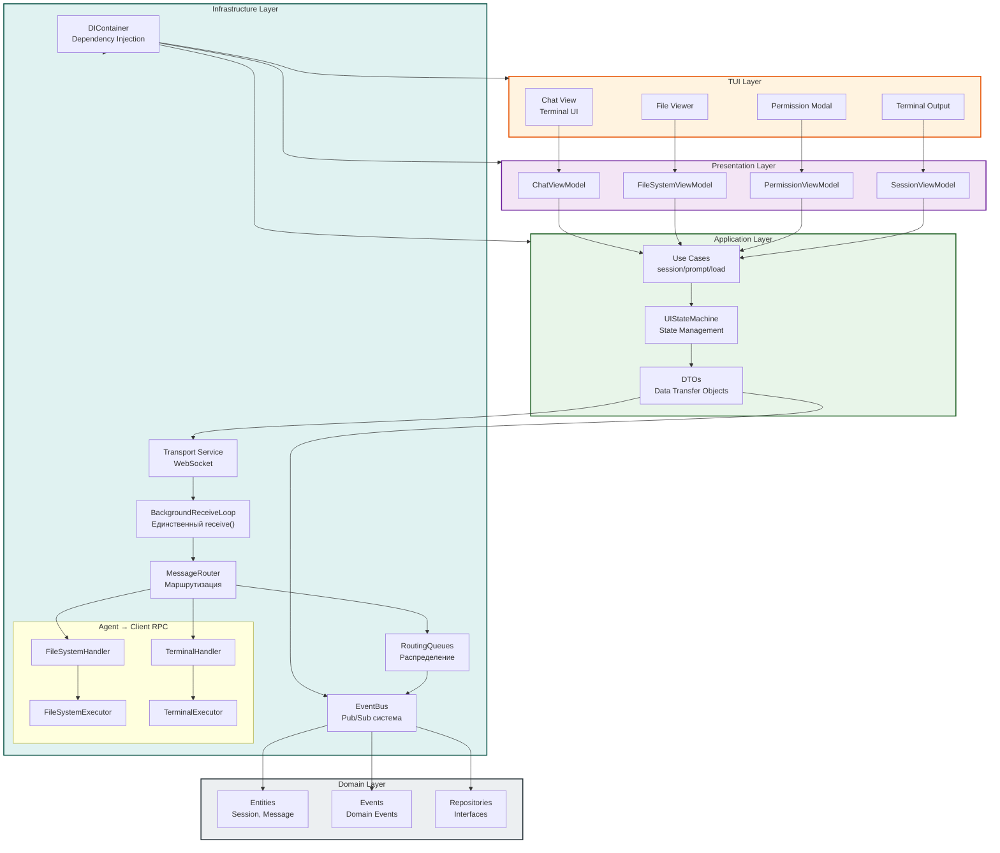

---

## Потоки данных

### 1. Отправка промпта (Client → Server)

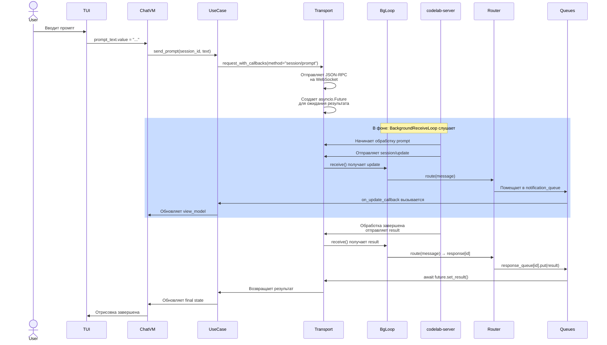

### 2. Обработка session/prompt на сервере

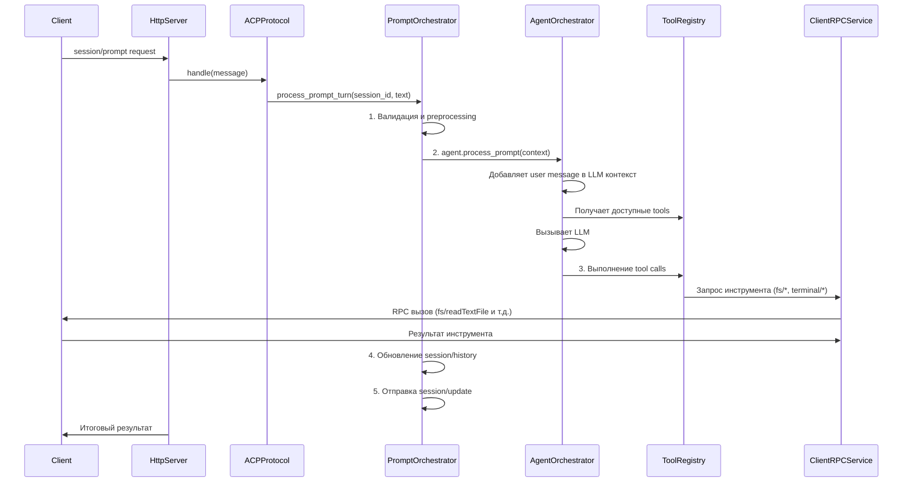

### 3. Обработка permission request на клиенте

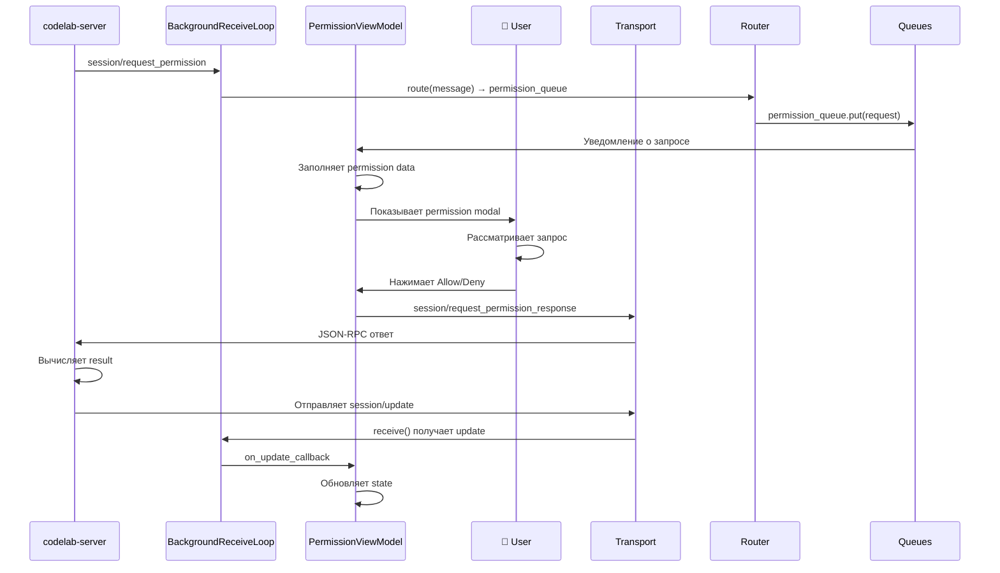

### 4. Background Receive Loop: Маршрутизация сообщений

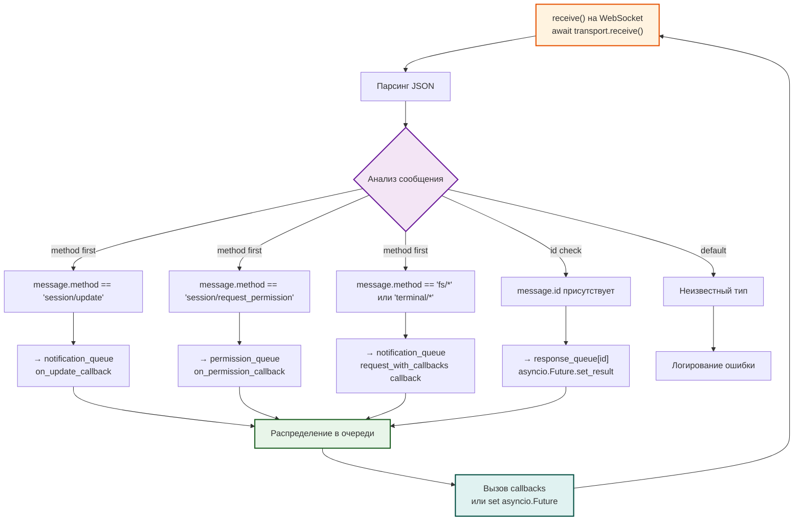

---

## Двухуровневая история

### SessionState.history vs events_history

На сервере в codelab.server существует **двухуровневая система истории**:

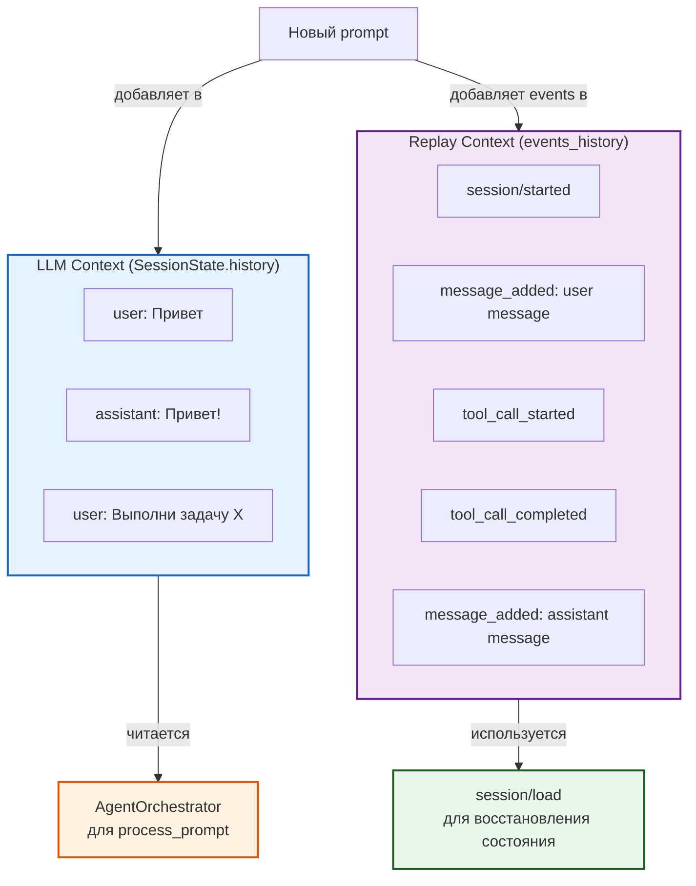

**Ключевые различия:**

| Аспект | SessionState.history | events_history |
|--------|----------------------|-----------------|
| **Содержание** | Message objects (user/assistant) | Structured events (started, added, completed) |
| **Использование** | Передача LLM для контекста | Восстановление state при load |
| **Обновление** | Централизованно в PromptOrchestrator | Через TurnLifecycleManager |
| **Размер** | Компактный (только сообщения) | Расширенный (все события) |
| **Воспроизведение** | Невозможно (информация потеряна) | Полное восстановление через replay |

**Архитектурное решение:**
- **AgentOrchestrator.process_prompt()** — **НЕ** модифицирует SessionState
- **PromptOrchestrator** отвечает за добавление messages в history
- **TurnLifecycleManager** добавляет события в events_history
- Это обеспечивает **разделение ответственности** и **централизованное управление**

---

## Background Receive Loop

### Проблема: Race Condition при конкурентном доступе к WebSocket

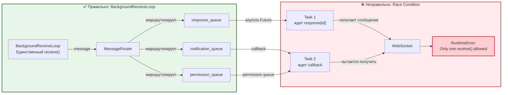

### Архитектура BackgroundReceiveLoop

```
┌─────────────────────────────────────────────────────────┐
│         BackgroundReceiveLoop                           │
│                                                          │
│  ┌──────────────────────────────────────────────┐      │
│  │ Главный цикл (asyncio.Task)                  │      │
│  │                                               │      │
│  │  while not should_stop:                      │      │
│  │    message = await transport.receive()       │      │
│  │    routing_key = router.route(message)       │      │
│  │    queue = queues.get(routing_key)           │      │
│  │    queue.put(message)                        │      │
│  └──────────────────────────────────────────────┘      │
│                     │                                   │
│    ┌────────────────┼────────────────┐                 │
│    ▼                ▼                ▼                 │
│  ┌──────────┐  ┌──────────┐  ┌──────────────┐         │
│  │Response  │  │Notif.    │  │Permission    │         │
│  │Queue     │  │Queue     │  │Queue         │         │
│  │          │  │          │  │              │         │
│  │[id1]:    │  │events:   │  │requests:     │         │
│  │Future    │  │list      │  │list          │         │
│  │[id2]:    │  │          │  │              │         │
│  │Future    │  │          │  │              │         │
│  └──────────┘  └──────────┘  └──────────────┘         │
│      ▲              ▲              ▲                   │
│      │              │              │                   │
│  ┌───┴──────────────┴──────────────┴─────┐            │
│  │ Потребители:                          │            │
│  │ - request_with_callbacks              │            │
│  │ - on_update_callback                  │            │
│  │ - on_permission_callback              │            │
│  └───────────────────────────────────────┘            │
│                                                          │
└─────────────────────────────────────────────────────────┘
```

**Ключевые особенности:**

1. **Единственный receive()** — избегает RuntimeError при конкурентном доступе
2. **Маршрутизация на основе сообщения** — router.route() определяет очередь
3. **Три типа очередей:**
   - **response_queue** — RPC ответы (по id)
   - **notification_queue** — асинхронные уведомления (session/update, fs/*, terminal/*)
   - **permission_queue** — запросы разрешений
4. **Graceful shutdown** — await stop() дожидается завершения loop
5. **Диагностика** — счетчики сообщений и ошибок для мониторинга

---

## Критические архитектурные решения

### 1. Абстракция SessionStorage в codelab.server

**Проблема:** Нужна гибкость в выборе хранилища (в памяти для dev, на диске для prod).

**Решение:** [`SessionStorage(ABC)`](codelab/src/codelab/server/storage/base.py) — интерфейс с двумя реализациями:

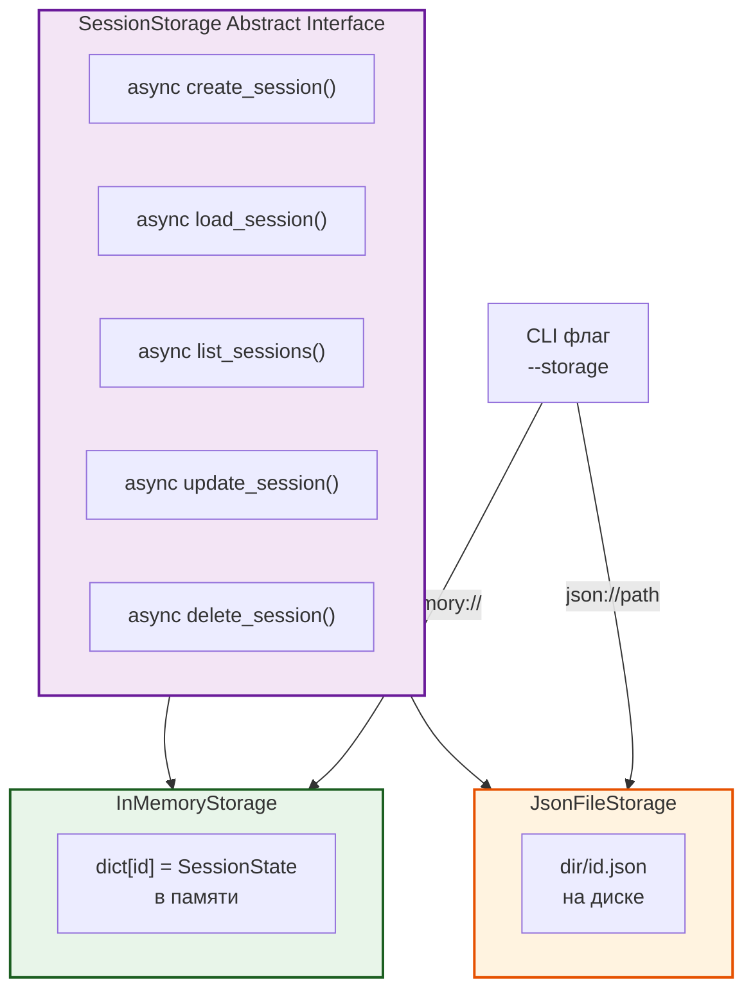

**Преимущества:**
- ✅ Easy testing (InMemoryStorage)
- ✅ Production persistence (JsonFileStorage)
- ✅ Plug-and-play новых backends (Redis, PostgreSQL)
- ✅ Изоляция логики хранения от протокола

### 2. Фильтрация инструментов по ClientRuntimeCapabilities

**Проблема:** Не все клиенты поддерживают все инструменты (например, некоторые не поддерживают file system операции).

**Решение:** [`ClientRuntimeCapabilities`](codelab/src/codelab/server/protocol/state.py) для фильтрации:

```python
# Пример из PromptOrchestrator
available_tools = [
    tool for tool in all_tools
    if client_capabilities.supports_tool(tool.id)
]
```

**Ключевые возможности:**
- `supports_filesystem`: Поддержка fs операций
- `supports_terminal`: Поддержка terminal операций
- `max_tool_call_iterations`: Максимальное количество итераций tool calls

### 3. ClientRPCService для асинхронных вызовов

**Проблема:** Инструменты (fs/*, terminal/*) должны выполняться асинхронно на клиенте, а сервер ждет результата.

**Решение:** [`ClientRPCService`](codelab/src/codelab/server/client_rpc/service.py) управляет [`asyncio.Future`](codelab/src/codelab/server/client_rpc/models.py):

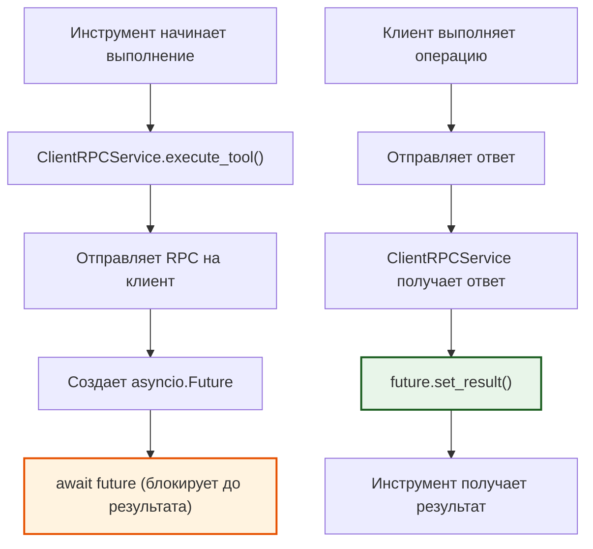

### 4. PromptOrchestrator как центральный координатор

**Проблема:** Обработка prompt-turn включает множество этапов (валидация, LLM, tools, permissions, обновления).

**Решение:** [`PromptOrchestrator`](codelab/src/codelab/server/protocol/handlers/prompt_orchestrator.py) интегрирует все компоненты:

```python
class PromptOrchestrator:
    def __init__(
        self,
        state_manager: StateManager,
        plan_builder: PlanBuilder,
        turn_lifecycle_manager: TurnLifecycleManager,
        tool_call_handler: ToolCallHandler,
        permission_manager: PermissionManager,
        client_rpc_handler: ClientRPCHandler,
        tool_registry: ToolRegistry,
    ):
        # Все компоненты инжектированы
        self.state_manager = state_manager
        self.plan_builder = plan_builder
        # ...
```

**Координирует:**
1. Валидацию входных данных
2. Преобразование контекста для LLM
3. Вызов агента
4. Управление tool calls
5. Проверку разрешений
6. Обновление состояния сессии
7. Отправку events в историю

---

## Расширение и интеграция

### Добавление нового инструмента в codelab.server

1. **Определить инструмент** в `tools/definitions/`
2. **Реализовать executor** в `tools/executors/`
3. **Зарегистрировать** в `PromptOrchestrator`

Пример:

```python
from acp_server.tools.base import ToolDefinition, ToolExecutor

class MyToolDefinition(ToolDefinition):
    id = "my/tool"
    name = "My Tool"
    
    async def execute(self, input_schema: dict) -> dict:
        # Реализация
        pass

class MyToolExecutor(ToolExecutor):
    async def execute(self, name: str, arguments: dict) -> dict:
        # Выполнение
        pass

# В PromptOrchestrator.__init__():
tool_registry.register("my/tool", MyToolDefinition(), MyToolExecutor())
```

### Добавление нового обработчика в codelab.client

1. **Создать handler** в `infrastructure/handlers/`
2. **Зарегистрировать** в [`HandlerRegistry`](codelab/src/codelab/client/infrastructure/handler_registry.py)
3. **Добавить tests** в `tests/`

Пример:

```python
from acp_client.infrastructure.handler_registry import HandlerRegistry

class MyHandler:
    async def handle(self, request: dict) -> dict:
        # Обработка запроса
        pass

# Регистрация:
registry = HandlerRegistry()
registry.register("my/method", MyHandler())
```

### Интеграция нового LLM провайдера

1. **Наследовать** [`BaseLLMProvider`](codelab/src/codelab/server/llm/base.py)
2. **Реализовать** `async generate()` метод
3. **Зарегистрировать** в CLI флаге `--llm-provider`

Пример:

```python
from acp_server.llm.base import BaseLLMProvider, LLMMessage

class MyLLMProvider(BaseLLMProvider):
    async def generate(self, messages: list[LLMMessage]) -> str:
        # Вызов API
        response = await my_api.generate(messages)
        return response.text
```

---

## Документы проекта

### Справочная документация

- **[codelab/README.md](codelab/README.md)** — основная документация проекта
- **[doc/product/developer-guide/](doc/product/developer-guide/)** — руководство разработчика

### Специальные документы

- **[AGENTS.md](AGENTS.md)** — инструкции для агентных ассистентов
- **[doc/ACP_IMPLEMENTATION_STATUS.md](doc/ACP_IMPLEMENTATION_STATUS.md)** — матрица соответствия ACP спецификации
- **[doc/Agent Client Protocol/](doc/Agent Client Protocol/)** — официальная спецификация ACP (не менять!)

---

## Заключение

Архитектура Codelab разработана для:
- ✅ **Модульности** — каждый компонент отвечает за одно
- ✅ **Расширяемости** — добавление новых компонентов не требует изменений существующих
- ✅ **Тестируемости** — все слои имеют интерфейсы для mock-объектов
- ✅ **Производительности** — асинхронность, потоковые обновления, оптимальные структуры данных
- ✅ **Безопасности** — валидация, аутентификация, логирование всех операций
