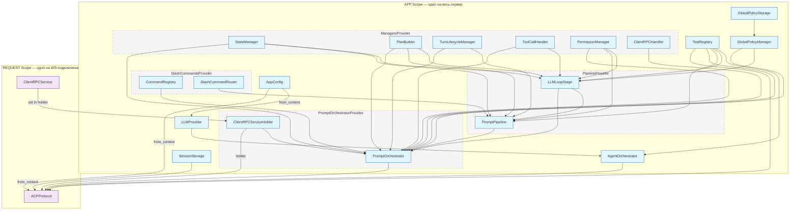

# CodeLab

Унифицированная реализация ACP (Agent Client Protocol) — сервер агента и клиент в одном пакете.

## Установка

```bash
# Базовая установка
uv pip install -e .

# С поддержкой сервера
uv pip install -e ".[server]"

# С TUI клиентом
uv pip install -e ".[tui]"

# Полная установка
uv pip install -e ".[full]"

# С поддержкой Web UI (браузер)
uv pip install -e ".[web]"
```

### Глобальная установка через pipx

Для установки `codelab` как глобального CLI-инструмента (изолированно от других пакетов) используйте [pipx](https://pipx.pypa.io/):

```bash
# Установка из ветки develop
pipx install "git+https://github.com/pese-git/codelab-ai.git@develop#subdirectory=codelab"

# Или установка из ветки master (по умолчанию)
pipx install "git+https://github.com/pese-git/codelab-ai.git#subdirectory=codelab"
```

> **Примечание:** Параметр `@develop` (или любое другое имя ветки/тега) — необязательный. Если не указан, будет использована ветка по умолчанию (`master`).

После установки команда `codelab` будет доступна глобально.

## Структура проекта

```
codelab/
├── src/codelab/
│   ├── shared/           # Общие модули
│   │   ├── messages.py   # JSON-RPC сообщения
│   │   ├── logging.py    # Структурированное логирование
│   │   └── content/      # Типы контента ACP
│   ├── server/           # Серверная часть (агент)
│   └── client/           # Клиентская часть (TUI)
```

## CLI

После установки доступна команда `codelab`:

```bash
# Справка
codelab --help

# Запуск сервера агента
codelab serve --port 8765

# Запуск TUI клиента
codelab connect --host localhost --port 8765
```

### Web UI

При запуске сервера командой `codelab serve` доступен Web UI на корневом пути `/`:

```bash
# Запуск сервера с Web UI
codelab serve --port 4096
# Откройте http://127.0.0.1:4096/ в браузере

# Запуск сервера без Web UI
codelab serve --port 4096 --no-web
```

**Примечание:** Web UI требует установки дополнительного пакета `textual-web`:
```bash
pip install 'codelab[web]'
```

Если `textual-web` не установлен, на корневом пути будет отображаться информативная страница с инструкциями по установке.

## Использование

### Shared модули

```python
from codelab.shared import ACPMessage, JsonRpcError, setup_logging
from codelab.shared.content import TextContent, ImageContent

# Создание JSON-RPC сообщения
msg = ACPMessage.request("session/prompt", {"prompt": "Hello"})

# Настройка логирования
logger = setup_logging(level="DEBUG", log_file="default")
logger.info("app_started", version="1.0.0")
```

## Домашняя директория

При первом запуске `codelab` автоматически создаётся домашняя директория `~/.codelab/` со следующей структурой:

```
~/.codelab/
├── config/   # Конфигурационные файлы
├── logs/     # Файлы логов (codelab.log)
├── data/     # Сессии, история
└── cache/    # Кэш MCP и временные данные
```

## Конфигурация

Создайте файл `.env` на основе `.env.example`:

```bash
cp .env.example .env
```

Основные переменные окружения:

| Переменная | Описание | По умолчанию |
|------------|----------|--------------|
| `CODELAB_LLM_PROVIDER` | Провайдер LLM (openai, mock) | `mock` |
| `OPENAI_API_KEY` | API ключ OpenAI | - |
| `CODELAB_LLM_MODEL` | Модель LLM | `gpt-4o` |
| `CODELAB_PORT` | Порт сервера | `8765` |
| `CODELAB_HOST` | Хост сервера | `127.0.0.1` |
| `CODELAB_LOG_LEVEL` | Уровень логирования | `INFO` |

## Архитектура сервера

Сервер использует DI-контейнер **Dishka** для управления зависимостями. Зависимости разделены на два уровня:

- **APP scope** — живут всё время работы сервера (LLM-провайдер, реестр инструментов, оркестратор агента, менеджер политик).
- **REQUEST scope** — создаются вручную при каждом WebSocket-подключении (оркестратор промптов, протокол ACP, сервис RPC к клиенту).



### Как это работает

1. При запуске `codelab serve` создаётся DI-контейнер (`di.make_container`) со всеми APP-зависимостями: менеджеры, pipeline-стадии, провайдеры LLM, инструменты, агент.
2. `PromptOrchestrator` и `PromptPipeline` создаются один раз в APP scope со всеми зависимостями.
3. При каждом WebSocket-подключении создаётся `ClientRPCService`, устанавливается в `ClientRPCServiceHolder`, и REQUEST scope получает `ACPProtocol` с уже настроенным holder.
4. `ClientRPCServiceHolder` — мост между APP и REQUEST scope: сервис обновляется per-request, а `PromptOrchestrator` и `ACPProtocol` используют holder без пересоздания.

## Разработка

```bash
# Установка dev-зависимостей
uv pip install -e ".[dev]"

# Проверка кода
uv run ruff check src/
uv run ty check

# Запуск тестов
uv run pytest
```
