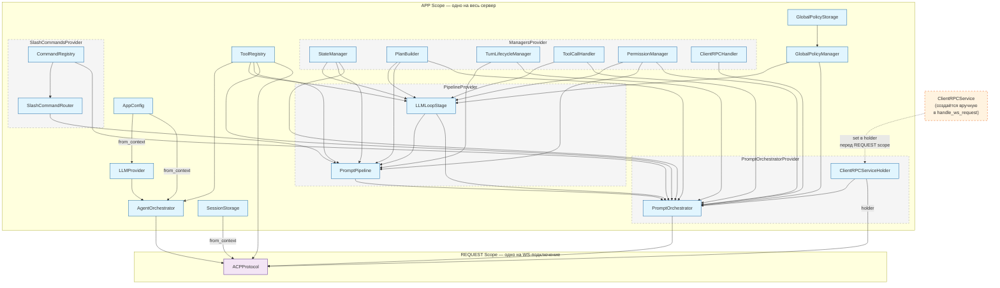
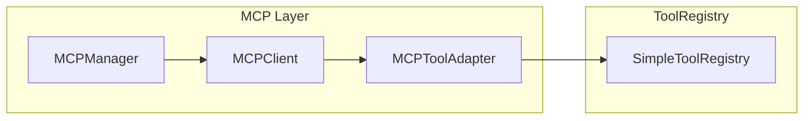

# CodeLab

Унифицированная реализация ACP (Agent Client Protocol) — сервер агента и клиент в одном пакете.

## Быстрый старт за 5 минут

Запуск CodeLab с локальной LLM через Ollama:

```bash
# 1. Установка Ollama (macOS)
brew install ollama

# 2. Скачивание модели
ollama pull gemma4:e2b

# 3. Установка CodeLab
pipx install "git+https://github.com/pese-git/codelab-ai.git#subdirectory=codelab"

# 4. Запуск приложения
CODELAB_LLM_PROVIDER=openai CODELAB_LLM_MODEL=gemma4:e2b CODELAB_LLM_BASE_URL=http://localhost:11434 codelab
```

> 📖 Подробнее: [Настройка Ollama](../doc/product/getting-started/05-ollama-setup.md)

## Установка

```bash
# Базовая установка
uv pip install -e .

# С поддержкой сервера
uv pip install -e ".[server]"

# С TUI клиентом
uv pip install -e ".[tui]"

# Полная установка
uv pip install -e ".[full]"

# С поддержкой Web UI (браузер)
uv pip install -e ".[web]"
```

### Глобальная установка через pipx

Для установки `codelab` как глобального CLI-инструмента (изолированно от других пакетов) используйте [pipx](https://pipx.pypa.io/):

```bash
# Установка из ветки develop
pipx install "git+https://github.com/pese-git/codelab-ai.git@develop#subdirectory=codelab"

# Или установка из ветки main (по умолчанию)
pipx install "git+https://github.com/pese-git/codelab-ai.git#subdirectory=codelab"
```

> **Примечание:** Параметр `@develop` (или любое другое имя ветки/тега) — необязательный. Если не указан, будет использована ветка по умолчанию (`main`).

После установки команда `codelab` будет доступна глобально.

## Структура проекта

```
codelab/
├── src/codelab/
│   ├── shared/           # Общие модули
│   │   ├── messages.py   # JSON-RPC сообщения
│   │   ├── logging.py    # Структурированное логирование
│   │   └── content/      # Типы контента ACP
│   ├── server/           # Серверная часть (агент)
│   └── client/           # Клиентская часть (TUI)
```

## CLI

После установки доступна команда `codelab`:

```bash
# Справка
codelab --help

# Запуск сервера агента
codelab serve --port 8765

# Запуск TUI клиента
codelab connect --host localhost --port 8765
```

### Web UI

При запуске сервера командой `codelab serve` доступен Web UI на корневом пути `/`:

```bash
# Запуск сервера с Web UI
codelab serve --port 4096
# Откройте http://127.0.0.1:4096/ в браузере

# Запуск сервера без Web UI
codelab serve --port 4096 --no-web
```

**Примечание:** Web UI требует установки дополнительного пакета `textual-web`:
```bash
pip install 'codelab[web]'
```

Если `textual-web` не установлен, на корневом пути будет отображаться информативная страница с инструкциями по установке.

## Использование

### Shared модули

```python
from codelab.shared import ACPMessage, JsonRpcError, setup_logging
from codelab.shared.content import TextContent, ImageContent

# Создание JSON-RPC сообщения
msg = ACPMessage.request("session/prompt", {"prompt": "Hello"})

# Настройка логирования
logger = setup_logging(level="DEBUG", log_file="default")
logger.info("app_started", version="1.0.0")
```

## Домашняя директория

При первом запуске `codelab` автоматически создаётся домашняя директория `~/.codelab/` со следующей структурой:

```
~/.codelab/
├── config/   # Конфигурационные файлы
├── logs/     # Файлы логов (codelab.log)
├── data/     # Сессии, история
└── cache/    # Кэш MCP и временные данные
```

## Конфигурация

Создайте файл `.env` на основе `.env.example`:

```bash
cp .env.example .env
```

Основные переменные окружения:

| Переменная | Описание | По умолчанию |
|------------|----------|--------------|
| `CODELAB_LLM_PROVIDER` | Активный провайдер LLM | `mock` |
| `CODELAB_LLM_MODEL` | Модель в формате `"provider/model"` | `mock/mock-model` |
| `CODELAB_LLM_PROVIDERS` | Список провайдеров через запятую | `openai,mock` |
| `OPENAI_API_KEY` | API ключ OpenAI | - |
| `ANTHROPIC_API_KEY` | API ключ Anthropic | - |
| `CODELAB_FALLBACK_ENABLED` | Включить fallback | `false` |
| `CODELAB_FALLBACK_STRATEGY` | Стратегия fallback | `sequential` |
| `CODELAB_FALLBACK_ORDER` | Порядок провайдеров через запятую | - |
| `CODELAB_PORT` | Порт сервера | `8765` |
| `CODELAB_HOST` | Хост сервера | `127.0.0.1` |
| `CODELAB_LOG_LEVEL` | Уровень логирования | `INFO` |

### Поддерживаемые LLM провайдеры

| Провайдер | ID | Модели по умолчанию | Base URL |
|-----------|----|---------------------|----------|
| OpenAI | `openai` | `gpt-4o`, `o3`, `o4-mini` | `https://api.openai.com/v1` |
| Anthropic | `anthropic` | `claude-sonnet-4`, `claude-opus-4` | `https://api.anthropic.com` |
| OpenRouter | `openrouter` | `mistral-large`, `llama-3.1` | `https://openrouter.ai/api/v1` |
| Zen | `zen` | `zen-sonnet` | `https://zen.opencode.ai/v1` |
| Go | `go` | `go-fast` | `https://go.opencode.ai/v1` |
| Ollama | `ollama` | `llama3.1:70b`, `mistral` | `http://localhost:11434/v1` |
| LMStudio | `lmstudio` | local models | `http://localhost:1234/v1` |
| Mock | `mock` | `mock-model` | N/A |

### Fallback система

При ошибках основного провайдера можно настроить fallback цепочку:

```bash
codelab serve --fallback-enabled --fallback-strategy sequential --fallback-order openai,openrouter,ollama
```

Fallback перебирает провайдеры по порядку при retryable ошибках (rate_limit, timeout, internal_error).

## Архитектура сервера

Сервер использует DI-контейнер **Dishka** для управления зависимостями. Зависимости разделены на два уровня:

- **APP scope** — живут всё время работы сервера (LLM-провайдер, реестр инструментов, оркестратор агента, менеджер политик).
- **REQUEST scope** — создаётся при каждом WebSocket-подключении (`ACPProtocol`). `ClientRPCService` создаётся вручную вне контейнера и устанавливается в holder перед входом в REQUEST scope.



### Как это работает

1. При запуске `codelab serve` создаётся DI-контейнер (`di.make_container`) со всеми APP-зависимостями: менеджеры, pipeline-стадии, провайдеры LLM, инструменты, агент.
2. `PromptOrchestrator` и `PromptPipeline` создаются один раз в APP scope со всеми зависимостями.
3. При каждом WebSocket-подключении создаётся `ClientRPCService`, устанавливается в `ClientRPCServiceHolder`, и REQUEST scope получает `ACPProtocol` с уже настроенным holder.
4. `ClientRPCServiceHolder` — мост между APP и REQUEST scope: сервис обновляется per-request, а `PromptOrchestrator` и `ACPProtocol` используют holder без пересоздания.

## Архитектура клиента

Клиент использует DI-контейнер **Dishka** (`make_container`) со скоупом `APP` — все зависимости создаются один раз и живут до завершения процесса. Провайдеры разделены на два класса:

- **`ClientProvider`** — инфраструктурные сервисы (транспорт, репозитории, обработчики).
- **`ViewModelProvider`** — ViewModels для MVVM-слоя.

Циклическая зависимость `SessionCoordinator ↔ PermissionHandler` разрешается через двухфазную инициализацию в `CoreServices`.

```mermaid
graph TD
    subgraph APP["APP Scope — один контейнер на весь процесс"]
        CFG["ClientConfig\n(from context)"]

        subgraph ClientProv["ClientProvider"]
            LOG[BoundLogger]
            EB[EventBus]
            TS["TransportService\n↳ ACPTransportService"]
            SR["SessionRepository\n↳ InMemorySessionRepository"]
            FSE[FileSystemExecutor]
            FSH[FileSystemHandler]
            TE[TerminalExecutor]
            TH[TerminalHandler]

            subgraph CoreSvcs["CoreServices  ⟳ двухфазная инициализация"]
                SC[SessionCoordinator]
                PH[PermissionHandler]
            end
        end

        subgraph VMProv["ViewModelProvider"]
            UI_VM[UIViewModel]
            SESS_VM[SessionViewModel]
            PLAN_VM[PlanViewModel]
            CHAT_VM[ChatViewModel]
            TERM_VM[TerminalViewModel]
            FS_VM[FileSystemViewModel]
            FV_VM[FileViewerViewModel]
            PERM_VM[PermissionViewModel]
            TLOG_VM[TerminalLogViewModel]
        end
    end

    TUI["ACPClientApp\ntui/app.py"]

    %% Config
    CFG --> LOG
    CFG -->|host, port| TS
    CFG -->|cwd| FSE

    %% Infrastructure
    FSE --> FSH
    TE --> TH

    %% CoreServices: разрыв цикла
    TS --> CoreSvcs
    SR --> CoreSvcs
    LOG --> CoreSvcs
    CoreSvcs --> SC
    CoreSvcs --> PH
    SC -. "_permission_handler\npost-init" .-> PH
    TS -. "_permission_handler\npost-init" .-> PH

    %% ViewModels: все получают EventBus + BoundLogger
    EB --> UI_VM & PLAN_VM & TERM_VM & FS_VM & FV_VM & PERM_VM & TLOG_VM
    LOG --> UI_VM & PLAN_VM & TERM_VM & FS_VM & FV_VM & PERM_VM & TLOG_VM
    SC --> SESS_VM & CHAT_VM
    EB --> SESS_VM & CHAT_VM
    LOG --> SESS_VM & CHAT_VM
    PLAN_VM --> CHAT_VM
    CFG --> CHAT_VM
    FSE --> CHAT_VM
    TE --> CHAT_VM

    %% TUI резолвит из контейнера
    TUI -->|"get(SessionCoordinator)"| SC
    TUI -->|"get(TransportService)"| TS
    TUI -->|get ViewModels| UI_VM & SESS_VM & CHAT_VM & PLAN_VM
    TUI -->|get ViewModels| TERM_VM & FS_VM & FV_VM & PERM_VM & TLOG_VM

    classDef svc fill:#e1f5fe,stroke:#01579b
    classDef vm fill:#f3e5f5,stroke:#4a148c
    classDef cfg fill:#fff3e0,stroke:#e65100
    classDef tui fill:#e8f5e9,stroke:#1b5e20
    class LOG,EB,TS,SR,FSE,FSH,TE,TH,SC,PH svc
    class UI_VM,SESS_VM,PLAN_VM,CHAT_VM,TERM_VM,FS_VM,FV_VM,PERM_VM,TLOG_VM vm
    class CFG cfg
    class TUI tui
```



### Как это работает

1. При запуске `codelab connect` создаётся DI-контейнер через `create_client_container()` — все APP-зависимости инициализируются один раз.
2. `CoreServices` — фабрика, которая создаёт `SessionCoordinator` и `PermissionHandler` в два шага, а затем связывает их через `_permission_handler`, обходя циклическую зависимость.
3. `ACPClientApp` резолвит `SessionCoordinator`, `TransportService` и все 9 ViewModels в `__init__` через `container.get()` — без Service Locator в методах.
4. При выходе `on_unmount` вызывает `transport.disconnect()` и `container.close()`.

### Отмена промпта

`TransportService.request_with_callbacks()` удерживает глобальный `asyncio.Lock` на всё время выполнения `session/prompt`. Чтобы отмена не вставала в очередь за этим локом, `TransportService` предоставляет отдельный метод:

```
cancel_prompt(session_id) → обходит _callbacks_request_lock
    └─ создаёт per-request response queue
    └─ отправляет session/cancel напрямую через send()
    └─ ждёт ответа (timeout 5 с) и очищает очередь
```

`ACPTransportService` переопределяет этот метод с lock-free реализацией. Базовый класс `TransportService` содержит fallback через `request_with_callbacks` для совместимости с другими реализациями транспорта.

На стороне сервера `session/cancel` отменяет активный `asyncio.Task` с LLM-запросом через `AgentOrchestrator.cancel_prompt()`, что немедленно прерывает HTTP-запрос к модели (`CancelledError`).

## MCP интеграция

CodeLab поддерживает Model Context Protocol (MCP) для подключения внешних инструментов:



**Компоненты:**
- `MCPManager` — управление несколькими MCP-серверами на сессию
- `MCPClient` — клиент для одного MCP-сервера с state machine
- `MCPToolAdapter` — адаптация MCP инструментов к ACP ToolDefinition
- `StdioTransport` — запуск MCP-серверов через stdio subprocess

**Использование:**
```json
{
  "mcpServers": {
    "filesystem": {
      "command": "npx",
      "args": ["-y", "@modelcontextprotocol/server-filesystem", "/path/to/dir"]
    }
  }
}
```

**Именование:** MCP инструменты получают namespace `mcp:server_id:tool_name`.

## Content Types

CodeLab поддерживает все типы контента ACP:

| Тип | Описание | MIME типы |
|-----|----------|-----------|
| `text` | Текстовые сообщения | `text/plain` |
| `diff` | Дифф изменений | `text/x-diff` |
| `image` | Изображения | `image/png`, `image/jpeg`, `image/gif`, `image/webp` |
| `audio` | Аудиоданные | `audio/wav`, `audio/mpeg` |
| `embedded` | Встроенные ресурсы | Ссылки на ресурсы |
| `resource_link` | Ссылки на ресурсы | URI |

**Pipeline обработки:**
```
ToolExecutor → ContentExtractor → ContentValidator → ContentFormatter → LLM
```

- `ContentExtractor` — извлечение content из tool results
- `ContentValidator` — валидация согласно ACP спецификации
- `ContentFormatter` — форматирование в LLM-специфичные форматы (OpenAI/Anthropic)

## Разработка

```bash
# Установка dev-зависимостей
uv pip install -e ".[dev]"

# Проверка кода
uv run ruff check src/
uv run ty check

# Запуск тестов
uv run pytest
```
