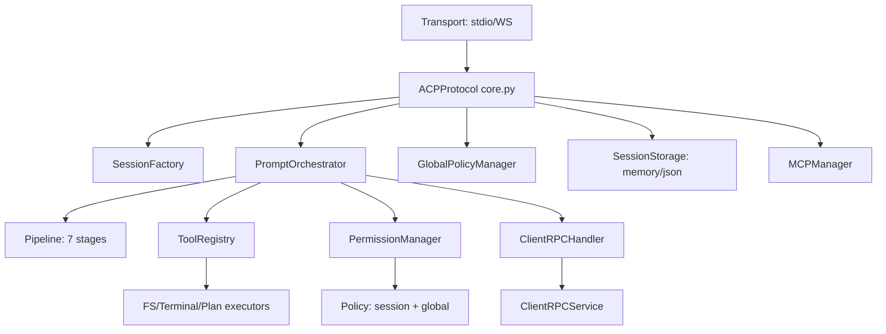
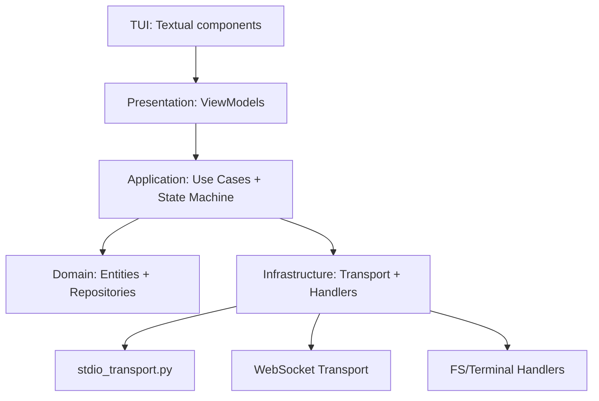

# Верифицированный отчёт: Реализация ACP Protocol

**Дата:** 2026-05-19
**Метод:** Ручная верификация кода vs спецификация `doc/Agent Client Protocol/`

---

## Сводка

| Метрика | Значение |
|---|---|
| Spec sections fully covered | **13** из 17 (76%) |
| Spec sections partially covered | 3 из 17 (18%) |
| Spec sections not covered | 1 из 17 (6%) — Streamable HTTP (draft) |
| Все ACP методы реализованы | ✅ 17 из 17 |
| stdio transport | ✅ Полностью (сервер + клиент) |
| Тестовых файлов | ~142 |
| Тестовых методов | ~2,230 |

---

## Статус по разделам спецификации

### ✅ 01. Overview — Полностью реализовано

| Метод ACP | Направление | Статус | Файл реализации |
|---|---|---|---|
| `initialize` | Client → Agent | ✅ | `server/protocol/handlers/auth.py` |
| `authenticate` | Client → Agent | ✅ | `server/protocol/handlers/auth.py` |
| `session/new` | Client → Agent | ✅ | `server/protocol/handlers/session.py` |
| `session/load` | Client → Agent | ✅ | `server/protocol/handlers/session.py` |
| `session/list` | Client → Agent | ✅ | `server/protocol/handlers/session.py` |
| `session/prompt` | Client → Agent | ✅ | `server/protocol/handlers/prompt.py` |
| `session/cancel` | Client → Agent | ✅ | `server/protocol/handlers/prompt.py` |
| `session/set_config_option` | Client → Agent | ✅ | `server/protocol/handlers/config.py` |
| `session/set_mode` | Client → Agent | ✅ | `server/protocol/handlers/config.py` |
| `session/update` | Agent → Client | ✅ | notification pipeline |
| `session/request_permission` | Agent → Client | ✅ | `server/protocol/handlers/permissions.py` |
| `fs/read_text_file` | Agent → Client | ✅ | `server/client_rpc/service.py` |
| `fs/write_text_file` | Agent → Client | ✅ | `server/client_rpc/service.py` |
| `terminal/create` | Agent → Client | ✅ | `server/client_rpc/service.py` |
| `terminal/output` | Agent → Client | ✅ | `server/client_rpc/service.py` |
| `terminal/wait_for_exit` | Agent → Client | ✅ | `server/client_rpc/service.py` |
| `terminal/release` | Agent → Client | ✅ | `server/client_rpc/service.py` |
| `terminal/kill` | Agent → Client | ✅ | `server/client_rpc/service.py` |

### ✅ 02. Initialization — Полностью реализовано

- Протокол v1, согласование версий (`core.py:203`)
- Client capabilities: `fs.readTextFile`, `fs.writeTextFile`, `terminal`
- Agent capabilities: `loadSession`, `mcpCapabilities` (http/sse), `promptCapabilities` (image/audio/embeddedContext), `sessionCapabilities.list`
- `agentInfo`: name=codelab-server, title=ACP Server, version=0.1.0
- Auth methods advertisement (метод `local` с api_key)

### ✅ 03. Session Setup — Полностью реализовано

- `session/new` с cwd (абсолютный путь), mcpServers
- `session/load` с replay истории через `ReplayManager` (`handlers/replay_manager.py`)
- MCP серверы: stdio transport ✅, HTTP/SSE declared но не подключены
- Session ID формат `sess_{uuid4().hex[:12]}`
- ConfigOptions и Modes в response

### ⚠️ 04. Session List — Частично реализовано

- ✅ `session/list` с cursor-based pagination (base64-encoded JSON)
- ✅ Фильтрация по cwd
- ✅ `session_info_update` notification
- ✅ Сортировка по `updatedAt` (reverse), page size = 50
- ❌ Нет тестов на pagination edge cases (invalid cursor, empty results boundary)

### ✅ 05. Prompt Turn — Полностью реализовано

- Pipeline pattern с 7 stages: Validation → SlashCommand → PlanBuilding → TurnLifecycle(open) → Directives → LLMLoop → TurnLifecycle(close)
- Streamed `agent_message_chunk`, `user_message_chunk`
- Tool call flow: pending → in_progress → completed/failed/cancelled
- Permission request flow с 4 опциями (allow_once, allow_always, reject_once, reject_always)
- Stop reasons: `end_turn`, `max_tokens`, `max_turn_requests`, `refusal`, `cancelled`
- Cancellation с корректной обработкой pending requests и tombstones

### ✅ 06. Content — Полностью реализовано

| Тип | Статус | Файл |
|---|---|---|
| Text | ✅ | `shared/content/text.py` |
| Image | ✅ (требует capability) | `shared/content/image.py` |
| Audio | ✅ (требует capability) | `shared/content/audio.py` |
| Embedded Resource | ✅ (требует capability) | `shared/content/embedded.py` |
| Resource Link | ✅ | `shared/content/resource_link.py` |
| Annotations | ✅ | `shared/content/base.py` |

### ✅ 08. Tool Calls — Полностью реализовано

- Tool call creation с toolCallId, title, kind, status
- Status transitions: pending → in_progress → completed/failed/cancelled
- Tool kinds: read, edit, delete, move, search, execute, think, fetch, switch_mode, other
- Tool call content: text, diff, terminal
- Locations (path + line) для "follow-along"
- rawInput / rawOutput — поддерживаются в модели
- Permission request flow интегрирован

### ✅ 09. File System — Полностью реализовано

- `fs/read_text_file` с line/limit параметрами
- `fs/write_text_file` с diff tracking (difflib)
- Capability checking перед вызовами
- Path normalization к absolute paths в рамках cwd

### ✅ 10. Terminal — Полностью реализовано

- `terminal/create` с command, args, env, cwd, outputByteLimit
- `terminal/output` с truncated flag и exitStatus
- `terminal/wait_for_exit` с exitCode/signal
- `terminal/kill` без release
- `terminal/release` с kill + cleanup
- Terminal embedding в tool calls

### ✅ 11. Agent Plan — Полностью реализовано

- Plan entries: content, priority (low/medium/high), status (pending/in_progress/completed)
- Plan update notifications через `session/update`
- `PlanExtractor` для извлечения из LLM response (JSON block, tool call)
- `update_plan` tool (kind=think, no permission required)
- Dynamic plan updates

### ✅ 12. Session Modes — Полностью реализовано

- Modes: ask, code (configurable через config specs)
- `session/set_mode` (legacy, делегирует set_config_option)
- `current_mode_update` notification
- Modes в session/new и session/load response

### ✅ 13. Session Config Options — Полностью реализовано

- `session/set_config_option` с валидацией по spec
- Config options: mode (ask/code), model (baseline)
- `config_option_update` notification
- Полный state в response (все options, не только изменённый)
- Приоритет configOptions над modes

### ✅ 14. Slash Commands — Полностью реализовано

- `available_commands_update` notification
- AvailableCommand с name, description, input.hint
- CommandRegistry, SlashCommandRouter
- Built-in команды: help, mode, status
- Dynamic updates

### ⚠️ 15. Extensibility — Частично реализовано

- ✅ `_meta` field поддерживается в Pydantic моделях
- ✅ Extension methods (`_` prefix) зарезервированы в spec
- ❌ Нет тестов на extensibility
- ❌ Custom capability advertisement через `_meta` не реализован явно

### ⚠️ 16. Transports — Частично реализовано

| Транспорт | Статус | Файл |
|---|---|---|
| stdio | ✅ Полностью | `server/transport/stdio.py` + `server/transport/stdio_runner.py` |
| WebSocket | ✅ Полностью | `server/http_server.py` |
| HTTP | ✅ Есть сервер | `server/http_server.py` |
| Streamable HTTP | ❌ Draft spec | Не реализован (как и в spec) |

**stdio transport (сервер):** `StdioServerTransport` (211 строк)
- Читает JSON-RPC из stdin (newline-delimited)
- Пишет ответы в stdout с line buffering
- Логи ТОЛЬКО в stderr
- Signal handlers (SIGTERM, SIGINT) для graceful shutdown

**stdio transport (клиент):** `StdioClientTransport` (285 строк)
- Запускает агент как subprocess
- Async context manager с graceful shutdown
- stdout/stderr background readers
- Queue-based message delivery

### ✅ 17. Schema — Полностью реализовано

- Все JSON Schema определения соответствуют spec
- Pydantic модели для всех типов с migration support

---

## Проблемы и гэпы

### 🔴 Критичные (нарушают spec compliance или стабильность)

#### 1. `session/mcp/*` методы не зарегистрированы

**Файл:** `server/protocol/handlers/mcp.py` (376 строк)
**Проблема:** Реализация существует (`session_mcp_add`, `session_mcp_remove`, `session_mcp_list`) но методы не добавлены в `_handlers` словарь в `core.py:156-167`.

**Исправление:** Добавить в `_handlers`:
```python
"session/mcp/add": self._handle_session_mcp_add,
"session/mcp/remove": self._handle_session_mcp_remove,
"session/mcp/list": self._handle_session_mcp_list,
```

#### 2. `handlers/legacy.py` отсутствует

**Проблема:** Упомянут в AGENTS.md с методами `ping`, `echo`, `shutdown`, но файл не существует. Эти методы не являются частью ACP spec, поэтому это скорее cleanup AGENTS.md.

### 🟡 Важные (рекомендуется для production)

#### 3. `NaiveAgent.cancel_prompt()` — заглушка

**Файл:** `server/agent/naive.py:202-210`
```python
async def cancel_prompt(self, session_id: str) -> None:
    pass  # Наивная реализация
```
**Влияние:** Отмена prompt turn работает на уровне `TurnLifecycleManager` (флаг `cancel_requested`), но LLM запрос не прерывается реально.

#### 4. `PlanBuildingStage` — no-op

**Файл:** `server/protocol/handlers/pipeline/stages/plan_building.py`
```python
async def process(self, context: PromptContext) -> PromptContext:
    return context  # Зарезервирована для будущей pre-plan логики
```
**Влияние:** План строится в `LLMLoopStage` из ответа LLM, а не на этой стадии.

#### 5. Дублирование `directives.py`

| Файл | Функции |
|---|---|
| `handlers/directives.py` (115 строк) | `resolve_tool_title`, `normalize_tool_kind`, `extract_prompt_directives` |
| `handlers/prompt.py` | Те же функции (дублируются) |

**Влияние:** Риск рассинхронизации, путаница при поддержке.

#### 6. Несоответствие имён инструментов wire-формату ACP

| Ожидается (ACP spec) | Реализовано | Файл |
|---|---|---|
| `fs/read_text_file` | `read_text_file` | `tools/definitions/filesystem.py:33` |
| `fs/write_text_file` | `write_text_file` | `tools/definitions/filesystem.py:76` |
| `terminal/create` | `execute_command` | `tools/definitions/terminal.py:34` |
| `terminal/wait_for_exit` | `wait_for_exit` | `tools/definitions/terminal.py:86` |
| `terminal/release` | `release_terminal` | `tools/definitions/terminal.py:119` |

**Влияние:** Имена инструментов используются для LLM function calling, а не для wire-формата JSON-RPC. Это не нарушает ACP spec (wire-формат — это `session/update` notifications, а не tool names), но создаёт путаницу.

#### 7. Только OpenAI LLM провайдер

- `llm/openai_provider.py` — полная реализация
- `llm/mock_provider.py` — для тестов
- ❌ Нет Anthropic/Claude, Google Gemini, Ollama, локальных моделей

#### 8. MCP HTTP/SSE не реализованы

- Объявлены в `agentCapabilities.mcpCapabilities` (http/sse: true)
- `mcp/transport.py` — только `StdioTransport`
- HTTP/SSE transport MCP не реализован

#### 9. MCP auto-reconnect отсутствует

- Нет переподключения при падении MCP сервера
- `MCPManager` не отслеживает состояние серверов после shutdown

#### 10. MCP resources/prompts не поддерживаются

- Реализованы только `tools/list` и `tools/call`
- MCP resources и prompts не обрабатываются

### 🟢 Желательные (улучшение качества)

| # | Проблема | Статус |
|---|---|---|
| 11 | Нет тестов extensibility (`_meta`, custom methods) | Не покрыто |
| 12 | Нет тестов session/list pagination edge cases | Минимально |
| 13 | Stop reasons `max_tokens`, `max_turn_requests`, `refusal` не тестированы | Не покрыто |
| 14 | Tool call `locations`, `rawInput`, `rawOutput` не тестированы | Не покрыто |
| 15 | Rate limiting для tool execution | Не реализовано |
| 16 | SQLite storage | Не реализовано (только memory + JSON file) |
| 17 | Streaming tool_calls в OpenAI | Не обрабатывается (только текст) |
| 18 | `authenticate` — минимальное тестовое покрытие | 4 теста |

---

## Архитектура

### Pipeline обработки prompt


### Компоненты сервера



### Компоненты клиента (Clean Architecture)



---

## Тестовое покрытие

### Сервер (~1,089 тестов, 67 файлов)

| Область | Файлов | Тестов | Покрытие |
|---|---|---|---|
| Core Protocol | 2 | 88 | ✅ Полное |
| Prompt Orchestrator | 1 | 24 | ✅ Полное |
| Turn Lifecycle | 1 | 32 | ✅ Полное |
| State Manager | 1 | 21 | ✅ Полное |
| Session Factory | 1 | 15 | ✅ Полное |
| Storage | 3 | 41 | ✅ Полное |
| Plan Builder/Extractor | 2 | 46 | ✅ Полное |
| Tool Definitions | 1 | 40 | ✅ Полное |
| Tool Registry | 1 | 20 | ✅ Полное |
| Tool Call Handler | 1 | 26 | ✅ Полное |
| Permission Manager | 3 | 57 | ✅ Полное |
| Client RPC Handler | 1 | 38 | ✅ Полное |
| Client RPC Service | 1 | 26 | ✅ Полное |
| Slash Commands | 2 | 35 | ✅ Полное |
| HTTP Server | 2 | 18 | ✅ Полное |
| Agent | 3 | 40 | ✅ Полное |
| LLM Provider | 1 | 6 | ⚠️ Базовое |
| MCP Module | 1 | 27 | ✅ Полное |
| Content | 3 | 68 | ✅ Полное |
| Pipeline | 1 | 18 | ✅ Полное |
| Global Policy | 2 | 69 | ✅ Полное |
| Интеграционные | 10+ | ~100 | ✅ Полное |

### Клиент (~1,022 теста, 67 файлов)

| Область | Файлов | Тестов | Покрытие |
|---|---|---|---|
| Domain Entities | 1 | 10 | ✅ |
| Application | 3 | 21 | ✅ |
| Infrastructure | 12 | ~170 | ✅ |
| Presentation | 5 | 73 | ✅ |
| TUI Components | 32 | ~700 | ✅ |

### Shared Content (~112 тестов, 6 файлов)

| Тип | Тестов |
|---|---|
| Base | 13 |
| Text | 17 |
| Image | 19 |
| Audio | 20 |
| Embedded | 16 |
| Resource Link | 27 |

### Не покрыто тестами

- Extensibility (`_meta` propagation, custom methods)
- Session list pagination edge cases
- Stop reasons: `max_tokens`, `max_turn_requests`, `refusal`
- Tool call `locations`, `rawInput`, `rawOutput`
- MCP HTTP/SSE transports
- stdio transport E2E (сервер + клиент через subprocess)

---

## Рекомендации по приоритетам

### P0 — Критичные

1. **Зарегистрировать `session/mcp/*` методы** в `core.py`
2. **Обновить AGENTS.md** — убрать упоминание несуществующего `legacy.py`

### P1 — Важные

3. **Реализовать `NaiveAgent.cancel_prompt()`** — отмена LLM запроса
4. **Устранить дублирование `directives.py`** — оставить один источник
5. **Добавить тесты extensibility** — `_meta`, custom methods
6. **Добавить тесты stop reasons** — `max_tokens`, `max_turn_requests`, `refusal`

### P2 — Желательные

7. **Добавить LLM провайдеры** — Anthropic, Gemini, Ollama
8. **Реализовать MCP HTTP transport**
9. **Добавить MCP auto-reconnect**
10. **Реализовать SQLite storage**
11. **Добавить rate limiting для tool execution**
12. **Добавить stdio transport E2E тесты**
