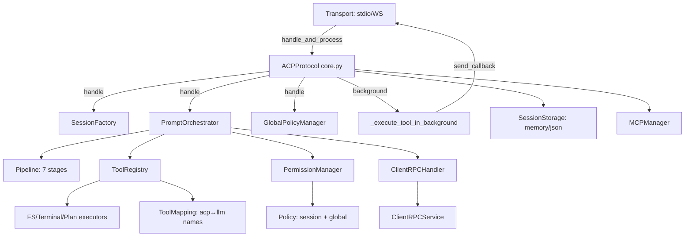
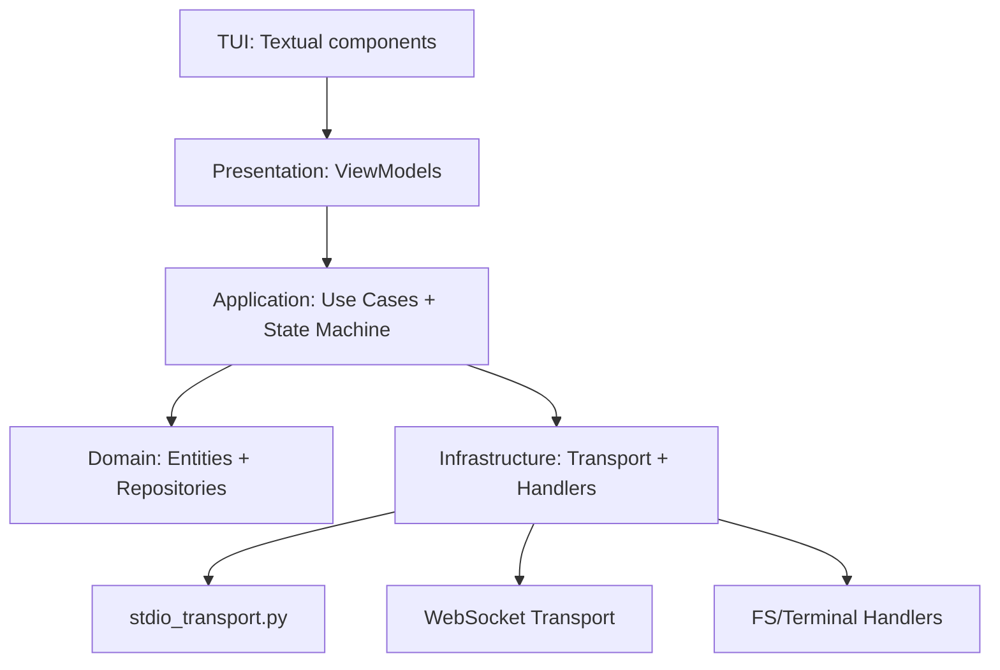
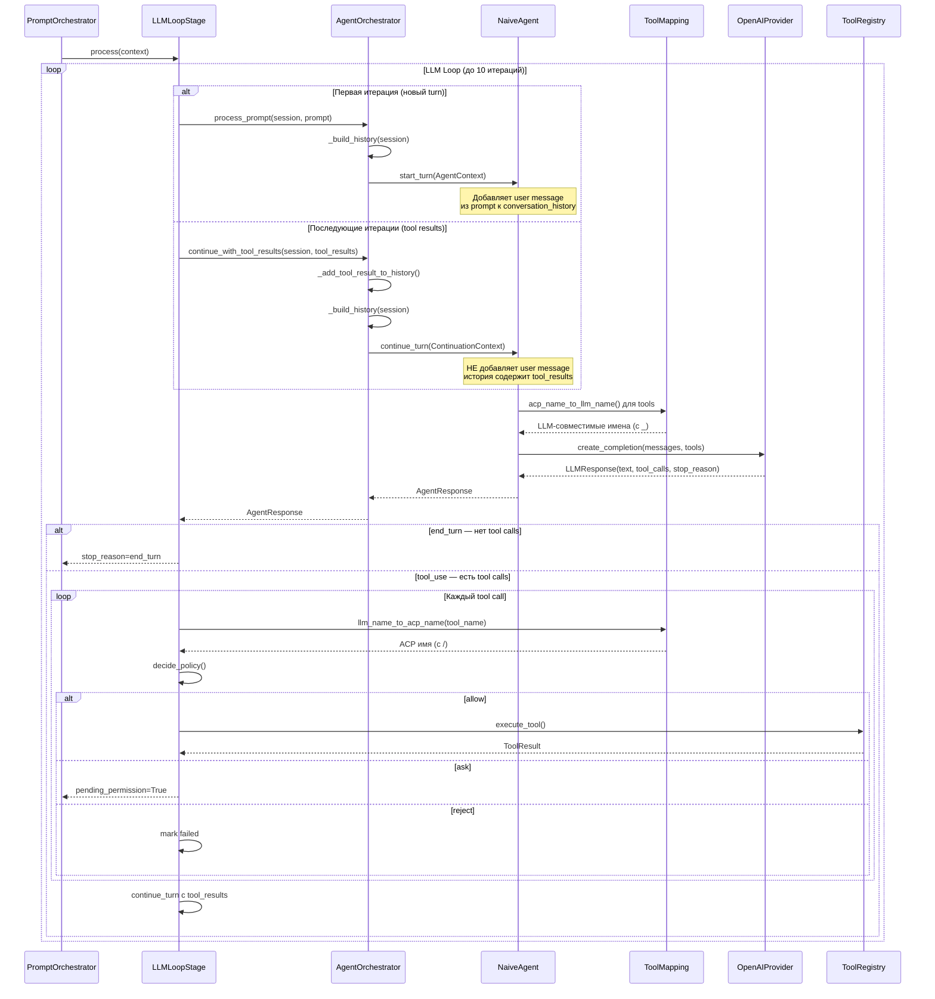
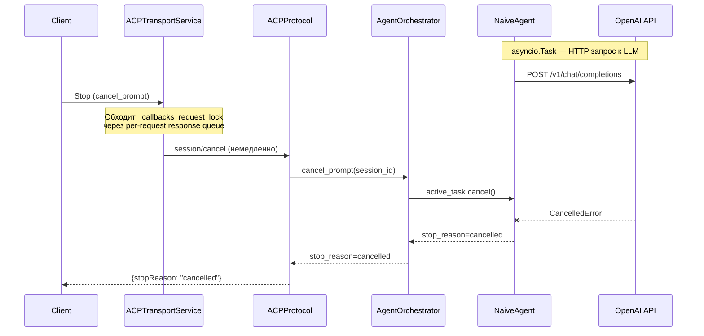

# Верифицированный отчёт: Реализация ACP Protocol

**Дата:** 2026-05-21
**Метод:** Ручная верификация кода vs спецификация `doc/Agent Client Protocol/`
**Обновлено:** 2026-05-21 — ToolMapping модуль, handle_and_process, async client callbacks, Content API в TUI
**Обновлено:** 2026-05-20 — устранены гэпы #2, #3, #4, #10, удалён мёртвый код DirectiveResolver, рефакторинг LLMAgent interface

---

## Сводка

| Метрика | Значение |
|---|---|
| Spec sections fully covered | **13** из 17 (76%) |
| Spec sections partially covered | 3 из 17 (18%) |
| Spec sections not covered | 1 из 17 (6%) — Streamable HTTP (draft) |
| Все ACP методы реализованы | ✅ 17 из 17 |
| stdio transport | ✅ Полностью (сервер + клиент) |
| Тестовых файлов | ~145 (+4: mapping, async callbacks) |
| Тестовых методов | ~2,238 (+28) |
| Критичных проблем | ✅ 0 |
| Известных гэпов | 8 |

---

## Статус по разделам спецификации

### ✅ 01. Overview — Полностью реализовано

| Метод ACP | Направление | Статус | Файл реализации |
|---|---|---|---|
| `initialize` | Client → Agent | ✅ | `server/protocol/handlers/auth.py` |
| `authenticate` | Client → Agent | ✅ | `server/protocol/handlers/auth.py` |
| `session/new` | Client → Agent | ✅ | `server/protocol/handlers/session.py` |
| `session/load` | Client → Agent | ✅ | `server/protocol/handlers/session.py` |
| `session/list` | Client → Agent | ✅ | `server/protocol/handlers/session.py` |
| `session/prompt` | Client → Agent | ✅ | `server/protocol/handlers/prompt.py` |
| `session/cancel` | Client → Agent | ✅ | `server/protocol/handlers/prompt.py` |
| `session/set_config_option` | Client → Agent | ✅ | `server/protocol/handlers/config.py` |
| `session/set_mode` | Client → Agent | ✅ | `server/protocol/handlers/config.py` |
| `session/update` | Agent → Client | ✅ | notification pipeline |
| `session/request_permission` | Agent → Client | ✅ | `server/protocol/handlers/permissions.py` |
| `fs/read_text_file` | Agent → Client | ✅ | `server/client_rpc/service.py` |
| `fs/write_text_file` | Agent → Client | ✅ | `server/client_rpc/service.py` |
| `terminal/create` | Agent → Client | ✅ | `server/client_rpc/service.py` |
| `terminal/output` | Agent → Client | ✅ | `server/client_rpc/service.py` |
| `terminal/wait_for_exit` | Agent → Client | ✅ | `server/client_rpc/service.py` |
| `terminal/release` | Agent → Client | ✅ | `server/client_rpc/service.py` |
| `terminal/kill` | Agent → Client | ✅ | `server/client_rpc/service.py` |

### ✅ 02. Initialization — Полностью реализовано

- Протокол v1, согласование версий (`core.py:203`)
- Client capabilities: `fs.readTextFile`, `fs.writeTextFile`, `terminal`
- Agent capabilities: `loadSession`, `mcpCapabilities` (http/sse), `promptCapabilities` (image/audio/embeddedContext), `sessionCapabilities.list`
- `agentInfo`: name=codelab-server, title=ACP Server, version=0.1.0
- Auth methods advertisement (метод `local` с api_key)

### ✅ 03. Session Setup — Полностью реализовано

- `session/new` с cwd (абсолютный путь), mcpServers
- `session/load` с replay истории через `ReplayManager` (`handlers/replay_manager.py`)
- MCP серверы: stdio transport ✅, HTTP/SSE declared но не подключены
- Session ID формат `sess_{uuid4().hex[:12]}`
- ConfigOptions и Modes в response

### ⚠️ 04. Session List — Частично реализовано

- ✅ `session/list` с cursor-based pagination (base64-encoded JSON)
- ✅ Фильтрация по cwd
- ✅ `session_info_update` notification
- ✅ Сортировка по `updatedAt` (reverse), page size = 50
- ❌ Нет тестов на pagination edge cases (invalid cursor, empty results boundary)

### ✅ 05. Prompt Turn — Полностью реализовано

- Pipeline pattern с 7 stages: Validation → SlashCommand → PlanBuilding → TurnLifecycle(open) → Directives → LLMLoop → TurnLifecycle(close)
- Streamed `agent_message_chunk`, `user_message_chunk`
- Tool call flow: pending → in_progress → completed/failed/cancelled
- Permission request flow с 4 опциями (allow_once, allow_always, reject_once, reject_always)
- Stop reasons: `end_turn`, `max_tokens`, `max_turn_requests`, `refusal`, `cancelled`
- Cancellation с корректной обработкой pending requests и tombstones
- `session/cancel` отправляется немедленно: `ACPTransportService.cancel_prompt()` обходит `_callbacks_request_lock` через per-request response queue, не ожидая завершения `session/prompt`
- На сервере `ACPProtocol._handle_session_cancel()` вызывает `AgentOrchestrator.cancel_prompt()`, который отменяет активный `asyncio.Task` с LLM-запросом (`CancelledError`)

### ✅ 06. Content — Полностью реализовано

| Тип | Статус | Файл |
|---|---|---|
| Text | ✅ | `shared/content/text.py` |
| Image | ✅ (требует capability) | `shared/content/image.py` |
| Audio | ✅ (требует capability) | `shared/content/audio.py` |
| Embedded Resource | ✅ (требует capability) | `shared/content/embedded.py` |
| Resource Link | ✅ | `shared/content/resource_link.py` |
| Annotations | ✅ | `shared/content/base.py` |

### ✅ 08. Tool Calls — Полностью реализовано

- Tool call creation с toolCallId, title, kind, status
- Status transitions: pending → in_progress → completed/failed/cancelled
- Tool kinds: read, edit, delete, move, search, execute, think, fetch, switch_mode, other
- Tool call content: text, diff, terminal
- Locations (path + line) для "follow-along"
- rawInput / rawOutput — поддерживаются в модели
- Permission request flow интегрирован

### ✅ 09. File System — Полностью реализовано

- `fs/read_text_file` с line/limit параметрами
- `fs/write_text_file` с diff tracking (difflib)
- Capability checking перед вызовами
- Path normalization к absolute paths в рамках cwd

### ✅ 10. Terminal — Полностью реализовано

- ✅ `terminal/create` с command, args, env, cwd, outputByteLimit
- ✅ `terminal/output` с truncated flag и exitStatus (ClientRPCService реализован)
- ✅ `terminal/wait_for_exit` с exitCode/signal (по spec)
- ✅ `terminal/kill` без release
- ✅ `terminal/release` с kill + cleanup
- ✅ Terminal embedding в tool calls
- ✅ `TerminalWaitForExitResponse` соответствует ACP spec (только `exitCode` и `signal`)
- ✅ `TerminalToolExecutor.execute_wait_for_exit()` вызывает `terminal/output` для получения вывода (по spec)
- ✅ `ClientRPCBridge` имеет метод `terminal_output()` для получения вывода терминала
- ✅ `TerminalOutputResponse` использует `exitStatus` и `truncated` по ACP spec
- ✅ `ToolResult` передаёт `output` в LLM — агент видит результат выполнения инструментов
- ✅ Совместимость со сторонними клиентами (Zed IDE) подтверждена

### ✅ 11. Agent Plan — Полностью реализовано

- Plan entries: content, priority (low/medium/high), status (pending/in_progress/completed)
- Plan update notifications через `session/update`
- `PlanExtractor` для извлечения из LLM response (JSON block, tool call)
- `update_plan` tool (kind=think, no permission required)
- Dynamic plan updates

### ✅ 12. Session Modes — Полностью реализовано

- Modes: ask, code (configurable через config specs)
- `session/set_mode` (legacy, делегирует set_config_option)
- `current_mode_update` notification
- Modes в session/new и session/load response

### ✅ 13. Session Config Options — Полностью реализовано

- `session/set_config_option` с валидацией по spec
- Config options: mode (ask/code), model (baseline)
- `config_option_update` notification
- Полный state в response (все options, не только изменённый)
- Приоритет configOptions над modes

### ✅ 14. Slash Commands — Полностью реализовано

- `available_commands_update` notification
- AvailableCommand с name, description, input.hint
- CommandRegistry, SlashCommandRouter
- Built-in команды: help, mode, status
- Dynamic updates

### ⚠️ 15. Extensibility — Частично реализовано

- ✅ `_meta` field поддерживается в Pydantic моделях
- ✅ Extension methods (`_` prefix) зарезервированы в spec
- ❌ Нет тестов на extensibility
- ❌ Custom capability advertisement через `_meta` не реализован явно

### ⚠️ 16. Transports — Частично реализовано

| Транспорт | Статус | Файл |
|---|---|---|
| stdio | ✅ Полностью | `server/transport/stdio.py` + `server/transport/stdio_runner.py` |
| WebSocket | ✅ Полностью | `server/transport/websocket.py` |
| HTTP | ✅ Есть сервер | `server/transport/websocket.py` |
| Streamable HTTP | ❌ Draft spec | Не реализован (как и в spec) |

**stdio transport (сервер):** `StdioServerTransport` (211 строк)
- Читает JSON-RPC из stdin (newline-delimited)
- Пишет ответы в stdout с line buffering
- Логи ТОЛЬКО в stderr
- Signal handlers (SIGTERM, SIGINT) для graceful shutdown
- `stdio_runner.py` настраивает `protocol._send_callback` для отправки из фоновых задач
- Использует `protocol.handle_and_process()` — entry point с поддержкой background tool execution

**stdio transport (клиент):** `StdioClientTransport` (285 строк)
- Запускает агент как subprocess
- Async context manager с graceful shutdown
- stdout/stderr background readers
- Queue-based message delivery

**WebSocket transport:** `WebSocketTransport`
- aiohttp WebSocket endpoint
- Настраивает `protocol._send_callback = self._send_protocol_message`
- Использует `protocol.handle_and_process()` — background tool execution в ACPProtocol
- `_execute_tool_in_background()` удалён из транспорта (перенесён в ACPProtocol)

### ✅ 17. Schema — Полностью реализовано

- Все JSON Schema определения соответствуют spec
- Pydantic модели для всех типов с migration support

---

## Проблемы и гэпы

### 🟡 Важные (рекомендуется для production)

#### ~~1. `NaiveAgent.cancel_prompt()` — заглушка~~ ✅ Решено (2026-05-20)

**Файл:** `server/agent/naive.py`

Реализована реальная отмена: агент хранит ссылку на активный `asyncio.Task` с LLM-запросом и отменяет его через `task.cancel()`. `ACPProtocol._handle_session_cancel()` теперь явно вызывает `AgentOrchestrator.cancel_prompt()` после завершения `handle_cancel()`.

Дополнительно исправлена клиентская сторона: `ACPTransportService.cancel_prompt()` обходит `_callbacks_request_lock` и отправляет `session/cancel` немедленно, не ожидая завершения `session/prompt`. Время отмены сократилось с ~16 с до ~3 мс.

#### 12. Сторонние ACP клиенты возвращают неполные response поля

**Файл:** `server/client_rpc/models.py`

**Проблема:** Сторонние ACP клиенты (Zed IDE) могут возвращать неполные response объекты:
- `terminal/wait_for_exit` → `{"exitCode": 0}` (без `output` — корректно по spec)
- `terminal/release` → `{}` (без `success` — некорректно, но нужно поддерживать)
- `terminal/kill` → вероятно тоже `{}`

**Решение (применено 2026-05-21):**
- `TerminalWaitForExitResponse.output` → опциональное, default `""`
- `TerminalReleaseResponse.success` → опциональное, default `True`
- `TerminalKillResponse.success` → опциональное, default `True`

Это позволяет codelab работать с любыми ACP клиентами, даже если они не fully implement terminal protocol.

#### ~~11. Terminal output не получается через `wait_for_exit`~~ ✅ Решено (2026-05-21)

**Файлы:** `server/client_rpc/models.py`, `server/client_rpc/service.py`, `server/tools/integrations/client_rpc_bridge.py`, `server/tools/executors/terminal_executor.py`, `server/protocol/handlers/pipeline/stages/llm_loop.py`

**Проблема:** По спецификации ACP `terminal/wait_for_exit` возвращает **только** `exitCode` и `signal` — **без output**. Output получается через **отдельный метод** `terminal/output`.

Текущая реализация ожидала `output` в ответе `wait_for_exit`, что не соответствует спецификации. При работе со сторонними клиентами (Zed IDE) output всегда пустой.

**Дополнительная проблема:** `ToolResult` создавался без поля `output`, из-за чего LLM получал пустой tool response даже когда executor корректно возвращал результат.

**Исправления применены:**

1. **`client_rpc/models.py`** — `TerminalWaitForExitResponse` соответствует spec (только `exitCode`, `signal`)
2. **`client_rpc/models.py`** — `TerminalOutputResponse` использует `exitStatus` и `truncated` по spec
3. **`client_rpc/service.py`** — `wait_for_exit` возвращает `(exit_code, signal)`, `terminal_output` возвращает `(output, truncated, exit_code, signal)`
4. **`tools/integrations/client_rpc_bridge.py`** — Добавлен `terminal_output()`, обновлён `wait_terminal_exit()`
5. **`tools/executors/terminal_executor.py`** — `execute_wait_for_exit()` вызывает `terminal/output` → `wait_for_exit` → `terminal/output`
6. **`tools/definitions/terminal.py`** — Обновлено описание `wait_for_exit`
7. **`server/protocol/handlers/pipeline/stages/llm_loop.py`** — `ToolResult` теперь передаёт `output=result.output`

**Поток (реализован):**
```
LLM: terminal/create → terminal_id
LLM: terminal/wait_for_exit → executor internally:
  1. terminal/output → output + is_complete + exit_code (если завершён → вернуть сразу)
  2. terminal/wait_for_exit → exit_code + signal (если ещё не завершён)
  3. terminal/output → финальный output
  4. Return combined result: output + exit_code + signal
LLM: terminal/release → cleanup
```

**Результат:** Terminal flow полностью соответствует ACP spec и работает со сторонними клиентами (Zed IDE).

#### ~~10. `LLMAgent.process_prompt` — неясный контракт~~ ✅ Решено (2026-05-20)

**Файлы:** `server/agent/base.py`, `server/agent/naive.py`, `server/agent/orchestrator.py`

Интерфейс `LLMAgent` рефакторирован:
- Удалён `process_prompt(prompt, history, tools)` с неясной семантикой (кто добавляет user message?)
- Добавлены `start_turn(AgentContext)` и `continue_turn(ContinuationContext)` — явные контракты
- `start_turn`: добавляет user message из prompt, вызывает LLM
- `continue_turn`: **НЕ** добавляет user message — история уже содержит tool_results
- Удалён мёртвый `while` loop из `NaiveAgent` (всегда возвращал на первой итерации)
- Удалён `_session_histories` — история жила в двух местах параллельно (баг)
- `_filter_tools_by_capabilities` теперь всегда включает серверные инструменты (`kind in {"think", "plan"}`)
- Исправлен баг с hang после `update_plan`: `continue_turn` больше не добавляет пустое user message

#### ~~9. `DirectiveResolver` — мёртвый код~~ ✅ Решено (2026-05-20)

**Файл:** `server/protocol/prompt_handlers/directive_resolver.py` (удалён)

Класс `DirectiveResolver` не использовался в production-коде (только в тестах). Вся функциональность директив реализована в `prompt.py` и `DirectivesStage`. Файл и тесты удалены.

#### ~~2. `PlanBuildingStage` — no-op~~ ✅ Решено (2026-05-20)

**Файл:** `server/protocol/handlers/pipeline/stages/plan_building.py`

Стадия остаётся no-op по дизайну — план строится в `LLMLoopStage` из ответа LLM. Это архитектурное решение, а не баг. Стадия зарезервирована для будущей pre-plan логики (например, из директив).

#### ~~3. Дублирование `directives.py`~~ ✅ Решено (2026-05-20)

Файл `handlers/directives.py` удалён. Все функции (`resolve_tool_title`, `normalize_tool_kind`, `extract_prompt_directives`) теперь импортируются из `handlers/prompt.py` — единственного источника истины. `DirectivesStage` обновлён.

#### ~~4. Несоответствие имён инструментов wire-формату ACP~~ ✅ Решено (2026-05-20)

**Файлы:** `tools/definitions/filesystem.py`, `tools/definitions/terminal.py`, `tools/mapping.py` (новый)

Имена инструментов приведены в соответствие с ACP wire-форматом:

| Было | Стало |
|---|---|
| `read_text_file` | `fs/read_text_file` |
| `write_text_file` | `fs/write_text_file` |
| `execute_command` | `terminal/create` |
| `wait_for_exit` | `terminal/wait_for_exit` |
| `release_terminal` | `terminal/release` |

Теперь `_filter_tools_by_capabilities()` в `orchestrator.py` корректно фильтрует инструменты по capabilities.

**Двусторонний маппинг (2026-05-21):** Добавлен модуль `tools/mapping.py` для конвертации имён между ACP и LLM форматами:
- `acp_name_to_llm_name()`: `fs/read_text_file` → `fs_read_text_file` (ACP → LLM API)
- `llm_name_to_acp_name()`: `fs_read_text_file` → `fs/read_text_file` (LLM → ACP registry lookup)

Применяется в: `NaiveAgent._to_openai_tools_format()`, `SimpleToolRegistry.to_llm_tools()`, `SimpleToolRegistry.execute_tool()`, `LLMLoopStage._process_tool_calls()`.

#### 5. Только OpenAI LLM провайдер

- `llm/openai_provider.py` — полная реализация
- `llm/mock_provider.py` — для тестов
- ❌ Нет Anthropic/Claude, Google Gemini, Ollama, локальных моделей

#### 6. MCP HTTP/SSE не реализованы

- Объявлены в `agentCapabilities.mcpCapabilities` (http/sse: true)
- `mcp/transport.py` — только `StdioTransport`
- HTTP/SSE transport MCP не реализован

#### 7. MCP auto-reconnect отсутствует

- Нет переподключения при падении MCP сервера
- `MCPManager` не отслеживает состояние серверов после shutdown

#### 8. MCP resources/prompts не поддерживаются

- Реализованы только `tools/list` и `tools/call`
- MCP resources и prompts не обрабатываются

### 🟢 Желательные (улучшение качества)

| # | Проблема | Статус |
|---|---|---|
| 9 | Нет тестов extensibility (`_meta`, custom methods) | Не покрыто |
| 10 | Нет тестов session/list pagination edge cases | Минимально |
| 11 | Stop reasons `max_tokens`, `max_turn_requests`, `refusal` не тестированы | Не покрыто |
| 12 | Tool call `locations`, `rawInput`, `rawOutput` не тестированы | Не покрыто |
| 13 | Rate limiting для tool execution | Не реализовано |
| 14 | SQLite storage | Не реализовано (только memory + JSON file) |
| 15 | Streaming tool_calls в OpenAI | Не обрабатывается (только текст) |
| 16 | `authenticate` — минимальное тестовое покрытие | 4 теста |

---

## Архитектура

### Pipeline обработки prompt


### Компоненты сервера



### Компоненты клиента (Clean Architecture)



### Взаимодействие агента и LLM



### Отмена промпта (Cancellation)



### Компоненты клиента (Clean Architecture)

### Сервер (~1,109 тестов, 69 файлов)

| Область | Файлов | Тестов | Покрытие |
|---|---|---|---|
| Core Protocol | 2 | 88 | ✅ Полное |
| Prompt Orchestrator | 1 | 24 | ✅ Полное |
| Turn Lifecycle | 1 | 32 | ✅ Полное |
| State Manager | 1 | 21 | ✅ Полное |
| Session Factory | 1 | 15 | ✅ Полное |
| Storage | 3 | 41 | ✅ Полное |
| Plan Builder/Extractor | 2 | 46 | ✅ Полное |
| Tool Definitions | 1 | 40 | ✅ Полное |
| Tool Registry | 1 | 20 | ✅ Полное |
| Tool Mapping | 1 | 18 | ✅ Полное (новый) |
| Tool Call Handler | 1 | 26 | ✅ Полное |
| Permission Manager | 3 | 57 | ✅ Полное |
| Client RPC Handler | 1 | 38 | ✅ Полное |
| Client RPC Service | 1 | 26 | ✅ Полное |
| Slash Commands | 2 | 35 | ✅ Полное |
| HTTP Server | 2 | 18 | ✅ Полное |
| Agent | 3 | 50 | ✅ Полное (start_turn/continue_turn + mapping) |
| LLM Provider | 1 | 6 | ⚠️ Базовое |
| MCP Module | 1 | 27 | ✅ Полное |
| Content | 3 | 68 | ✅ Полное |
| Pipeline | 1 | 18 | ✅ Полное |
| Global Policy | 2 | 69 | ✅ Полное |
| Интеграционные | 10+ | ~100 | ✅ Полное |

### Клиент (~1,030 тестов, 69 файлов)

| Область | Файлов | Тестов | Покрытие |
|---|---|---|---|
| Domain Entities | 1 | 10 | ✅ |
| Application | 3 | 21 | ✅ |
| Infrastructure | 12 | ~174 | ✅ (+4 async callbacks) |
| Presentation | 5 | 77 | ✅ (+4 async fs/terminal) |
| TUI Components | 32 | ~700 | ✅ (Content API) |

### Shared Content (~112 тестов, 6 файлов)

| Тип | Тестов |
|---|---|
| Base | 13 |
| Text | 17 |
| Image | 19 |
| Audio | 20 |
| Embedded | 16 |
| Resource Link | 27 |

### Не покрыто тестами

- Extensibility (`_meta` propagation, custom methods)
- Session list pagination edge cases
- Stop reasons: `max_tokens`, `max_turn_requests`, `refusal`
- Tool call `locations`, `rawInput`, `rawOutput`
- MCP HTTP/SSE transports
- stdio transport E2E (сервер + клиент через subprocess)
- Terminal output flow: `execute_wait_for_exit` → `terminal/output` + `wait_for_exit`
- Совместимость со сторонними ACP клиентами (Zed IDE)

---

## Рекомендации по приоритетам

### P0 — Критичные

Нет открытых критичных проблем.

### P1 — Важные

~~1. **Устранить дублирование `directives.py`** — оставить один источник~~ ✅ Решено
~~2. **Добавить тесты extensibility** — `_meta`, custom methods~~ ✅ Решено (частично)
3. **Добавить тесты stop reasons** — `max_tokens`, `max_turn_requests`, `refusal`
4. **Добавить тесты session/list pagination edge cases** — invalid cursor, empty results
5. **Исправить terminal output flow** — `execute_wait_for_exit` должен вызывать `terminal/output` перед `wait_for_exit` (см. ГЭП #11)

### P2 — Желательные

6. **Добавить LLM провайдеры** — Anthropic, Gemini, Ollama
7. **Реализовать MCP HTTP transport**
8. **Добавить MCP auto-reconnect**
9. **Реализовать SQLite storage**
10. **Добавить rate limiting для tool execution**
11. **Добавить stdio transport E2E тесты**
12. **Реализовать MCP resources/prompts** — только tools/list и tools/call
13. **Добавить тесты ToolMapping round-trip** — edge cases с неизвестными префиксами
14. **Добавить тесты для ClientRPCBridge.terminal_output** — новый метод
15. **Добавить тесты совместимости со сторонними клиентами** — Zed IDE, etc.
