# План интеграции неиспользуемых TUI-компонентов

## Обзор

Документ описывает план внедрения TUI-компонентов, которые созданы и протестированы, но пока не интегрированы в основное приложение [`app.py`](codelab/src/codelab/client/tui/app.py).

---

## Прогресс интеграции

| Приоритет | Статус | Story Points | Прогресс |
|-----------|--------|--------------|----------|
| **P0** | ✅ Завершено | 6 / 6 SP | 100% |
| **P1** | ✅ Завершено | 19 / 19 SP | 100% |
| **P2** | ✅ Завершено | 12 / 12 SP | 100% |
| **Итого** | ✅ Завершено | **37 / 37 SP** | **100%** |

### Выполненные задачи P1

| # | Компонент | SP | Коммит | Описание |
|---|-----------|----|---------|-----------| 
| 1 | **ToolCallList** | 3 | [`b5808d4`](https://github.com/pese-git/codelab-ai/commit/b5808d4) | Интеграция в `ToolPanel` с ProgressBar |
| 2 | **FileChangePreview** | 3 | [`4dba8c2`](https://github.com/pese-git/codelab-ai/commit/4dba8c2) | [`FileChangePreviewModal`](codelab/src/codelab/client/tui/components/file_change_preview_modal.py) — модальное окно diff для файловых операций |
| 3 | **MessageBubble** | 7 | [`7b29afb`](https://github.com/pese-git/codelab-ai/commit/7b29afb) | Интеграция в `ChatView` — стилизованные сообщения с ролями |
| 4 | **TerminalPanel** | 3 | [`d399baa`](https://github.com/pese-git/codelab-ai/commit/d399baa) | Улучшенный `TerminalOutputPanel` с toolbar |
| 5 | **PermissionRequest** | 2 | [`4116439`](https://github.com/pese-git/codelab-ai/commit/4116439) | Альтернатива InlinePermissionWidget в [`ChatViewPermissionManager`](codelab/src/codelab/client/tui/components/chat_view_permission_manager.py) |
| 6 | **ActionBar** | 2 | [`27582c3`](https://github.com/pese-git/codelab-ai/commit/27582c3), [`a84d476`](https://github.com/pese-git/codelab-ai/commit/a84d476) | [`QuickActionsBar`](codelab/src/codelab/client/tui/components/quick_actions_bar.py) с MVVM интеграцией |

### Новые файлы P1

- [`file_change_preview_modal.py`](codelab/src/codelab/client/tui/components/file_change_preview_modal.py)
- [`quick_actions_bar.py`](codelab/src/codelab/client/tui/components/quick_actions_bar.py)
- [`test_tui_permission_request.py`](codelab/tests/client/test_tui_permission_request.py)
- [`test_tui_action_bar.py`](codelab/tests/client/test_tui_action_bar.py)

### Результаты проверок (P1)

```
✅ ruff check:  All passed
✅ ty check:    All passed  
✅ pytest:      2087 passed, 7 skipped (33s)
```

### Выполненные задачи P2

| # | Компонент | SP | Коммит | Описание |
|---|-----------|----|---------|-----------| 
| 1 | **SearchInput** | 2 | [`c5cb16b`](https://github.com/pese-git/codelab-ai/commit/c5cb16b) | Компонент поиска с debounce, историей, тесты (25+) |
| 2 | **CollapsiblePanel** | 2 | [`0fc6ed8`](https://github.com/pese-git/codelab-ai/commit/0fc6ed8) | Сворачиваемые панели, AccordionGroup alias, тесты (30) |
| 3 | **ContextMenu** | 3 | [`4522e4e`](https://github.com/pese-git/codelab-ai/commit/4522e4e) | Контекстное меню с методами show/hide/from_items, тесты (35) |
| 4 | **MainLayout** | 5 | [`f66117e`](https://github.com/pese-git/codelab-ai/commit/f66117e) | Главный layout с LayoutConfig, toggle_sidebar/panel, тесты (14) |

### Новые файлы P2

- [`search_input.py`](codelab/src/codelab/client/tui/components/search_input.py)
- [`collapsible_panel.py`](codelab/src/codelab/client/tui/components/collapsible_panel.py)
- [`context_menu.py`](codelab/src/codelab/client/tui/components/context_menu.py)
- [`main_layout.py`](codelab/src/codelab/client/tui/components/main_layout.py)
- [`test_tui_search_input.py`](codelab/tests/client/test_tui_search_input.py)
- [`test_tui_collapsible_panel.py`](codelab/tests/client/test_tui_collapsible_panel.py)
- [`test_tui_context_menu.py`](codelab/tests/client/test_tui_context_menu.py)
- [`test_tui_main_layout.py`](codelab/tests/client/test_tui_main_layout.py)

### Результаты проверок (P2)

```
✅ ruff check:  All passed
✅ ty check:    All passed  
✅ pytest:      2186 passed, 13 skipped
```

---

## 1. Приоритеты внедрения

### P0 - Критично для UX ✅

| Компонент | Обоснование | Зависимости | Статус |
|-----------|-------------|-------------|--------|
| [`ToastContainer`](codelab/src/codelab/client/tui/components/toast.py) | Уведомления об ошибках, успехах, предупреждениях | UIViewModel | ✅ |
| [`Spinner`](codelab/src/codelab/client/tui/components/spinner.py) | Индикатор загрузки при ожидании ответа | ChatViewModel | ✅ |
| [`LoadingIndicator`](codelab/src/codelab/client/tui/components/spinner.py) | Визуальная обратная связь | UIViewModel | ✅ |
| [`ProgressBar`](codelab/src/codelab/client/tui/components/progress.py) | Прогресс долгих операций | ChatViewModel | ✅ |

### P1 - Улучшает функциональность ✅

| Компонент | Обоснование | Зависимости | Статус |
|-----------|-------------|-------------|--------|
| [`MessageBubble`](codelab/src/codelab/client/tui/components/message_bubble.py) | Стилизованные сообщения с ролями | ChatViewModel | ✅ `7b29afb` |
| [`ToolCallList`](codelab/src/codelab/client/tui/components/tool_call_list.py) | Список tool calls в ToolPanel | ChatViewModel | ✅ `b5808d4` |
| [`FileChangePreviewModal`](codelab/src/codelab/client/tui/components/file_change_preview_modal.py) | Превью изменений файлов (модальное окно) | FileViewerViewModel | ✅ `4dba8c2` |
| [`PermissionRequest`](codelab/src/codelab/client/tui/components/permission_request.py) | Альтернатива InlinePermissionWidget | PermissionViewModel | ✅ `4116439` |
| [`QuickActionsBar`](codelab/src/codelab/client/tui/components/quick_actions_bar.py) | Панель быстрых действий с MVVM | UIViewModel | ✅ `27582c3` |
| [`TerminalOutputPanel`](codelab/src/codelab/client/tui/components/terminal_output.py) | Улучшенная панель терминала с toolbar | TerminalViewModel | ✅ `d399baa` |

### P2 - Nice-to-have ✅

| Компонент | Обоснование | Зависимости | Статус |
|-----------|-------------|-------------|--------|
| [`MainLayout`](codelab/src/codelab/client/tui/components/main_layout.py) | Рефакторинг layout | UIViewModel | ✅ `f66117e` |
| [`CollapsiblePanel`](codelab/src/codelab/client/tui/components/collapsible_panel.py) | Сворачиваемые панели | - | ✅ `0fc6ed8` |
| [`ContextMenu`](codelab/src/codelab/client/tui/components/context_menu.py) | Контекстные действия | UIViewModel | ✅ `4522e4e` |
| [`SearchInput`](codelab/src/codelab/client/tui/components/search_input.py) | Поиск в сессиях/файлах | FileSystemViewModel | ✅ `c5cb16b` |
| [`StyledContainer`](codelab/src/codelab/client/tui/components/container.py), [`Card`](codelab/src/codelab/client/tui/components/container.py) | Стилизация | - | - |
| [`StatusLine`](codelab/src/codelab/client/tui/components/status_line.py) | Альтернатива FooterBar | UIViewModel | - |

---

## 2. План интеграции по компонентам

### 2.1 P0: Toast и ToastContainer

**Где использовать:** Добавить [`ToastContainer`](codelab/src/codelab/client/tui/components/toast.py) в корневой compose приложения.

**Изменения в [`app.py`](codelab/src/codelab/client/tui/app.py:173):**

```python
def compose(self) -> ComposeResult:
    yield HeaderBar(self._ui_vm)
    with Horizontal(id="body"):
        # ... existing layout ...
    with Vertical(id="bottom"):
        yield PromptInput(self._chat_vm)
        yield FooterBar(self._ui_vm)
    # Добавить ToastContainer как overlay
    yield ToastContainer(id="toast-container")
```

**Новые методы в ACPClientApp:**

```python
def show_toast(
    self,
    message: str,
    toast_type: ToastType = ToastType.INFO,
    duration: float = 3.0,
    title: str | None = None,
) -> None:
    """Показать уведомление."""
    container = self.query_one("#toast-container", ToastContainer)
    container.add_toast(ToastData(
        message=message,
        toast_type=toast_type,
        duration=duration,
        title=title,
    ))
```

**События для обработки:**
- [`Toast.Dismissed`](codelab/src/codelab/client/tui/components/toast.py:115) - удаление toast из контейнера
- Подписка на `UIViewModel.error_message` для автоматического показа ошибок

**Story Points:** 2

---

### 2.2 P0: Spinner и LoadingIndicator

**Где использовать:** 
- [`ChatView`](codelab/src/codelab/client/tui/app.py:186) - при ожидании ответа агента
- [`PromptInput`](codelab/src/codelab/client/tui/app.py:191) - индикатор в поле ввода

**Интеграция с ChatView:**

```python
# В ChatView.compose()
yield LoadingIndicator(id="chat-loading", visible=False)

# Подписка в on_mount
self._chat_vm.is_processing.subscribe(self._on_processing_changed)

def _on_processing_changed(self, is_processing: bool) -> None:
    loading = self.query_one("#chat-loading", LoadingIndicator)
    loading.display = is_processing
```

**Story Points:** 2

---

### 2.3 P0: ProgressBar

**Где использовать:** 
- [`ToolPanel`](codelab/src/codelab/client/tui/app.py:189) - прогресс выполнения tool calls
- [`ChatView`](codelab/src/codelab/client/tui/app.py:186) - прогресс streaming

**Изменения в ToolPanel:**

```python
def compose(self) -> ComposeResult:
    yield ProgressBar(id="tool-progress", visible=False)
    # ... existing content ...
```

**Story Points:** 2

---

### 2.4 P1: MessageList и SessionTurn

**Где использовать:** Замена текущей реализации в [`ChatView`](codelab/src/codelab/client/tui/components/chat_view.py).

**Текущая проблема:** ChatView использует собственную логику рендеринга сообщений.

**План интеграции:**

1. Добавить [`MessageList`](codelab/src/codelab/client/tui/components/message_list.py) в ChatView
2. Использовать [`SessionTurn`](codelab/src/codelab/client/tui/components/session_turn.py) для группировки turn
3. Подписаться на `ChatViewModel.messages`

```python
def compose(self) -> ComposeResult:
    yield MessageList(id="messages")

def _on_messages_changed(self, messages: list) -> None:
    message_list = self.query_one("#messages", MessageList)
    message_list.update_messages(messages)
```

**Story Points:** 5

---

### 2.5 P1: ToolCallList

**Где использовать:** [`ToolPanel`](codelab/src/codelab/client/tui/components/tool_panel.py).

**Интеграция:**

```python
def compose(self) -> ComposeResult:
    yield ToolCallList(chat_vm=self._chat_vm, id="tool-calls")
```

**События:**
- Подписка на `ChatViewModel.active_tool_calls`
- Обработка [`ToolCallCard.Selected`](codelab/src/codelab/client/tui/components/tool_call_card.py) для детального просмотра

**Story Points:** 3

---

### 2.6 P1: FileChangePreview

**Где использовать:** 
- Модальное окно при просмотре изменений файла
- [`ToolPanel`](codelab/src/codelab/client/tui/app.py:189) для preview изменений

**Интеграция:**

```python
def action_show_file_changes(self, file_path: str, changes: list) -> None:
    preview = FileChangePreview(
        file_path=file_path,
        changes=changes,
    )
    self.push_screen(preview)
```

**Story Points:** 3

---

### 2.7 P1: TerminalPanel

**Где использовать:** Замена или дополнение [`TerminalOutputPanel`](codelab/src/codelab/client/tui/components/terminal_output.py).

**Преимущества TerminalPanel:**
- Встроенный toolbar с кнопками
- Управление несколькими сессиями терминала
- Лучшая интеграция с TerminalViewModel

**Story Points:** 3

---

### 2.8 P2: MainLayout

**Решение:** Постепенная миграция от текущего layout к MainLayout.

**Преимущества MainLayout:**
- Reactive управление видимостью панелей
- Responsive поведение
- Единообразная структура

**План миграции:**

1. Перенести логику из [`app.py`](codelab/src/codelab/client/tui/app.py:173) в MainLayout
2. Обновить compose() для использования MainLayout
3. Сохранить обратную совместимость

```python
def compose(self) -> ComposeResult:
    yield HeaderBar(self._ui_vm)
    yield MainLayout(
        ui_vm=self._ui_vm,
        sidebar=self._create_sidebar(),
        main_content=self._create_main_content(),
        right_panel=self._create_tool_panel(),
    )
    with Vertical(id="bottom"):
        yield PromptInput(self._chat_vm)
        yield FooterBar(self._ui_vm)
```

**Story Points:** 5

---

### 2.9 P2: CollapsiblePanel и AccordionPanel

**Где использовать:**
- [`Sidebar`](codelab/src/codelab/client/tui/components/sidebar.py) - сворачиваемые секции
- [`ToolPanel`](codelab/src/codelab/client/tui/components/tool_panel.py) - группировка инструментов

**Story Points:** 2

---

### 2.10 P2: SearchInput

**Где использовать:**
- [`Sidebar`](codelab/src/codelab/client/tui/components/sidebar.py) - поиск по сессиям
- [`FileTree`](codelab/src/codelab/client/tui/components/file_tree.py) - поиск файлов

**Story Points:** 2

---

### 2.11 P2: ContextMenu

**Где использовать:**
- Правый клик на сессии в Sidebar
- Правый клик на файле в FileTree
- Правый клик на сообщении в ChatView

**Интеграция через ContextMenuScreen:**

```python
def on_click(self, event: Click) -> None:
    if event.button == 3:  # Right click
        menu = ContextMenuScreen(
            items=[
                MenuItem("Copy", action="copy"),
                MenuItem("Delete", action="delete"),
                MenuSeparator(),
                MenuItem("Properties", action="properties"),
            ]
        )
        self.app.push_screen(menu)
```

**Story Points:** 3

---

## 3. Решение по дубликатам

### 3.1 MainLayout vs текущий layout в app.py

**Рекомендация:** Постепенный рефакторинг

| Аспект | Текущий layout | MainLayout |
|--------|----------------|------------|
| Reactive | Ручное управление | Встроенное |
| Responsive | Нет | Да |
| Тестируемость | Сложнее | Проще |

**План:**
1. Оставить текущий layout для MVP
2. Планировать миграцию на MainLayout в P2
3. Не дублировать логику - выбрать один подход

**Решение:** Перенести в MainLayout в рамках P2.

---

### 3.2 StatusLine vs FooterBar

**Рекомендация:** Объединить функциональность

| Аспект | FooterBar | StatusLine |
|--------|-----------|------------|
| Hotkeys | Да | Да |
| Режимы | Нет | Да |
| Токены | Да | Нет |
| UIViewModel | Да | Да |

**План:**
1. Добавить поддержку режимов в FooterBar
2. StatusLine использовать для компактных случаев
3. Не заменять FooterBar на StatusLine

**Решение:** Расширить FooterBar, StatusLine оставить для специфичных use cases.

---

## 4. Диаграмма зависимостей компонентов

```mermaid
flowchart TB
    subgraph ViewModels
        UIViewModel
        ChatViewModel
        SessionViewModel
        PermissionViewModel
        FileSystemViewModel
        TerminalViewModel
        FileViewerViewModel
    end

    subgraph P0_Components["P0: Критичные ✅"]
        ToastContainer["ToastContainer ✅"] --> UIViewModel
        Toast["Toast ✅"] --> ToastContainer
        Spinner["Spinner ✅"] --> ChatViewModel
        LoadingIndicator["LoadingIndicator ✅"] --> UIViewModel
        ProgressBar["ProgressBar ✅"] --> ChatViewModel
    end

    subgraph P1_Components["P1: Функциональные ✅"]
        MessageBubble["MessageBubble ✅"] --> ChatViewModel
        ToolCallList["ToolCallList ✅"] --> ChatViewModel
        FileChangePreviewModal["FileChangePreviewModal ✅"] --> FileViewerViewModel
        PermissionRequest["PermissionRequest ✅"] --> PermissionViewModel
        QuickActionsBar["QuickActionsBar ✅"] --> UIViewModel
        TerminalOutputPanel["TerminalOutputPanel ✅"] --> TerminalViewModel
    end

    subgraph P2_Components["P2: Nice-to-have ✅"]
        MainLayout["MainLayout ✅"] --> UIViewModel
        CollapsiblePanel["CollapsiblePanel ✅"]
        SearchInput["SearchInput ✅"] --> FileSystemViewModel
        ContextMenu["ContextMenu ✅"] --> UIViewModel
    end

    subgraph CurrentLayout[Текущий Layout в app.py]
        HeaderBar --> UIViewModel
        Sidebar --> SessionViewModel
        FileTree --> FileSystemViewModel
        ChatView --> ChatViewModel
        ChatView --> PermissionViewModel
        PlanPanel
        ToolPanel --> ChatViewModel
        ToolPanel --> TerminalViewModel
        PromptInput --> ChatViewModel
        FooterBar --> UIViewModel
    end

    %% P0 интеграции (выполнено)
    ToastContainer -.->|"✅"| CurrentLayout
    Spinner -.->|"✅"| ChatView
    LoadingIndicator -.->|"✅"| PromptInput
    ProgressBar -.->|"✅"| ToolPanel
    
    %% P1 интеграции (выполнено)
    MessageBubble -.->|"✅"| ChatView
    ToolCallList -.->|"✅"| ToolPanel
    FileChangePreviewModal -.->|"✅"| ToolPanel
    PermissionRequest -.->|"✅"| ChatView
    QuickActionsBar -.->|"✅"| CurrentLayout
    TerminalOutputPanel -.->|"✅"| ToolPanel
    
    %% P2 интеграции (выполнено)
    SearchInput -.->|"✅"| Sidebar
    SearchInput -.->|"✅"| FileTree
    ContextMenu -.->|"✅"| Sidebar
    ContextMenu -.->|"✅"| FileTree
    MainLayout -.->|"✅"| CurrentLayout
    CollapsiblePanel -.->|"✅"| Sidebar
```



---

## 5. Оценка трудозатрат

### Сводная таблица по приоритетам

| Приоритет | Компоненты | Story Points | Статус |
|-----------|------------|--------------|--------|
| **P0** | Toast, Spinner, LoadingIndicator, ProgressBar | 6 SP | ✅ Выполнено |
| **P1** | MessageBubble, ToolCallList, FileChangePreviewModal, PermissionRequest, QuickActionsBar, TerminalOutputPanel | 19 SP | ✅ Выполнено |
| **P2** | SearchInput, CollapsiblePanel, ContextMenu, MainLayout | 12 SP | ✅ Выполнено |
| **Итого** | 16 компонентов | **37/37 SP** | **100%** |

### Детальная оценка

| Компонент | SP | Комментарий | Статус |
|-----------|------|-------------|--------|
| ToastContainer | 2 | Простая интеграция | ✅ |
| Spinner/LoadingIndicator | 2 | Простая интеграция | ✅ |
| ProgressBar | 2 | Простая интеграция | ✅ |
| MessageBubble | 7 | Интеграция в ChatView | ✅ `7b29afb` |
| ToolCallList | 3 | Средняя сложность | ✅ `b5808d4` |
| FileChangePreviewModal | 3 | Модальное окно diff | ✅ `4dba8c2` |
| PermissionRequest | 2 | Альтернатива InlinePermissionWidget | ✅ `4116439` |
| QuickActionsBar | 2 | Панель с MVVM | ✅ `27582c3` |
| TerminalOutputPanel | 3 | Улучшенный с toolbar | ✅ `d399baa` |
| SearchInput | 2 | Компонент поиска с debounce | ✅ `c5cb16b` |
| CollapsiblePanel | 2 | Сворачиваемые панели | ✅ `0fc6ed8` |
| ContextMenu | 3 | Контекстное меню | ✅ `4522e4e` |
| MainLayout | 5 | Рефакторинг layout | ✅ `f66117e` |

---

## 6. Рекомендуемый порядок внедрения

### Фаза 1: P0 - Базовый UX ✅

1. ✅ ToastContainer + Toast
2. ✅ Spinner + LoadingIndicator
3. ✅ ProgressBar

### Фаза 2: P1 - Функциональность ✅

1. ✅ ToolCallList в ToolPanel (`b5808d4`)
2. ✅ FileChangePreviewModal (`4dba8c2`)
3. ✅ MessageBubble в ChatView (`7b29afb`)
4. ✅ TerminalOutputPanel с toolbar (`d399baa`)
5. ✅ PermissionRequest в ChatViewPermissionManager (`4116439`)
6. ✅ QuickActionsBar (`27582c3`, `a84d476`)

### Фаза 3: P2 - Полировка ✅ (12 SP)

| # | Компонент | SP | Коммит | Описание |
|---|-----------|-----|--------|----------|
| 1 | SearchInput | 2 | `c5cb16b` | Поиск с debounce, история, 25+ тестов |
| 2 | CollapsiblePanel | 2 | `0fc6ed8` | Сворачиваемые панели, AccordionGroup, 30 тестов |
| 3 | ContextMenu | 3 | `4522e4e` | Контекстное меню, show/hide/from_items, 35 тестов |
| 4 | MainLayout | 5 | `f66117e` | LayoutConfig, toggle_sidebar/panel, 14 тестов |

---

## 7. Риски и митигации

| Риск | Вероятность | Влияние | Митигация |
|------|-------------|---------|-----------|
| Конфликты стилей CSS | Средняя | Низкое | Использовать scoped CSS |
| Регрессии в существующем функционале | Средняя | Высокое | Покрытие тестами перед изменениями |
| Увеличение времени загрузки | Низкая | Среднее | Lazy loading компонентов |
| Дублирование кода | Низкая | Низкое | Рефакторинг при интеграции |

---

## 8. Критерии готовности

Для каждого компонента перед интеграцией:

- [x] Существуют unit-тесты компонента
- [x] Компонент корректно работает с соответствующим ViewModel
- [x] CSS стили не конфликтуют с существующими
- [x] Документация обновлена
- [x] Интеграционный тест добавлен

---

## 9. Результаты интеграции ✅

### Общая статистика

| Метрика | Значение |
|---------|----------|
| **Всего Story Points** | 37 SP |
| **Выполнено** | 37 SP (100%) |
| **Компоненты интегрировано** | 16 |
| **Тестов добавлено** | ~104 (P2) |
| **Общее количество тестов** | 2186 passed, 13 skipped |

### Коммиты по фазам

| Фаза | SP | Коммиты |
|------|-----|---------|
| **P0** | 6 | Базовые компоненты интегрированы |
| **P1** | 19 | `b5808d4`, `4dba8c2`, `7b29afb`, `d399baa`, `4116439`, `27582c3`, `a84d476` |
| **P2** | 12 | `c5cb16b`, `0fc6ed8`, `4522e4e`, `f66117e` |

### Интегрированные компоненты P2

| Компонент | Файл | Тесты | Особенности |
|-----------|------|-------|-------------|
| [`SearchInput`](codelab/src/codelab/client/tui/components/search_input.py) | search_input.py | 25+ | debounce, история запросов, SearchMode |
| [`CollapsiblePanel`](codelab/src/codelab/client/tui/components/collapsible_panel.py) | collapsible_panel.py | 30 | анимация, AccordionGroup alias |
| [`ContextMenu`](codelab/src/codelab/client/tui/components/context_menu.py) | context_menu.py | 35 | show/hide/from_items, вложенные меню |
| [`MainLayout`](codelab/src/codelab/client/tui/components/main_layout.py) | main_layout.py | 14 | LayoutConfig, toggle_sidebar/panel |

### Финальные проверки

```
✅ ruff check:  All passed
✅ ty check:    All passed  
✅ pytest:      2186 passed, 13 skipped
```

### Заключение

Интеграция всех TUI-компонентов завершена. Все приоритеты (P0, P1, P2) выполнены на 100%.
Кодовая база готова к использованию новых компонентов в основном приложении.
