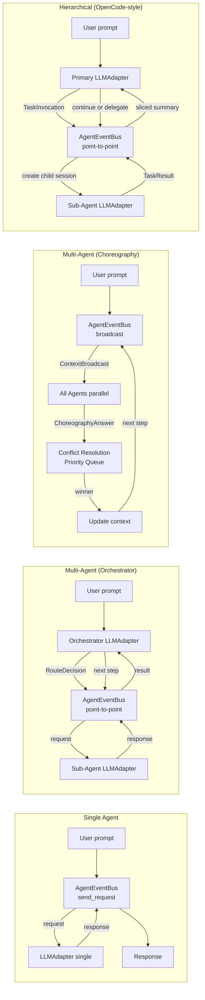

# ТЕХНИЧЕСКОЕ ЗАДАНИЕ: Мультиагентная экосистема CodeLab на базе ACP и EventBus

> Версия: 1.0
> Дата: 27 мая 2026
> Статус: Утверждено к реализации

---

## 1. ОБЩИЕ СВЕДЕНИЯ

### 1.1. Наименование проекта
CodeLab — унифицированная реализация ИИ-ассистента по протоколу Agent Client Protocol (ACP).

### 1.2. Цель изменений
Трансформация архитектуры из Single-Agent системы в гибкую мультиагентную платформу с:
- Централизованным (orchestrator) и децентрализованным (choreography) взаимодействием агентов
- In-Memory EventBus для межагентской коммуникации
- Динамическим изменением состава агентов без перезапуска
- Полной observability (tracing, timeline, metrics)
- Сохранением стабильного внешнего ACP-контракта

### 1.3. Стадия реализации
MVP (Minimum Viable Product). Все компоненты работают в одном Python-процессе с возможностью будущего выноса в микросервисы.

### 1.4. Ключевые архитектурные принципы
1. **ACP boundary** — клиент НЕ знает о мультиагентности. Для клиента сервер = один агент.
2. **EventBus-first** — всё межагентское общение проходит через шину событий.
3. **Dynamic agents** — состав агентов меняется на лету через `agents.yaml` hot reload.
4. **Observability by design** — tracing, timeline, metrics встроены через DI, не добавлены постфактум.
5. **Strategy pattern** — четыре режима выполнения: single, multi_orchestrated, multi_choreographed, hierarchical.
6. **Hybrid context** — Token-Slicing для координатора + Child Sessions для деталей.
7. **Pure uniformity** — все стратегии используют единый путь через EventBus для консистентной observability и архитектуры.
8. **ACP compliance** — все кастомные элементы используют префикс `_` согласно ACP Extensibility spec.

---

## 2. АРХИТЕКТУРА СИСТЕМЫ

### 2.1. Общая схема

```
┌─────────────────┐    WebSocket / JSON-RPC 2.0    ┌──────────────────────────────┐
│   TUI (Client)  │ ◄────────────────────────────► │       Server (Agent)          │
│                 │         ACP Protocol            │                               │
│  session/prompt │                                 │  ACPProtocol                  │
│  session/update │                                 │    ↓                          │
│  session/cancel │                                 │  PromptOrchestrator (Pipeline)│
│  set_config_opt │                                 │    ↓                          │
│                 │                                 │  StrategyDispatcher            │
└─────────────────┘                                 │    ↓                          │
                                                    │  ExecutionEngine               │
                                                    │    ↓                          │
                                                    │  AgentEventBus (INTERNAL)      │
                                                    │  ├── LLMAdapter (coder)        │
                                                    │  ├── LLMAdapter (tester)       │
                                                    │  └── LLMAdapter (orchestrator) │
                                                    │                                │
                                                    │  Observability:                │
                                                    │  ├── Tracer                    │
                                                    │  ├── EventTimeline             │
                                                    │  └── MetricsTracker            │
                                                    │                                │
                                                    │  Configuration:                │
                                                    │  ├── AgentSystemLoader         │
                                                    │  └── AgentFactory              │
                                                    └──────────────────────────────┘
```

### 2.2. Границы ответственности

| Слой | Компоненты | Назначение |
|---|---|---|
| **ACP Layer** | ACPProtocol, PromptOrchestrator, Pipeline | Внешний контракт — НЕ меняется |
| **Agent Layer** | ExecutionEngine, AgentEventBus, LLMAdapter | Мультиагентность — НОВЫЙ |
| **Observability** | Tracer, EventTimeline, MetricsTracker | Наблюдаемость — НОВЫЙ |
| **Configuration** | AgentSystemLoader, AgentFactory, ConfigOptionBuilder | Динамическая конфигурация — НОВЫЙ |
| **Storage** | SessionStorage, MetricsRepository, ObservabilityStorage | Персистентность — РАСШИРЯЕТСЯ |

### 2.3. Режимы выполнения (Strategy Pattern)

Четыре стратегии выполнения:

| Стратегия | Коммуникация | Контекст | Когда использовать |
|---|---|---|---|
| **Single** | EventBus (send_request) | Единый | Простые задачи, бенчмарк |
| **Orchestrated** | EventBus (point-to-point) | Гибрид (sliced + child) | Сложные последовательные задачи |
| **Choreography** | EventBus (broadcast) | Гибрид (опционально) | Параллельный анализ, исследование |
| **Hierarchical** | EventBus (point-to-point + child session) | Гибрид (нативный) | Делегирование с навигацией |



**Приоритет выбора режима:**
```
1. Slash command override (context.meta["routing_mode"]) — если есть
2. Config value (config_values["_routing_mode"]) — persistent режим сессии
3. Default ("single") — fallback
```

---

## 3. КОМПОНЕНТЫ

### 3.1. AgentEventBus (INTERNAL)

**Назначение:** In-Memory шина для межагентского общения внутри серверного процесса.

**Контракт:**
```python
class AgentEventBus(AbstractEventBus):
    async def register_agent(self, agent_name: str, handler: RequestHandler) -> None
    async def unregister_agent(self, agent_name: str) -> None
    async def send_request(self, request: AgentRequest, parent_span: SpanContext | None) -> AgentResponse
    async def broadcast(self, broadcast: ContextBroadcast) -> list[ChoreographyAnswer]
    def subscribe(self, event_type: type, handler: Handler) -> Subscription
```

**Два паттерна на одной шине:**

| Паттерн | Метод | Использование |
|---|---|---|
| **Point-to-Point** | `send_request()` → `AgentResponse` | Оркестратор → субагент |
| **Broadcast** | `broadcast()` → `list[ChoreographyAnswer]` | Хореография → все агенты |
| **Fire-and-forget** | `publish()` → `None` | Уведомления, метрики, логирование |

### 3.1.1. Коммуникация между агентами

**Принцип чистой uniformity:** все стратегии используют единый путь через EventBus.
Это обеспечивает консистентную observability, единообразную архитектуру и упрощает
разработку, отладку и тестирование всех стратегий.

#### Единый путь через EventBus

```python
# Все стратегии — один паттерн вызова
response = await event_bus.send_request(
    AgentRequest(target_agent=agent_name, ...),
    parent_span=context.span
)
```

**Почему все через EventBus:**
- **Uniformity** — один паттерн для всех стратегий, не нужно держать в голове "какой путь у этой"
- **Observability** — одинаковая структура трейсов: `strategy_execution → bus_request → llm_call`
- **Cross-cutting features** — rate limiting, retry, circuit breaker в одном месте
- **Testing** — один паттерн моков для всех стратегий
- **Debugging** — всегда одинаковые span'ы, проще анализировать
- **Extensibility** — добавление нового агента = регистрация в шине, без изменений стратегий

**Tradeoff:**
- ~10ms dispatch overhead для SingleStrategy
- Bus = single point of failure (митигируется тестами и мониторингом)
- Benchmark contamination (решается вычитанием baseline bus latency)

#### AgentCaller — единый интерфейс

```python
class AgentCaller:
    """Единый интерфейс для вызова агентов через EventBus."""

    async def call(
        self,
        agent_name: str,
        messages: list[Message],
        tools: list[ToolDefinition],
        parent_span: SpanContext,
        session_id: str | None = None,
    ) -> AgentResult:
        # Всегда через EventBus — uniformity
        return await self.event_bus.send_request(
            AgentRequest(
                target_agent=agent_name,
                messages=messages,
                tools=tools,
                correlation_id=self.correlation_id,
                session_id=session_id,
            ),
            parent_span=parent_span
        )
```

#### Матрица коммуникации по стратегиям

| Стратегия | Путь | Метод | Observability |
|---|---|---|---|
| **Single** | EventBus | `send_request()` | Tracer + Timeline + Metrics |
| **Orchestrated** | EventBus | `send_request()` | Tracer + Timeline + Metrics |
| **Choreography** | EventBus | `broadcast()` | Tracer + Timeline + Metrics |
| **Hierarchical** | EventBus | `send_request()` + child session | Tracer + Timeline + Metrics |

### 3.2. Контракты сообщений

```python
# Request/Response (для оркестратора)
@dataclass(frozen=True)
class AgentRequest(DomainEvent):
    target_agent: str
    messages: list[Message]
    tools: list[ToolDefinition]
    correlation_id: str
    session_id: str

@dataclass(frozen=True)
class AgentResponse(DomainEvent):
    request_id: str
    text: str
    tool_calls: list[ToolCall]
    usage: TokenUsage          # ← СОХРАНЯЕТСЯ (было потеряно в NaiveAgent)
    stop_reason: str
    agent_name: str

# Broadcast (для хореографии)
@dataclass(frozen=True)
class ContextBroadcast(DomainEvent):
    context: list[Message]
    available_agents: list[str]
    step: int
    correlation_id: str
    session_id: str

@dataclass(frozen=True)
class ChoreographyAnswer(DomainEvent):
    agent_name: str
    action_taken: bool
    reasoning: str
    output: str | None
    status_signal: Literal["continue", "completed"]
    usage: TokenUsage

# Lifecycle events (для observability)
@dataclass(frozen=True)
class AgentRegistered(DomainEvent):
    agent_name: str
    capabilities: dict

@dataclass(frozen=True)
class AgentUnregistered(DomainEvent):
    agent_name: str

@dataclass(frozen=True)
class AgentListChanged(DomainEvent):
    added: list[str]
    removed: list[str]
```

### 3.3. Agent Protocol (единый контракт)

```python
class Agent(Protocol):
    async def call(
        self,
        messages: list[Message],
        tools: list[ToolDefinition] | None = None,
        config: AgentConfig | None = None,
        parent_span: SpanContext | None = None,
    ) -> AgentResult:
        """Вызов агента с историей сообщений и опциональными инструментами."""
```

### 3.4. LLMAdapter (замена NaiveAgent)

**Что сохраняет от NaiveAgent:**
- Cancellation через `asyncio.Task` (`_active_tasks`)
- Tool name mapping (ACP `/` → LLM `_`)
- Plan extraction
- Single LLM call pattern

**Что добавляет:**
- Сохранение `usage` (токены) в `AgentResult`
- Tracer span для каждого LLM call
- Timeline event recording
- Metrics auto-log

### 3.5. ExecutionEngine (замена AgentOrchestrator)

**Композиция вместо монолита:**

| Компонент | Из старого кода | Назначение |
|---|---|---|
| `HistoryBuilder` | `AgentOrchestrator._build_history` + `_convert_to_llm_messages` | Конвертация session.history → LLMMessage |
| `ToolFilter` | `AgentOrchestrator._filter_tools_by_capabilities` | Фильтрация по client capabilities |
| `MessageSanitizer` | `AgentOrchestrator._sanitize_orphaned_tool_calls` | Восстановление orphaned tool calls |
| `PlanExtractor` | `agent/plan_extractor.py` | Извлечение плана из LLM response |
| `LLMAdapter` | `NaiveAgent` | Вызов LLM провайдера |

### 3.6. AgentSystemLoader

**Назначение:** Парсинг `agents.yaml`, hot reload через watchdog, публикация событий.

```yaml
# storage/agents.yaml
global:
  mode: "multi_orchestrated"    # single | multi_orchestrated | multi_choreographed
  default_model: "openai/gpt-4o"
  max_steps: 7
  safety_mode: true
  debug: false

orchestrator:
  model: "openai/gpt-4o"
  temperature: 0.1

agents:
  - name: "coder"
    enabled: true
    model: "anthropic/claude-3-5-sonnet"
    system_prompt: "Ты — Senior Python Developer..."
    tools: ["fs/read_text_file", "fs/write_text_file"]
    priority: 1

  - name: "tester"
    enabled: true
    model: "openai/gpt-4o-mini"
    system_prompt: "Ты — QA Engineer..."
    tools: ["terminal/create", "terminal/wait_for_exit"]
    priority: 2
```

**Hot reload flow:**
```
1. watchdog detect change → agents.yaml modified
2. AgentSystemLoader.reload() → parse new config
3. Для отключенных агентов: agent.stop() → publish AgentUnregistered
4. Для новых агентов: AgentFactory.create() → agent.start() → publish AgentRegistered
5. publish AgentListChanged(added, removed)
6. Подписчики (Orchestrator, TUI, Metrics) реагируют автоматически
```

### 3.7. Execution Strategies

#### SingleStrategy

Вызов единственного агента через EventBus. Минимальная задержка, базовый бенчмарк.

```
1. User prompt → SingleStrategy
2. AgentRequest(target_agent="single") → EventBus.send_request()
3. LLMAdapter обрабатывает запрос
4. AgentResponse → возвращается в стратегию
5. Ответ пользователю
```

**Почему через EventBus:**
- Uniformity — один паттерн для всех стратегий
- Observability — одинаковая структура трейсов
- Testing — один паттерн моков
- Extensibility — легко добавить агентов без изменений стратегии

#### OrchestratedStrategy
```
1. RouteDecision через LLM (Structured Outputs → RouteDecision Pydantic)
2. Point-to-point через EventBus.send_request()
3. Token-Slicing: суммаризация ответа субагента перед добавлением в контекст
4. max_steps предохранитель (по умолчанию 7)
5. Race condition guard: проверка available_agents перед каждым шагом
```

**RouteDecision (Structured Outputs):**
```python
class RouteDecision(BaseModel):
    reasoning: str
    target_agent: str | None    # null = задача решена
    task_payload: str | None    # атомарная задача для субагента
```

#### ChoreographyStrategy
```
1. Broadcast ContextBroadcast всем агентам параллельно
2. Сбор ChoreographyAnswer от каждого агента
3. Conflict Resolution: Priority Queue из agents.yaml
4. coordination_overhead_tokens: токены холостых опросов
5. max_steps предохранитель
```

#### HierarchicalStrategy

Стратегия иерархического делегирования (OpenCode-style Primary + Subagent):

```
1. Primary Agent получает пользовательский запрос
2. Primary LLM решает: ответить самому или делегировать через Task tool
3. При делегировании:
   a. CHECK task permissions (caller может вызывать target?)
   b. Если "ask" → session/request_permission пользователю
   c. Создать child session (изолированный контекст)
   d. TaskInvocation через EventBus.send_request()
4. Subagent выполняет в child session:
   a. Свой system prompt
   b. Свой набор инструментов
   c. Свой permissions
   d. Своя история сообщений
5. Subagent возвращает TaskResult
6. Token-Slicer суммаризует результат для parent context
7. Primary интегрирует summary, продолжает или завершает

**TaskInvocation (через EventBus):**
```python
@dataclass(frozen=True)
class TaskInvocation(DomainEvent):
    target_agent: str
    prompt: str
    tools: list[ToolDefinition]
    permission_override: dict | None = None
    correlation_id: str
    session_id: str           # parent session
    parent_span: SpanContext | None

@dataclass(frozen=True)
class TaskResult(DomainEvent):
    invocation_id: str
    success: bool
    output: str
    tool_calls: list[ToolCall]
    usage: TokenUsage
    agent_name: str
    child_session_id: str     # ID изолированной child session
```

**Конфигурация агента для HierarchicalStrategy:**
```yaml
agents:
  - name: "coder"
    mode: "primary"           # primary | subagent | hidden
    model: "anthropic/claude-3-5-sonnet"
    tools: ["fs/*", "terminal/*"]
    permission:
      task:                   # task permissions
        "*": "deny"
        "tester": "allow"
        "reviewer": "ask"
      edit: "ask"
      bash:
        "git *": "allow"
        "*": "ask"

  - name: "tester"
    mode: "subagent"
    description: "Writes and runs tests"
    model: "openai/gpt-4o-mini"
    tools: ["terminal/*"]
    hidden: false

  - name: "compact"
    mode: "subagent"
    hidden: true              # системный агент, не виден пользователю
    model: "openai/gpt-4o-mini"
```

**Когда использовать:**
- Субагенту нужен большой контекст (Token-Slicing обрезает детали)
- Пользователь хочет видеть детали работы субагентов
- Итеративная работа с субагентом (рефоллоуап в child session)
- Чёткое разделение ответственности между агентами

### 3.8. Управление контекстом (Hybrid Context Management)

Для балансировки между скоростью выполнения и сохранностью деталей применяется
гибридный подход к управлению контекстом.

#### Три подхода

| Подход | Описание | Плюсы | Минусы |
|---|---|---|---|
| **Token-Slicing** | Суммаризация ответов субагентов перед добавлением в контекст координатора | Компактный контекст, быстрые решения | Потеря деталей, нельзя рефоллоуап |
| **Child Sessions** | Каждый субагент в изолированной сессии с полным контекстом | Полные детали, навигация | Больше storage, сложнее |
| **Гибрид** | Token-Slicing для координатора + Child Sessions для деталей | И скорость, и observability | Средняя сложность |

#### Гибридный подход (рекомендуемый)

```
┌─────────────────────────────────────────────────┐
│  Parent Session (с Token-Slicing summaries)     │
│  Для быстрых RouteDecision координатора         │
│  Для основного потока ACP history               │
└─────────────────────────────────────────────────┘
                      +
┌─────────────────────────────────────────────────┐
│  Child Sessions (полный контекст, сохранены)    │
│  Для TUI navigation и отладки                   │
│  Для рефоллоуап с субагентами                   │
│  TUI-only, не раскрывает ACP boundary           │
└─────────────────────────────────────────────────┘
```

#### Применимость по стратегиям

| Стратегия | Token-Slicing | Child Sessions | Гибрид | Ценность |
|---|---|---|---|---|
| **Single** | ❌ | ❌ | ❌ | Не нужен |
| **Orchestrated** | ✅ | ✅ | ✅ | **Высокая** |
| **Choreography** | ✅ | ✅ | ✅ | Средняя |
| **Hierarchical** | ✅ | ✅ | ✅ | **Высокая** |

#### TokenSlicer компонент

```python
@dataclass(frozen=True)
class SlicedResult:
    summary: str               # суммаризированный ответ для parent context
    child_session_id: str      # ссылка на child session с полным контекстом
    original_tokens: int       # количество токенов до сжатия
    sliced_tokens: int         # количество токенов после сжатия

class TokenSlicer:
    async def summarize(
        self,
        full_output: str,
        child_session_id: str,
        max_tokens: int = 120
    ) -> SlicedResult:
        """Суммаризует ответ субагента, сохраняя ссылку на child session."""
        summary = await self.llm.summarize(full_output, max_tokens)
        return SlicedResult(
            summary=summary,
            child_session_id=child_session_id,
            original_tokens=count_tokens(full_output),
            sliced_tokens=count_tokens(summary)
        )
```

#### SessionState для иерархии

```python
class SessionState(BaseModel):
    # ... существующие поля ...
    parent_session_id: str | None = None
    child_session_ids: list[str] = Field(default_factory=list)
    is_child_session: bool = False
    task_result: str | None = None
    sliced_summary: str | None = None
```

#### ACP Boundary и навигация

Session navigation — **TUI-only фича**. Сервер хранит иерархию сессий
internally, но через ACP отдаёт только merged history родительской сессии.

Через ACP (merged history):
```json
{
  "history": [
    {"role": "user", "text": "Напиши CRUD API"},
    {"role": "assistant", "text": "Делегирую coder...", "agent_name": "primary"},
    {"role": "assistant", "text": "Создал 5 файлов", "agent_name": "coder"},
    {"role": "assistant", "text": "Делегирую tester...", "agent_name": "primary"},
    {"role": "assistant", "text": "Написал 20 тестов", "agent_name": "tester"}
  ]
}
```

Только в TUI:
- Навигация parent ↔ child sessions (Leader+Left/Right)
- Просмотр полной child session history
- Debug panel с деталями субагентов

**Обоснование:** Клиент НЕ знает о мультиагентности (принцип 1). Навигация —
это UI-фича для observability, не раскрытие внутренней архитектуры.

---

## 4. OBSERVABILITY

### 4.1. Три слоя наблюдаемости

| Слой | Что даёт | Где хранится | Как смотреть |
|---|---|---|---|
| **Structured Logging** | Что произошло | `logs/codelab.log` (JSON) | `grep correlation_id`, `jq` |
| **Distributed Tracing** | Как прошло, где задержка | In-memory + `debug/trace_*.json` | TUI live view, JSON export |
| **Event Timeline** | Почему произошло, полная хронология | In-memory + `debug/timeline_*.json` | TUI live view, JSON export |

### 4.2. Correlation ID

Сквозной ID для каждого prompt turn:
```
correlation_id = f"turn_{session_id}_{turn_number}"
```

Все логи, spans, timeline events включают correlation_id.

### 4.3. Distributed Tracing

```python
@dataclass
class Span:
    trace_id: str
    span_id: str
    parent_span_id: str | None
    operation: str          # "llm_call", "bus_request", "route_decision", "tool_call"
    agent_name: str
    start_time: float
    end_time: float | None
    status: Literal["ok", "error", "cancelled"]
    attributes: dict[str, Any]
    error: str | None
```

**Пример трейса:**
```
trace_id: turn_sess123_5
├─ prompt_received [0ms]
├─ strategy_execution [12500ms]
│  ├─ route_decision [2300ms] → target=coder
│  ├─ bus_request [8500ms] → coder
│  │  └─ llm_call [8200ms] claude-3-5-sonnet, 4500 in / 1200 out
│  ├─ token_slicing [50ms] 4500→120
│  └─ route_decision [1650ms] → target=tester
│     └─ bus_request [1650ms] → tester
│        └─ llm_call [1600ms] gpt-4o-mini, 2100 in / 600 out
└─ prompt_completed [0ms]
```

### 4.4. Event Timeline

```python
@dataclass
class TimelineEvent:
    timestamp: float
    event_type: str
    session_id: str
    correlation_id: str
    publisher: str
    subscribers: list[str]
    payload_summary: dict
    duration_ms: float | None
    error: str | None
```

### 4.5. Debug Mode

При `debug: true` в `agents.yaml`:
- Full payload logging (не только summary)
- LLM prompt/response dump (для анализа RouteDecision)
- Broadcast audit (все ответы при хореографии, включая "молчащих" агентов)
- Conflict Resolution details
- Token slicing diff (до/после)
- Export: `storage/debug/trace_{session_id}.json`, `timeline_{session_id}.json`

### 4.6. TUI Live View

```
┌─────────────────────────────────────────────────────────────────┐
│ CodeLab AI Terminal                              [MODE: MULTI]  │
├─────────────────────────────────────────────────────────────────┤
│ 🔄 [orchestrator] Принимаю задачу. Анализирую...               │
│ 🎯 [orchestrator] Решение: нужен coder (2.3s LLM)              │
│ 🤖 [coder] → claude-3-5-sonnet [8.2s] · 4500 in / 1200 out    │
│ 📝 [coder] Создал src/validator.py                              │
│ ✂️ [orchestrator] Контекст сжат: 4500 → 120 символов            │
│ 🎯 [orchestrator] Решение: нужен tester (1.6s LLM)             │
│ 🤖 [tester] → gpt-4o-mini [1.6s] · 2100 in / 600 out          │
│ 🧪 [tester] Написал 4 теста                                    │
│ ─────────────────────────────────────────────────────────────── │
│ 💰 $0.042 | 8400 tokens | 12.3s | 3 LLM calls                  │
└─────────────────────────────────────────────────────────────────┘

TUI Navigation (Leader+Right/Left):
┌─────────────────────────────────────────────────────────────────┐
│ [Child: coder] session/child_1                                  │
│ System: Ты — Senior Python Developer...                         │
│ Task: Напиши валидатор email                                    │
│ [полный код, tool calls, результаты]                            │
│                                                                 │
│ [Leader+Right] → [Child: tester]  |  [Leader+Left] → [Parent]  │
└─────────────────────────────────────────────────────────────────┘
```

---

## 5. STORAGE

### 5.1. Что где хранится

| Данные | Где | Формат | Когда сохраняется |
|---|---|---|---|
| **Session state + history** | `~/.codelab/sessions/{id}.json` | Pydantic model_dump | После каждого turn |
| **Child sessions** | `~/.codelab/sessions/{id}/children/` | Pydantic model_dump | При создании child session |
| **Session metrics** | `storage/benchmarks/run_{id}.json` | ExecutionMetrics | По завершении turn |
| **Event timeline** | `storage/debug/timeline_{id}.json` | list[TimelineEvent] | Только debug mode |
| **Trace spans** | `storage/debug/trace_{id}.json` | list[Span] | Только debug mode |
| **Agent config** | `storage/agents.yaml` | YAML | При старте + hot reload |
| **Global policies** | `~/.codelab/data/policies/global_permissions.json` | JSON | При изменении |
| **Model pricing** | `storage/models_price.json` | JSON | Статический справочник |

### 5.2. Новые поля в SessionState

```python
class SessionState(BaseModel):
    # ... существующие поля ...
    execution_mode: str = "single"                    # single | multi_orchestrated | multi_choreographed | hierarchical
    active_agents: list[str] = Field(default_factory=list)
    session_metrics: SessionMetrics | None = None
    current_correlation_id: str | None = None
    # Иерархия сессий (для HierarchicalStrategy и гибридного контекста)
    parent_session_id: str | None = None
    child_session_ids: list[str] = Field(default_factory=list)
    is_child_session: bool = False
    task_result: str | None = None
    sliced_summary: str | None = None

class SessionMetrics(BaseModel):
    total_time_sec: float = 0.0
    total_llm_calls: int = 0
    input_tokens: int = 0
    output_tokens: int = 0
    estimated_cost_usd: float = 0.0
    task_success: bool | None = None
    agent_breakdown: dict[str, dict] = Field(default_factory=dict)
```

### 5.3. Мультиагентная история

```python
session.history = [
    {"role": "user", "text": "Напиши валидатор email"},
    {"role": "assistant", "text": "Анализирую...", "agent_name": "orchestrator",
     "correlation_id": "turn_sess123_5", "step": 1},
    {"role": "assistant", "text": "Создал validator.py", "agent_name": "coder",
     "correlation_id": "turn_sess123_5", "step": 2,
     "usage": {"prompt_tokens": 4500, "completion_tokens": 1200}},
    {"role": "tool", "tool_call_id": "call_001", "content": "File written",
     "agent_name": "coder"},
]
```

### 5.4. Atomic write для метрик

```
1. Пишем во временный файл: .run_{session_id}.json.tmp
2. Atomic rename: → run_{session_id}.json
```

### 5.5. Миграция существующих сессий

Существующие `SessionState` файлы **совместимы** — новые поля имеют defaults. Миграция через `model_validator`:

```python
@model_validator(mode="before")
@classmethod
def migrate_schema(cls, data: dict) -> dict:
    version = data.get("schema_version", 0)
    if version < 3:
        data.setdefault("execution_mode", "single")
        data.setdefault("active_agents", [])
        data.setdefault("session_metrics", None)
        data.setdefault("parent_session_id", None)
        data.setdefault("child_session_ids", [])
        data.setdefault("is_child_session", False)
        data.setdefault("task_result", None)
        data.setdefault("sliced_summary", None)
        data["schema_version"] = 3
    return data
```

---

## 6. ACP BOUNDARY И CONFIG OPTIONS

### 6.1. Принцип

**Клиент НЕ знает о мультиагентности.** Для клиента сервер = один агент. ACP контракт не меняется.

Все кастомные config options используют префикс `_` согласно ACP Extensibility (15-Extensibility.md):
> *"The protocol reserves any method name starting with an underscore (`_`) for custom extensions."*

### 6.2. session/set_config_option

| configId | Single режим | Multi режим | Описание |
|---|---|---|---|
| `"model"` | Модель единственного агента | Модель **оркестратора** (для RouteDecision) | Существующая |
| `"_routing_mode"` | N/A | `"single"` / `"multi_orchestrated"` / `"multi_choreographed"` | **НОВАЯ** (кастомная) |
| `"mode"` | Режим работы (code/ask) | Режим работы (code/ask) | Существующая |

### 6.2.1. Спецификация `_routing_mode`

Config option `_routing_mode` — кастомное расширение ACP для выбора режима выполнения агента.

**Формат (ACP config option):**
```json
{
  "id": "_routing_mode",
  "name": "Routing Mode",
  "description": "Agent execution mode: single, multi-orchestrated, multi-choreographed, or hierarchical",
  "type": "select",
  "currentValue": "single",
  "options": [
    {"value": "single", "name": "Single Agent", "description": "Direct LLM call"},
    {"value": "multi_orchestrated", "name": "Multi-Agent (Orchestrator)", "description": "Centralized routing via orchestrator"},
    {"value": "multi_choreographed", "name": "Multi-Agent (Choreography)", "description": "Decentralized broadcast to all agents"},
    {"value": "hierarchical", "name": "Hierarchical (OpenCode-style)", "description": "Primary-Subagent hierarchy with child sessions and navigation"}
  ]
}
```

**Без категории** — избегаем конфликта с зарезервированной категорией `mode` (ACP spec 13-Session Config Options.md):
> *"Category names that do not begin with `_` are reserved for the ACP spec."*

**Поток данных в ACP:**

1. **`session/new`** — сервер возвращает `_routing_mode` в `configOptions` (дефолт из `agents.yaml`)
2. **`session/set_config_option`** — клиент меняет режим: `{"configId": "_routing_mode", "value": "multi_orchestrated"}`
3. **`session/prompt`** — `StrategySelectionStage` читает `config_values["_routing_mode"]` и выбирает стратегию

### 6.2.2. Slash Command override

Slash commands `/single`, `/multi`, `/choreography`, `/hierarchical` — **one-shot override** для одного промпта.

**Приоритет разрешения режима:**
```
1. Slash command override (context.meta["routing_mode"]) — если есть
2. Config value (config_values["_routing_mode"]) — persistent режим сессии
3. Default ("single") — fallback
```

**Пример использования:**
```
# Сессия в режиме multi_orchestrated (дефолт из agents.yaml)
Привет!                              → multi_orchestrated

/single Объясни этот код             → single (one-shot, не меняет config)
/hierarchical Напиши валидатор и тесты → hierarchical (one-shot)
Напиши тесты                         → multi_orchestrated (вернулся к дефолту)

# Пользователь хочет сменить дефолт:
set_config_option(_routing_mode=multi_choreographed)
Теперь все промпты → multi_choreographed
```

**Реализация:**
- `SlashCommandStage` распознаёт `/single`, `/multi`, `/choreography`, `/hierarchical` → записывает в `context.meta["routing_mode"]`
- `StrategySelectionStage` читает `meta` → `config_values` → `default`
- Slash command **не мутирует** `config_values` — только override на один prompt turn

### 6.3. Модели субагентов

**НЕ управляются через ACP.** Только через:
1. `agents.yaml` hot reload (persistent)
2. TUI slash command: `/config agent coder model anthropic/claude-3-5-sonnet`

**Обоснование:** Чистая ACP граница — клиент не должен знать о внутренней мультиагентной структуре.

### 6.4. Новые ACP notifications

Сервер может отправлять дополнительные `session/update` уведомления:

```json
{
  "jsonrpc": "2.0",
  "method": "session/update",
  "params": {
    "sessionId": "sess_123",
    "update": {
      "sessionUpdate": "agent_message_chunk",
      "content": {"type": "text", "text": "[orchestrator]: Delegating to coder..."}
    }
  }
}
```

Это **не нарушение ACP** — `agent_message_chunk` — стандартный тип обновления.

---

## 7. TOOLS GUARD (БЕЗОПАСНОСТЬ)

### 7.1. Расширение существующей permission системы

| Компонент | Текущее состояние | Что добавляется |
|---|---|---|
| `ToolDefinition` | `requires_permission: bool` | `danger_level: Literal["SAFE", "DANGEROUS", "CRITICAL"]` |
| Permission flow | 3-tier: session → global → ask | + `agent_name` через `_meta` в `session/request_permission` |
| Global policies | По `tool_kind` | + по `tool_name` + danger level |
| TUI ModalScreen | Generic Allow/Reject | + danger-aware styling, agent name из `_meta` |

**Передача `agent_name` через ACP `_meta`:**

Согласно [15-Extensibility.md](../Agent%20Client%20Protocol/protocol/15-Extensibility.md), все типы в протоколе включают `_meta` field для кастомной информации. `agent_name` передаётся в `session/request_permission`:

```json
{
  "method": "session/request_permission",
  "params": {
    "sessionId": "sess_abc123",
    "toolCall": { "toolCallId": "call_001" },
    "options": [
      { "optionId": "allow-once", "name": "Allow once", "kind": "allow_once" },
      { "optionId": "reject-once", "name": "Reject", "kind": "reject_once" }
    ],
    "_meta": {
      "agent_name": "coder"
    }
  }
}
```

Клиент (TUI) извлекает `agent_name` из `_meta` и отображает в модалке подтверждения. Это не нарушает ACP boundary — `_meta` игнорируется клиентами, которые его не понимают.

### 7.2. Danger levels

| Level | Примеры | Поведение |
|---|---|---|
| **SAFE** | `fs/read_text_file`, git status | Auto-execute |
| **DANGEROUS** | `fs/write_text_file`, package install | Policy validation |
| **CRITICAL** | `terminal/create` (rm -rf, curl | sh) | Manual user confirmation |

---

## 8. ПЛАН РЕАЛИЗАЦИИ

### Фаза 0: Foundation — контракты + observability core

| # | Файл | Описание |
|---|---|---|
| 0.1 | `shared/events/base.py` | `AbstractEventBus` — subscribe, unsubscribe, publish, clear |
| 0.2 | `shared/events/contracts.py` | `DomainEvent`, `AgentRegistered`, `AgentUnregistered`, `AgentListChanged` |
| 0.3 | `shared/events/agent_bus.py` | `AgentEventBus(AbstractEventBus)` — register_agent, send_request, broadcast |
| 0.4 | `shared/metrics/models.py` | `ExecutionMetrics`, `TokenUsage` (Pydantic) |
| 0.5 | `shared/metrics/repository.py` | `IMetricsRepository` ABC + `JsonMetricsRepository` |
| 0.6 | `shared/metrics/pricing.py` | `PricingEngine` — `models_price.json`, расчёт cost |
| 0.7 | `storage/models_price.json` | Справочник цен |
| 0.8 | `storage/agents.yaml` | Sample конфигурация |
| 0.9 | `server/observability/tracer.py` | `Tracer` — distributed tracing: Span, SpanContext, context manager |
| 0.10 | `server/observability/timeline.py` | `EventTimeline` — хронология всех событий сессии |
| 0.11 | `server/observability/factory.py` | `ObservabilityFactory` — создаёт Tracer + Timeline + Metrics |
| 0.12 | `server/observability/correlation.py` | `CorrelationId` — генерация и propagation |
| 0.13 | `server/observability/logging.py` | Расширение structlog — correlation_id во все логи |
| 0.14 | `server/storage/metrics.py` | `JsonMetricsRepository` — сохранение в `storage/benchmarks/` |
| 0.15 | `server/storage/observability.py` | `JsonObservabilityStorage` — export в `storage/debug/` |
| 0.16 | `server/storage/agent_config.py` | `YamlAgentConfigStorage` — загрузка agents.yaml с watchdog |
| 0.17 | `tests/server/shared/events/` | Unit-тесты EventBus |
| 0.18 | `tests/server/observability/` | Unit-тесты Tracer, EventTimeline, CorrelationId |

### Фаза 1: Новый agent layer (замена NaiveAgent + AgentOrchestrator)

| # | Файл | Описание |
|---|---|---|
| 1.1 | `server/agent/core/agent.py` | `Agent` Protocol — `async call(messages, tools, config, parent_span) → AgentResult` |
| 1.2 | `server/agent/core/result.py` | `AgentResult` — text, tool_calls, **usage**, stop_reason, agent_name |
| 1.3 | `server/agent/core/context.py` | `TurnContext` — единый контекст + correlation_id |
| 1.4 | `server/agent/adapters/llm_adapter.py` | `LLMAdapter` — замена NaiveAgent, сохраняет usage, tracer span |
| 1.5 | `server/agent/adapters/history_builder.py` | `HistoryBuilder` — из AgentOrchestrator._build_history |
| 1.6 | `server/agent/adapters/tool_filter.py` | `ToolFilter` — из AgentOrchestrator._filter_tools_by_capabilities |
| 1.7 | `server/agent/adapters/message_sanitizer.py` | `MessageSanitizer` — из AgentOrchestrator._sanitize_orphaned_tool_calls |
| 1.8 | `server/agent/adapters/plan_extractor.py` | `PlanExtractor` — перенос из agent/plan_extractor.py |
| 1.9 | `server/agent/engine.py` | `ExecutionEngine` — замена AgentOrchestrator, tracer span |
| 1.10 | `server/agent/factory.py` | `AgentFactory` — создаёт LLMAdapter из AgentConfig |
| 1.11 | `server/llm/providers/telemetry_hook.py` | Hook — TelemetrySink.record_request() после каждого LLM call |
| 1.12 | `server/protocol/state.py` | Новые поля: execution_mode, active_agents, session_metrics, correlation_id |
| 1.13 | `server/protocol/history.py` | Утилиты для мультиагентной истории: add_agent_message(), add_tool_call() |
| 1.14 | `tests/server/agent/` | Unit-тесты нового agent layer |

### Фаза 2: Мультиагентность + Dynamic Agents

| # | Файл | Описание |
|---|---|---|
| 2.1 | `server/agent/config.py` | `AgentConfig`, `MultiAgentConfig` — Pydantic для agents.yaml |
| 2.2 | `server/agent/loader.py` | `AgentSystemLoader` — парсинг YAML, watchdog hot reload, публикация событий |
| 2.3 | `server/agent/strategies/base.py` | `ExecutionStrategy` ABC — parent_span propagation, hybrid context support |
| 2.4 | `server/agent/strategies/single.py` | `SingleStrategy` — прямой вызов LLMAdapter |
| 2.5 | `server/agent/strategies/orchestrated.py` | `OrchestratedStrategy` — RouteDecision, point-to-point, Token-Slicing, max_steps |
| 2.6 | `server/agent/strategies/choreography.py` | `ChoreographyStrategy` — broadcast, parallel, Conflict Resolution |
| 2.7 | `server/agent/strategies/models.py` | `RouteDecision`, `ChoreographyAnswer`, `TaskInvocation`, `TaskResult` — Pydantic |
| 2.8 | `server/agent/strategies/token_slicer.py` | `TokenSlicer` — суммаризация, tracer span с diff |
| 2.9 | `server/agent/strategies/hierarchical.py` | `HierarchicalStrategy` — Primary-Subagent, Task tool, child sessions, task permissions |
| 2.10 | `server/agent/core/caller.py` | `AgentCaller` — единый интерфейс вызова через EventBus |
| 2.11 | `server/agent/core/context_manager.py` | `HybridContextManager` — Token-Slicing + Child Sessions, SessionState hierarchy |
| 2.12 | `tests/server/agent/strategies/` | Unit-тесты всех 4 стратегий |

### Фаза 3: MetricsTracker (cross-cutting observability)

| # | Файл | Описание |
|---|---|---|
| 3.1 | `server/metrics/tracker.py` | `MetricsTracker` — context manager, TelemetrySink, auto-log через tracer |
| 3.2 | `server/metrics/subscribers.py` | `MetricsSubscriber` — подписчик на EventBus события |
| 3.3 | `tests/server/metrics/` | Unit-тесты MetricsTracker |

### Фаза 4: ToolsGuard (расширение существующего)

| # | Файл | Описание |
|---|---|---|
| 4.1 | `server/tools/base.py` | Добавить `danger_level` в `ToolDefinition` |
| 4.2 | `server/tools/guard.py` | `ToolsGuardInterceptor` — tracer span для verify_action |
| 4.3 | `server/tools/definitions/*.py` | Разметить danger levels |
| 4.4 | `server/protocol/handlers/permissions.py` | Добавить `agent_name` в `_meta` при `session/request_permission` |
| 4.5 | `client/tui/components/permission_modal.py` | Извлечь agent_name из `_meta`, показать в UI |
| 4.6 | `tests/server/tools/` | Unit-тесты guard + `_meta` propagation |

### Фаза 5: Интеграция в pipeline

| # | Файл | Описание |
|---|---|---|
| 5.1 | `server/protocol/handlers/pipeline/stages/strategy_selection.py` | `StrategySelectionStage` — читает `_routing_mode` с приоритетом: slash override > config_values > default |
| 5.2 | `server/protocol/handlers/pipeline/stages/llm_loop.py` | РЕФАКТОРИНГ: делегирует ExecutionEngine + StrategyDispatcher |
| 5.3 | `server/di.py` | Новые провайдеры: AgentEventBus, AgentSystemLoader, ExecutionEngine, ObservabilityFactory, AgentCaller |
| 5.4 | `server/protocol/handlers/config.py` | Обработка `_routing_mode`, расширенная обработка `model` |
| 5.5 | `server/protocol/handlers/config_option_builder.py` | `build_routing_mode_config_option()` — spec для `_routing_mode` |
| 5.6 | `server/protocol/handlers/slash_commands/routing.py` | Slash commands `/single`, `/multi`, `/choreography`, `/hierarchical` (one-shot override) |
| 5.7 | `server/protocol/handlers/slash_commands/agent_config.py` | `/config agent <name> model <ref>` |
| 5.8 | `server/protocol/handlers/permissions.py` | Task permissions resolution для HierarchicalStrategy |
| 5.9 | `tests/server/protocol/` | Integration tests pipeline + strategies + slash commands |

### Фаза 6: TUI — live observability view

| # | Файл | Описание |
|---|---|---|
| 6.1 | `client/tui/components/footer.py` | Mode indicator + live metrics |
| 6.2 | `client/tui/components/agent_status.py` | Widget: список активных агентов |
| 6.3 | `client/tui/components/step_logger.py` | Live timeline мультиагентности |
| 6.4 | `client/tui/components/trace_viewer.py` | Debug panel: просмотр spans |
| 6.5 | `client/tui/components/session_navigation.py` | Навигация parent ↔ child sessions (Leader+Left/Right) |
| 6.6 | `client/tui/app.py` | Hotkey для переключения режимов + toggle debug panel + session navigation |

### Фаза 7: Debug Mode + Export

| # | Файл | Описание |
|---|---|---|
| 7.1 | `server/observability/debug_mode.py` | `DebugMode` — full payload logging, LLM dump, broadcast audit |
| 7.2 | `server/observability/export.py` | Export trace + timeline в JSON |
| 7.3 | `server/observability/comparative.py` | `ComparativeReport` — Single vs Multi метрики |
| 7.4 | `storage/debug/` | Директория для debug exports |
| 7.5 | `tests/server/observability/` | Unit-тесты debug mode + export |

### Фаза 8: Тесты + миграция + cleanup

| # | Файл | Описание |
|---|---|---|
| 8.1 | `tests/` | Все ~1800 существующих тестов проходят |
| 8.2 | `server/agent/` | Удаление: naive.py, orchestrator.py, state.py, plan_extractor.py |
| 8.3 | `server/agent/__init__.py` | Обновление экспортов |
| 8.4 | `Makefile` | `make check` проходит |

---

## 9. МАТРИЦА ПРИЁМКИ (КРИТЕРИИ УСПЕШНОСТИ MVP)

### 9.1. Функциональные критерии

| # | Критерий | Проверка |
|---|---|---|
| 1 | Приложение считывает `agents.yaml`, отключает/включает агентов без падения | Hot reload test |
| 2 | Прогон задачи во всех 4 режимах завершается успешно | Integration test |
| 3 | Генерируются валидные JSON-файлы метрик в `storage/benchmarks/` | File validation |
| 4 | В режиме Orchestrator модель строго подчиняется списку активных агентов | Unit test |
| 5 | Cancellation (`session/cancel`) работает во всех режимах | Integration test |
| 6 | `session/set_config_option(model=...)` меняет модель оркестратора | Unit test |
| 7 | `session/set_config_option(_routing_mode=...)` переключает режим | Unit test |
| 8 | Slash commands `/single`, `/multi`, `/choreography`, `/hierarchical` работают как one-shot override | Integration test |
| 9 | ~1800 существующих тестов не сломаны | `make check` |

### 9.2. Observability критерии

| # | Критерий | Проверка |
|---|---|---|
| 10 | Correlation ID присутствует во всех логах prompt turn | Log grep test |
| 11 | Distributed trace содержит spans для всех операций | Trace validation |
| 12 | Event Timeline записывает все события сессии | Timeline validation |
| 13 | Debug mode экспортирует trace + timeline в JSON | File existence test |
| 14 | TUI показывает live timeline и метрики | Manual / visual test |
| 15 | Child sessions сохраняются и доступны для навигации | Integration test |
| 16 | Token-Slicing корректно суммаризирует ответы | Unit test |

### 9.3. Performance критерии

| # | Критерий | Ожидание |
|---|---|---|
| 15 | EventBus dispatch latency ≤ 10ms | Benchmark |
| 16 | Single Agent latency ≤ baseline + bus overhead | Benchmark |
| 17 | Orchestrated overhead ≤ 2x Single Agent | Benchmark |
| 18 | Choreography overhead ≤ 3x Single Agent | Benchmark |
| 19 | Hierarchical overhead ≤ 2x Single Agent | Benchmark |

---

## 10. УДАЛЯЕМЫЕ КОМПОНЕНТЫ

| Файл | Причина | Функциональность перенесена в |
|---|---|---|
| `server/agent/naive.py` | Замена на LLMAdapter | `server/agent/adapters/llm_adapter.py` |
| `server/agent/orchestrator.py` | Замена на ExecutionEngine | `server/agent/engine.py` + adapters |
| `server/agent/state.py` | Замена на MultiAgentConfig | `server/agent/config.py` |
| `server/agent/plan_extractor.py` | Перенос в adapters | `server/agent/adapters/plan_extractor.py` |
| `server/agent/base.py` | Замена Agent Protocol | `server/agent/core/agent.py` |

---

## 11. РИСКИ И МИТИГАЦИЯ

| Риск | Вероятность | Влияние | Митигация |
|---|---|---|---|
| Поломка существующих тестов | Высокая | Среднее | Поэтапный рефакторинг, тесты на каждом шаге |
| Race condition при hot reload | Средняя | Высокое | asyncio.Lock, проверка available_agents перед каждым шагом |
| Переполнение контекста координатора | Средняя | Среднее | Token-Slicing на каждом шаге |
| Бесконечные циклы в хореографии | Низкая | Высокое | max_steps предохранитель (7) |
| Потеря метрик при краше | Средняя | Среднее | Append-only write + atomic rename |
| Leaky ACP boundary | Средняя | Высокое | Code review, тесты на изоляцию клиента, navigation только в TUI |
| Конфликт имён с будущими ACP версиями | Низкая | Высокое | Все кастомные элементы с префиксом `_` |
| Утечка памяти в child sessions | Средняя | Среднее | TTL для child sessions, cleanup по завершении turn |
| Конфликт danger_level vs permissions | Средняя | Высокое | Чёткий priority: deny > ask > allow |
| EventBus single point of failure | Низкая | Высокое | Тесты, мониторинг, graceful degradation |

---

## 12. ГЛОССАРИЙ

| Термин | Определение |
|---|---|
| **ACP** | Agent Client Protocol — внешний контракт клиент-сервер |
| **EventBus** | In-Memory шина для межагентского общения |
| **Orchestrator** | Агент-маршрутизатор (централизованное управление) |
| **Choreography** | Децентрализованное взаимодействие агентов |
| **Hierarchical** | Иерархическое делегирование Primary → Subagent с child sessions |
| **Token-Slicing** | Суммаризация ответов субагентов для контекста координатора |
| **Child Session** | Изолированная сессия субагента с полным контекстом |
| **Hybrid Context** | Token-Slicing для координатора + Child Sessions для деталей |
| **AgentCaller** | Единый интерфейс вызова агентов через EventBus |
| **Correlation ID** | Сквозной ID для observability одного prompt turn |
| **Span** | Единица distributed tracing (операция с duration) |
| **Timeline** | Хронология всех событий сессии |
| **Hot Reload** | Перезагрузка конфигурации без перезапуска |
| **LLMAdapter** | Адаптер LLM провайдера → Agent Protocol (замена NaiveAgent) |
| **ExecutionEngine** | Композиция компонентов для выполнения turn (замена AgentOrchestrator) |
| **`_routing_mode`** | Кастомная config option для выбора режима выполнения (ACP-compliant) |
| **Slash Override** | One-shot override режима через `/single`, `/multi`, `/choreography`, `/hierarchical` |
| **Task tool** | Инструмент делегирования Primary → Subagent в HierarchicalStrategy |
| **Task Permissions** | Контроль каких субагентов агент может вызывать |
