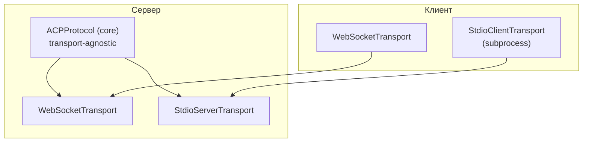

# План реализации stdio транспорта для ACP

> **Дата:** 2026-05-19
> **Статус:** ✅ Реализовано
> **Связано со спецификацией:** `doc/Agent Client Protocol/protocol/16-Transports.md`

---

## Мотивация

Спецификация ACP определяет stdio как **основной** транспорт: клиент запускает агент как subprocess, сообщения передаются через stdin/stdout в формате newline-delimited JSON-RPC. Текущая реализация поддерживает только WebSocket.

### Текущее состояние (до реализации)

| Компонент | Транспорт | Статус |
|-----------|-----------|--------|
| Сервер (`codelab serve`) | WebSocket (`aiohttp`) | Реализовано |
| Клиент (`codelab connect`) | WebSocket (`aiohttp`) | Реализовано |
| Local mode (`codelab`) | WebSocket (сервер в thread) | Реализовано |
| stdio (сервер) | — | **Не реализовано** |
| stdio (клиент) | — | **Не реализовано** |

### Целевое состояние (реализовано)

| Компонент | Транспорт | Статус |
|-----------|-----------|--------|
| Сервер (`codelab serve`) | WebSocket | ✅ Без изменений |
| Сервер (`codelab serve --stdio`) | stdio | ✅ Реализовано |
| Клиент (`codelab connect`) | WebSocket | ✅ Без изменений |
| Клиент (`codelab connect --stdio`) | stdio (subprocess) | ✅ Реализовано |
| Local mode (`codelab`) | stdio (subprocess) | ✅ Реализовано |

---


### Принятые решения

| Вопрос | Решение | Обоснование |
|--------|---------|-------------|
| Local mode: stdio или WebSocket? | **stdio** | Корректнее по spec, изолированный процесс |
| Отдельный `serve --stdio`? | **Да** | Полезно для интеграции с внешними клиентами (IDE plugins) |
| Streamable HTTP? | **Нет** | Сейчас только stdio и WebSocket |

## Архитектурный принцип

`ACPProtocol` (dispatcher) **не зависит от транспорта** — он принимает `ACPMessage` и возвращает `ProtocolOutcome`. stdio transport — это новый transport layer, переиспользующий всю бизнес-логику.



---

## Этап 1: Stdio transport для сервера

### Задача 1.1 — Абстрактный транспорт сервера

**Файлы:**
- `codelab/src/codelab/server/transport/__init__.py` (новый)
- `codelab/src/codelab/server/transport/base.py` (новый)

**Что сделать:**

Создать пакет `server/transport/` с протоколом `AcpServerTransport`:

```python
class AcpServerTransport(Protocol):
    async def run(
        self,
        on_message: Callable[[ACPMessage], Awaitable[ProtocolOutcome]],
    ) -> None:
        """Основной цикл транспорта. Вызывает on_message для каждого входящего сообщения."""
        ...

    async def send(self, message: ACPMessage) -> None:
        """Отправить response или notification."""
        ...

    async def close(self) -> None:
        """Graceful shutdown."""
        ...
```

**Почему:** Единый интерфейс позволяет WebSocket и Stdio работать одинаково. Callback `on_message` принимает `ACPMessage` и возвращает `ProtocolOutcome` (response + notifications + followups).

---

### Задача 1.2 — WebSocketTransport (рефакторинг)

**Файлы:**
- `codelab/src/codelab/server/transport/websocket.py` (новый)
- `codelab/src/codelab/server/http_server.py` (изменение)

**Что сделать:**

Перенести логику обработки WebSocket из `ACPHttpServer.handle_ws_request()` в класс `WebSocketTransport(AcpServerTransport)`:

- `WebSocketTransport` принимает `aiohttp.WebSocketResponse` + callback для Agent→Client RPC
- Реализует `AcpServerTransport`: `run(on_message)`, `send()`, `close()`
- Вся текущая логика переносится:
  - Deferred prompt tasks
  - Background prompt request tasks
  - Disconnect cleanup (cancel active turns, cancel pending RPC)
  - WS send lock
  - Auto-complete deferred prompt

`ACPHttpServer` упрощается: создаёт `WebSocketTransport` и делегирует обработку.

**Требования:**
- Никаких изменений в поведении — только рефакторинг
- Все существующие тесты должны проходить

---

### Задача 1.3 — StdioServerTransport

**Файлы:**
- `codelab/src/codelab/server/transport/stdio.py` (новый)

**Что сделать:**

```python
class StdioServerTransport:
    """ACP сервер через stdin/stdout (newline-delimited JSON-RPC)."""
```

**Реализация `run(on_message)`:**

1. Создать `asyncio.StreamReader` обёртку над `sys.stdin.buffer`
2. Цикл чтения:
   - `line = await reader.readline()`
   - Если пустая строка (EOF) → graceful exit
   - Decode UTF-8 → `ACPMessage.from_json()`
   - Вызвать `outcome = await on_message(acp_request)`
   - Отправить все notifications из `outcome.notifications` через `send()`
   - Отправить `outcome.response` через `send()` если есть
   - Отправить все `outcome.followup_responses` через `send()`
3. При parse error → отправить `ACPMessage.error_response(None, -32700, "Parse error")`

**Реализация `send(message)`:**

1. `data = message.to_json().encode("utf-8") + b"\n"`
2. `sys.stdout.buffer.write(data)`
3. `await asyncio.get_event_loop().run_in_executor(None, sys.stdout.flush)`

**Реализация `close()`:**

1. Установить флаг `_closed = True`
2. Отменить все pending operations

**Ключевые детали:**

| Аспект | Решение |
|--------|---------|
| **Логирование** | ТОЛЬКО в stderr. Structlog handler на stderr. Логи НЕ должны попадать в stdout — иначе JSON-RPC парсер сломается |
| **Buffering** | `sys.stdout.reconfigure(line_buffering=True)` при старте + ручной flush после каждого сообщения |
| **SIGTERM/SIGINT** | Register signal handlers → `close()` + `sys.exit(0)` |
| **Agent→Client RPC** | `session/request_permission`, `fs/*`, `terminal/*` — идут по тому же stdout. Нужен `asyncio.Lock` на запись чтобы не было race condition между response и outgoing RPC |
| **EOF** | Graceful exit из цикла, cleanup pending operations |

---

### Задача 1.4 — Функция запуска stdio сервера

**Файлы:**
- `codelab/src/codelab/server/transport/stdio_runner.py` (новый)

**Что сделать:**

Функция `run_stdio_server()` — аналог `ACPHttpServer.run()`:

```python
async def run_stdio_server(
    storage: SessionStorage,
    config: AppConfig,
    require_auth: bool = False,
    auth_api_key: str | None = None,
) -> None:
```

**Шаги:**

1. Создать DI контейнер (`make_container()` из `server/di.py`)
2. Создать `StdioServerTransport`
3. Создать `ClientRPCService` с callback на `transport.send()` (Agent→Client RPC через тот же stdout)
4. Установить `ClientRPCService` в `ClientRPCServiceHolder`
5. Создать `ACPProtocol` из DI контейнера
6. Запустить `transport.run(on_message=protocol.handle)`
7. Graceful shutdown при EOF/signal

**Важно:** Agent→Client RPC в stdio режиме идут по тому же каналу (stdout агента = stdin клиента). `ClientRPCService.send_request_callback` пишет JSON-RPC request в stdout. Нужен единый `asyncio.Lock` на запись — protects both responses and outgoing RPC requests.

---

### Задача 1.5 — CLI: `--stdio` флаг

**Файлы:**
- `codelab/src/codelab/server/cli.py` (изменение)
- `codelab/src/codelab/cli.py` (изменение)

**Что сделать:**

Добавить `--stdio` флаг в `serve_parser`:

```python
serve_parser.add_argument(
    "--stdio",
    action="store_true",
    help="Запустить stdio транспорт вместо WebSocket",
)
```

Обновить `run_serve()`:

```python
def run_serve(args):
    if args.stdio:
        run_stdio_serve(args)   # новая функция
    else:
        run_http_serve(args)    # существующий путь
```

В stdio режиме:
- Web UI автоматически отключается
- `--no-web` игнорируется
- Порт и host игнорируются (не нужны для stdio)

**Примеры использования:**

```bash
# WebSocket режим (как сейчас)
codelab serve --port 8765

# stdio режим
codelab serve --stdio

# stdio с кастомным storage
codelab serve --stdio --storage json:~/.codelab/data/sessions
```

---

### Задача 1.6 — Тесты серверного stdio

**Файлы:**
- `codelab/tests/server/transport/test_stdio_transport.py` (новый)
- `codelab/tests/server/transport/test_websocket_transport.py` (новый)

**Что тестировать:**

| Тест | Описание |
|------|----------|
| `test_message_roundtrip` | Request → response через stdio |
| `test_notification_streaming` | Multiple notifications sent correctly |
| `test_eof_graceful_shutdown` | EOF → цикл завершается, cleanup выполняется |
| `test_malformed_json_error` | Невалидный JSON → error response `-32700` |
| `test_agent_to_client_rpc` | Agent→Client RPC через тот же канал |
| `test_lock_prevents_race` | asyncio.Lock предотвращает interleaved writes |
| `test_signal_handler` | SIGTERM → graceful shutdown |
| `test_initialize_flow` | Полный initialize flow через stdio |
| `test_session_new_flow` | session/new через stdio |

**Подход к мокам:**
- `sys.stdin` → `asyncio.StreamReader` с feed данных
- `sys.stdout` → `asyncio.StreamWriter` с capture записанных байт
- `sys.stderr` → StringIO для capture логов

---

## Этап 2: Stdio transport для клиента

### Задача 2.1 — StdioClientTransport

**Файлы:**
- `codelab/src/codelab/client/infrastructure/stdio_transport.py` (новый)

**Что сделать:**

Реализует интерфейс `Transport` из `client/infrastructure/transport.py`:

```python
class StdioClientTransport:
    """Клиентский stdio транспорт — запускает агент как subprocess."""

    def __init__(
        self,
        command: str,
        args: list[str],
        cwd: str | None = None,
    ) -> None:
        self._command = command
        self._args = args
        self._cwd = cwd
```

**Реализация:**

| Метод | Описание |
|-------|----------|
| `__aenter__()` | `asyncio.create_subprocess_exec(command, *args, stdin=PIPE, stdout=PIPE, stderr=PIPE, cwd=cwd)`. Запустить background reader для stdout → `asyncio.Queue`. Background reader для stderr → логирование. |
| `__aexit__()` | Close stdin → wait process (timeout 5s) → kill if needed → cleanup tasks |
| `send_str(data)` | `process.stdin.write((data + "\n").encode())` + `drain()` |
| `receive_text()` | `await stdout_queue.get()` |
| `is_connected()` | `process.returncode is None` (процесс жив) |

**Background reader для stdout:**

```python
async def _stdout_reader(self) -> None:
    while not self._closed:
        line = await self._process.stdout.readline()
        if not line:  # EOF
            break
        await self._stdout_queue.put(line.decode("utf-8").strip())
```

**Ключевые детали:**

| Аспект | Решение |
|--------|---------|
| **stderr** | Только логирование, НЕ ACP сообщения |
| **Graceful shutdown** | Close stdin → wait 5s → kill |
| **Queue** | `asyncio.Queue[str]` для буферизации входящих сообщений |
| **Process exit** | Если процесс завершился неожиданно → raise error при `receive_text()` |

---

### Задача 2.2 — Параметризация ACPTransportService

**Файлы:**
- `codelab/src/codelab/client/infrastructure/services/acp_transport_service.py` (изменение)

**Что сделать:**

Параметризовать `ACPTransportService` чтобы принимал любой `Transport` вместо хардкода `WebSocketTransport`:

**Текущий код:**
```python
def __init__(self, host: str, port: int, ...):
    self._transport: WebSocketTransport | None = None
    # ...
    self._transport = WebSocketTransport(host=self.host, port=self.port)
```

**Новый код:**
```python
def __init__(
    self,
    transport: Transport,
    parser: MessageParser | None = None,
    permission_handler: PermissionHandler | None = None,
) -> None:
    self._transport: Transport = transport
    # ... остальная логика без изменений
```

**Почему:** Вся routing infrastructure (BackgroundReceiveLoop, MessageRouter, RoutingQueues) переиспользуется. Меняется только底层 транспорт.

**Обратная совместимость:** Создать factory функцию:

```python
def create_websocket_transport_service(
    host: str, port: int, ...
) -> ACPTransportService:
    transport = WebSocketTransport(host=host, port=port)
    return ACPTransportService(transport=transport, ...)
```

---

### Задача 2.3 — Обновить ClientConfig и ClientProvider (DI)

**Файлы:**
- `codelab/src/codelab/client/infrastructure/client_config.py` (изменение)
- `codelab/src/codelab/client/infrastructure/providers.py` (изменение)

**Что сделать:**

`ClientConfig` добавить поля:

```python
@dataclass
class ClientConfig:
    host: str
    port: int
    cwd: Path
    history_dir: str | None = None
    logger: Any | None = None
    # Новое:
    transport_mode: Literal["websocket", "stdio"] = "websocket"
    stdio_command: str | None = None
    stdio_args: list[str] | None = None
```

`ClientProvider.get_transport()`:

```python
@provide(scope=Scope.APP)
def get_transport(self, config: ClientConfig) -> TransportService:
    if config.transport_mode == "stdio":
        transport = StdioClientTransport(
            command=config.stdio_command,
            args=config.stdio_args or [],
            cwd=str(config.cwd),
        )
    else:
        transport = WebSocketTransport(host=config.host, port=config.port)

    return ACPTransportService(
        transport=transport,
        permission_handler=...,
    )
```

---

### Задача 2.4 — Обновить container_factory

**Файлы:**
- `codelab/src/codelab/client/infrastructure/container_factory.py` (изменение)

**Что сделать:**

`create_client_container()` принимает новые параметры:

```python
def create_client_container(
    host: str,
    port: int,
    cwd: str | None = None,
    history_dir: str | None = None,
    logger: Any | None = None,
    # Новое:
    transport_mode: str = "websocket",
    stdio_command: str | None = None,
    stdio_args: list[str] | None = None,
) -> Container:
```

Передаёт их в `ClientConfig`.

---

### Задача 2.5 — Обновить CLI клиента

**Файлы:**
- `codelab/src/codelab/cli.py` (изменение)
- `codelab/src/codelab/client/tui/app.py` (изменение)

**Что сделать:**

`codelab connect` — новые аргументы:

```python
connect_parser.add_argument(
    "--stdio",
    action="store_true",
    help="Запустить агент как subprocess через stdio транспорт",
)
connect_parser.add_argument(
    "--agent-command",
    type=str,
    default=None,
    help="Команда для запуска агента (по умолчанию: codelab serve --stdio)",
)
```

`run_connect()`:

```python
def run_connect(args):
    if args.stdio:
        _run_tui_app_stdio(
            agent_command=args.agent_command or "codelab serve --stdio",
            cwd=args.cwd,
        )
    else:
        _run_tui_app(host=args.host, port=args.port, cwd=args.cwd)
```

`ACPClientApp` — поддержка stdio mode:

```python
def __init__(
    self,
    *,
    host: str,
    port: int,
    cwd: str | None = None,
    history_dir: str | None = None,
    # Новое:
    transport_mode: str = "websocket",
    stdio_command: str | None = None,
    stdio_args: list[str] | None = None,
) -> None:
```

**Примеры использования:**

```bash
# WebSocket (как сейчас)
codelab connect --host 127.0.0.1 --port 8765

# stdio (дефолтная команда агента)
codelab connect --stdio --cwd /project

# stdio (кастомная команда агента)
codelab connect --stdio --agent-command "codelab serve --stdio --storage json:./sessions" --cwd /project
```

---

### Задача 2.6 — Обновить local mode на stdio

**Файлы:**
- `codelab/src/codelab/cli.py` — `run_local()` (изменение)

**Текущий подход:**

Сервер запускается в **thread** + WebSocket → TUI подключается по WebSocket.

**Рекомендуемый подход:**

Сервер запускается как **subprocess** + stdio transport → TUI подключается через stdio.

**Почему:**
- Соответствует спецификации ACP
- Убирает hack с thread + WebSocket
- Более изолированный процесс сервера

**Реализация:**
- `codelab` без подкоманды запускает сервер как subprocess через stdio
- TUI подключается к subprocess через `StdioClientTransport`
- Graceful shutdown: при выходе из TUI процесс сервера завершается

---

### Задача 2.7 — Тесты клиентского stdio

**Файлы:**
- `codelab/tests/client/infrastructure/test_stdio_transport.py` (новый)
- `codelab/tests/client/infrastructure/test_stdio_acp_transport_service.py` (новый)

**Что тестировать:**

| Тест | Описание |
|------|----------|
| `test_send_receive_roundtrip` | send → receive через mock subprocess |
| `test_subprocess_exit_error` | Process exit → error при receive |
| `test_graceful_shutdown` | __aexit__ → process terminated cleanly |
| `test_stderr_logging` | stderr → логируется, не парсится как JSON |
| `test_is_connected` | is_connected отражает состояние процесса |
| `test_full_lifecycle` | initialize → session/new → prompt через stdio |

**Подход к мокам:**
- Mock `asyncio.create_subprocess_exec` → fake process с pipe
- Или использовать реальный subprocess с echo-скриптом для интеграционных тестов

---

## Порядок выполнения

```mermaid
graph LR
    subgraph "Этап 1: Сервер ✅"
        A1[1.1 Абстракция] --> A2[1.2 WS рефакторинг]
        A2 --> A3[1.3 StdioServer]
        A3 --> A4[1.4 Runner]
        A4 --> A5[1.5 CLI]
        A5 --> A6[1.6 Тесты]
    end

    subgraph "Этап 2: Клиент ✅"
        B1[2.1 StdioClient] --> B2[2.2 Параметризация]
        B2 --> B3[2.3 DI]
        B3 --> B4[2.4 Factory]
        B4 --> B5[2.5 CLI]
        B5 --> B6[2.6 Local mode]
        B6 --> B7[2.7 Тесты]
    end

    A6 -. "после этапа 1" .-> B1
```



---

## Сводка файлов

### Новые файлы (реализованы)

| Файл | Этап | Описание | Статус |
|------|------|----------|--------|
| `server/transport/__init__.py` | 1 | Пакет транспорта | ✅ |
| `server/transport/base.py` | 1 | `AcpServerTransport` протокол | ✅ |
| `server/transport/websocket.py` | 1 | `WebSocketTransport` (рефакторинг) | ✅ |
| `server/transport/stdio.py` | 1 | `StdioServerTransport` | ✅ |
| `server/transport/stdio_runner.py` | 1 | `run_stdio_server()` | ✅ |
| `client/infrastructure/stdio_transport.py` | 2 | `StdioClientTransport` | ✅ |
| `tests/client/test_acp_transport_service.py` | 2 | Тесты transport service | ✅ |
| `tests/client/test_concurrent_receive_calls.py` | 2 | Тесты concurrent receive | ✅ |
| `tests/client/test_dishka_di_container.py` | 2 | Тесты DI container | ✅ |

### Изменённые файлы (реализованы)

| Файл | Этап | Изменение | Статус |
|------|------|-----------|--------|
| `server/http_server.py` | 1 | Делегирование в `WebSocketTransport` | ✅ |
| `server/cli.py` | 1 | `--stdio` флаг | ✅ |
| `cli.py` | 1+2 | `--stdio` для serve и connect, local mode | ✅ |
| `client/infrastructure/transport.py` | 2 | Без изменений (интерфейс уже есть) | ✅ |
| `client/infrastructure/services/acp_transport_service.py` | 2 | Параметризация транспорта | ✅ |
| `client/infrastructure/client_config.py` | 2 | Новые поля transport_mode, stdio_* | ✅ |
| `client/infrastructure/providers.py` | 2 | Factory для stdio/websocket | ✅ |
| `client/infrastructure/container_factory.py` | 2 | Новые параметры | ✅ |
| `client/tui/app.py` | 2 | Поддержка stdio mode | ✅ |

---

## Риски и митигация

| Риск | Вероятность | Влияние | Митигация | Статус |
|------|-------------|---------|-----------|--------|
| Логи попадают в stdout | Высокая | Критическое | Structlog handler только на stderr. Тест на capture stdout | ✅ Митигирован |
| Buffering stdout | Средняя | Высокое | `line_buffering=True` + ручной flush | ✅ Митигирован |
| Race condition writes | Средняя | Высокое | Единый `asyncio.Lock` на все writes | ✅ Митигирован |
| Windows совместимость | Средняя | Среднее | Проверка `sys.stdin.buffer` на Windows | ⚠️ Требуется проверка |
| Рефакторинг WebSocket | Низкая | Среднее | Полное покрытие тестами перед рефакторингом. CI проверка | ✅ Митигирован |
| Breaking changes CLI | Низкая | Низкое | Все новые опции опциональны. Дефолтное поведение не меняется | ✅ Митигирован |

---

## Оценка объёма

| Задача | Файлы | Строки | Сложность | Статус |
|--------|-------|--------|-----------|--------|
| 1.1 Абстракция | 2 | ~80 | Низкая | ✅ |
| 1.2 WS рефакторинг | 2 | ~400 | Средняя | ✅ |
| 1.3 StdioServer | 1 | ~250 | Средняя | ✅ |
| 1.4 Runner | 1 | ~150 | Средняя | ✅ |
| 1.5 CLI | 2 | ~60 | Низкая | ✅ |
| 1.6 Тесты | 2 | ~500 | Средняя | ✅ |
| **Этап 1 итого** | **10** | **~1440** | | **✅** |
| 2.1 StdioClient | 1 | ~200 | Средняя | ✅ |
| 2.2 Параметризация | 1 | ~100 | Низкая | ✅ |
| 2.3 DI | 2 | ~80 | Низкая | ✅ |
| 2.4 Factory | 1 | ~30 | Низкая | ✅ |
| 2.5 CLI | 2 | ~120 | Низкая | ✅ |
| 2.6 Local mode | 1 | ~80 | Низкая | ✅ |
| 2.7 Тесты | 2 | ~400 | Средняя | ✅ |
| **Этап 2 итого** | **10** | **~1010** | | **✅** |
| **Всего** | **~20** | **~2450** | | **✅ Реализовано** |

---

## Принятые решения

1. **Local mode** — переводить на stdio.
   - stdio: корректнее по spec, изолированный процесс ✅

2. **Отдельный `codelab serve --stdio`** — да, нужен.
   - Полезно для интеграции с внешними клиентами (IDE plugins) ✅

3. **Streamable HTTP транспорт** — не сейчас.
   - Сейчас только stdio и WebSocket ✅
