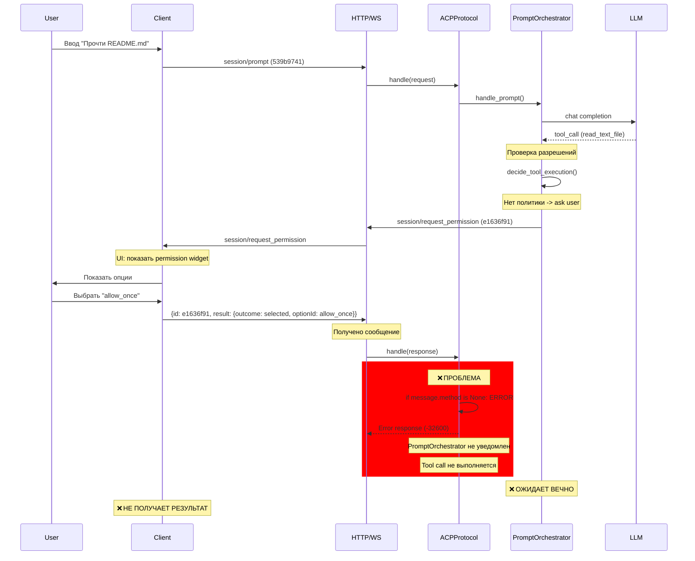
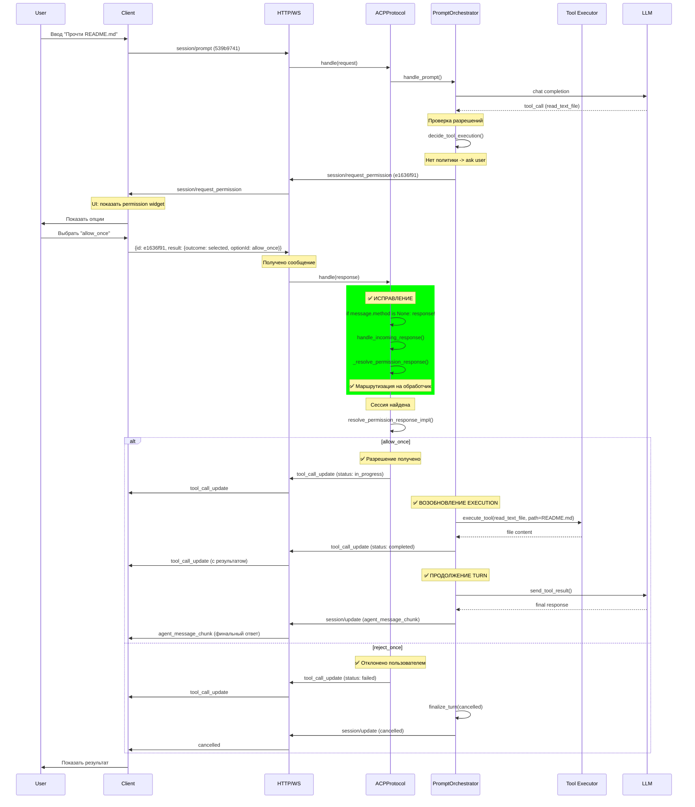
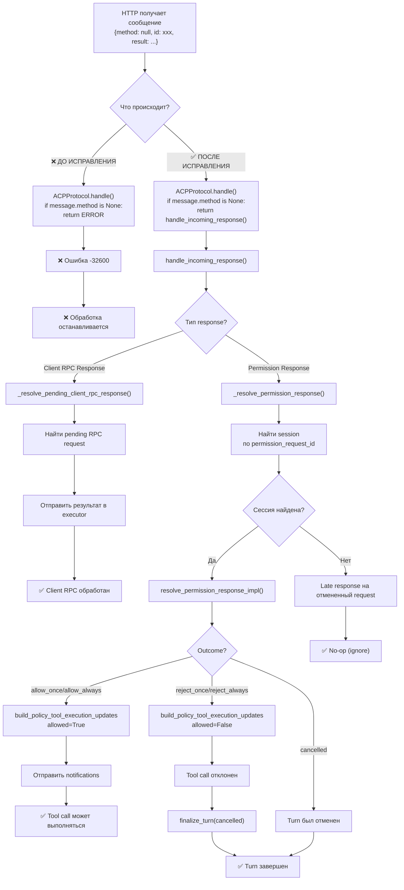
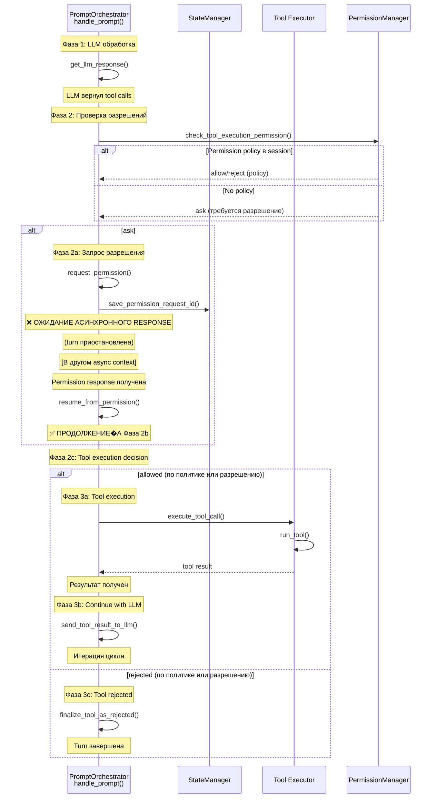
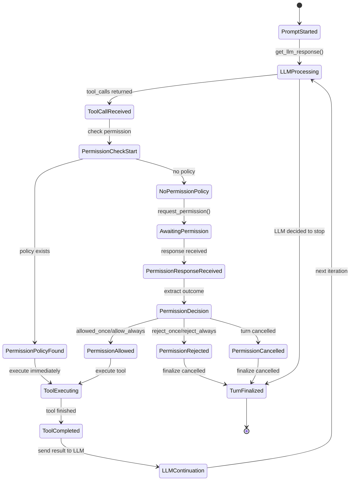
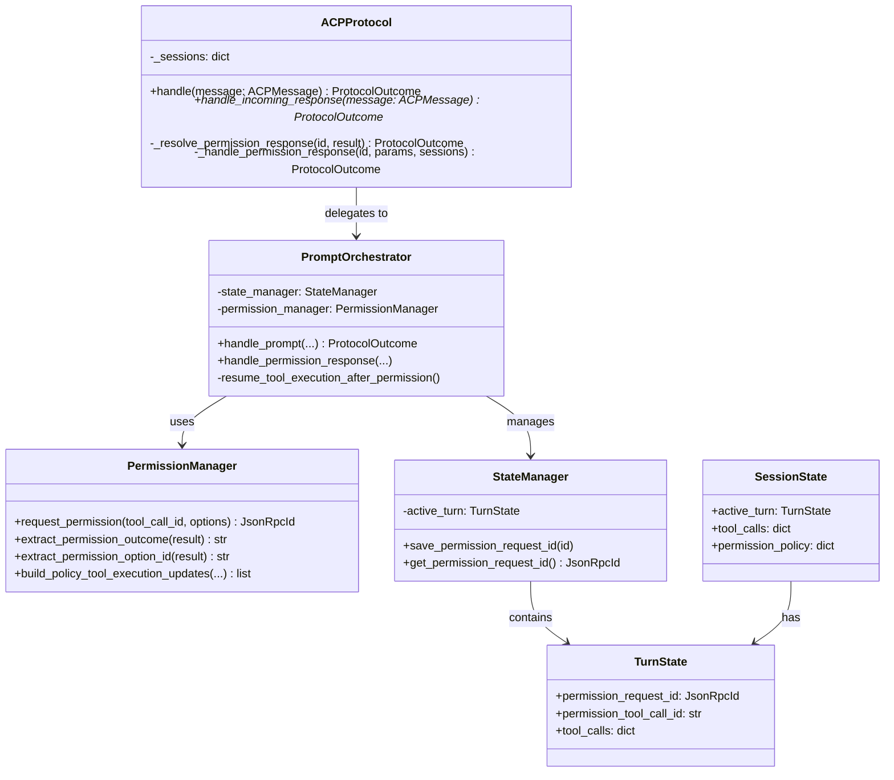
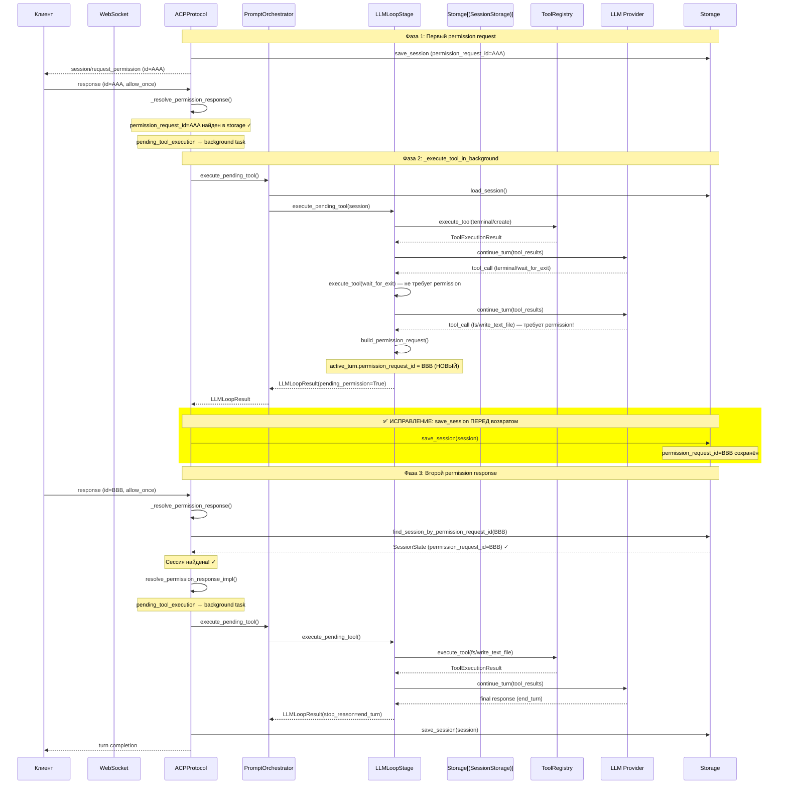

# Permission Flow: Диаграммы последовательности

## 1. Текущее состояние (СЛОМАНО)



---

## 2. Исправленное состояние (РАБОТАЕТ)



---

## 3. Поток обработки responses в ACPProtocol



---

## 4. Tool execution resumption flow



---

## 5. State transitions при permission response



---

## 6. Диаграмма классов для permission flow



---

## 7. Временная диаграмма обработки (timing)

```mermaid
timeline
    title Timing: Permission Flow от начала до конца
    
    12:30:17.517 : Client: prompt submitted
    12:30:17.517 : Client: sending_message (session/prompt)
    12:30:17.520 : Server: message received (prompt)
    12:30:17.520 : Server: active turn created
    12:30:17.520 : Server: openai create_completion request starting
    
    12:30:19.035 : Server: received openai api response (tool_calls)
    12:30:19.035 : Server: decision: ask user for permission
    12:30:19.036 : Server: permission request sent (e1636f91)
    12:30:19.037 : Server: notifications sent to client
    12:30:19.037 : Client: permission request received
    12:30:19.044 : Client: permission widget mounted
    
    12:30:19.044-12:30:21.202 : User: waiting (waiting for user choice)
    
    12:30:21.202 : Client: user selected allow_once
    12:30:21.202 : Client: permission choice received
    12:30:21.204 : Client: sending permission response (e1636f91)
    12:30:21.205 : Server: message received (permission response)
    
    rect rgb(255, 0, 0)
        12:30:21.205+ : ❌ LOGS STOPPED
    end
    
    rect rgb(0, 255, 0)
        12:30:21.205 : [AFTER FIX] response recognized
        12:30:21.205 : [AFTER FIX] handle_incoming_response()
        12:30:21.205 : [AFTER FIX] _resolve_permission_response()
        12:30:21.205 : [AFTER FIX] permission_response_impl()
        12:30:21.206 : [AFTER FIX] tool_call_update (running)
        12:30:21.206 : [AFTER FIX] tool execution starts
    end
    
    12:30:21.250 : [AFTER FIX] tool_call_update (completed)
    12:30:21.250 : [AFTER FIX] tool result sent to LLM
    12:30:21.250 : [AFTER FIX] LLM processing continues
    12:30:22.800 : [AFTER FIX] LLM response received
    12:30:22.801 : [AFTER FIX] agent_message_chunk sent
    12:30:22.801 : [AFTER FIX] turn finalized
    12:30:22.802 : Client: final response received
```

---

---

## 8. Execute Pending Tool Flow (исправление permission_request_id mismatch)

**Проблема:** После выполнения инструмента LLM loop мог вызвать ещё один tool, требующий permission. Новый `permission_request_id` записывался в in-memory session, но **не сохранялся** в storage. При ответе клиента `find_session_by_permission_request_id` читал storage и находил старый ID → mismatch → сессия не найдена → агент зависал.



### Ключевое изменение в `core.py`

**До (сломано):**
```python
async def execute_pending_tool(self, session_id, tool_call_id):
    session = await self._storage.load_session(session_id)
    orchestrator = await self._get_prompt_orchestrator()
    return await orchestrator.execute_pending_tool(session, ...)
    # ❌ Сессия НЕ сохранена — новый permission_request_id потерян
```

**После (исправлено):**
```python
async def execute_pending_tool(self, session_id, tool_call_id):
    session = await self._storage.load_session(session_id)
    orchestrator = await self._get_prompt_orchestrator()
    
    llm_result = await orchestrator.execute_pending_tool(session, ...)
    
    # ✅ Сохраняем сессию — LLM loop мог установить новый permission_request_id
    await self._storage.save_session(session)
    
    return llm_result
```

### Почему `load_session` в `_execute_tool_in_background` был ошибкой

Предыдущая попытка исправления делала `load_session()` в `_execute_tool_in_background`:

```python
# ❌ WRONG: load_session загружает СТАРУЮ копию из storage
session = await self._storage.load_session(session_id)
await self._storage.save_session(session)
```

Это перезаписывало in-memory изменения (новый `permission_request_id`) старой копией из storage. Правильное решение — сохранять сессию **внутри** `execute_pending_tool()`, где in-memory session содержит актуальные изменения.

---

## Заметки

1. **Критическое изменение**: Строка в `ACPProtocol.handle()` меняется с `return ERROR` на `return handle_incoming_response()`
2. **Cascade effect**: Это позволяет существующему коду обработать permission response
3. **No breaking changes**: Все остальное работает как раньше
4. **Tool execution resumption**: После разрешения, tool должен выполняться и результат отправляться в LLM
5. **Session persistence**: `execute_pending_tool()` сохраняет сессию после orchestrator вызова, чтобы новый `permission_request_id` был доступен в storage
