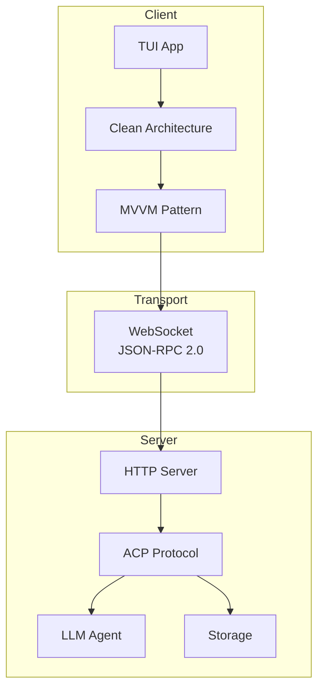
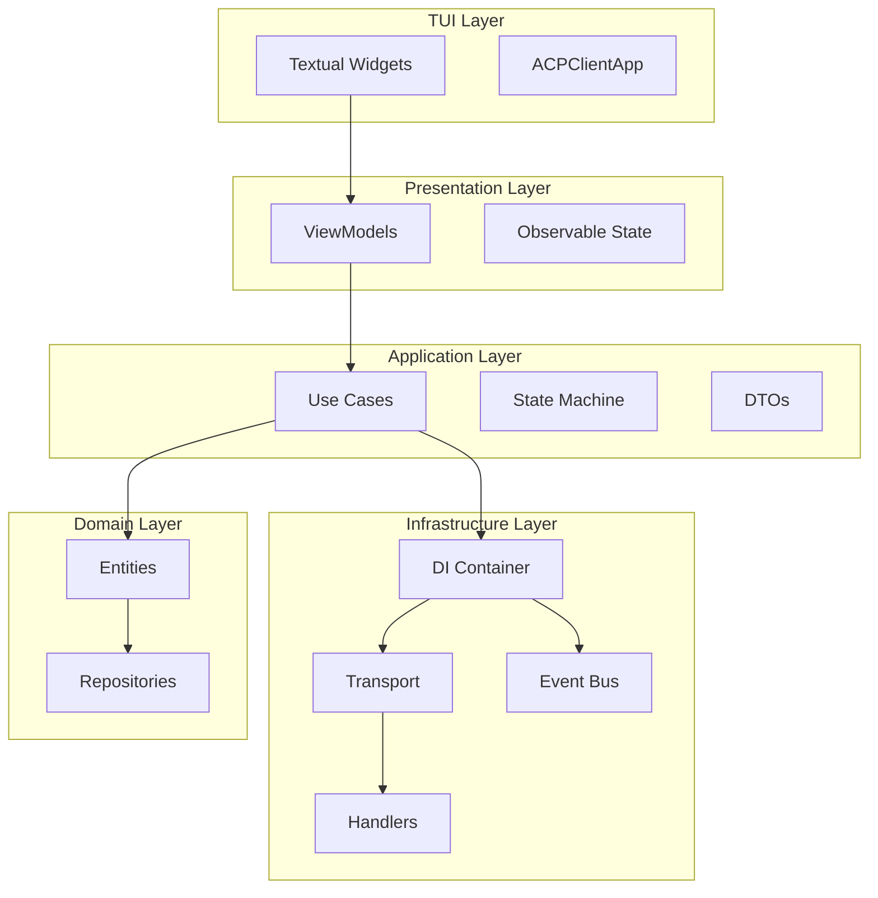
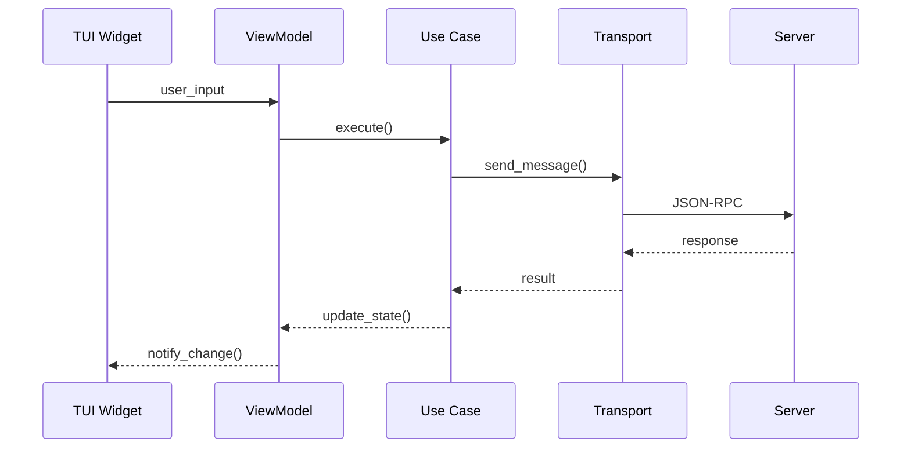
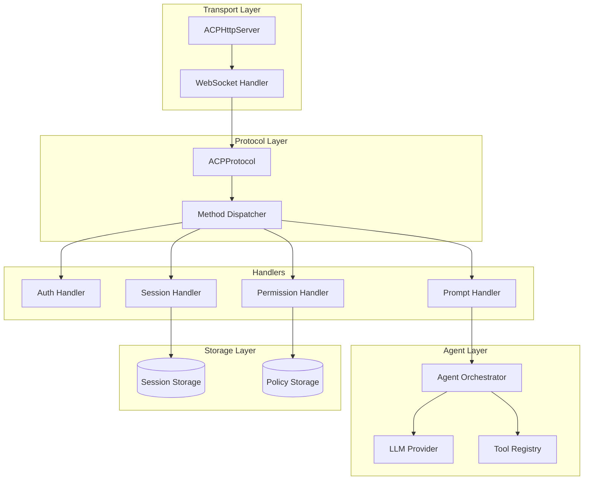
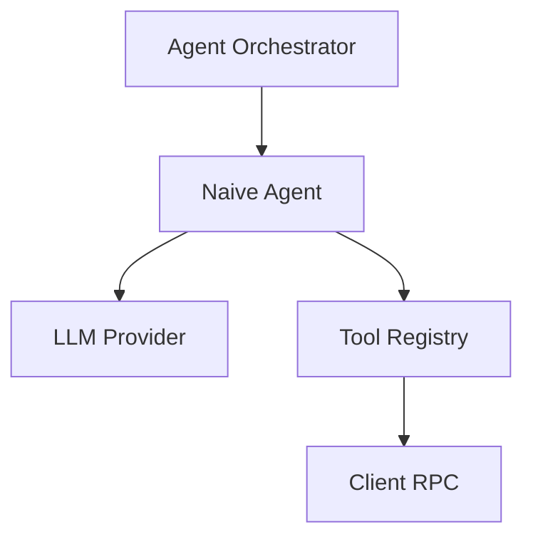
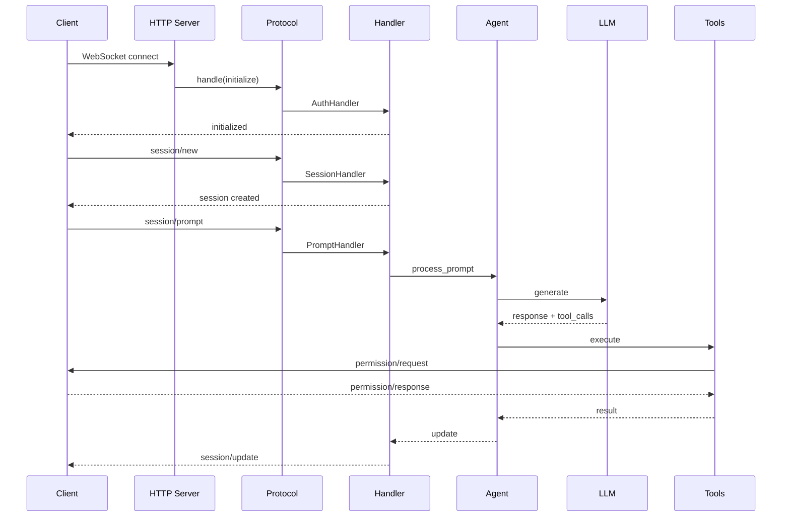

# Архитектура CodeLab

> Детальное описание архитектуры клиента и сервера для разработчиков.

## Обзор

CodeLab реализует клиент-серверную архитектуру на основе [Agent Client Protocol (ACP)](../../Agent%20Client%20Protocol/get-started/01-Introduction.md). Проект состоит из двух основных компонентов:



## Структура проекта

```
codelab/
├── src/codelab/
│   ├── cli.py              # Единая точка входа CLI
│   ├── shared/             # Общие модули
│   │   ├── messages.py     # JSON-RPC сообщения
│   │   ├── logging.py      # Структурированное логирование
│   │   └── content/        # ACP Content Types
│   ├── client/             # TUI клиент
│   │   ├── domain/         # Domain Layer
│   │   ├── application/    # Application Layer
│   │   ├── infrastructure/ # Infrastructure Layer
│   │   ├── presentation/   # Presentation Layer
│   │   └── tui/            # TUI Layer
│   └── server/             # ACP сервер
│       ├── protocol/       # Протокол ACP
│       ├── agent/          # LLM агенты
│       ├── tools/          # Инструменты агента
│       ├── storage/        # Хранилище сессий
│       └── llm/            # LLM провайдеры
└── tests/                  # Тесты
```

## Архитектура клиента

### Clean Architecture

Клиент реализует Clean Architecture с 5 слоями:



### Слои клиента

#### Domain Layer (`client/domain/`)

Базовые сущности и интерфейсы:

```python
# entities.py
@dataclass
class Session:
    """Сущность сессии."""
    id: str
    title: str | None
    created_at: datetime
    messages: list[Message]

@dataclass
class Message:
    """Сущность сообщения."""
    role: Literal["user", "assistant"]
    content: list[ContentPart]
    timestamp: datetime
```

#### Application Layer (`client/application/`)

Use Cases и бизнес-логика:

```python
class SendPromptUseCase:
    """Use case отправки промпта."""
    
    async def execute(self, session_id: str, text: str) -> None:
        # Валидация
        # Отправка через transport
        # Обновление состояния
```

#### Infrastructure Layer (`client/infrastructure/`)

Техническая реализация:

- **DIBootstrapper** — инициализация DI контейнера
- **Transport** — WebSocket соединение
- **EventBus** — слабо связанная коммуникация
- **Handlers** — обработчики fs/*, terminal/*
- **Async Callbacks** — `_call_callback()` поддерживает sync и async функции для предотвращения deadlock в stdio режиме

#### Presentation Layer (`client/presentation/`)

ViewModels для MVVM:

```python
class ChatViewModel(BaseViewModel):
    """ViewModel для Chat View."""
    
    messages: Observable[list[Message]]
    is_loading: Observable[bool]
    
    async def send_message(self, text: str) -> None:
        self.is_loading.set(True)
        await self._send_prompt_use_case.execute(text)
```

#### TUI Layer (`client/tui/`)

Textual компоненты:

```python
class ChatView(Widget):
    """Виджет чата."""
    
    def compose(self) -> ComposeResult:
        yield Static(id="messages")
        yield PromptInput()
    
    def _update_streaming(self, text: str) -> None:
        # Используем Content API для безопасного рендеринга
        # (избегаем crash на markup-like символах в тексте LLM)
        from textual.content import Content
        prefix = Content.from_markup("[bold green]⟳ [/]")
        safe_text = Content.from_text(text)
        # prefix + safe_text — безопасное комбинирование
```

### Диаграмма потока данных



## Архитектура сервера

### Общая структура



### Protocol Layer (`server/protocol/`)

Ядро ACP протокола:

```python
class ACPProtocol:
    """Главный класс протокола ACP."""
    
    async def handle(self, message: ACPMessage) -> ProtocolOutcome:
        """Диспетчеризация JSON-RPC запросов."""
        method = message.method
        handler = self._get_handler(method)
        return await handler.handle(message)
```

### Handler Layer (`server/protocol/handlers/`)

Обработчики методов протокола:

| Модуль | Методы |
|--------|--------|
| `auth.py` | `authenticate`, `initialize` |
| `session.py` | `session/new`, `session/load`, `session/list` |
| `prompt.py` | `session/prompt`, `session/cancel` |
| `permissions.py` | `session/request_permission` |
| `config.py` | `session/set_config_option`, `session/set_mode` |

### Agent Layer (`server/agent/`)

Управление LLM агентом:



```python
class AgentOrchestrator:
    """Оркестратор LLM агента."""
    
    async def process_prompt(self, prompt: str) -> AsyncIterator[Update]:
        """Обработка промпта с потоковыми обновлениями."""
        async for update in self.agent.run(prompt):
            yield update
```

### Tool System (`server/tools/`)

Система инструментов:

```
tools/
├── base.py              # Базовые классы
├── registry.py          # Реестр инструментов
├── mapping.py           # Маппинг имён ACP ↔ LLM
├── definitions/         # Определения инструментов
│   ├── filesystem.py    # fs/* инструменты
│   └── terminal.py      # terminal/* инструменты
├── executors/           # Исполнители
│   ├── filesystem_executor.py
│   └── terminal_executor.py
└── integrations/        # Интеграции
    ├── client_rpc_bridge.py
    └── permission_checker.py
```

### ToolMapping

Модуль `mapping.py` обеспечивает конвертацию имён инструментов между форматами:

```python
# ACP → LLM: замена / на _
acp_name_to_llm_name("fs/read_text_file")  # → "fs_read_text_file"

# LLM → ACP: восстановление / для известных префиксов
llm_name_to_acp_name("fs_read_text_file")  # → "fs/read_text_file"
```

**Почему это нужно:** Некоторые LLM провайдеры (Azure через OpenRouter) не поддерживают `/` в именах функций. Паттерн: `^[a-zA-Z0-9_\.-]+$`.

**Где применяется:**
- `NaiveAgent._to_openai_tools_format()` — при отправке в LLM
- `SimpleToolRegistry.to_llm_tools()` — при конвертации для LLM
- `SimpleToolRegistry.execute_tool()` — при lookup в registry
- `LLMLoopStage._process_tool_calls()` — при обработке tool calls
```

### Storage Layer (`server/storage/`)

Хранение данных:

```python
class SessionStorage(ABC):
    """Абстрактный интерфейс хранилища."""
    
    @abstractmethod
    async def save(self, session: SessionState) -> None: ...
    
    @abstractmethod
    async def load(self, session_id: str) -> SessionState | None: ...

class JsonFileStorage(SessionStorage):
    """Хранение в JSON файлах."""
    
class InMemoryStorage(SessionStorage):
    """In-memory хранение (development)."""
```

## Взаимодействие компонентов

### Жизненный цикл запроса



### Bidirectional RPC

```mermaid
graph LR
    subgraph "Client"
        Handler[RPC Handler]
        FS[FileSystem Executor]
        Term[Terminal Executor]
        AsyncCB[Async Callbacks\n_call_callback()]
    end
    
    subgraph "Server"
        RPC[ClientRPCService]
        Bridge[RPC Bridge]
    end
    
    RPC -->|fs/read_text_file| AsyncCB
    RPC -->|terminal/create| AsyncCB
    AsyncCB --> FS
    AsyncCB --> Term
    FS -->|response| Bridge
    Term -->|response| Bridge
```

## Паттерны проектирования

### Используемые паттерны

| Паттерн | Применение |
|---------|------------|
| **Clean Architecture** | Структура клиента |
| **MVVM** | Presentation layer |
| **Repository** | Domain layer |
| **Factory** | Создание сессий, handlers |
| **Observer** | Observable state |
| **Command** | Use Cases |
| **Strategy** | LLM providers |
| **Chain of Responsibility** | Protocol handlers |

### Dependency Injection

```python
class DIBootstrapper:
    """Bootstrapper DI контейнера."""
    
    def bootstrap(self) -> Container:
        container = Container()
        
        # Transport
        container.register(Transport, WebSocketTransport)
        
        # Use Cases
        container.register(SendPromptUseCase)
        
        # ViewModels
        container.register(ChatViewModel)
        
        return container
```

## Дополнительные материалы

- [Разработка клиента](02-client-development.md) — детали реализации клиента
- [Разработка сервера](03-server-development.md) — детали реализации сервера
- [Архитектура разрешений](../../architecture/CLIENT_PERMISSION_HANDLING_ARCHITECTURE.md)
- [Архитектура Client Methods](../../architecture/CLIENT_METHODS_ARCHITECTURE.md)
