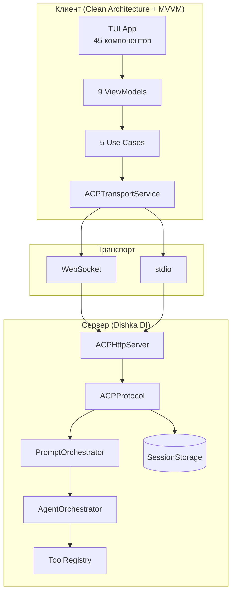
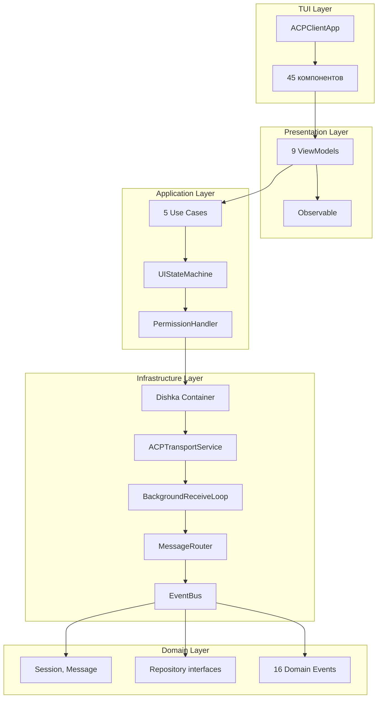
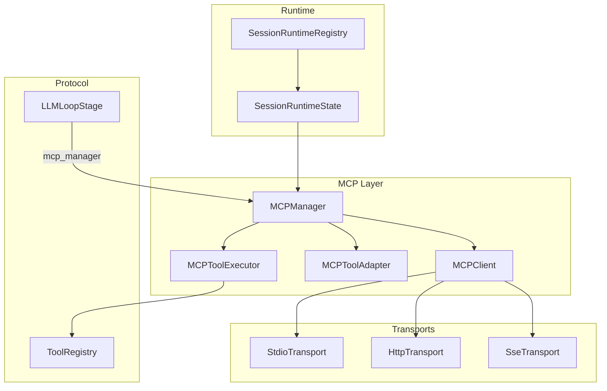
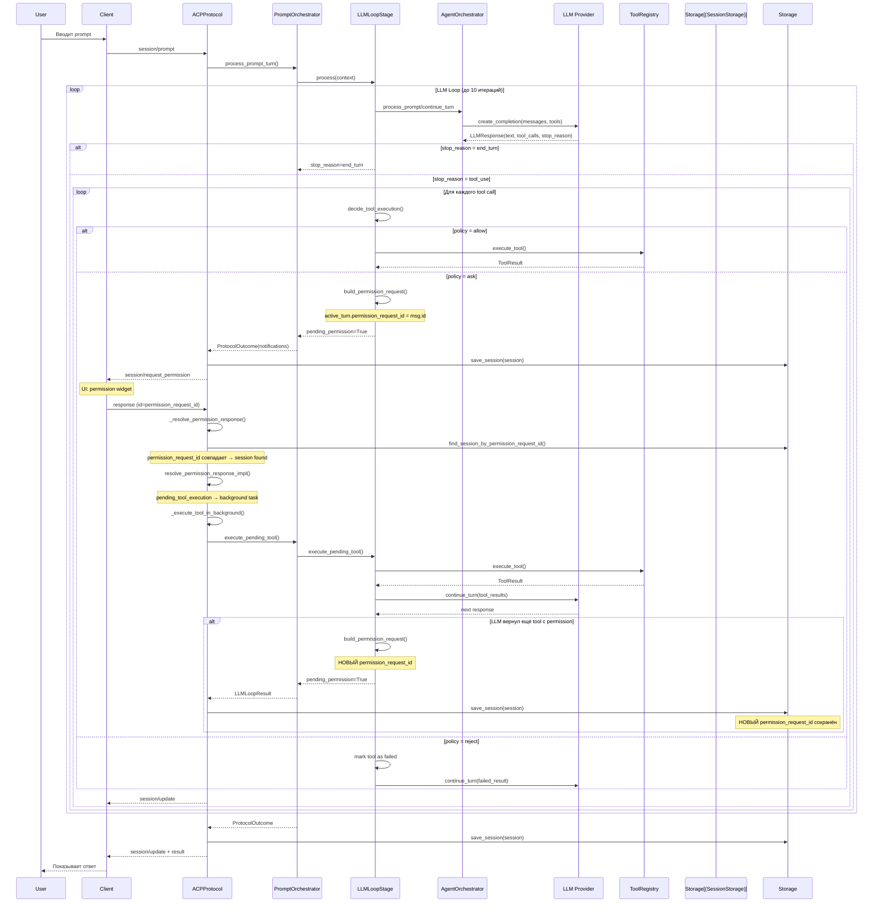

# Архитектура CodeLab

> Детальное описание архитектуры клиента и сервера для разработчиков.

## Обзор

CodeLab реализует клиент-серверную архитектуру на основе [Agent Client Protocol (ACP)](../../Agent%20Client%20Protocol/get-started/01-Introduction.md). Проект использует **Dishka DI контейнер** для управления зависимостями и следует принципам **Clean Architecture** на клиенте.



## Полная архитектурная схема

Ниже представлена детальная схема всех подсистем CodeLab с компонентами и связями.

```mermaid
graph TB
    %% ==========================================
    %% CLIENT SIDE
    %% ==========================================
    subgraph CLIENT["🖥️ CodeLab Client (Clean Architecture + MVVM)"]
        direction TB

        subgraph TUI_LAYER["TUI Layer (Textual)"]
            direction TB
            APP[ACPClientApp]
            COMPONENTS[45 компонентов<br/>ChatView, Sidebar, FileTree<br/>PromptInput, ToolPanel<br/>MessageBubble, ToolCallCard<br/>PermissionModal, FileViewer<br/>CommandPalette, Tabs<br/>Toast, Spinner, MarkdownViewer]
            NAV[NavigationManager]
            THEME[ThemeManager<br/>dark/light]
        end

        subgraph PRESENTATION["Presentation Layer (MVVM)"]
            direction TB
            UI_VM[UIViewModel<br/>connection, sidebar, modals]
            SESSION_VM[SessionViewModel<br/>session list, create, switch]
            CHAT_VM[ChatViewModel<br/>messages, streaming, tools]
            PLAN_VM[PlanViewModel<br/>agent plan display]
            TERM_VM[TerminalViewModel<br/>terminal output]
            FS_VM[FileSystemViewModel<br/>file tree]
            FV_VM[FileViewerViewModel<br/>file preview]
            PERM_VM[PermissionViewModel<br/>permission modal]
            TERMLOG_VM[TerminalLogViewModel<br/>terminal log]
            OBS[Observable&lt;T&gt;<br/>ObservableCommand]
        end

        subgraph APPLICATION["Application Layer"]
            direction TB
            INIT_UC[InitializeUseCase]
            CREATE_UC[CreateSessionUseCase]
            LOAD_UC[LoadSessionUseCase]
            SEND_UC[SendPromptUseCase]
            LIST_UC[ListSessionsUseCase]
            COORD[SessionCoordinator]
            PH[PermissionHandler]
            SM[UIStateMachine<br/>7 состояний]
        end

        subgraph INFRASTRUCTURE["Infrastructure Layer"]
            direction TB
            DI_CLIENT[Dishka Container<br/>ClientProvider, ViewModelProvider]
            TRANSPORT_CLIENT[ACPTransportService<br/>WebSocket + Stdio]
            BG_LOOP[BackgroundReceiveLoop<br/>single receive]
            ROUTER[MessageRouter<br/>→ RoutingQueues]
            RESPONSE_Q[response_queues<br/>per-request]
            NOTIF_Q[notification_queue<br/>session/update, fs/*, terminal/*]
            PERM_Q[permission_queue<br/>session/request_permission]
            EVENT_BUS[EventBus<br/>16 Domain Events]
            FS_HANDLER[FileSystemHandler<br/>+ Executor]
            TERM_HANDLER[TerminalHandler<br/>+ Executor]
        end

        subgraph DOMAIN["Domain Layer"]
            direction TB
            ENTITIES[Entities<br/>Session, Message<br/>Permission, ToolCall]
            REPOS[Repository Interfaces<br/>SessionRepository<br/>HistoryRepository<br/>TransportService<br/>SessionService]
            EVENTS[16 Domain Events<br/>Session, Prompt, Permission<br/>Error, ToolCall]
        end

        subgraph CLIENT_TRANSPORT["Client Transport"]
            WS_CLIENT[WebSocket Client<br/>aiohttp]
            STDIO_CLIENT[Stdio Client<br/>subprocess]
        end

        APP --> COMPONENTS --> NAV & THEME
        COMPONENTS --> UI_VM & SESSION_VM & CHAT_VM & PLAN_VM & TERM_VM & FS_VM & FV_VM & PERM_VM & TERMLOG_VM
        UI_VM & SESSION_VM & CHAT_VM & PLAN_VM & TERM_VM & FS_VM & FV_VM & PERM_VM & TERMLOG_VM --> OBS
        UI_VM & SESSION_VM & CHAT_VM & PLAN_VM & TERM_VM & FS_VM & FV_VM & PERM_VM & TERMLOG_VM --> INIT_UC & CREATE_UC & LOAD_UC & SEND_UC & LIST_UC
        INIT_UC & CREATE_UC & LOAD_UC & SEND_UC & LIST_UC --> COORD & SM & PH
        PH & SM --> DI_CLIENT
        DI_CLIENT --> TRANSPORT_CLIENT & EVENT_BUS & FS_HANDLER & TERM_HANDLER
        TRANSPORT_CLIENT --> BG_LOOP --> ROUTER --> RESPONSE_Q & NOTIF_Q & PERM_Q
        RESPONSE_Q --> OBS
        NOTIF_Q --> EVENT_BUS
        PERM_Q --> PH
        EVENT_BUS --> ENTITIES & REPOS & EVENTS
        TRANSPORT_CLIENT --> WS_CLIENT & STDIO_CLIENT
    end

    %% ==========================================
    %% TRANSPORT LAYER
    %% ==========================================
    subgraph TRANSPORT["🔌 Transport (JSON-RPC 2.0)"]
        WS_SERVER[WebSocket Server<br/>aiohttp]
        STDIO_SERVER[Stdio Server<br/>stdin/stdout]
    end

    %% ==========================================
    %% SERVER SIDE
    %% ==========================================
    subgraph SERVER["⚙️ CodeLab Server (Dishka DI — APP + REQUEST scope)"]
        direction TB

        subgraph HTTP_LAYER["HTTP/Transport Layer"]
            HTTP_SERVER[ACPHttpServer<br/>handle_ws_request]
        end

        subgraph PROTOCOL["Protocol Layer (REQUEST scope)"]
            AP[ACPProtocol<br/>method dispatcher<br/>middleware onion]
            MIDDLEWARE[Middleware<br/>MessageTraceMiddleware]
            PENDING_REG[PendingRequestRegistry]
        end

        subgraph ORCHESTRATION["Orchestration (APP scope)"]
            PO[PromptOrchestrator<br/>10+ dependencies]
            PIPELINE[PromptPipeline<br/>7 стадий]
        end

        subgraph PIPELINE_STAGES["Pipeline Stages (7)"]
            direction TB
            V[ValidationStage]
            SC[SlashCommandStage]
            PB[PlanBuildingStage]
            TL1[TurnLifecycleStage open]
            DS[DirectivesStage]
            LL[LLMLoopStage<br/>до 10 итераций]
            TL2[TurnLifecycleStage close]
        end

        subgraph MANAGERS["Managers (APP scope)"]
            direction TB
            STM[StateManager]
            PLB[PlanBuilder]
            TLCM[TurnLifecycleManager]
            TCH[ToolCallHandler]
            PM[PermissionManager]
            CRH[ClientRPCHandler]
            GPM[GlobalPolicyManager]
        end

        subgraph SLASH_CMDS["Slash Commands"]
            CR[CommandRegistry]
            SR[SlashCommandRouter]
            CMDS[Help / Mode / Status]
        end

        subgraph AGENT["Agent Layer"]
            direction TB
            AO[AgentOrchestrator]
            AGENT_BASE[LLMAgent(ABC)]
            NAIVE[NaiveAgent]
            PE[PlanExtractor]
        end

        subgraph LLM["LLM Layer"]
            direction TB
            REGISTRY[LLMProviderRegistry<br/>8+ providers]
            RESOLVER[ModelResolver]
            PROVIDERS[Providers<br/>OpenAI, Anthropic<br/>OpenRouter, Zen, Go<br/>Ollama, LMStudio, Mock]
            FALLBACK[Fallback System<br/>SequentialStrategy<br/>CircuitBreaker]
            DISCOVERY[Model Discovery]
            TELEMETRY[LLM Telemetry]
        end

        subgraph TOOLS["Tools Layer"]
            direction TB
            TOOL_REG[SimpleToolRegistry]
            TOOL_DEF[ToolDefinition]
            TOOL_RESULT[ToolExecutionResult]
            TOOL_MAP[ToolMapping<br/>/ ↔ _]
            FS_EXEC[FileSystemExecutor<br/>read/write]
            TERM_EXEC[TerminalExecutor<br/>create/output/kill]
            PLAN_EXEC[PlanExecutor]
            MCP_EXEC[MCPToolExecutor<br/>mcp:server:tool]
            TOOL_INT[Tool Integrations<br/>ClientRPCBridge<br/>PermissionChecker]
        end

        subgraph MCP["MCP Layer"]
            direction TB
            MM[MCPManager<br/>auto-reconnect<br/>health check 60s]
            MC[MCPClient<br/>state machine]
            TA[MCPToolAdapter<br/>kind inference]
            MCP_MODELS[MCP Models<br/>Request, Response, Tool<br/>ServerConfig, Resource<br/>Prompt, Annotations]
            MCP_TRANSPORTS[MCP Transports<br/>StdioTransport<br/>HttpTransport<br/>SseTransport]
            MCP_RETRY[Auto-Reconnect<br/>Exponential backoff<br/>jitter 10%]
        end

        subgraph RUNTIME["Runtime (REQUEST scope)"]
            SRR[SessionRuntimeRegistry]
            SRS[SessionRuntimeState<br/>mcp_manager]
            RPC_HOLDER[ClientRPCServiceHolder<br/>APP ↔ REQUEST bridge]
        end

        subgraph STORAGE["Storage Layer"]
            direction TB
            STORAGE_IF[SessionStorage(ABC)]
            MEM[InMemoryStorage]
            JSON[JsonFileStorage]
            CACHED[CachedSessionStorage<br/>LRU 200]
            GPS[GlobalPolicyStorage]
        end

        subgraph CLIENT_RPC["Client RPC (Agent → Client)"]
            RPC_SERVICE[ClientRPCService]
            RPC_MODELS[RPC Models]
        end

        subgraph CONTENT["Content Pipeline"]
            EXTRACTOR[ContentExtractor]
            VALIDATOR[ContentValidator]
            FORMATTER[ContentFormatter<br/>OpenAI/Anthropic]
            CONTENT_TYPES[6 Content Types<br/>Text, Diff, Image<br/>Audio, Embedded, ResourceLink]
        end

        subgraph TOML_CFG["TOML Configuration"]
            TOML_LOADER[TOMLLoader]
            PYDANTIC_CFG[PydanticConfig]
            TOML_FILES[auth.toml<br/>codelab.toml<br/>codelab.local.toml]
        end

        subgraph SERVER_CONFIG["Server Configuration"]
            APP_CFG[AppConfig]
            LLM_CFG[LLMConfig]
            AGENT_CFG[AgentConfig]
            STORAGE_CFG[StorageConfig]
            WS_CFG[WebSocketConfig]
        end

        subgraph SHARED["Shared Modules"]
            MESSAGES[ACPMessage, JsonRpcError<br/>JSON-RPC 2.0]
            LOGGING[Structured Logging<br/>structlog]
            SHARED_CONTENT[Shared Content Types]
        end

        subgraph SERVER_TRANSPORT["Server Transport"]
            WS_TRANSPORT[WebSocketTransport]
            STDIO_TRANSPORT[StdioTransport]
        end

        HTTP_SERVER --> AP --> MIDDLEWARE & PENDING_REG
        AP --> PO --> PIPELINE
        PIPELINE --> V & SC & PB & TL1 & DS & LL & TL2
        V --> SC --> PB --> TL1 --> DS --> LL --> TL2
        PO --> STM & PLB & TLCM & TCH & PM & CRH & GPM
        SC --> CR & SR --> CMDS
        LL --> AO --> AGENT_BASE --> NAIVE & PE
        AO --> REGISTRY & RESOLVER
        LL --> TOOL_REG --> TOOL_DEF & TOOL_RESULT & TOOL_MAP
        TOOL_REG --> FS_EXEC & TERM_EXEC & PLAN_EXEC & MCP_EXEC & TOOL_INT
        MCP_EXEC --> MM --> MC & TA & MCP_MODELS & MCP_RETRY
        MC --> MCP_TRANSPORTS
        REGISTRY --> PROVIDERS & FALLBACK & DISCOVERY & TELEMETRY
        AP --> STORAGE_IF --> MEM & JSON & CACHED
        PM --> GPS
        CRH --> RPC_SERVICE & RPC_MODELS
        LL --> EXTRACTOR & VALIDATOR & FORMATTER & CONTENT_TYPES
        PO --> SRR & RPC_HOLDER
        SRR --> SRS
        HTTP_SERVER --> APP_CFG --> LLM_CFG & AGENT_CFG & STORAGE_CFG & WS_CFG
        APP_CFG --> TOML_LOADER & PYDANTIC_CFG & TOML_FILES
        AP --> MESSAGES & LOGGING & SHARED_CONTENT
        HTTP_SERVER --> WS_TRANSPORT & STDIO_TRANSPORT
    end

    %% ==========================================
    %% EXTERNAL SYSTEMS
    %% ==========================================
    subgraph EXTERNAL["🌐 External Systems"]
        LLM_API[LLM APIs<br/>OpenAI, Anthropic<br/>OpenRouter, Zen, Go]
        OLLAMA[Ollama<br/>local models]
        LMSTUDIO[LMStudio<br/>local models]
        MCP_SERVERS[MCP Servers<br/>filesystem, github<br/>playwright, database, git]
        FILESYSTEM[Local File System]
        TERMINAL[Local Terminal/Shell]
    end

    %% ==========================================
    %% CONNECTIONS
    %% ==========================================
    WS_CLIENT -.->|WebSocket| WS_SERVER
    STDIO_CLIENT -.->|stdin/stdout| STDIO_SERVER
    WS_SERVER -.->|WebSocket| WS_TRANSPORT
    STDIO_SERVER -.->|stdin/stdout| STDIO_TRANSPORT
    PROVIDERS -.->|HTTP API| LLM_API
    PROVIDERS -.->|local| OLLAMA & LMSTUDIO
    MCP_TRANSPORTS -.->|stdio/http/sse| MCP_SERVERS
    FS_EXEC -.->|read/write| FILESYSTEM
    TERM_EXEC -.->|execute| TERMINAL
```

## Структура проекта

```
codelab/
├── src/codelab/
│   ├── cli.py              # Единая точка входа CLI
│   ├── shared/             # Общие модули
│   │   ├── messages.py     # JSON-RPC сообщения (ACPMessage, JsonRpcError)
│   │   ├── logging.py      # Structlog конфигурация
│   │   └── content/        # ACP Content Types
│   ├── client/             # TUI клиент (Clean Architecture)
│   │   ├── domain/         # Entities, Repositories, Events
│   │   ├── application/    # Use Cases, DTOs, State Machine
│   │   ├── infrastructure/ # DI, Transport, Handlers, EventBus
│   │   ├── presentation/   # 9 ViewModels (MVVM)
│   │   └── tui/            # 45 Textual компонентов
│   └── server/             # ACP сервер (Dishka DI)
│       ├── di.py           # Dishka контейнер (APP/REQUEST scope)
│       ├── config.py       # Pydantic конфигурация
│       ├── http_server.py  # HTTP/WebSocket сервер
│       ├── protocol/       # ACP протокол
│       ├── agent/          # LLM агент
│       ├── tools/          # Инструменты
│       ├── storage/        # Хранилище сессий
│       ├── mcp/            # MCP интеграция
│       └── client_rpc/     # Agent→Client RPC
└── tests/                  # Тесты (~2200)
```

## Архитектура клиента

### Clean Architecture (5 слоёв)



### Domain Layer (`client/domain/`)

**Сущности:**
- `Session` — ACP сессия с ID, capabilities, auth status
- `Message` — протокольное сообщение (request/response/notification)
- `Permission` — запрос разрешения
- `ToolCall` — вызов инструмента агентом

**Интерфейсы:**
- `SessionRepository(ABC)` — save, load, delete, list_all
- `HistoryRepository(ABC)` — save_message, load_history, clear_history
- `TransportService(ABC)` — connect, disconnect, request_with_callbacks, cancel_prompt
- `SessionService(ABC)` — initialize, create_session, send_prompt, cancel_prompt

**Domain Events (16 типов):**
- Session: `SessionCreatedEvent`, `SessionInitializedEvent`, `SessionClosedEvent`, `SessionLoadedEvent`
- Prompt: `PromptStartedEvent`, `PromptCompletedEvent`, `PromptCancelledEvent`
- Permission: `PermissionRequestedEvent`, `PermissionGrantedEvent`, `PermissionDeniedEvent`
- Error: `ErrorOccurredEvent`, `ConnectionLostEvent`, `ConnectionRestoredEvent`
- Tool Call: `ToolCallStartedEvent`, `ToolCallCompletedEvent`, `ToolCallFailedEvent`

### Application Layer (`client/application/`)

**Use Cases (5):**
- `InitializeUseCase` — подключение к серверу, отправка `initialize`
- `CreateSessionUseCase` — создание сессии через `session/new`
- `LoadSessionUseCase` — загрузка сессии через `session/load` с replay updates
- `SendPromptUseCase` — отправка `session/prompt` с callbacks
- `ListSessionsUseCase` — список сессий через `session/list`

**SessionCoordinator** — оркестратор, композирующий все use cases.

**PermissionHandler** — полный цикл запроса разрешений: парсинг → UI modal → ожидание → отправка ответа.

**UIStateMachine** — управление состояниями UI: `INITIALIZING`, `READY`, `PROCESSING_PROMPT`, `WAITING_PERMISSION`, `CANCELLING`, `RECONNECTING`, `ERROR`.

### Infrastructure Layer (`client/infrastructure/`)

**DI Container (Dishka):**
- `create_client_container()` — фабрика контейнера
- `ClientProvider` — инфраструктурные сервисы (транспорт, репозитории, обработчики)
- `ViewModelProvider` — 9 ViewModels

**Транспорт:**
- `WebSocketTransport` — aiohttp WebSocket клиент
- `StdioClientTransport` — запуск агента как subprocess
- `ACPTransportService` — основной сервис транспорта с `request_with_callbacks()` и lock-free `cancel_prompt()`

**BackgroundReceiveLoop** — единый `receive()` на WebSocket для избежания race condition. Маршрутизирует сообщения через `MessageRouter` в `RoutingQueues`:
- `response_queues` — per-request ответные очереди
- `notification_queue` — общие уведомления (session/update, fs/*, terminal/*)
- `permission_queue` — запросы разрешений

**EventBus** — pub/sub система для domain events с поддержкой sync/async handlers.

**Handlers:**
- `FileSystemHandler` + `FileSystemExecutor` — fs/read_text_file, fs/write_text_file
- `TerminalHandler` + `TerminalExecutor` — terminal/create, output, wait_for_exit, release, kill

### Presentation Layer (`client/presentation/`)

**MVVM паттерн с Observable состоянием:**

| ViewModel | Ответственность |
|-----------|-----------------|
| `UIViewModel` | Глобальное UI: connection_status, sidebar, modals, toasts |
| `SessionViewModel` | Управление сессиями: список, создание, переключение |
| `ChatViewModel` | Чат и prompt-turn: сообщения, streaming, tool calls, permissions |
| `PlanViewModel` | Отображение плана агента |
| `TerminalViewModel` | Вывод терминала |
| `FileSystemViewModel` | Дерево файлов |
| `FileViewerViewModel` | Просмотр файла (modal) |
| `PermissionViewModel` | Модальное окно разрешений |
| `TerminalLogViewModel` | Лог терминала (modal) |

**Observable<T>** — реактивное свойство с уведомлением об изменениях.
**ObservableCommand** — async команда с `is_executing` и `error` observables.

### TUI Layer (`client/tui/`)

**45 компонентов** в `tui/components/`:
- **Основные:** `ChatView`, `Sidebar`, `FileTree`, `PromptInput`, `ToolPanel`, `HeaderBar`, `FooterBar`
- **Сообщения:** `MessageBubble`, `MessageList`, `StreamingText`, `ThinkingIndicator`
- **Инструменты:** `ToolCallCard`, `ToolCallList`, `TerminalOutput`, `TerminalPanel`
- **Разрешения:** `PermissionModal`, `PermissionBadge`, `InlinePermissionWidget`
- **Файлы:** `FileViewer`, `FileChangePreview`, `FileChangePreviewModal`
- **Навигация:** `CommandPalette`, `Tabs`, `CollapsiblePanel`, `ContextMenu`
- **Утилиты:** `Toast`, `Spinner`, `Progress`, `SearchInput`, `StatusLine`, `KeyboardManager`, `MarkdownViewer`
- **Макет:** `MainLayout` (OpenCode-style: sidebar, content, dock regions)

**NavigationManager** — централизованное управление фокусом и навигацией.
**ThemeManager** — переключение тем (dark/light).

## Архитектура сервера

### Dishka DI контейнер

**Скоупы:**
- **APP scope** — синглтоны на всё время жизни сервера
- **REQUEST scope** — на одно WebSocket соединение

**Провайдеры (10):**

| Провайдер | Скоуп | Создаёт |
|-----------|-------|---------|
| `ManagersProvider` | APP | StateManager, PlanBuilder, TurnLifecycleManager, ToolCallHandler, PermissionManager, ClientRPCHandler |
| `SlashCommandsProvider` | APP | CommandRegistry, SlashCommandRouter |
| `StorageProvider` | APP | GlobalPolicyStorage, GlobalPolicyManager |
| `LLMProvider_` | APP | LLMProviderRegistry (8+ провайдеров: OpenAI, Anthropic, OpenRouter, Zen, Go, Ollama, LMStudio, Mock) |
| `ToolsProvider` | APP | SimpleToolRegistry, MCPToolExecutor |
| `AgentProvider` | APP | AgentOrchestrator |
| `PipelineProvider` | APP | LLMLoopStage, PromptPipeline (7 стадий) |
| `PromptOrchestratorProvider` | APP | ClientRPCServiceHolder, PromptOrchestrator |
| `MCPProvider` | APP | MCPManager factory |
| `RequestProvider` | REQUEST | ACPProtocol, SessionRuntimeRegistry |

**Holder паттерн:** `ClientRPCServiceHolder` — мост между APP и REQUEST scope. `ClientRPCService` создаётся вручную в `handle_ws_request` и устанавливается в holder перед REQUEST scope.

### Protocol Layer (`server/protocol/`)

**ACPProtocol** — транспорт-agnostic диспетчер методов ACP. Принимает `ACPMessage`, возвращает `ProtocolOutcome`.

**Зарегистрированные методы:**

| Метод | Файл | Описание |
|-------|------|----------|
| `initialize` | `handlers/auth.py` | Инициализация, обмен capabilities |
| `authenticate` | `handlers/auth.py` | Аутентификация |
| `session/new` | `handlers/session.py` | Создание сессии |
| `session/load` | `handlers/session.py` | Загрузка сессии |
| `session/list` | `handlers/session.py` | Список сессий |
| `session/prompt` | `handlers/prompt.py` | Обработка промпта (через PromptOrchestrator) |
| `session/cancel` | `handlers/prompt.py` | Отмена промпта |
| `session/request_permission_response` | `handlers/permissions.py` | Ответ на запрос разрешения |
| `session/set_config_option` | `handlers/config.py` | Установка опции |
| `session/set_mode` | `handlers/config.py` | Установка режима |

**PromptOrchestrator** — центральный координатор prompt-turn. Инжектирует 10+ зависимостей: StateManager, PlanBuilder, TurnLifecycleManager, ToolCallHandler, PermissionManager, ClientRPCHandler, ToolRegistry, LLMLoopStage, ClientRPCServiceHolder, GlobalPolicyManager, CommandRegistry, PromptPipeline.

### Pipeline система (`protocol/handlers/pipeline/`)

**7 стадий обработки промпта:**

1. `ValidationStage` — валидация входных данных
2. `SlashCommandStage` — обработка `/help`, `/mode`, `/status`
3. `PlanBuildingStage` — построение плана выполнения
4. `TurnLifecycleStage(open)` — открытие turn, отправка session/started
5. `DirectivesStage` — обработка директив промпта, фильтрация инструментов
6. `LLMLoopStage` — основной цикл LLM с tool calls (до 10 итераций)
7. `TurnLifecycleStage(close)` — закрытие turn

**LLMLoopStage** — главная стадия:
- Вызов LLM через AgentOrchestrator
- Обработка tool calls с проверкой разрешений
- Выполнение инструментов через ToolRegistry
- Отправка session/update уведомлений

### Slash Commands (`protocol/handlers/slash_commands/`)

**Встроенные команды:**
- `/help` — список доступных команд
- `/mode` — переключение режима сессии
- `/status` — текущее состояние сессии

**Архитектура:** CommandRegistry → SlashCommandRouter → CommandHandler

### Agent Layer (`server/agent/`)

**Архитектура:** Один LLM вызов на turn; цикл tool calls живёт в `LLMLoopStage`, НЕ в агенте.

| Файл | Класс | Описание |
|------|-------|----------|
| `base.py` | `LLMAgent(ABC)` | Интерфейс: `start_turn()`, `continue_turn()`, `cancel_prompt()` |
| `naive.py` | `NaiveAgent` | Реализация с OpenAI function calling |
| `orchestrator.py` | `AgentOrchestrator` | Построение контекстов, фильтрация инструментов по capabilities |
| `plan_extractor.py` | `PlanExtractor` | Извлечение плана из LLM ответа |

**Фильтрация инструментов:** `_SERVER_SIDE_TOOL_KINDS = {"think", "plan"}` — всегда доступны. Остальные (fs_read, fs_write, terminal) требуют matching client capabilities.

### Tool System (`server/tools/`)

**Компоненты:**
- `ToolDefinition` — имя, описание, параметры, kind, requires_permission
- `ToolExecutionResult` — success, output, error, metadata, content
- `SimpleToolRegistry` — in-memory реестр с sync/async executors

**Инструменты:**

| Инструмент | Kind | Requires Permission |
|------------|------|---------------------|
| `fs/read_text_file` | read | Да |
| `fs/write_text_file` | edit | Да |
| `terminal/create` | execute | Да |
| `terminal/wait_for_exit` | read | Нет |
| `terminal/release` | delete | Нет |
| `terminal/kill` | execute | Нет |
| `terminal/output` | read | Нет |
| `update_plan` | think | Нет |
| `mcp:*:*` | inferred | Да (зависит от kind) |

**ToolMapping:** `acp_name_to_llm_name()` (/ → _) и `llm_name_to_acp_name()` (_ → /) для совместимости с LLM провайдерами.

**MCP инструменты:** Динамически регистрируются из подключённых MCP серверов с namespaced именами `mcp:server_id:tool_name`. Kind определяется через MCPToolAdapter._infer_kind().

### MCP Integration (`server/mcp/`)

Полная интеграция Model Context Protocol для расширения инструментов агента.



**Компоненты:**

| Файл | Класс | Описание |
|------|-------|----------|
| `models.py` | Pydantic модели | MCPRequest, MCPResponse, MCPTool, MCPServerConfig, MCPToolAnnotations |
| `transport.py` | Transports | StdioTransport, HttpTransport, SseTransport |
| `client.py` | `MCPClient` | Клиент для одного MCP-сервера (initialize, tools, resources, prompts) |
| `manager.py` | `MCPManager` | Управление несколькими серверами, auto-reconnect, health check |
| `tool_adapter.py` | `MCPToolAdapter` | Адаптация MCP инструментов к ACP ToolDefinition, kind inference |
| `executors/mcp_executor.py` | `MCPToolExecutor` | Executor для MCP инструментов через ToolRegistry |
| `protocol/session_runtime.py` | `SessionRuntimeRegistry` | REQUEST-scoped реестр runtime объектов (MCP manager) |

**Именование:** `mcp:server_id:tool_name` (namespace для избежания конфликтов).

**Транспорты:**
- **StdioTransport** — subprocess с async stdin/stdout
- **HttpTransport** — HTTP POST с JSON-RPC, notification queue
- **SseTransport** — Server-Sent Events (deprecated в MCP spec)

**Auto-reconnect:**
- Exponential backoff: 1s → 2s → 4s → 8s → 16s → 30s
- Jitter 10% для предотвращения thundering herd
- Health check каждые 60 секунд
- Максимум 5 попыток (настраивается в MCPServerConfig)

**Kind Inference** (приоритет):
1. MCP ToolAnnotations (`readOnlyHint`, `destructiveHint`, `idempotentHint`, `openWorldHint`)
2. Эвристика по имени (`read_*` → read, `create_*` → execute)
3. Fallback → `other`

**SessionRuntimeRegistry:**
- Отделяет runtime объекты (MCP manager) от сериализуемого SessionState
- REQUEST-scoped через Dishka
- Автоматический cleanup MCP subprocesses при disconnect
- Предотвращает потерю MCP при session/load

**Интеграция в LLMLoopStage:**
- MCP manager передаётся через `PromptContext.meta["mcp_manager"]`
- MCPToolExecutor интегрирован в цикл выполнения инструментов
- System message включает информацию о MCP серверах для LLM

### Storage Layer (`server/storage/`)

| Backend | Файл | Описание |
|---------|------|----------|
| `SessionStorage(ABC)` | `base.py` | Интерфейс: save, load, delete, list (paginated) |
| `InMemoryStorage` | `memory.py` | Dict-based, для development |
| `JsonFileStorage` | `json_file.py` | Один файл на сессию, async I/O |
| `CachedSessionStorage` | `cached.py` | LRU cache (200 sessions) wrapper |
| `GlobalPolicyStorage` | `global_policy_storage.py` | Глобальные политики разрешений |

**CLI:** `--storage memory` или `--storage json:/path`, всегда обёрнуто в `CachedSessionStorage`.

## Потоки данных

### Жизненный цикл запроса



### Отмена промпта

`ACPTransportService.request_with_callbacks()` удерживает глобальный `asyncio.Lock` на всё время выполнения `session/prompt`. Чтобы отмена не вставала в очередь за этим локом, `cancel_prompt()` обходит `_callbacks_request_lock`:

```
cancel_prompt(session_id) → обходит _callbacks_request_lock
    └─ создаёт per-request response queue
    └─ отправляет session/cancel напрямую через send()
    └─ ждёт ответа (timeout 5 с) и очищает очередь
```

На стороне сервера `session/cancel` отменяет активный `asyncio.Task` с LLM-запросом через `AgentOrchestrator.cancel_prompt()`, что немедленно прерывает HTTP-запрос к модели (`CancelledError`).

## Дополнительные материалы

- [Разработка клиента](02-client-development.md) — детали реализации клиента
- [Разработка сервера](03-server-development.md) — детали реализации сервера
- [Обработчики протокола](04-protocol-handlers.md) — создание новых handlers
- [Тестирование](05-testing.md) — запуск и написание тестов
- [Вклад в проект](06-contributing.md) — как внести вклад
