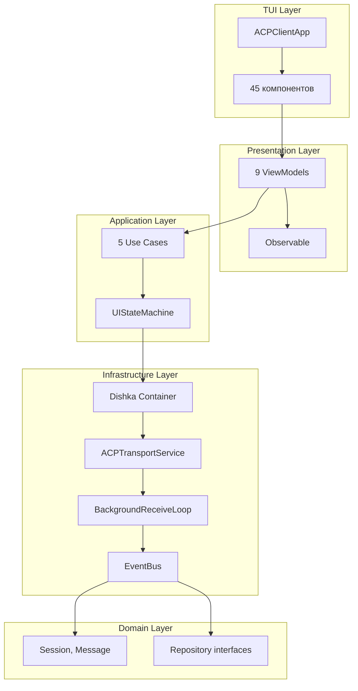

# Разработка клиента CodeLab

> Руководство по разработке клиентской части CodeLab.

## Обзор

Клиент CodeLab реализует **Clean Architecture** с 5 слоями и **MVVM паттерн** для реактивного UI. Управление зависимостями осуществляется через **Dishka DI контейнер**.



## DI контейнер

Клиент использует `dishka` для управления зависимостями. Контейнер создаётся через `create_client_container()`:

```python
from codelab.client.infrastructure.container_factory import create_client_container

container = create_client_container(
    host="127.0.0.1",
    port=8765,
    cwd="/path/to/project",
    transport_mode="websocket",  # или "stdio"
)
```

**Провайдеры:**
- `ClientProvider` — инфраструктурные сервисы (транспорт, репозитории, обработчики)
- `ViewModelProvider` — 9 ViewModels

**Разрешение циклической зависимости:** `SessionCoordinator ↔ PermissionHandler` разрешается через двухфазную инициализацию в `CoreServices`.

## MVVM паттерн

### Observable<T>

Реактивное свойство с уведомлением об изменениях:

```python
from codelab.client.presentation.observable import Observable

class MyViewModel:
    def __init__(self):
        self.messages: Observable[list[Message]] = Observable([])
        self.is_loading: Observable[bool] = Observable(False)
    
    def on_message_received(self, message: Message) -> None:
        messages = self.messages.get()
        messages.append(message)
        self.messages.set(messages)  # Уведомит подписчиков
```

### ObservableCommand

Async команда с состоянием выполнения:

```python
from codelab.client.presentation.observable import ObservableCommand

class MyViewModel:
    def __init__(self):
        self.send_prompt_cmd = ObservableCommand(self._send_prompt)
    
    async def _send_prompt(self, text: str) -> None:
        # Логика отправки промпта
        pass
```

**Свойства команды:**
- `is_executing: Observable[bool]` — выполняется ли команда
- `error: Observable[Exception | None]` — ошибка выполнения

### BaseViewModel

Базовый класс для всех ViewModels с интеграцией EventBus:

```python
from codelab.client.presentation.base_view_model import BaseViewModel

class MyViewModel(BaseViewModel):
    def __init__(self, event_bus: EventBus, logger: BoundLogger):
        super().__init__(event_bus, logger)
        self.on_event(SessionCreatedEvent, self._on_session_created)
    
    async def _on_session_created(self, event: SessionCreatedEvent) -> None:
        self.logger.info("session_created", session_id=event.session_id)
```

## ViewModels

### UIViewModel

Глобальное состояние UI:

```python
class UIViewModel(BaseViewModel):
    connection_status: Observable[ConnectionStatus]
    sidebar_tab: Observable[SidebarTab]
    sidebar_collapsed: Observable[bool]
    is_loading: Observable[bool]
    loading_message: Observable[str]
    error_message: Observable[str]
    info_message: Observable[str]
    warning_message: Observable[str]
    active_modal: Observable[str | None]
    modal_data: Observable[dict]
```

### SessionViewModel

Управление сессиями:

```python
class SessionViewModel(BaseViewModel):
    sessions: Observable[list[Session]]
    selected_session_id: Observable[str | None]
    is_loading_sessions: Observable[bool]
    error_message: Observable[str]
    session_count: Observable[int]
    
    load_sessions_cmd: ObservableCommand
    create_session_cmd: ObservableCommand
    switch_session_cmd: ObservableCommand
    delete_session_cmd: ObservableCommand
```

### ChatViewModel

Чат и prompt-turn (крупнейший ViewModel):

```python
class ChatViewModel(BaseViewModel):
    messages: Observable[list[Message]]
    tool_calls: Observable[list[ToolCall]]
    is_streaming: Observable[bool]
    streaming_text: Observable[str]
    pending_permissions: Observable[list[Permission]]
    last_stop_reason: Observable[str | None]
    
    send_prompt_cmd: ObservableCommand
    cancel_prompt_cmd: ObservableCommand
    approve_permission_cmd: ObservableCommand
    reject_permission_cmd: ObservableCommand
    clear_chat_cmd: ObservableCommand
```

**Особенности:**
- Per-session state caching (`ChatSessionState`)
- Local JSON history persistence (`~/.codelab/data/history/{session_id}.json`)
- Обработка callbacks: fs/read, fs/write, terminal lifecycle
- Session switching с сохранением состояния

### Остальные ViewModels

| ViewModel | Назначение |
|-----------|------------|
| `PlanViewModel` | Отображение плана агента |
| `TerminalViewModel` | Вывод терминала |
| `FileSystemViewModel` | Дерево файлов |
| `FileViewerViewModel` | Просмотр файла (modal) |
| `PermissionViewModel` | Модальное окно разрешений |
| `TerminalLogViewModel` | Лог терминала (modal) |

## TUI компоненты

### Структура компонента

```python
from textual.widget import Widget
from textual.reactive import reactive

class MyComponent(Widget):
    """Мой TUI компонент."""
    
    def __init__(self, view_model: MyViewModel):
        super().__init__()
        self._vm = view_model
    
    def compose(self) -> ComposeResult:
        yield Static(id="content")
    
    def on_mount(self) -> None:
        # Подписка на Observable
        self._vm.some_property.subscribe(self._on_change)
    
    def _on_change(self, value: Any) -> None:
        self.query_one("#content").update(str(value))
```

### Безопасный рендеринг контента

Для избежания crash на markup-like символах в тексте LLM используйте Content API:

```python
from textual.content import Content

# Безопасное комбинирование formatting + plain text
prefix = Content.from_markup("[bold green]⟳ [/]")
safe_text = Content.from_text(llm_output)
widget.update(prefix + safe_text)
```

### Список компонентов (45 файлов)

**Основные:**
- `chat_view.py` — основной чат с inline permission widget
- `sidebar.py` — список сессий
- `file_tree.py` — дерево файлов
- `prompt_input.py` — ввод промпта с submit/cancel
- `header.py`, `footer.py` — шапка и статус-бар
- `main_layout.py` — OpenCode-style макет (sidebar, content, dock)

**Сообщения:**
- `message_bubble.py`, `message_list.py` — рендеринг сообщений
- `streaming_text.py` — потоковый текст с typing effect
- `thinking_indicator.py` — индикатор мышления агента

**Инструменты:**
- `tool_call_card.py`, `tool_call_list.py`, `tool_panel.py` — отображение tool calls
- `terminal_output.py`, `terminal_panel.py` — вывод терминала

**Разрешения:**
- `permission_modal.py`, `permission_badge.py`, `permission_request.py`
- `inline_permission_widget.py` — inline запрос разрешений в чате

**Файлы:**
- `file_viewer.py` — просмотр файла
- `file_change_preview.py`, `file_change_preview_modal.py` — превью изменений

**Навигация:**
- `command_palette.py` — палитра команд (Ctrl+P)
- `tabs.py`, `collapsible_panel.py`, `context_menu.py`

**Утилиты:**
- `toast.py` — всплывающие уведомления
- `spinner.py`, `progress.py` — индикаторы загрузки
- `search_input.py`, `status_line.py`, `keyboard_manager.py`
- `markdown.py` — рендеринг Markdown
- `help_modal.py`, `session_turn.py`

## NavigationManager

Централизованное управление фокусом и навигацией:

```python
from codelab.client.tui.navigation import NavigationManager

nav = NavigationManager()
await nav.show_screen("permission_modal")
await nav.hide_screen("permission_modal")
await nav.reset()  # Закрыть все модалы
```

**OperationQueue** — приоритетная очередь (HIGH/NORMAL/LOW) для последовательного выполнения операций.

**ModalWindowTracker** — отслеживание активных модальных окон с автогенерацией ID.

## EventBus

Pub/Sub система для domain events:

```python
from codelab.client.infrastructure.events.bus import EventBus

bus = EventBus()

# Подписка
async def on_session_created(event: SessionCreatedEvent) -> None:
    print(f"Session created: {event.session_id}")

bus.subscribe(SessionCreatedEvent, on_session_created)

# Публикация
await bus.publish(SessionCreatedEvent(session_id="123"))
```

**Особенности:**
- Поддержка sync и async handlers
- Параллельное выполнение async handlers через `asyncio.gather`
- Error isolation — падение одного handler не блокирует другие

## Transport Service

### ACPTransportService

Основной сервис транспорта:

```python
# Подключение
await transport.connect()

# Запрос с callbacks
result = await transport.request_with_callbacks(
    method="session/prompt",
    params={"session_id": "123", "prompt": [...]},
    on_update=on_update_callback,
    on_fs_read=on_fs_read_callback,
    on_terminal_create=on_terminal_create_callback,
)

# Отмена промпта (lock-free)
await transport.cancel_prompt(session_id="123")

# Отключение
await transport.disconnect()
```

### BackgroundReceiveLoop

Единый фоновый цикл получения сообщений:

```
WebSocket.receive_text() → BackgroundReceiveLoop → MessageRouter → RoutingQueues
```

**Три типа очередей:**
- `response_queues` — per-request ответные очереди
- `notification_queue` — общие уведомления
- `permission_queue` — запросы разрешений

### MessageRouter

Маршрутизация сообщений по типу:

| Сообщение | Очередь |
|-----------|---------|
| `session/update` | notification |
| `session/request_permission` | permission |
| `fs/*` или `terminal/*` | notification |
| Сообщение с `id` | response[id] |
| `session/cancel` | notification |

## Тестирование клиента

### Unit тесты

```python
import pytest
from codelab.client.presentation.chat_view_model import ChatViewModel

@pytest.mark.asyncio
async def test_chat_view_model_send_message():
    vm = ChatViewModel(event_bus=EventBus(), logger=mock_logger)
    await vm.send_prompt_cmd.execute("Hello")
    assert vm.is_streaming.get() == True
```

### MVVM тесты

```python
@pytest.mark.asyncio
async def test_view_model_observable_updates():
    vm = MyViewModel(event_bus=EventBus(), logger=mock_logger)
    updates = []
    vm.some_property.subscribe(updates.append)
    vm.some_property.set("new_value")
    assert updates == ["new_value"]
```

### Интеграционные тесты

```python
@pytest.mark.asyncio
async def test_transport_request_with_callbacks():
    transport = ACPTransportService(mock_transport)
    await transport.connect()
    result = await transport.request_with_callbacks(
        method="session/prompt",
        params={"session_id": "123"},
    )
    assert result is not None
```

## См. также

- [Архитектура](01-architecture.md) — общая архитектура системы
- [Разработка сервера](03-server-development.md) — детали реализации сервера
- [Тестирование](05-testing.md) — запуск и написание тестов
