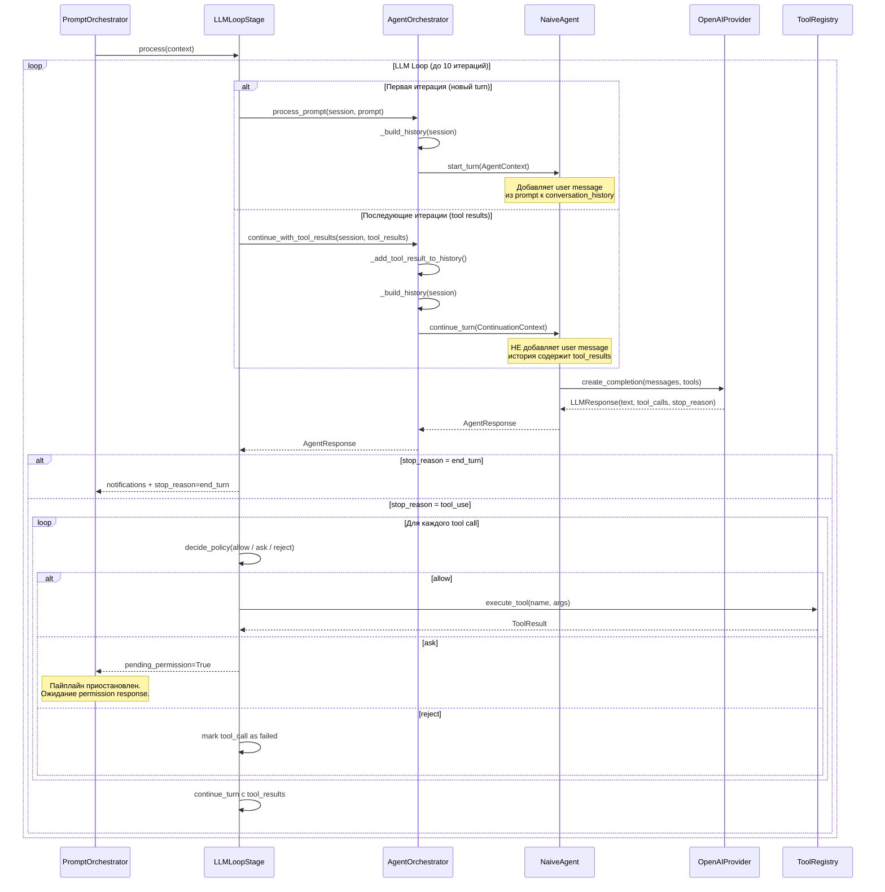
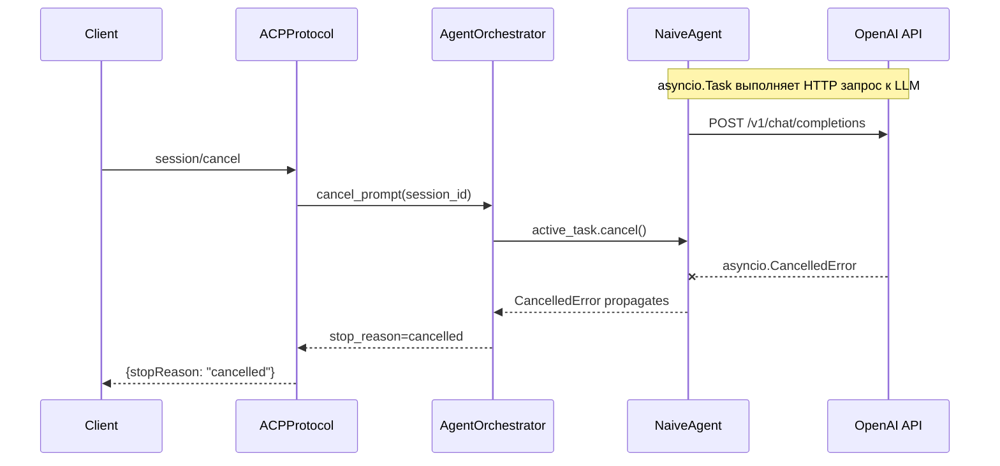
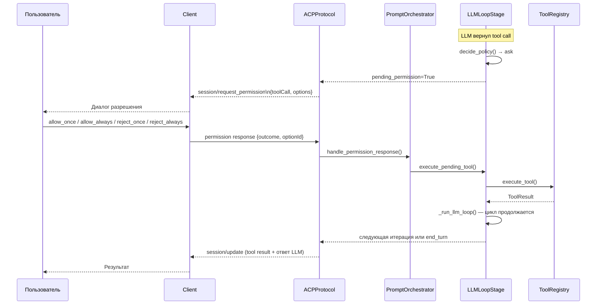

# Разработка сервера

> Руководство по разработке ACP сервера CodeLab.

## Обзор

Сервер CodeLab реализует ACP протокол и содержит LLM агента для обработки запросов пользователей.

## Структура сервера

```
server/
├── cli.py                # CLI команды сервера
├── config.py             # Конфигурация
├── http_server.py        # WebSocket транспорт
├── messages.py           # JSON-RPC сообщения
├── protocol/             # ACP протокол
│   ├── __init__.py
│   ├── core.py           # ACPProtocol (handle_and_process)
│   ├── state.py          # Состояния
│   ├── session_factory.py
│   └── handlers/         # Обработчики методов
├── agent/                # LLM агенты
│   ├── base.py
│   ├── naive.py          # NaiveAgent (start_turn/continue_turn)
│   ├── orchestrator.py
│   └── state.py
├── tools/                # Инструменты
│   ├── base.py
│   ├── registry.py       # SimpleToolRegistry
│   ├── mapping.py        # Маппинг имён ACP ↔ LLM
│   ├── definitions/
│   └── executors/
├── storage/              # Хранилище
│   ├── base.py
│   ├── memory.py
│   └── json_file.py
├── llm/                  # LLM провайдеры
│   ├── base.py
│   ├── openai_provider.py
│   └── mock_provider.py
├── client_rpc/           # RPC к клиенту
│   ├── service.py
│   ├── models.py
│   └── exceptions.py
├── transport/            # Транспортные реализации
│   ├── websocket.py      # WebSocketTransport
│   ├── stdio.py          # StdioServerTransport
│   └── stdio_runner.py   # run_stdio_server()
└── mcp/                  # MCP интеграция
    ├── client.py
    └── models.py
```

## HTTP Server

### ACPHttpServer

```python
from aiohttp import web, WSMsgType

class ACPHttpServer:
    """WebSocket транспорт ACP-сервера."""
    
    def __init__(
        self,
        host: str = "127.0.0.1",
        port: int = 8080,
        storage: SessionStorage | None = None,
        config: AppConfig | None = None,
    ) -> None:
        self.host = host
        self.port = port
        self.storage = storage or InMemoryStorage()
        self.config = config or AppConfig()
        
        # Создание aiohttp app
        self._app = web.Application()
        self._setup_routes()
    
    def _setup_routes(self) -> None:
        """Настройка маршрутов."""
        self._app.router.add_get("/acp/ws", self._handle_websocket)
        self._app.router.add_get("/health", self._handle_health)
    
    async def _handle_websocket(self, request: web.Request) -> web.WebSocketResponse:
        """Обработка WebSocket соединения."""
        ws = web.WebSocketResponse()
        await ws.prepare(request)
        
        # Создание протокола для соединения
        protocol = ACPProtocol(
            storage=self.storage,
            config=self.config,
            send_callback=ws.send_json,
        )
        
        # Настраиваем send_callback для отправки из фоновых задач
        protocol._send_callback = self._send_protocol_message
        
        async for msg in ws:
            if msg.type == WSMsgType.TEXT:
                data = msg.json()
                # Используем handle_and_process для поддержки фоновых задач
                outcome = await protocol.handle_and_process(ACPMessage.from_dict(data))
                await self._send_outcome(ws, outcome)
            elif msg.type == WSMsgType.ERROR:
                logger.error("WebSocket error", error=ws.exception())
        
        return ws
    
    async def run(self) -> None:
        """Запуск сервера."""
        runner = web.AppRunner(self._app)
        await runner.setup()
        site = web.TCPSite(runner, self.host, self.port)
        await site.start()
```

## Protocol Layer

### ACPProtocol

```python
class ACPProtocol:
    """Главный класс протокола ACP."""
    
    def __init__(
        self,
        storage: SessionStorage,
        config: AppConfig,
        send_callback: Callable[[dict], Awaitable[None]] | None = None,
    ) -> None:
        self._storage = storage
        self._config = config
        self._send_callback = send_callback  # Для отправки из фоновых задач
        
        # Инициализация handlers
        self._handlers = self._create_handlers()
    
    async def handle(self, message: ACPMessage) -> ProtocolOutcome:
        """Диспетчеризация JSON-RPC запроса."""
        method = message.method
        
        if method not in self._handlers:
            return ProtocolOutcome.error(
                JsonRpcError.method_not_found(method)
            )
        
        handler = self._handlers[method]
        return await handler.handle(message)
    
    async def handle_and_process(self, message: ACPMessage) -> ProtocolOutcome:
        """Обрабатывает сообщение и запускает фоновые задачи если нужно.
        
        Основной entry point для транспорта:
        1. Вызывает handle() для обработки запроса
        2. Если outcome содержит pending_tool_execution — запускает фоновую задачу
        3. Возвращает чистый outcome для отправки транспортом
        """
        outcome = await self.handle(message)
        
        if outcome.pending_tool_execution is not None:
            pending = outcome.pending_tool_execution
            asyncio.create_task(
                self._execute_tool_in_background(
                    session_id=pending.session_id,
                    tool_call_id=pending.tool_call_id,
                )
            )
        
        return outcome
    
    async def _execute_tool_in_background(
        self, *, session_id: str, tool_call_id: str,
    ) -> None:
        """Фоновая задача для выполнения tool после permission approval."""
        llm_result = await self.execute_pending_tool(
            session_id=session_id,
            tool_call_id=tool_call_id,
        )
        
        # Отправляем notifications и turn completion
        for notification in llm_result.notifications:
            await self._send_message(notification)
        
        if not llm_result.pending_permission:
            turn_completion = await self.complete_active_turn(session_id)
            if turn_completion is not None:
                await self._send_message(turn_completion)
    
    async def _send_message(self, message: ACPMessage) -> None:
        """Отправляет сообщение через transport callback."""
        if self._send_callback is not None:
            await self._send_callback(message)
```

### Protocol Outcome

```python
@dataclass
class ProtocolOutcome:
    """Результат обработки запроса."""
    
    response: dict | None = None
    notifications: list[dict] = field(default_factory=list)
    error: JsonRpcError | None = None
    
    @classmethod
    def success(cls, result: dict) -> "ProtocolOutcome":
        return cls(response=result)
    
    @classmethod
    def error(cls, error: JsonRpcError) -> "ProtocolOutcome":
        return cls(error=error)
    
    @classmethod
    def with_notifications(
        cls, 
        result: dict, 
        notifications: list[dict]
    ) -> "ProtocolOutcome":
        return cls(response=result, notifications=notifications)
```

## Protocol Handlers

### Структура Handler

```python
from abc import ABC, abstractmethod

class Handler(ABC):
    """Базовый класс обработчика."""
    
    @abstractmethod
    async def handle(self, message: ACPMessage) -> ProtocolOutcome:
        """Обработка сообщения."""
        ...

class SessionHandler(Handler):
    """Обработчик session/* методов."""
    
    def __init__(self, storage: SessionStorage) -> None:
        self._storage = storage
    
    async def handle(self, message: ACPMessage) -> ProtocolOutcome:
        method = message.method
        
        if method == "session/new":
            return await self._handle_new(message)
        elif method == "session/load":
            return await self._handle_load(message)
        elif method == "session/list":
            return await self._handle_list(message)
        
        return ProtocolOutcome.error(
            JsonRpcError.method_not_found(method)
        )
    
    async def _handle_new(self, message: ACPMessage) -> ProtocolOutcome:
        """Создание новой сессии."""
        params = message.params or {}
        
        session = SessionState(
            id=str(uuid.uuid4()),
            title=params.get("title"),
            created_at=datetime.utcnow(),
        )
        
        await self._storage.save(session)
        
        return ProtocolOutcome.success({
            "session_id": session.id,
            "title": session.title,
        })
```

### Создание нового Handler

```python
# server/protocol/handlers/my_handler.py

class MyCustomHandler(Handler):
    """Обработчик кастомных методов."""
    
    def __init__(
        self,
        storage: SessionStorage,
        service: MyService,
    ) -> None:
        self._storage = storage
        self._service = service
    
    async def handle(self, message: ACPMessage) -> ProtocolOutcome:
        params = message.params or {}
        
        # Валидация
        if "required_field" not in params:
            return ProtocolOutcome.error(
                JsonRpcError.invalid_params("required_field is required")
            )
        
        # Бизнес-логика
        result = await self._service.process(params)
        
        # Возврат результата
        return ProtocolOutcome.success({"data": result})
```

## Agent Layer

### LLMAgent Interface

```python
class LLMAgent(ABC):
    """Абстрактный агент — выполняет один вызов LLM.

    Ответственности:
      - Сформировать список messages из контекста.
      - Вызвать LLM провайдер ровно один раз.
      - Вернуть AgentResponse с текстом и/или tool_calls.
      - Поддерживать отмену активного запроса через cancel_prompt().

    НЕ является ответственностью агента:
      - Управление циклом tool-calling (это LLMLoopStage).
      - Хранение истории сессии (это SessionState в AgentOrchestrator).
      - Выполнение инструментов (это LLMLoopStage + ToolRegistry).
    """

    @abstractmethod
    async def start_turn(self, context: AgentContext) -> AgentResponse:
        """Начало нового turn пользователя.

        Добавляет user message из context.prompt к conversation_history
        и выполняет один вызов LLM.
        """

    @abstractmethod
    async def continue_turn(self, context: ContinuationContext) -> AgentResponse:
        """Продолжение turn после получения результатов tool_calls.

        НЕ добавляет user message — history уже содержит tool_results.
        Выполняет один вызов LLM для получения следующего ответа.
        """

    @abstractmethod
    async def cancel_prompt(self, session_id: str) -> None:
        """Отменить текущий in-flight LLM запрос для сессии."""

    @abstractmethod
    async def initialize(
        self,
        llm_provider: LLMProvider,
        tool_registry: ToolRegistry,
        config: dict[str, Any],
    ) -> None:
        """Обновить зависимости агента после инициализации DI контейнера."""

    @abstractmethod
    async def end_session(self, session_id: str) -> None:
        """Завершить сессию и освободить ресурсы."""
```

### Маппинг имён инструментов в NaiveAgent

NaiveAgent использует `acp_name_to_llm_name()` при конвертации инструментов для LLM API:

```python
def _to_openai_tools_format(tools: list[ToolDefinition]) -> list[dict[str, Any]]:
    """Преобразовать ToolDefinition в формат OpenAI function calling.
    
    Применяет маппинг имён: ACP имена (с `/`) конвертируются
    в LLM-совместимые имена (с `_`).
    """
    return [
        {
            "type": "function",
            "function": {
                "name": acp_name_to_llm_name(tool.name),  # fs/read → fs_read
                "description": tool.description,
                "parameters": tool.parameters,
            },
        }
        for tool in tools
    ]
```

### AgentContext и ContinuationContext

```python
@dataclass
class AgentContext:
    """Контекст для start_turn — начало нового turn пользователя."""
    session_id: str
    session: SessionState
    prompt: list[dict[str, Any]]           # Prompt пользователя (блоки контента)
    conversation_history: list[LLMMessage] # История до текущего промпта
    available_tools: list[ToolDefinition]  # Отфильтрованы по capabilities
    config: dict[str, Any]

@dataclass
class ContinuationContext:
    """Контекст для continue_turn — продолжение после tool_results."""
    session_id: str
    session: SessionState
    history: list[LLMMessage]              # Полная история включая tool_results
    available_tools: list[ToolDefinition]  # Отфильтрованы по capabilities
    config: dict[str, Any]
```

### Agent Orchestrator

```python
class AgentOrchestrator:
    """Оркестратор LLM агента.

    Собирает контекст из SessionState и вызывает агента через явные методы:
      - process_prompt       → agent.start_turn()   (новый turn пользователя)
      - continue_with_tool_results → agent.continue_turn() (после tool_results)

    Также отвечает за _filter_tools_by_capabilities — фильтрацию инструментов
    согласно ACP-спецификации (capabilities omitted in initialize = UNSUPPORTED).
    """

    def __init__(
        self,
        config: OrchestratorConfig,
        llm_provider: LLMProvider,
        tool_registry: ToolRegistry,
    ) -> None:
        self.config = config
        self.llm_provider = llm_provider
        self.tool_registry = tool_registry
        self.agent: LLMAgent = NaiveAgent(llm=llm_provider, tools=tool_registry)

    async def process_prompt(
        self,
        session_state: SessionState,
        prompt: str,
    ) -> AgentResponse:
        """Начало нового turn: вызывает agent.start_turn()."""
        context = AgentContext(
            session_id=session_state.session_id,
            session=session_state,
            prompt=[{"type": "text", "text": prompt}],
            conversation_history=self._build_history(session_state),
            available_tools=self._filter_tools(session_state),
            config=session_state.config_values,
        )
        return await self.agent.start_turn(context)

    async def continue_with_tool_results(
        self,
        session_state: SessionState,
        tool_results: list[ToolResult],
    ) -> AgentResponse:
        """Продолжение turn после tool_results: вызывает agent.continue_turn()."""
        for result in tool_results:
            self._add_tool_result_to_history(session_state, result)

        context = ContinuationContext(
            session_id=session_state.session_id,
            session=session_state,
            history=self._build_history(session_state),
            available_tools=self._filter_tools(session_state),
            config=session_state.config_values,
        )
        return await self.agent.continue_turn(context)
```

### Взаимодействие агента с LLM



### Отмена LLM запроса



### Permission flow



### NaiveAgent Implementation

```python
class NaiveAgent(LLMAgent):
    """Агент с одним вызовом LLM.

    Отвечает за:
      - Формирование списка messages из контекста.
      - Один HTTP вызов к LLM провайдеру.
      - Поддержку отмены через asyncio.Task.

    НЕ отвечает за:
      - Цикл tool-calling (LLMLoopStage).
      - Хранение истории сессии (SessionState).
      - Выполнение инструментов (ToolRegistry).
    """

    def __init__(self, llm: LLMProvider, tools: ToolRegistry | None = None) -> None:
        self.llm = llm
        self._tools = tools  # Только для initialize(), поиск через context
        self._active_tasks: dict[str, asyncio.Task] = {}

    async def start_turn(self, context: AgentContext) -> AgentResponse:
        """Начало нового turn: добавляет user message и вызывает LLM."""
        messages = list(context.conversation_history)
        prompt_text = _format_prompt(context.prompt)
        if prompt_text:
            messages.append(LLMMessage(role="user", content=prompt_text))
        return await self._call_llm(messages, context.available_tools, context.session_id)

    async def continue_turn(self, context: ContinuationContext) -> AgentResponse:
        """Продолжение turn после tool_results: НЕ добавляет user message."""
        return await self._call_llm(context.history, context.available_tools, context.session_id)

    async def _call_llm(
        self,
        messages: list[LLMMessage],
        tools: list[ToolDefinition],
        session_id: str,
    ) -> AgentResponse:
        """Одиночный вызов LLM с поддержкой отмены."""
        task = asyncio.current_task()
        if task is not None:
            self._active_tasks[session_id] = task
        try:
            return await self._execute_llm_call(messages, tools, session_id)
        except asyncio.CancelledError:
            raise
        finally:
            self._active_tasks.pop(session_id, None)
```

## LLM Providers

### LLMProvider Interface

```python
class LLMProvider(ABC):
    """Абстрактный LLM провайдер."""
    
    @abstractmethod
    async def generate(
        self,
        messages: list[dict],
        tools: list[dict] | None = None,
    ) -> LLMResponse:
        """Генерация ответа."""
        ...
    
    @abstractmethod
    async def stream(
        self,
        messages: list[dict],
        tools: list[dict] | None = None,
    ) -> AsyncIterator[LLMChunk]:
        """Потоковая генерация."""
        ...
```

### OpenAI Provider

```python
class OpenAIProvider(LLMProvider):
    """OpenAI LLM провайдер."""
    
    def __init__(
        self,
        api_key: str,
        model: str = "gpt-4o",
        base_url: str | None = None,
    ) -> None:
        self._client = AsyncOpenAI(
            api_key=api_key,
            base_url=base_url,
        )
        self._model = model
    
    async def stream(
        self,
        messages: list[dict],
        tools: list[dict] | None = None,
    ) -> AsyncIterator[LLMChunk]:
        """Потоковая генерация через OpenAI API."""
        
        response = await self._client.chat.completions.create(
            model=self._model,
            messages=messages,
            tools=tools,
            stream=True,
        )
        
        async for chunk in response:
            delta = chunk.choices[0].delta
            yield LLMChunk(
                text=delta.content,
                tool_calls=self._parse_tool_calls(delta.tool_calls),
            )
```

### Добавление нового провайдера

```python
# server/llm/anthropic_provider.py

class AnthropicProvider(LLMProvider):
    """Anthropic Claude провайдер."""
    
    def __init__(self, api_key: str, model: str = "claude-3-opus-20240229"):
        self._client = AsyncAnthropic(api_key=api_key)
        self._model = model
    
    async def stream(
        self,
        messages: list[dict],
        tools: list[dict] | None = None,
    ) -> AsyncIterator[LLMChunk]:
        # Конвертация формата сообщений
        anthropic_messages = self._convert_messages(messages)
        
        async with self._client.messages.stream(
            model=self._model,
            messages=anthropic_messages,
            tools=self._convert_tools(tools),
        ) as stream:
            async for event in stream:
                yield self._convert_event(event)
```

## Tool System

### ToolDefinition

```python
@dataclass
class ToolDefinition:
    """Определение инструмента."""
    
    name: str
    description: str
    parameters: dict  # JSON Schema
    kind: Literal["read", "write", "execute"]
    requires_permission: bool = True
```

### Tool Registry

```python
class ToolRegistry:
    """Реестр инструментов."""
    
    def get_definitions(self) -> list[dict]:
        """Получение определений для LLM."""
        return [
            {
                "type": "function",
                "function": {
                    "name": acp_name_to_llm_name(tool.name),  # Маппинг имён
                    "description": tool.description,
                    "parameters": tool.parameters,
                }
            }
            for tool in self._tools.values()
        ]
    
    async def execute(
        self,
        name: str,  # LLM имя (с _)
        arguments: dict,
        context: ExecutionContext,
    ) -> ToolResult:
        """Выполнение инструмента."""
        # Конвертируем LLM имя обратно в ACP формат
        acp_name = llm_name_to_acp_name(name)
        executor = self._executors.get(acp_name)
        if not executor:
            raise ToolNotFoundError(acp_name)
        
        return await executor.execute(arguments, context)
```

### Создание нового инструмента

```python
# server/tools/definitions/my_tool.py

class MyToolDefinition:
    """Определения моих инструментов."""
    
    @staticmethod
    def search_code() -> ToolDefinition:
        return ToolDefinition(
            name="search_code",
            description="Search for code patterns in the project",
            parameters={
                "type": "object",
                "properties": {
                    "pattern": {
                        "type": "string",
                        "description": "Search pattern (regex)",
                    },
                    "file_types": {
                        "type": "array",
                        "items": {"type": "string"},
                        "description": "File extensions to search",
                    },
                },
                "required": ["pattern"],
            },
            kind="read",
            requires_permission=True,
        )

# server/tools/executors/my_tool_executor.py

class MyToolExecutor(ToolExecutor):
    """Исполнитель моего инструмента."""
    
    async def execute(
        self,
        arguments: dict,
        context: ExecutionContext,
    ) -> ToolResult:
        pattern = arguments["pattern"]
        file_types = arguments.get("file_types", ["*"])
        
        # Выполнение через Client RPC
        result = await context.client_rpc.call(
            "code/search",
            {"pattern": pattern, "file_types": file_types},
        )
        
        return ToolResult(
            success=True,
            content=result,
        )
```

## Storage Layer

### SessionStorage Interface

```python
class SessionStorage(ABC):
    """Абстрактное хранилище сессий."""
    
    @abstractmethod
    async def save(self, session: SessionState) -> None:
        """Сохранение сессии."""
        ...
    
    @abstractmethod
    async def load(self, session_id: str) -> SessionState | None:
        """Загрузка сессии."""
        ...
    
    @abstractmethod
    async def delete(self, session_id: str) -> bool:
        """Удаление сессии."""
        ...
    
    @abstractmethod
    async def list_all(self) -> list[SessionSummary]:
        """Список всех сессий."""
        ...
```

### JSON File Storage

```python
class JsonFileStorage(SessionStorage):
    """Хранение сессий в JSON файлах."""
    
    def __init__(self, directory: Path) -> None:
        self._directory = directory
        self._directory.mkdir(parents=True, exist_ok=True)
    
    async def save(self, session: SessionState) -> None:
        path = self._get_path(session.id)
        data = session.to_dict()
        
        async with aiofiles.open(path, "w") as f:
            await f.write(json.dumps(data, indent=2))
    
    async def load(self, session_id: str) -> SessionState | None:
        path = self._get_path(session_id)
        
        if not path.exists():
            return None
        
        async with aiofiles.open(path) as f:
            data = json.loads(await f.read())
        
        return SessionState.from_dict(data)
    
    def _get_path(self, session_id: str) -> Path:
        return self._directory / f"{session_id}.json"
```

## Тестирование

### Unit тесты Handler

```python
class TestSessionHandler:
    @pytest.fixture
    def storage(self) -> Mock:
        return AsyncMock(spec=SessionStorage)
    
    @pytest.fixture
    def handler(self, storage) -> SessionHandler:
        return SessionHandler(storage)
    
    async def test_new_session(self, handler, storage):
        """Тест создания сессии."""
        message = ACPMessage(
            method="session/new",
            params={"title": "Test"},
        )
        
        outcome = await handler.handle(message)
        
        assert outcome.error is None
        assert "session_id" in outcome.response
        storage.save.assert_called_once()
```

### Интеграционные тесты

```python
class TestServerIntegration:
    @pytest.fixture
    async def server(self):
        server = ACPHttpServer(port=0)  # Случайный порт
        task = asyncio.create_task(server.run())
        yield server
        task.cancel()
    
    async def test_full_flow(self, server):
        """Интеграционный тест полного цикла."""
        async with aiohttp.ClientSession() as session:
            async with session.ws_connect(
                f"ws://localhost:{server.port}/acp/ws"
            ) as ws:
                # Initialize
                await ws.send_json({
                    "jsonrpc": "2.0",
                    "method": "initialize",
                    "id": 1,
                })
                response = await ws.receive_json()
                assert "result" in response
```

## См. также

- [Архитектура](01-architecture.md) — общая архитектура
- [Protocol Handlers](04-protocol-handlers.md) — создание обработчиков
- [Тестирование](05-testing.md) — руководство по тестированию
