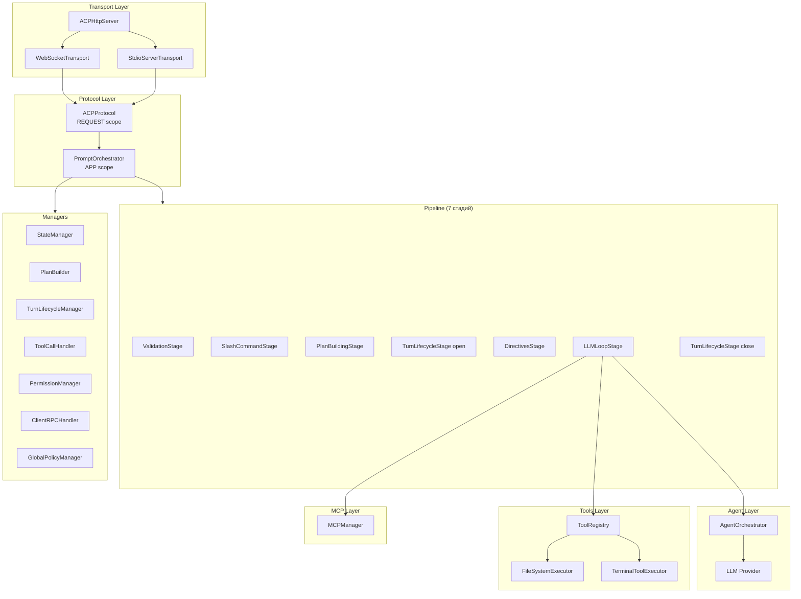
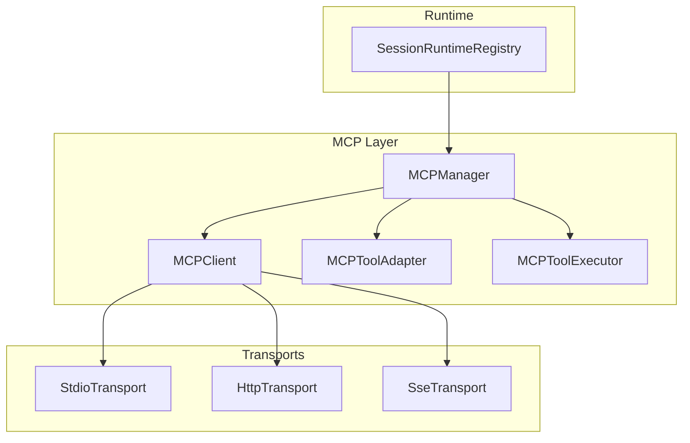

# Разработка сервера CodeLab

> Руководство по разработке серверной части CodeLab.

## Обзор

Сервер CodeLab использует **Dishka DI контейнер** с двумя скоупами (APP/REQUEST) и **Pipeline систему** для обработки промптов.



## DI контейнер

### Скоупы

- **APP scope** — синглтоны на всё время жизни сервера (LLM, ToolRegistry, менеджеры, pipeline)
- **REQUEST scope** — на одно WebSocket соединение (ClientRPCService, ACPProtocol)

### Создание контейнера

```python
from codelab.server.di import make_container
from codelab.server.config import AppConfig
from codelab.server.storage.json_file import JsonFileStorage

config = AppConfig.from_env()
storage = JsonFileStorage(Path("~/.codelab/data/sessions").expanduser())

container = make_container(
    config=config,
    storage=storage,
    require_auth=False,
    auth_api_key=None,
)
```

### Провайдеры

| Провайдер | Создаёт |
|-----------|---------|
| `ManagersProvider` | StateManager, PlanBuilder, TurnLifecycleManager, ToolCallHandler, PermissionManager, ClientRPCHandler |
| `SlashCommandsProvider` | CommandRegistry (Status, Mode, Help), SlashCommandRouter |
| `StorageProvider` | GlobalPolicyStorage, GlobalPolicyManager |
| `LLMProvider_` | LLMProviderRegistry (8+ провайдеров) |
| `ToolsProvider` | SimpleToolRegistry |
| `AgentProvider` | AgentOrchestrator |
| `PipelineProvider` | LLMLoopStage, PromptPipeline (7 стадий) |
| `PromptOrchestratorProvider` | ClientRPCServiceHolder, PromptOrchestrator |
| `RequestProvider` | ACPProtocol (per-connection) |

### Holder паттерн

`ClientRPCServiceHolder` — мост между APP и REQUEST scope. `ClientRPCService` создаётся вручную в `handle_ws_request` и устанавливается в holder перед REQUEST scope:

```python
# В handle_ws_request
client_rpc_service = ClientRPCService(send_callback=send_message)
holder = await request_scope.get(ClientRPCServiceHolder)
holder.service = client_rpc_service  # Устанавливаем перед созданием ACPProtocol

protocol = await request_scope.get(ACPProtocol)
```

## Protocol Layer

### ACPProtocol

Транспорт-agnostic диспетчер методов ACP:

```python
class ACPProtocol:
    async def handle(self, message: ACPMessage) -> ProtocolOutcome:
        """Диспетчеризация JSON-RPC запросов."""
        method = message.method
        handler = self._get_handler(method)
        return await handler.handle(message)
```

**Зарегистрированные методы:**

| Метод | Файл | Описание |
|-------|------|----------|
| `initialize` | `handlers/auth.py` | Инициализация, обмен capabilities |
| `authenticate` | `handlers/auth.py` | Аутентификация |
| `session/new` | `handlers/session.py` | Создание сессии |
| `session/load` | `handlers/session.py` | Загрузка сессии |
| `session/list` | `handlers/session.py` | Список сессий |
| `session/prompt` | `handlers/prompt.py` | Обработка промпта |
| `session/cancel` | `handlers/prompt.py` | Отмена промпта |
| `session/request_permission_response` | `handlers/permissions.py` | Ответ на запрос разрешения |
| `session/set_config_option` | `handlers/config.py` | Установка опции |
| `session/set_mode` | `handlers/config.py` | Установка режима |

### PromptOrchestrator

Центральный координатор prompt-turn. Инжектирует 10+ зависимостей:

```python
class PromptOrchestrator:
    def __init__(
        self,
        state_manager: StateManager,
        plan_builder: PlanBuilder,
        turn_lifecycle_manager: TurnLifecycleManager,
        tool_call_handler: ToolCallHandler,
        permission_manager: PermissionManager,
        client_rpc_handler: ClientRPCHandler,
        tool_registry: ToolRegistry,
        llm_loop_stage: LLMLoopStage,
        client_rpc_service_holder: ClientRPCServiceHolder,
        global_policy_manager: GlobalPolicyManager,
        command_registry: CommandRegistry,
        pipeline: PromptPipeline,
    ):
        ...
```

## Pipeline система

### Структура

```python
class PromptPipeline:
    def __init__(self, stages: list[PipelineStage]):
        self.stages = stages
    
    async def process(self, context: PipelineContext) -> PipelineResult:
        for stage in self.stages:
            result = await stage.execute(context)
            if result.should_stop:
                return result
        return PipelineResult.success()
```

### 7 стадий

1. **ValidationStage** — валидация входных данных (session ID, prompt array, content blocks)
2. **SlashCommandStage** — обработка `/help`, `/mode`, `/status`
3. **PlanBuildingStage** — построение плана выполнения
4. **TurnLifecycleStage(open)** — открытие turn, отправка `session/started`
5. **DirectivesStage** — обработка директив промпта, фильтрация инструментов по capabilities
6. **LLMLoopStage** — основной цикл LLM с tool calls (до 10 итераций)
7. **TurnLifecycleStage(close)** — закрытие turn

### LLMLoopStage

Главная стадия — цикл LLM с tool calls:

```python
class LLMLoopStage:
    async def execute(self, context: PipelineContext) -> StageResult:
        for iteration in range(max_iterations):
            # Вызов LLM
            response = await agent_orchestrator.process_prompt(context)
            
            if response.stop_reason == "end_turn":
                return StageResult(stop_reason="end_turn")
            
            if response.stop_reason == "tool_use":
                # Обработка tool calls
                for tool_call in response.tool_calls:
                    result = await self._process_tool_call(tool_call, context)
                    tool_results.append(result)
                
                # Продолжение с результатами инструментов
                context = context.with_tool_results(tool_results)
                continue
            
            if response.stop_reason == "cancelled":
                return StageResult(stop_reason="cancelled")
```

## Slash Commands

### Встроенные команды

- `/help` — список доступных команд
- `/mode` — переключение режима сессии
- `/status` — текущее состояние сессии

### Создание новой команды

```python
from codelab.server.protocol.handlers.slash_commands.base import SlashCommandHandler

class MyCommandHandler(SlashCommandHandler):
    @property
    def name(self) -> str:
        return "mycommand"
    
    @property
    def description(self) -> str:
        return "Моя команда"
    
    async def execute(self, context: CommandContext) -> CommandResult:
        return CommandResult.success("Выполнено!")
```

**Регистрация:**

```python
registry = CommandRegistry()
registry.register(MyCommandHandler())
```

## Agent Layer

### LLMAgent (ABC)

```python
class LLMAgent(ABC):
    @abstractmethod
    async def start_turn(self, context: AgentContext) -> AgentResponse:
        """Начать новый turn (с user prompt)."""
        ...
    
    @abstractmethod
    async def continue_turn(self, context: ContinuationContext) -> AgentResponse:
        """Продолжить turn (с tool results)."""
        ...
    
    @abstractmethod
    async def cancel_prompt(self) -> None:
        """Отменить текущий промпт."""
        ...
```

### NaiveAgent

Реализация с OpenAI function calling:

```python
class NaiveAgent(LLMAgent):
    async def start_turn(self, context: AgentContext) -> AgentResponse:
        # Добавляет user message к conversation_history
        # Вызывает LLM с tools
        # Возвращает AgentResponse(text, tool_calls, stop_reason)
        ...
```

### AgentOrchestrator

Управление агентом и фильтрация инструментов:

```python
class AgentOrchestrator:
    async def process_prompt(self, session: SessionState, prompt: list) -> AgentResponse:
        # Фильтрация инструментов по client capabilities
        available_tools = [
            tool for tool in all_tools
            if client_capabilities.supports_tool(tool.id)
        ]
        
        # Вызов агента
        return await self.agent.start_turn(context)
    
    async def cancel_prompt(self, session_id: str) -> None:
        # Отмена активного asyncio.Task
        if self._active_task:
            self._active_task.cancel()
```

## Tool System

### ToolDefinition

```python
class ToolDefinition:
    id: str  # "fs/read_text_file"
    name: str  # "Read Text File"
    description: str
    parameters: dict  # JSON Schema
    kind: str  # "read", "edit", "execute", "think", "plan"
    requires_permission: bool
```

### ToolExecutionResult

```python
class ToolExecutionResult:
    success: bool
    output: str
    error: str | None
    metadata: dict
    content: list[dict]  # Structured content (text, diff, image, etc.)
```

### SimpleToolRegistry

```python
class SimpleToolRegistry:
    def register(self, tool_id: str, definition: ToolDefinition, executor: ToolExecutor) -> None:
        ...
    
    async def execute_tool(self, tool_id: str, arguments: dict) -> ToolExecutionResult:
        # LLM name → ACP name mapping
        acp_tool_id = llm_name_to_acp_name(tool_id)
        executor = self._executors[acp_tool_id]
        return await executor.execute(acp_tool_id, arguments)
```

### ToolMapping

```python
# ACP → LLM: замена / на _
acp_name_to_llm_name("fs/read_text_file")  # → "fs_read_text_file"

# LLM → ACP: восстановление / для известных префиксов
llm_name_to_acp_name("fs_read_text_file")  # → "fs/read_text_file"
```

## MCP Integration

### Архитектура MCP



### MCPManager

Управление несколькими MCP-серверами на сессию:

```python
class MCPManager:
    async def add_server(self, config: MCPServerConfig) -> list[ToolDefinition]:
        """Добавить и инициализировать MCP сервер."""
        client = MCPClient(config)
        await client.connect()
        await client.initialize()
        mcp_tools = await client.list_tools()
        
        adapter = MCPToolAdapter(config.name, client)
        self._clients[config.name] = client
        self._adapters[config.name] = adapter
        self._tools_cache[config.name] = mcp_tools
        
        return adapter.adapt_tools(mcp_tools)
    
    async def call_tool(self, namespaced_name: str, arguments: dict) -> ToolExecutionResult:
        """Вызвать MCP инструмент: mcp:server_id:tool_name."""
        prefix, server_id, tool_name = MCPToolAdapter.parse_namespaced_name(namespaced_name)
        adapter = self._adapters[server_id]
        return await adapter.call_tool(tool_name, arguments)
    
    async def reconnect_with_backoff(self, server_id: str) -> bool:
        """Переподключение с exponential backoff + jitter."""
        ...
    
    async def start_health_check(self, server_id: str, interval: float = 60.0) -> None:
        """Periodic health check."""
        ...
```

### MCPClient

Клиент для одного MCP-сервера:

```python
class MCPClient:
    async def connect(self) -> None: ...
    async def disconnect(self) -> None: ...
    async def initialize(self) -> MCPInitializeResult: ...
    async def list_tools(self) -> list[MCPTool]: ...
    async def call_tool(self, name: str, arguments: dict) -> MCPCallToolResult: ...
    async def list_resources(self) -> list[MCPResource]: ...
    async def read_resource(self, uri: str) -> MCPReadResourceResult: ...
    async def list_prompts(self) -> list[MCPPrompt]: ...
    async def get_prompt(self, name: str, arguments: dict) -> MCPGetPromptResult: ...
```

### Транспорты

| Транспорт | Файл | Описание |
|-----------|------|----------|
| `StdioTransport` | `transport.py` | Subprocess с async stdin/stdout |
| `HttpTransport` | `transport.py` | HTTP POST с JSON-RPC, notification queue |
| `SseTransport` | `transport.py` | Server-Sent Events (deprecated) |

### MCPToolAdapter

Адаптация MCP инструментов к ACP ToolDefinition с kind inference:

```python
class MCPToolAdapter:
    def adapt_tools(self, mcp_tools: list[MCPTool]) -> list[ToolDefinition]:
        return [self._adapt_tool(tool) for tool in mcp_tools]
    
    def _adapt_tool(self, mcp_tool: MCPTool) -> ToolDefinition:
        kind = self._infer_kind(mcp_tool)
        return ToolDefinition(
            id=f"mcp:{self._server_id}:{mcp_tool.name}",
            name=mcp_tool.name,
            description=f"[MCP:{self._server_id}] {mcp_tool.description}",
            parameters=mcp_tool.input_schema.model_dump(),
            kind=kind,
            requires_permission=True,
        )
    
    def _infer_kind(self, mcp_tool: MCPTool) -> str:
        # Приоритет 1: MCP ToolAnnotations
        if mcp_tool.annotations:
            if mcp_tool.annotations.read_only_hint:
                return "read"
            if mcp_tool.annotations.destructive_hint:
                return "execute"
            if mcp_tool.annotations.idempotent_hint:
                return "edit"
            if mcp_tool.annotations.open_world_hint:
                return "execute"
        
        # Приоритет 2: Эвристика по имени
        name = mcp_tool.name.lower()
        if any(name.startswith(p) for p in ["read_", "get_", "list_", "fetch_"]):
            return "read"
        if any(name.startswith(p) for p in ["write_", "create_", "delete_", "remove_"]):
            return "execute"
        if any(name.startswith(p) for p in ["update_", "modify_", "set_"]):
            return "edit"
        
        # Приоритет 3: Fallback
        return "other"
```

### MCPToolExecutor

Executor для MCP инструментов через ToolRegistry:

```python
class MCPToolExecutor(ToolExecutor):
    @staticmethod
    def is_mcp_tool(tool_name: str) -> bool:
        return tool_name.startswith("mcp:")
    
    async def execute(self, session: SessionState, arguments: dict) -> ToolExecutionResult:
        tool_name = arguments.get("tool_name", "")
        mcp_arguments = {k: v for k, v in arguments.items() if k != "tool_name"}
        return await self._mcp_manager.call_tool(tool_name, mcp_arguments)
```

### SessionRuntimeRegistry

Отделяет runtime объекты (MCP manager) от сериализуемого SessionState:

```python
class SessionRuntimeRegistry:
    async def get_or_create(self, session_id: str) -> SessionRuntimeState: ...
    async def set_mcp_manager(self, session_id: str, mcp_manager: MCPManager) -> None: ...
    async def remove(self, session_id: str) -> None:  # cleanup MCP subprocesses
    async def cleanup(self) -> None:  # shutdown всех MCP при disconnect
```

**Зачем нужен:**
- SessionState сохраняется в JSON storage
- MCPManager содержит subprocesses и connections — не сериализуется
- Решение: отдельный REQUEST-scoped реестр

### Интеграция в LLMLoopStage

```python
class LLMLoopStage:
    async def process(self, context: PromptContext) -> PromptContext:
        mcp_manager = context.meta.get("mcp_manager")
        
        # MCP manager передаётся в run_loop
        result = await self.run_loop(
            session=context.session,
            session_id=context.session_id,
            agent_orchestrator=agent_orchestrator,
            mcp_manager=mcp_manager,
        )
```

### System Message с MCP информацией

LLM получает информацию о подключённых MCP серверах:

```
You have access to the following MCP servers:
- **filesystem** (5 tools): read_file, write_file, list_directory, ...
- **github** (12 tools): list_repositories, create_issue, ...
```

## Storage Layer

### SessionStorage (ABC)

```python
class SessionStorage(ABC):
    @abstractmethod
    async def save_session(self, session: SessionState) -> None: ...
    
    @abstractmethod
    async def load_session(self, session_id: str) -> SessionState | None: ...
    
    @abstractmethod
    async def delete_session(self, session_id: str) -> None: ...
    
    @abstractmethod
    async def list_sessions(self, offset: int = 0, limit: int = 50) -> list[SessionState]: ...
```

### Реализации

| Backend | Описание |
|---------|----------|
| `InMemoryStorage` | Dict-based, для development |
| `JsonFileStorage` | Один файл на сессию (`{base_path}/{session_id}.json`) |
| `CachedSessionStorage` | LRU cache (200 sessions) wrapper |

### GlobalPolicyStorage

Глобальные политики разрешений в `~/.codelab/data/policies/global_permissions.json`:

```python
class GlobalPolicyStorage:
    async def load_policies(self) -> dict:
        ...
    
    async def save_policies(self, policies: dict) -> None:
        # Atomic write (temp file + rename)
        ...
```

## Content Types Pipeline

### ContentExtractor

Извлечение content из tool results:

```python
class ContentExtractor:
    def extract(self, result: ToolExecutionResult) -> list[ContentBlock]:
        if result.content:
            return self._from_structured_content(result.content)
        return [TextContent(text=result.output)]
```

### ContentValidator

Валидация согласно ACP спецификации:

```python
class ContentValidator:
    def validate(self, content: list[ContentBlock]) -> ValidationResult:
        for block in content:
            if isinstance(block, ImageContent):
                self._validate_image(block)
            elif isinstance(block, AudioContent):
                self._validate_audio(block)
        return ValidationResult(success=True)
```

### ContentFormatter

Форматирование в LLM-специфичные форматы:

```python
class ContentFormatter:
    def format_for_openai(self, content: list[ContentBlock], tool_call_id: str) -> dict:
        return {
            "role": "tool",
            "tool_call_id": tool_call_id,
            "content": self._to_text(content),
        }
    
    def format_for_anthropic(self, content: list[ContentBlock], tool_use_id: str) -> dict:
        return {
            "role": "user",
            "content": [
                {
                    "type": "tool_result",
                    "tool_use_id": tool_use_id,
                    "content": self._to_anthropic_content(content),
                }
            ],
        }
```

## Client RPC

### ClientRPCService

Agent→Client RPC вызовы:

```python
class ClientRPCService:
    async def execute_tool(self, tool_id: str, arguments: dict) -> ToolResult:
        # Проверка capabilities
        if not self._capabilities.supports_tool(tool_id):
            raise ClientCapabilityMissingError(tool_id)
        
        # Отправка RPC запроса на клиент
        request_id = self._generate_id()
        future = self._create_future(request_id)
        
        await self._send_rpc_request(request_id, tool_id, arguments)
        
        # Ожидание ответа (без таймаута)
        return await future
```

### Terminal Output Flow (по ACP spec)

`terminal/wait_for_exit` возвращает только `exitCode` и `signal` — без output. Output получается через отдельный метод `terminal/output`:

```
execute_wait_for_exit(terminal_id)
    └─ terminal_output(terminal_id) → output + is_complete + exit_code
    └─ if is_complete: return ToolResult(output + exit_code)
    └─ if not complete:
        └─ wait_terminal_exit(terminal_id) → exit_code + signal
        └─ terminal_output(terminal_id) → финальный output
        └─ return ToolResult(output + exit_code + signal)
```

## Конфигурация

### AppConfig

Pydantic-based конфигурация:

```python
class LLMConfig(BaseModel):
    provider: str = "mock"  # openai, anthropic, mock
    api_key: str | None = None
    base_url: str | None = None
    model: str = "gpt-4o"
    temperature: float = 0.7
    max_tokens: int = 8192

class AppConfig(BaseModel):
    llm: LLMConfig = LLMConfig()
    agent: AgentConfig = AgentConfig()
    storage: StorageConfig = StorageConfig()
    websocket: WebSocketConfig = WebSocketConfig()
    
    @classmethod
    def from_env(cls) -> "AppConfig":
        return cls(
            llm=LLMConfig(
                provider=os.getenv("CODELAB_LLM_PROVIDER", "mock"),
                api_key=os.getenv("CODELAB_LLM_API_KEY"),
                model=os.getenv("CODELAB_LLM_MODEL", "gpt-4o"),
                ...
            ),
            ...
        )
```

## Тестирование сервера

### Unit тесты

```python
@pytest.mark.asyncio
async def test_prompt_orchestrator_process_prompt():
    orchestrator = PromptOrchestrator(...)
    result = await orchestrator.process_prompt_turn(session_id="123", prompt=[...])
    assert result.stop_reason == "end_turn"
```

### Integration тесты

```python
@pytest.mark.asyncio
async def test_session_lifecycle():
    storage = InMemoryStorage()
    protocol = ACPProtocol(storage=storage, ...)
    
    # Создание сессии
    result = await protocol.handle(ACPMessage.request("session/new", {}))
    session_id = result.response["result"]["sessionId"]
    
    # Загрузка сессии
    result = await protocol.handle(ACPMessage.request("session/load", {"sessionId": session_id}))
    assert result.response["result"]["sessionId"] == session_id
```

### MCP тесты

```python
@pytest.mark.asyncio
async def test_mcp_manager_add_server():
    manager = MCPManager("test_session")
    config = MCPServerConfig(name="test", command="echo", args=["hello"])
    tools = await manager.add_server(config)
    assert len(tools) >= 0
    await manager.shutdown()

@pytest.mark.asyncio
async def test_mcp_tool_execution():
    manager = MCPManager("test_session")
    config = MCPServerConfig(
        name="filesystem",
        command="npx",
        args=["-y", "@modelcontextprotocol/server-filesystem", "/tmp"]
    )
    await manager.add_server(config)
    
    result = await manager.call_tool(
        "mcp:filesystem:read_file",
        {"path": "/tmp/test.txt"}
    )
    assert result.success
    await manager.shutdown()

@pytest.mark.asyncio
async def test_reconnect_with_backoff():
    manager = MCPManager("test_session")
    config = MCPServerConfig(
        name="unreliable",
        command="false",  # всегда error
        max_retries=3,
        initial_delay=0.1
    )
    with pytest.raises(MCPManagerError):
        await manager.add_server(config)
```

## См. также

- [Архитектура](01-architecture.md) — общая архитектура системы
- [Обработчики протокола](04-protocol-handlers.md) — создание новых handlers
- [MCP разработка](08-mcp-development.md) — полное руководство по MCP
- [Тестирование](05-testing.md) — запуск и написание тестов
