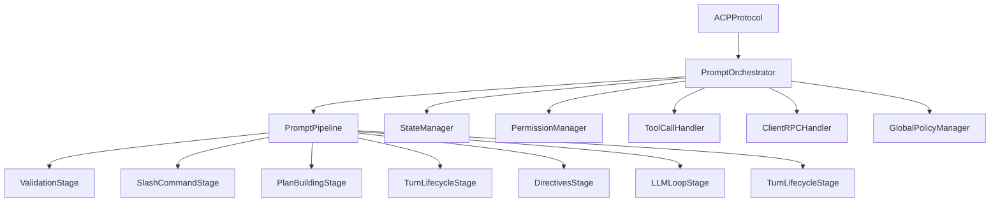

# Обработчики протокола CodeLab

> Руководство по созданию и расширению обработчиков методов ACP.

## Обзор

Обработчики протокола расположены в `server/protocol/handlers/` и вызываются через `PromptOrchestrator` — центральный координатор prompt-turn.



## Менеджеры

### StateManager

Управление состоянием сессии:

```python
class StateManager:
    def create_active_turn(self) -> ActiveTurnState:
        """Создать состояние активного turn."""
        ...
    
    def add_tool_call(self, turn: ActiveTurnState, tool_call: ToolCallState) -> None:
        """Добавить tool call к turn."""
        ...
    
    def update_tool_call_status(self, turn: ActiveTurnState, tool_call_id: str, status: str) -> None:
        """Обновить статус tool call."""
        ...
```

### PlanBuilder

Построение планов выполнения:

```python
class PlanBuilder:
    def build_plan(self, prompt: list[dict]) -> AgentPlan:
        """Построить план из промпта."""
        ...
    
    def update_plan(self, plan: AgentPlan, updates: list[dict]) -> AgentPlan:
        """Обновить план."""
        ...
```

### TurnLifecycleManager

Жизненный цикл prompt-turn:

```python
class TurnLifecycleManager:
    async def open_turn(self, session: SessionState) -> list[Notification]:
        """Открыть turn, отправить session/started."""
        ...
    
    async def close_turn(self, session: SessionState, stop_reason: str) -> list[Notification]:
        """Закрыть turn, отправить session/update."""
        ...
    
    async def add_event(self, session: SessionState, event: dict) -> None:
        """Добавить событие в events_history."""
        ...
```

### ToolCallHandler

Обработка tool calls:

```python
class ToolCallHandler:
    async def execute_tool(
        self,
        tool_id: str,
        arguments: dict,
        context: ToolCallContext,
    ) -> ToolExecutionResult:
        """Выполнить инструмент."""
        ...
```

### PermissionManager

Управление разрешениями:

```python
class PermissionManager:
    async def check_permission(
        self,
        session_id: str,
        tool_id: str,
        arguments: dict,
    ) -> PermissionResult:
        """Проверить разрешение (global → session → ask)."""
        ...
    
    async def allow_always(self, session_id: str, tool_id: str) -> None:
        """Разрешить всегда."""
        ...
    
    async def reject_always(self, session_id: str, tool_id: str) -> None:
        """Запретить всегда."""
        ...
```

### GlobalPolicyManager

Глобальные политики разрешений:

```python
class GlobalPolicyManager:
    async def initialize(self) -> None:
        """Загрузить политики из GlobalPolicyStorage."""
        ...
    
    async def get_policy(self, tool_id: str) -> PolicyAction:
        """Получить глобальную политику."""
        ...
    
    async def set_policy(self, tool_id: str, action: PolicyAction) -> None:
        """Установить глобальную политику."""
        ...
```

### ClientRPCHandler

Обработка agent→client RPC:

```python
class ClientRPCHandler:
    async def handle_response(self, response: ACPMessage) -> None:
        """Обработать ответ от клиента."""
        ...
    
    async def handle_permission_response(self, response: ACPMessage) -> None:
        """Обработать ответ на запрос разрешения."""
        ...
```

## Pipeline стадии

### Базовый класс

```python
class PipelineStage(ABC):
    @abstractmethod
    async def execute(self, context: PipelineContext) -> StageResult:
        """Выполнить стадию."""
        ...
```

### ValidationStage

Валидация входных данных:

```python
class ValidationStage(PipelineStage):
    async def execute(self, context: PipelineContext) -> StageResult:
        # Проверка session ID
        if not context.session_id:
            return StageResult.error("session_id is required")
        
        # Проверка prompt array
        if not context.prompt:
            return StageResult.error("prompt is required")
        
        # Проверка состояния сессии (нет активного turn)
        if context.session.has_active_turn:
            return StageResult.error("session has active turn")
        
        return StageResult.continue_()
```

### SlashCommandStage

Обработка slash команд:

```python
class SlashCommandStage(PipelineStage):
    async def execute(self, context: PipelineContext) -> StageResult:
        prompt_text = extract_text(context.prompt)
        
        if prompt_text.startswith("/"):
            command = prompt_text[1:].split()[0]
            if self._router.has_command(command):
                result = await self._router.execute(command, context)
                return StageResult.success(result)
        
        return StageResult.continue_()
```

### LLMLoopStage

Главная стадия — цикл LLM с tool calls:

```python
class LLMLoopStage(PipelineStage):
    async def execute(self, context: PipelineContext) -> StageResult:
        for iteration in range(self._max_iterations):
            # Вызов LLM
            response = await self._agent_orchestrator.process_prompt(context)
            
            if response.stop_reason == "end_turn":
                return StageResult.success(stop_reason="end_turn")
            
            if response.stop_reason == "tool_use":
                tool_results = []
                for tool_call in response.tool_calls:
                    # Проверка разрешений
                    permission = await self._permission_manager.check_permission(
                        context.session_id, tool_call.name, tool_call.arguments
                    )
                    
                    if permission == "allow":
                        result = await self._tool_registry.execute_tool(tool_call)
                        tool_results.append(result)
                    elif permission == "ask":
                        # Запрос разрешения у клиента
                        user_decision = await self._request_permission(tool_call)
                        if user_decision == "allow":
                            result = await self._tool_registry.execute_tool(tool_call)
                            tool_results.append(result)
                        else:
                            tool_results.append(ToolResult.failed("permission denied"))
                    else:  # reject
                        tool_results.append(ToolResult.failed("policy reject"))
                
                # Продолжение с результатами
                context = context.with_tool_results(tool_results)
                continue
            
            return StageResult.success(stop_reason=response.stop_reason)
        
        return StageResult.success(stop_reason="max_turn_requests")
```

## Slash Commands

### Базовый класс

```python
class SlashCommandHandler(ABC):
    @property
    @abstractmethod
    def name(self) -> str: ...
    
    @property
    @abstractmethod
    def description(self) -> str: ...
    
    @abstractmethod
    async def execute(self, context: CommandContext) -> CommandResult: ...
```

### Встроенные команды

**StatusCommandHandler:**
```python
class StatusCommandHandler(SlashCommandHandler):
    name = "status"
    description = "Показать состояние сессии"
    
    async def execute(self, context: CommandContext) -> CommandResult:
        session = context.session
        return CommandResult.success(
            f"Session: {session.id}\n"
            f"Mode: {session.mode}\n"
            f"Tools: {len(session.available_tools)}"
        )
```

**ModeCommandHandler:**
```python
class ModeCommandHandler(SlashCommandHandler):
    name = "mode"
    description = "Переключить режим сессии"
    
    async def execute(self, context: CommandContext) -> CommandResult:
        mode = context.args[0] if context.args else "code"
        context.session.mode = mode
        return CommandResult.success(f"Mode set to: {mode}")
```

**HelpCommandHandler:**
```python
class HelpCommandHandler(SlashCommandHandler):
    name = "help"
    description = "Показать список команд"
    
    def __init__(self, registry: CommandRegistry):
        self._registry = registry
    
    async def execute(self, context: CommandContext) -> CommandResult:
        commands = self._registry.list_commands()
        help_text = "\n".join(f"/{cmd.name} - {cmd.description}" for cmd in commands)
        return CommandResult.success(help_text)
```

### Создание новой команды

1. Создайте файл в `handlers/slash_commands/builtin/`
2. Наследуйте `SlashCommandHandler`
3. Зарегистрируйте в `SlashCommandsProvider`:

```python
class MyCommandHandler(SlashCommandHandler):
    @property
    def name(self) -> str:
        return "mycommand"
    
    @property
    def description(self) -> str:
        return "Моя команда"
    
    async def execute(self, context: CommandContext) -> CommandResult:
        return CommandResult.success("Выполнено!")

# В SlashCommandsProvider.get_command_registry():
registry.register(MyCommandHandler())
```

## Уведомления

### Типы уведомлений

| Тип | Описание |
|-----|----------|
| `session/started` | Turn начат |
| `session/update` | Обновление состояния |
| `agent_message_chunk` | Часть ответа агента |
| `user_message_chunk` | Часть сообщения пользователя |
| `tool_call` | Вызов инструмента |
| `tool_call_result` | Результат инструмента |
| `tool_call_update` | Обновление статуса инструмента |
| `plan` | План агента |

### Отправка уведомлений

```python
# В PromptOrchestrator
notifications = self._turn_lifecycle_manager.open_turn(session)
for notification in notifications:
    yield notification

# В LLMLoopStage
yield Notification(
    method="session/update",
    params={
        "sessionId": session_id,
        "update": {
            "type": "tool_call",
            "toolCall": tool_call.dict(),
        },
    },
)
```

## Обработка ошибок

### Иерархия исключений

```
ACPError
├── ValidationError
├── AuthenticationError
├── AuthorizationError
├── PermissionDeniedError
├── StorageError
│   ├── SessionNotFoundError
│   └── SessionAlreadyExistsError
├── AgentProcessingError
├── ToolExecutionError
├── ProtocolError
└── InvalidStateError
```

### Пример обработки

```python
async def handle_session_new(self, message: ACPMessage) -> ProtocolOutcome:
    try:
        session = await self._storage.create_session(...)
        return ProtocolOutcome.success(session.dict())
    except SessionAlreadyExistsError:
        return ProtocolOutcome.error(
            code=-32600,
            message="Session already exists",
        )
    except ValidationError as e:
        return ProtocolOutcome.error(
            code=-32602,
            message=f"Invalid params: {e}",
        )
```

## См. также

- [Архитектура](01-architecture.md) — общая архитектура системы
- [Разработка сервера](03-server-development.md) — детали реализации сервера
- [Тестирование](05-testing.md) — запуск и написание тестов
