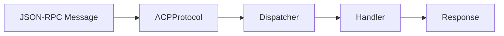

# Создание обработчиков протокола

> Руководство по созданию новых Protocol Handlers для ACP сервера.

## Обзор

Protocol Handlers — компоненты, обрабатывающие JSON-RPC методы ACP протокола. Каждый handler отвечает за группу связанных методов.



## Архитектура Handlers

### Структура директории

```
server/protocol/handlers/
├── __init__.py
├── auth.py              # authenticate, initialize
├── session.py           # session/new, load, list
├── prompt.py            # session/prompt, cancel
├── permissions.py       # session/request_permission
├── config.py            # session/set_config_option
├── tool_call_handler.py # Обработка tool calls
├── client_rpc_handler.py# RPC к клиенту
```

### Базовый Handler

```python
from abc import ABC, abstractmethod
from codelab.server.protocol import ACPMessage, ProtocolOutcome

class Handler(ABC):
    """Базовый класс обработчика протокола."""
    
    @abstractmethod
    async def handle(self, message: ACPMessage) -> ProtocolOutcome:
        """Обработка входящего сообщения.
        
        Args:
            message: JSON-RPC сообщение
            
        Returns:
            ProtocolOutcome с результатом или ошибкой
        """
        ...
    
    @property
    @abstractmethod
    def methods(self) -> list[str]:
        """Список методов, которые обрабатывает handler."""
        ...
```

## Создание Handler

### Шаг 1: Определение Handler

```python
# server/protocol/handlers/my_handler.py

from __future__ import annotations

from typing import TYPE_CHECKING

from codelab.server.protocol import ACPMessage, ProtocolOutcome
from codelab.shared.messages import JsonRpcError

if TYPE_CHECKING:
    from codelab.server.storage import SessionStorage
    from codelab.server.my_service import MyService


class MyHandler:
    """Обработчик кастомных методов.
    
    Обрабатывает методы:
    - my/action: Выполнение действия
    - my/query: Запрос данных
    """
    
    def __init__(
        self,
        storage: SessionStorage,
        service: MyService,
    ) -> None:
        """Инициализация handler.
        
        Args:
            storage: Хранилище сессий
            service: Сервис бизнес-логики
        """
        self._storage = storage
        self._service = service
    
    @property
    def methods(self) -> list[str]:
        """Методы handler."""
        return ["my/action", "my/query"]
    
    async def handle(self, message: ACPMessage) -> ProtocolOutcome:
        """Диспетчеризация по методам."""
        method = message.method
        
        if method == "my/action":
            return await self._handle_action(message)
        elif method == "my/query":
            return await self._handle_query(message)
        
        return ProtocolOutcome.error(
            JsonRpcError.method_not_found(method)
        )
    
    async def _handle_action(self, message: ACPMessage) -> ProtocolOutcome:
        """Обработка my/action."""
        params = message.params or {}
        
        # Валидация параметров
        session_id = params.get("session_id")
        if not session_id:
            return ProtocolOutcome.error(
                JsonRpcError.invalid_params("session_id is required")
            )
        
        data = params.get("data")
        if not data:
            return ProtocolOutcome.error(
                JsonRpcError.invalid_params("data is required")
            )
        
        # Проверка сессии
        session = await self._storage.load(session_id)
        if not session:
            return ProtocolOutcome.error(
                JsonRpcError.invalid_params(f"Session {session_id} not found")
            )
        
        # Бизнес-логика
        try:
            result = await self._service.perform_action(session, data)
        except ValueError as e:
            return ProtocolOutcome.error(
                JsonRpcError.invalid_params(str(e))
            )
        except Exception as e:
            return ProtocolOutcome.error(
                JsonRpcError.internal_error(str(e))
            )
        
        # Успешный результат
        return ProtocolOutcome.success({
            "success": True,
            "result": result,
        })
    
    async def _handle_query(self, message: ACPMessage) -> ProtocolOutcome:
        """Обработка my/query."""
        params = message.params or {}
        
        query = params.get("query", "")
        
        results = await self._service.search(query)
        
        return ProtocolOutcome.success({
            "results": results,
            "count": len(results),
        })
```

### Шаг 2: Регистрация Handler

```python
# server/protocol/core.py

class ACPProtocol:
    """Протокол ACP с диспетчеризацией."""
    
    def _create_handlers(self) -> dict[str, Handler]:
        """Создание и регистрация handlers."""
        handlers = {}
        
        # Существующие handlers
        auth_handler = AuthHandler(self._storage, self._config)
        for method in auth_handler.methods:
            handlers[method] = auth_handler
        
        session_handler = SessionHandler(self._storage)
        for method in session_handler.methods:
            handlers[method] = session_handler
        
        # Новый handler
        my_handler = MyHandler(self._storage, self._service)
        for method in my_handler.methods:
            handlers[method] = my_handler
        
        return handlers
```

### Шаг 3: Тестирование

```python
# tests/test_my_handler.py

import pytest
from unittest.mock import AsyncMock, Mock

from codelab.server.protocol.handlers.my_handler import MyHandler
from codelab.server.protocol import ACPMessage


class TestMyHandler:
    """Тесты MyHandler."""
    
    @pytest.fixture
    def storage(self) -> AsyncMock:
        return AsyncMock()
    
    @pytest.fixture
    def service(self) -> AsyncMock:
        return AsyncMock()
    
    @pytest.fixture
    def handler(self, storage, service) -> MyHandler:
        return MyHandler(storage, service)
    
    async def test_handle_action_success(self, handler, storage, service):
        """Тест успешного выполнения action."""
        # Arrange
        storage.load.return_value = Mock(id="session-1")
        service.perform_action.return_value = {"id": "result-1"}
        
        message = ACPMessage(
            method="my/action",
            params={
                "session_id": "session-1",
                "data": {"key": "value"},
            },
        )
        
        # Act
        outcome = await handler.handle(message)
        
        # Assert
        assert outcome.error is None
        assert outcome.response["success"] is True
        assert outcome.response["result"]["id"] == "result-1"
    
    async def test_handle_action_missing_session_id(self, handler):
        """Тест ошибки при отсутствии session_id."""
        message = ACPMessage(
            method="my/action",
            params={"data": {}},
        )
        
        outcome = await handler.handle(message)
        
        assert outcome.error is not None
        assert "session_id is required" in str(outcome.error)
    
    async def test_handle_action_session_not_found(self, handler, storage):
        """Тест ошибки при несуществующей сессии."""
        storage.load.return_value = None
        
        message = ACPMessage(
            method="my/action",
            params={
                "session_id": "unknown",
                "data": {},
            },
        )
        
        outcome = await handler.handle(message)
        
        assert outcome.error is not None
        assert "not found" in str(outcome.error)
```

## Работа с Notifications

### Отправка notifications

```python
async def _handle_long_action(self, message: ACPMessage) -> ProtocolOutcome:
    """Обработка с промежуточными notifications."""
    params = message.params or {}
    session_id = params["session_id"]
    
    notifications = []
    
    # Этап 1
    notifications.append({
        "jsonrpc": "2.0",
        "method": "session/update",
        "params": {
            "session_id": session_id,
            "updates": [{"type": "progress", "value": 0.3}],
        },
    })
    
    # Выполнение работы
    result = await self._service.process()
    
    # Этап 2
    notifications.append({
        "jsonrpc": "2.0",
        "method": "session/update",
        "params": {
            "session_id": session_id,
            "updates": [{"type": "progress", "value": 1.0}],
        },
    })
    
    return ProtocolOutcome.with_notifications(
        result={"completed": True},
        notifications=notifications,
    )
```

## Обработка ошибок

### Типы ошибок JSON-RPC

```python
from codelab.shared.messages import JsonRpcError

# Метод не найден
JsonRpcError.method_not_found("unknown/method")

# Неверные параметры
JsonRpcError.invalid_params("session_id is required")

# Внутренняя ошибка
JsonRpcError.internal_error("Database connection failed")

# Кастомная ошибка
JsonRpcError(
    code=-32001,
    message="Custom error",
    data={"details": "Additional info"},
)
```

### Обработка исключений

```python
async def _handle_action(self, message: ACPMessage) -> ProtocolOutcome:
    """Обработка с правильной обработкой ошибок."""
    try:
        # Валидация
        params = self._validate_params(message.params)
        
        # Выполнение
        result = await self._service.execute(params)
        
        return ProtocolOutcome.success(result)
    
    except ValidationError as e:
        # Ошибка валидации — invalid_params
        return ProtocolOutcome.error(
            JsonRpcError.invalid_params(str(e))
        )
    
    except NotFoundError as e:
        # Не найдено — кастомный код
        return ProtocolOutcome.error(
            JsonRpcError(code=-32002, message=str(e))
        )
    
    except PermissionError as e:
        # Нет доступа
        return ProtocolOutcome.error(
            JsonRpcError(code=-32003, message="Permission denied")
        )
    
    except Exception as e:
        # Неожиданная ошибка
        logger.exception("Unexpected error in handler")
        return ProtocolOutcome.error(
            JsonRpcError.internal_error("Internal server error")
        )
```

## Паттерны

### Валидация параметров

```python
from dataclasses import dataclass
from typing import TypedDict


class ActionParams(TypedDict):
    """Типизированные параметры my/action."""
    session_id: str
    data: dict
    options: dict | None


@dataclass
class ValidatedParams:
    """Валидированные параметры."""
    session_id: str
    data: dict
    options: dict


def validate_action_params(params: dict | None) -> ValidatedParams:
    """Валидация параметров action.
    
    Raises:
        ValidationError: При неверных параметрах
    """
    if not params:
        raise ValidationError("params is required")
    
    session_id = params.get("session_id")
    if not session_id or not isinstance(session_id, str):
        raise ValidationError("session_id must be a non-empty string")
    
    data = params.get("data")
    if not isinstance(data, dict):
        raise ValidationError("data must be an object")
    
    options = params.get("options", {})
    if not isinstance(options, dict):
        raise ValidationError("options must be an object")
    
    return ValidatedParams(
        session_id=session_id,
        data=data,
        options=options,
    )
```

### Проверка состояния сессии

```python
async def _require_session(
    self,
    session_id: str,
    *,
    require_active: bool = False,
) -> SessionState:
    """Получение сессии с проверками.
    
    Args:
        session_id: ID сессии
        require_active: Требовать активную сессию
        
    Returns:
        SessionState
        
    Raises:
        SessionNotFoundError: Сессия не найдена
        SessionNotActiveError: Сессия не активна
    """
    session = await self._storage.load(session_id)
    
    if not session:
        raise SessionNotFoundError(session_id)
    
    if require_active and not session.is_active:
        raise SessionNotActiveError(session_id)
    
    return session
```

### Асинхронная обработка

```python
async def _handle_prompt(self, message: ACPMessage) -> ProtocolOutcome:
    """Обработка prompt с асинхронной генерацией."""
    params = message.params or {}
    session_id = params["session_id"]
    
    # Запуск фоновой задачи
    task = asyncio.create_task(
        self._process_prompt_async(session_id, params)
    )
    
    # Сохранение для возможной отмены
    self._running_tasks[session_id] = task
    
    # Немедленный ответ
    return ProtocolOutcome.success({
        "status": "processing",
        "session_id": session_id,
    })

async def _process_prompt_async(
    self,
    session_id: str,
    params: dict,
) -> None:
    """Асинхронная обработка prompt."""
    try:
        async for update in self._agent.process(params):
            # Отправка notification
            await self._send_notification({
                "jsonrpc": "2.0",
                "method": "session/update",
                "params": {
                    "session_id": session_id,
                    "updates": [update.to_dict()],
                },
            })
    finally:
        # Очистка
        self._running_tasks.pop(session_id, None)
```

## Логирование

```python
import structlog

logger = structlog.get_logger(__name__)


class MyHandler:
    async def handle(self, message: ACPMessage) -> ProtocolOutcome:
        log = logger.bind(
            method=message.method,
            message_id=message.id,
        )
        
        log.debug("Handling message")
        
        try:
            result = await self._process(message)
            log.info("Message handled successfully")
            return result
        except Exception as e:
            log.error("Error handling message", error=str(e))
            raise
```

## Checklist создания Handler

- [ ] Определить методы, которые будет обрабатывать handler
- [ ] Создать класс handler с зависимостями
- [ ] Реализовать метод `handle()` с диспетчеризацией
- [ ] Добавить валидацию параметров
- [ ] Обработать все возможные ошибки
- [ ] Написать unit тесты
- [ ] Зарегистрировать handler в `ACPProtocol`
- [ ] Добавить документацию

## См. также

- [Разработка сервера](03-server-development.md) — общая архитектура сервера
- [Тестирование](05-testing.md) — руководство по тестированию
- [ACP Protocol Specification](../../Agent%20Client%20Protocol/protocol/01-Overview.md) — спецификация протокола
