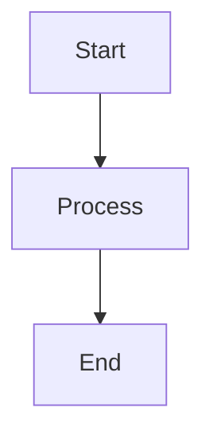

# Вклад в проект

> Руководство по участию в разработке CodeLab.

## Начало работы

### Клонирование репозитория

```bash
git clone https://github.com/pese-git/codelab-ai.git
cd acp-protocol
```

### Настройка окружения

```bash
# Установка uv (если не установлен)
curl -LsSf https://astral.sh/uv/install.sh | sh

# Установка зависимостей
cd codelab
uv sync
```

### Проверка установки

```bash
# Запуск тестов
make check

# Запуск приложения
uv run codelab
```

## Структура проекта

```
acp-protocol/
├── codelab/              # Основной проект
│   ├── src/codelab/      # Исходный код
│   │   ├── client/       # TUI клиент
│   │   ├── server/       # ACP сервер
│   │   └── shared/       # Общие модули
│   └── tests/            # Тесты
├── doc/                  # Документация
│   ├── Agent Client Protocol/  # Спецификация ACP (НЕ ИЗМЕНЯТЬ)
│   ├── architecture/     # Архитектурные документы
│   └── product/          # Пользовательская документация
├── AGENTS.md             # Правила для AI агентов
├── Makefile              # Команды проекта
└── README.md
```

## Рабочий процесс

### 1. Создание ветки

```bash
# Для фич
git checkout -b feature/my-feature

# Для багфиксов
git checkout -b fix/bug-description

# Для документации
git checkout -b docs/topic-name
```

### 2. Внесение изменений

```bash
# Редактирование кода
# ...

# Проверка изменений
make check
```

### 3. Коммит

```bash
# Добавление файлов
git add .

# Коммит с осмысленным сообщением
git commit -m "feat: добавлена поддержка нового инструмента"
```

### 4. Push и Pull Request

```bash
git push origin feature/my-feature
```

Создайте Pull Request через GitHub.

## Стиль кода

### Python

- **Python 3.12+**
- **Типизация**: Все функции и методы должны быть типизированы
- **Docstrings**: Google style
- **Форматирование**: ruff format
- **Линтинг**: ruff check

### Пример кода

```python
"""Модуль для обработки сессий.

Этот модуль содержит классы и функции для управления
сессиями ACP протокола.
"""

from __future__ import annotations

from dataclasses import dataclass
from datetime import datetime
from typing import TYPE_CHECKING

if TYPE_CHECKING:
    from codelab.server.storage import SessionStorage


@dataclass
class Session:
    """Сессия ACP.
    
    Атрибуты:
        id: Уникальный идентификатор сессии
        title: Название сессии (опционально)
        created_at: Время создания
    """
    
    id: str
    title: str | None
    created_at: datetime


async def create_session(
    storage: SessionStorage,
    title: str | None = None,
) -> Session:
    """Создает новую сессию.
    
    Args:
        storage: Хранилище сессий
        title: Опциональное название
        
    Returns:
        Созданная сессия
        
    Raises:
        StorageError: При ошибке сохранения
    """
    session = Session(
        id=generate_id(),
        title=title,
        created_at=datetime.utcnow(),
    )
    await storage.save(session)
    return session
```

### Именование

| Тип | Стиль | Пример |
|-----|-------|--------|
| Модули | snake_case | `session_handler.py` |
| Классы | PascalCase | `SessionHandler` |
| Функции | snake_case | `create_session` |
| Константы | UPPER_SNAKE | `DEFAULT_TIMEOUT` |
| Переменные | snake_case | `session_id` |

## Правила проекта

### Обязательно

1. **Каждое изменение покрыто тестами**
2. **Код проходит `make check`**
3. **Документация на русском языке**
4. **Осмысленные комментарии**
5. **Типизация всего кода**

### Запрещено

1. ❌ Изменять `doc/Agent Client Protocol/` — это официальный протокол
2. ❌ Нарушать спецификацию ACP
3. ❌ Добавлять зависимости без необходимости
4. ❌ Коммитить `.venv`, `__pycache__`, `.pytest_cache`

### Совместимость

- Python 3.12+
- Не ломать публичные интерфейсы CLI без необходимости

## Тестирование

### Запуск тестов

```bash
# Все тесты
make check

# Только pytest
cd codelab
uv run python -m pytest

# Конкретный модуль
uv run python -m pytest tests/server/

# С покрытием
uv run python -m pytest --cov=codelab
```

### Написание тестов

```python
import pytest
from unittest.mock import AsyncMock


class TestMyFeature:
    """Тесты моей функциональности."""
    
    @pytest.fixture
    def dependency(self) -> AsyncMock:
        """Mock зависимости."""
        return AsyncMock()
    
    async def test_happy_path(self, dependency):
        """Тест успешного сценария."""
        # Arrange
        dependency.method.return_value = "expected"
        
        # Act
        result = await my_function(dependency)
        
        # Assert
        assert result == "expected"
    
    async def test_error_handling(self, dependency):
        """Тест обработки ошибок."""
        dependency.method.side_effect = Exception("error")
        
        with pytest.raises(MyError):
            await my_function(dependency)
```

## Документация

### Структура документации

```
doc/
├── Agent Client Protocol/   # НЕ ИЗМЕНЯТЬ
├── architecture/            # Архитектурные решения
└── product/                 # Пользовательская документация
    ├── overview/
    ├── getting-started/
    ├── user-guide/
    └── developer-guide/
```

### Диаграммы

Используйте Mermaid для диаграмм:

```markdown

```

### Обновление документации

При изменении архитектуры:
1. Обновите соответствующий документ в `doc/architecture/`
2. Обновите диаграммы
3. Обновите связанные файлы в `doc/product/`

## Git

### Сообщения коммитов

```
<type>: <description>

[optional body]

[optional footer]
```

#### Типы

| Тип | Описание |
|-----|----------|
| `feat` | Новая функциональность |
| `fix` | Исправление бага |
| `docs` | Документация |
| `refactor` | Рефакторинг |
| `test` | Тесты |
| `chore` | Рутинные задачи |

#### Примеры

```bash
feat: добавлена поддержка terminal/kill

Реализован метод terminal/kill для остановки процессов.

Closes #123
```

```bash
fix: исправлена утечка памяти в ChatView

Добавлена очистка подписок при unmount компонента.
```

### Ветки

- `main` — стабильная версия
- `develop` — разработка
- `feature/*` — новые фичи
- `fix/*` — исправления
- `docs/*` — документация

## Code Review

### Checklist для автора

- [ ] Код проходит `make check`
- [ ] Добавлены тесты
- [ ] Обновлена документация (если нужно)
- [ ] Сообщения коммитов осмысленные
- [ ] PR описывает изменения

### Checklist для ревьюера

- [ ] Код соответствует стилю проекта
- [ ] Тесты покрывают изменения
- [ ] Нет нарушений архитектуры
- [ ] Документация актуальна

## Сообщение о проблемах

### Bug Report

```markdown
## Описание
Краткое описание проблемы

## Шаги воспроизведения
1. Запустить `codelab serve`
2. Подключиться с `codelab connect`
3. Отправить сообщение

## Ожидаемое поведение
Что должно было произойти

## Фактическое поведение
Что произошло на самом деле

## Окружение
- OS: macOS 14.0
- Python: 3.12
- CodeLab: commit hash
```

### Feature Request

```markdown
## Описание
Что хотелось бы добавить

## Мотивация
Почему это нужно

## Предлагаемое решение
Как это можно реализовать

## Альтернативы
Какие ещё варианты рассматривались
```

## Релизы

### Версионирование

Используется Semantic Versioning:
- MAJOR.MINOR.PATCH
- Пример: 1.2.3

### Процесс выпуска

1. Обновить `CHANGELOG.md` — перенести [Unreleased] в новую версию
2. Обновить версию в `pyproject.toml`
3. Создать тег: `git tag v1.2.3`
4. Отправить тег: `git push origin v1.2.3`
5. Создать GitHub Release с описанием изменений

## См. также

- [AGENTS.md](../../../AGENTS.md) — инструкции для агентных ассистентов
- [Тестирование](05-testing.md) — запуск и написание тестов
- [Архитектура](01-architecture.md) — общая архитектура системы
- [CHANGELOG.md](../../../CHANGELOG.md) — история изменений