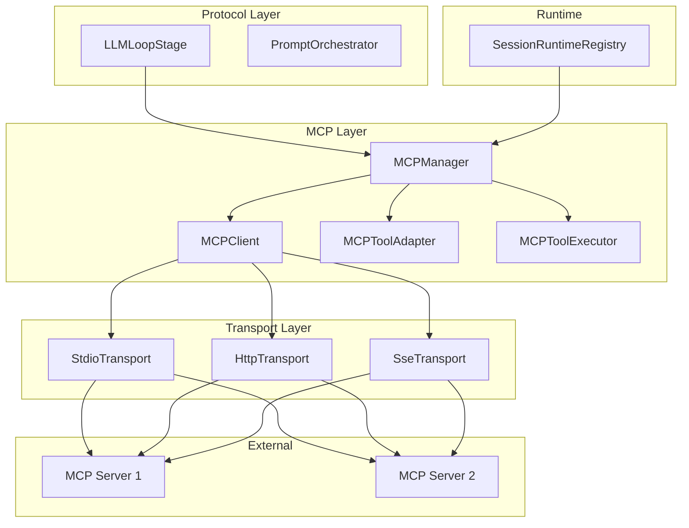
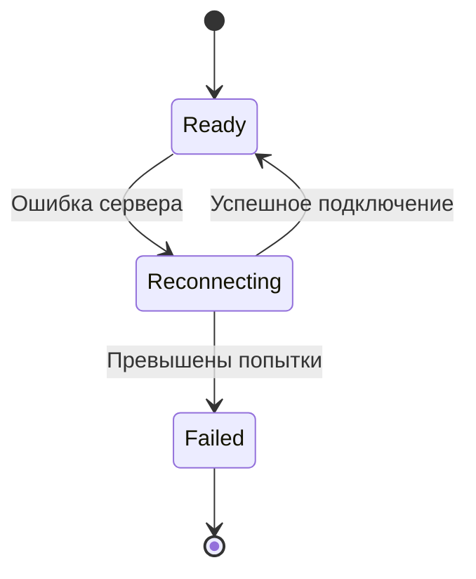
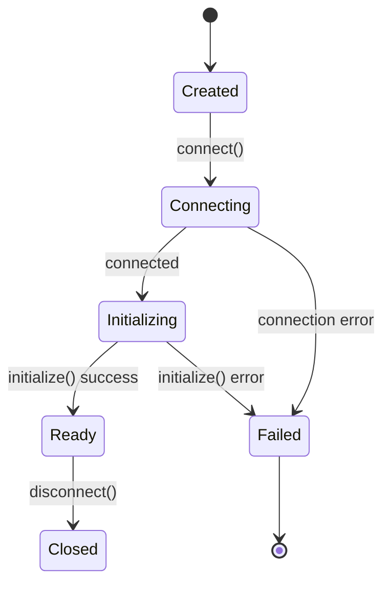
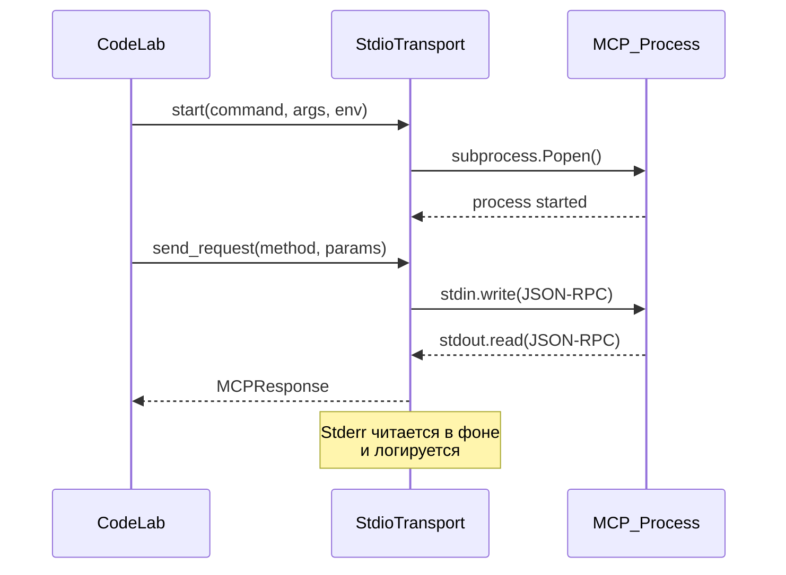
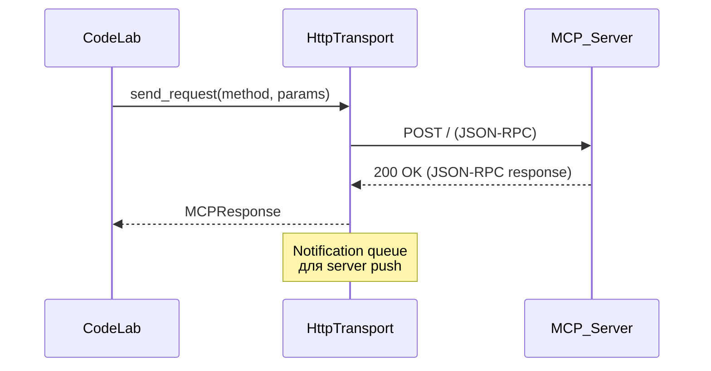
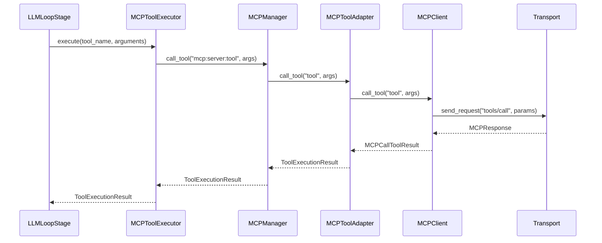

# Разработка MCP интеграции

> Руководство разработчика по расширению и отладке MCP (Model Context Protocol) в CodeLab.

## Обзор

MCP интеграция в CodeLab состоит из нескольких слоёв:



## Компоненты MCP

### MCPManager

Центральный менеджер MCP серверов для одной сессии.

**Файл:** `server/mcp/manager.py`

**Ответственность:**
- Управление жизненным циклом MCP клиентов
- Маршрутизация вызовов инструментов
- Auto-reconnect с exponential backoff
- Health check mechanism

**Ключевые методы:**

```python
class MCPManager:
    async def add_server(self, config: MCPServerConfig) -> list[ToolDefinition]
    async def remove_server(self, server_id: str) -> None
    async def call_tool(self, namespaced_name: str, arguments: dict) -> ToolExecutionResult
    def get_all_tools(self) -> list[ToolDefinition]
    async def reconnect_with_backoff(self, server_id: str) -> bool
    async def start_health_check(self, server_id: str, interval: float = 60.0) -> None
    async def shutdown(self) -> None
```

**Состояния:**



### MCPClient

Клиент для взаимодействия с одним MCP сервером.

**Файл:** `server/mcp/client.py`

**Жизненный цикл:**



**Ключевые методы:**

```python
class MCPClient:
    async def connect(self) -> None
    async def disconnect(self) -> None
    async def initialize(self) -> MCPInitializeResult
    async def list_tools(self) -> list[MCPTool]
    async def call_tool(self, name: str, arguments: dict) -> MCPCallToolResult
    async def list_resources(self) -> list[MCPResource]
    async def read_resource(self, uri: str) -> MCPReadResourceResult
    async def list_prompts(self) -> list[MCPPrompt]
    async def get_prompt(self, name: str, arguments: dict) -> MCPGetPromptResult
```

### Транспорты

**Файл:** `server/mcp/transport.py`

#### StdioTransport

Запускает MCP сервер как subprocess с async stdin/stdout.



**Ключевые особенности:**
- Async subprocess с `asyncio.create_subprocess_exec()`
- Lock для предотвращения race condition при одновременных запросах
- Background task для чтения stdout
- Background task для чтения stderr (логирование)

#### HttpTransport

HTTP POST с JSON-RPC для удалённых MCP серверов.



**Ключевые особенности:**
- aiohttp session reuse
- Notification queue для server-initiated сообщений
- Поддержка custom headers (auth tokens)

#### SseTransport

Server-Sent Events (deprecated в MCP spec).

**Ключевые особенности:**
- SSE endpoint для получения уведомлений
- HTTP POST для отправки запросов
- Message endpoint для отправки сообщений

### MCPToolAdapter

Адаптация MCP инструментов к ACP ToolDefinition.

**Файл:** `server/mcp/tool_adapter.py`

**Kind Inference:**

```python
def _infer_kind(self, mcp_tool: MCPTool) -> str:
    # Приоритет 1: MCP ToolAnnotations
    if mcp_tool.annotations:
        if mcp_tool.annotations.read_only_hint:
            return "read"
        if mcp_tool.annotations.destructive_hint:
            return "execute"
        if mcp_tool.annotations.idempotent_hint:
            return "edit"
        if mcp_tool.annotations.open_world_hint:
            return "execute"
    
    # Приоритет 2: Эвристика по имени
    name = mcp_tool.name.lower()
    if any(name.startswith(p) for p in ["read_", "get_", "list_", "fetch_"]):
        return "read"
    if any(name.startswith(p) for p in ["write_", "create_", "delete_", "remove_"]):
        return "execute"
    if any(name.startswith(p) for p in ["update_", "modify_", "set_"]):
        return "edit"
    
    # Приоритет 3: Fallback
    return "other"
```

**Namespaced имена:**

```python
@staticmethod
def create_namespaced_name(server_id: str, tool_name: str) -> str:
    return f"mcp:{server_id}:{tool_name}"

@staticmethod
def parse_namespaced_name(namespaced_name: str) -> tuple[str, str, str] | None:
    parts = namespaced_name.split(":", 2)
    if len(parts) != 3 or parts[0] != "mcp":
        return None
    return parts[0], parts[1], parts[2]  # prefix, server_id, tool_name
```

### MCPToolExecutor

Executor для MCP инструментов через ToolRegistry.

**Файл:** `server/tools/executors/mcp_executor.py`

```python
class MCPToolExecutor(ToolExecutor):
    async def execute(self, session: SessionState, arguments: dict) -> ToolExecutionResult:
        tool_name = arguments.get("tool_name", "")
        mcp_arguments = {k: v for k, v in arguments.items() if k != "tool_name"}
        result = await self._mcp_manager.call_tool(tool_name, mcp_arguments)
        return result
```

### SessionRuntimeRegistry

Реестр runtime-состояний сессий.

**Файл:** `server/protocol/session_runtime.py`

**Зачем нужен:**
- SessionState сериализуется в storage (JSON)
- MCPManager — runtime объект (subprocesses, connections)
- Нельзя сериализовать MCPManager в JSON
- Решение: отдельный реестр для runtime объектов

**Скоуп:** REQUEST-scoped через Dishka

```python
class SessionRuntimeRegistry:
    async def get_or_create(self, session_id: str) -> SessionRuntimeState
    async def set_mcp_manager(self, session_id: str, mcp_manager: MCPManager) -> None
    async def remove(self, session_id: str) -> None  # cleanup MCP subprocesses
    async def cleanup(self) -> None  # shutdown всех MCP при disconnect
```

## Интеграция в LLMLoopStage

MCP manager передаётся через `PromptContext.meta`:

```python
class LLMLoopStage:
    def _get_mcp_manager(self, context: PromptContext):
        return context.meta.get("mcp_manager")
    
    async def process(self, context: PromptContext) -> PromptContext:
        mcp_manager = self._get_mcp_manager(context)
        
        result = await self.run_loop(
            session=context.session,
            session_id=context.session_id,
            agent_orchestrator=agent_orchestrator,
            mcp_manager=mcp_manager,
        )
```

**Flow выполнения MCP инструмента:**



## System Message с MCP информацией

LLM получает system message с информацией о MCP серверах:

```python
def _build_mcp_system_message(mcp_manager: MCPManager | None) -> str:
    if mcp_manager is None:
        return ""
    
    servers_info = mcp_manager.get_servers_info()
    if not servers_info:
        return ""
    
    message = "You have access to the following MCP servers:\n"
    for server in servers_info:
        tools = server.get("tools", [])
        tool_names = [t["name"] for t in tools]
        message += f"- **{server['name']}** ({len(tools)} tools): {', '.join(tool_names)}\n"
    
    return message
```

**Пример system message:**
```
You have access to the following MCP servers:
- **filesystem** (5 tools): read_file, write_file, list_directory, etc.
- **github** (12 tools): list_repositories, create_issue, etc.
```

## Добавление нового MCP транспорта

1. Создайте класс транспорта в `server/mcp/transport.py`:

```python
class MyTransport:
    async def start(self, **kwargs) -> None:
        """Инициализация подключения."""
        ...
    
    async def send_request(self, method: str, params: dict) -> MCPResponse:
        """Отправить запрос и получить ответ."""
        ...
    
    async def close(self) -> None:
        """Закрыть подключение."""
        ...
```

2. Обновите `MCPClient.connect()` для использования нового транспорта:

```python
async def connect(self) -> None:
    if self.config.type == "my_transport":
        self._transport = MyTransport()
        await self._transport.start(**self.config.get_connection_params())
```

3. Добавьте тесты в `tests/server/mcp/test_transport_my.py`

## Добавление нового MCP сервера

MCP серверы настраиваются через конфигурацию, не требуют изменений кода.

**Пример конфигурации:**

```toml
[[mcp.servers]]
name = "my-server"
type = "stdio"
command = "my-mcp-server"
args = ["--stdio"]
```

## Тестирование MCP

### Unit тесты

```python
async def test_mcp_manager_add_server():
    manager = MCPManager("test_session")
    config = MCPServerConfig(
        name="test",
        command="echo",
        args=["hello"]
    )
    tools = await manager.add_server(config)
    assert len(tools) > 0
    await manager.shutdown()
```

### Integration тесты

```python
async def test_mcp_tool_execution():
    manager = MCPManager("test_session")
    config = MCPServerConfig(
        name="filesystem",
        command="npx",
        args=["-y", "@modelcontextprotocol/server-filesystem", "/tmp"]
    )
    await manager.add_server(config)
    
    result = await manager.call_tool(
        "mcp:filesystem:read_file",
        {"path": "/tmp/test.txt"}
    )
    assert result.success
    await manager.shutdown()
```

### Тестирование auto-reconnect

```python
async def test_reconnect_with_backoff():
    manager = MCPManager("test_session")
    # Добавляем сервер с неправильной командой
    config = MCPServerConfig(
        name="unreliable",
        command="false",  # всегда возвращает error
        max_retries=3,
        initial_delay=0.1
    )
    with pytest.raises(MCPManagerError):
        await manager.add_server(config)
```

## Отладка MCP

### Логирование

MCP компоненты используют structlog:

```python
logger.info(
    "Adding MCP server",
    session_id=session_id,
    server_id=server_id,
    tool_count=len(tools)
)
```

**Включение debug логов:**
```bash
export CODELAB_LOG_LEVEL=DEBUG
```

### Проверка состояния MCP

```python
# Получить информацию о серверах
servers_info = mcp_manager.get_servers_info()
for server in servers_info:
    print(f"Server: {server['name']}, State: {server['state']}, Tools: {server['tools_count']}")
```

### Troubleshooting

**MCP сервер не запускается:**
1. Проверьте команду запуска вручную
2. Проверьте переменные окружения
3. Посмотрите stderr логи

**Инструменты не видны:**
1. Проверьте `tools/list` response
2. Проверьте адаптацию в MCPToolAdapter
3. Проверьте регистрацию в ToolRegistry

**Timeout при вызове:**
1. Увеличьте timeout в конфигурации
2. Проверьте доступность сервера
3. Посмотрите логи транспорта

## Расширение MCP функциональности

### Добавление поддержки MCP ресурсов

```python
async def list_resources(self, server_id: str) -> list[MCPResource]:
    client = self._clients[server_id]
    return await client.list_resources()

async def read_resource(self, server_id: str, uri: str) -> str:
    client = self._clients[server_id]
    result = await client.read_resource(uri)
    return result.get_text_content()
```

### Добавление поддержки MCP промптов

```python
async def list_prompts(self, server_id: str) -> list[MCPPrompt]:
    client = self._clients[server_id]
    return await client.list_prompts()

async def get_prompt(self, server_id: str, name: str, arguments: dict) -> list[dict]:
    client = self._clients[server_id]
    result = await client.get_prompt(name, arguments)
    return result.messages
```

### Обработка MCP уведомлений

```python
# В MCPClient
async def _notification_handler(self, notification: MCPNotification):
    if notification.method == "notifications/tools/list_changed":
        await self._refresh_tools()
    elif notification.method == "notifications/resources/list_changed":
        self._notify_resource_change()
```

## См. также

- [Архитектура CodeLab](01-architecture.md) — общая архитектура
- [MCP серверы (user guide)](../user-guide/14-mcp-servers.md) — пользовательская документация
- [MCP Protocol](../../Model%20Context%20Protocol/) — полная спецификация MCP
- [Тестирование](05-testing.md) — запуск и написание тестов
