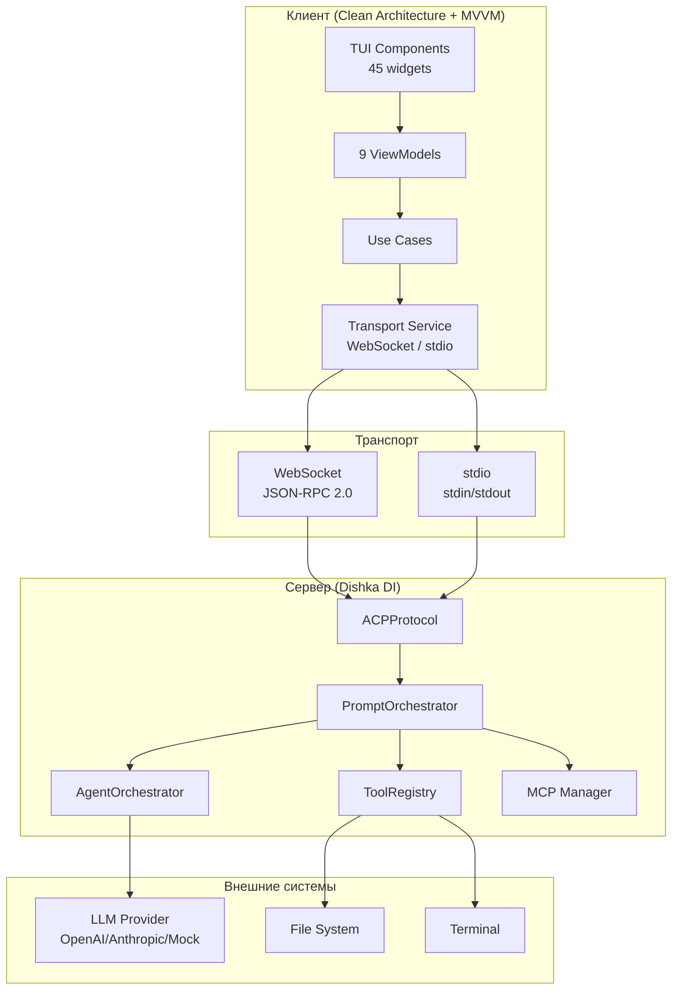

# Введение в CodeLab

> Унифицированная реализация Agent Client Protocol (ACP) — сервер агента и клиент в одном пакете.

## Что такое CodeLab?

CodeLab — это полнофункциональная реализация [Agent Client Protocol (ACP)](../../Agent%20Client%20Protocol/get-started/01-Introduction.md), стандартизированного протокола взаимодействия между AI-агентами и редакторами кода.

CodeLab объединяет в себе:
- **ACP-сервер** — интеллектуальный агент с поддержкой LLM (OpenAI, Anthropic, mock)
- **TUI-клиент** — терминальный интерфейс пользователя на базе Textual (Clean Architecture + MVVM)
- **Web UI** — браузерный интерфейс для работы через веб (textual-web)
- **stdio транспорт** — основной транспорт ACP для интеграции с IDE (stdin/stdout JSON-RPC)

## Для чего используется?

CodeLab позволяет:

1. **Автоматизировать разработку** — AI-агент выполняет задачи по кодированию, рефакторингу, тестированию
2. **Работать с файловой системой** — создание, редактирование, удаление файлов под контролем пользователя
3. **Выполнять команды терминала** — запуск скриптов, сборка проектов, деплой
4. **Планировать задачи** — агент формирует план действий и согласовывает его с пользователем
5. **Интегрироваться с MCP** — подключение внешних инструментов через Model Context Protocol
6. **Интегрироваться с IDE** — работа через stdio транспорт в Zed IDE и других редакторах

## Ключевые возможности

### 🤖 Интеллектуальный агент
- Поддержка OpenAI GPT-4, Anthropic Claude и других LLM-провайдеров
- Автоматическое планирование задач (plan-first mode)
- Контекстное понимание кодовой базы
- Цикл LLM с tool calls (до 10 итераций)
- Отмена промптов без блокировки (lock-free cancel)

### 🛡️ Система разрешений
- Гранулярный контроль над действиями агента
- Подтверждение опасных операций
- Глобальные и сессионные политики (GlobalPolicyManager)
- Inline виджеты разрешений в чате

### 📁 Работа с файлами
- Просмотр и редактирование файлов
- Создание новых файлов и директорий
- Интеллектуальное применение изменений (дифф)
- Песочница (sandbox) для защиты от path traversal

### 💻 Терминал
- Выполнение shell-команд
- Потоковый вывод результатов
- Фоновые процессы
- Корректный terminal output flow по ACP spec

### 🔌 MCP интеграция
- Подключение MCP-серверов
- Расширение возможностей агента
- Пользовательские инструменты
- Управление несколькими MCP-серверами на сессию

### 🏗️ Архитектура
- **Dishka DI контейнер** — управление зависимостями (APP scope / REQUEST scope)
- **Pipeline система** — 7 стадий обработки промпта
- **Slash команды** — `/help`, `/mode`, `/status`
- **Clean Architecture** — 5 слоёв на клиенте
- **MVVM паттерн** — 9 ViewModels для реактивного UI

## Архитектура

CodeLab следует клиент-серверной архитектуре ACP с поддержкой нескольких транспортов:



**Режимы работы:**
| Режим | Команда | Транспорт | Описание |
|-------|---------|-----------|----------|
| Локальный | `codelab` | stdio (subprocess) | Сервер + TUI в одном процессе |
| WebSocket сервер | `codelab serve` | WebSocket | Удалённые клиенты |
| stdio сервер | `codelab serve --stdio` | stdio | Для IDE плагинов |
| WebSocket клиент | `codelab connect` | WebSocket | Подключение к серверу |
| stdio клиент | `codelab connect --stdio` | stdio (subprocess) | Запуск агента как subprocess |

## Быстрый старт

```bash
# Клонирование репозитория
git clone https://github.com/pese-git/codelab-ai.git
cd acp-protocol/codelab

# Установка зависимостей
uv sync

# Локальный режим (сервер + TUI)
uv run codelab

# Или сервер + клиент отдельно
uv run codelab serve --port 8765        # WebSocket сервер
uv run codelab connect --port 8765      # TUI клиент

# stdio транспорт (для IDE плагинов)
uv run codelab serve --stdio            # сервер в stdio режиме
```

## Следующие шаги

- [Архитектура](02-architecture.md) — детальный обзор компонентов системы
- [Сценарии использования](03-use-cases.md) — примеры применения CodeLab
- [Установка](../getting-started/02-installation.md) — подробные инструкции по установке
- [Интеграция с Zed IDE](../user-guide/10-zed-ide-integration.md) — настройка в Zed IDE
