# Архитектура CodeLab

> Обзор архитектуры системы и взаимодействия компонентов.

## Общая архитектура

CodeLab реализует клиент-серверную архитектуру, определённую [Agent Client Protocol (ACP)](../../Agent%20Client%20Protocol/get-started/02-Architecture.md).

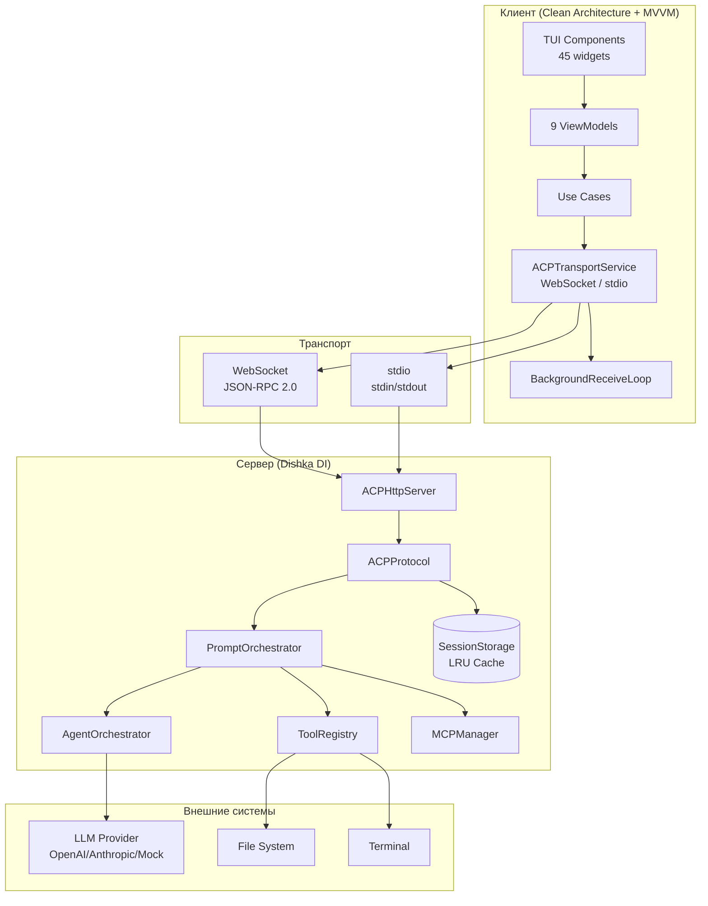

## Компоненты системы

### Клиент (Client)

Клиент реализует **Clean Architecture** с 5 слоями и **MVVM паттерн** для реактивного UI:

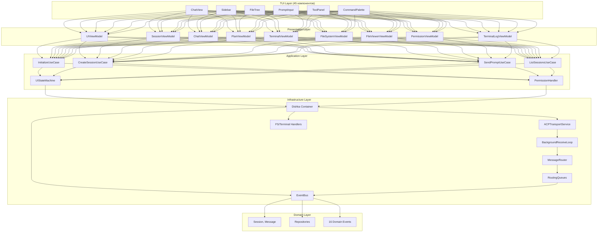

**Слои клиента:**
- **TUI Layer** — 45 Textual компонентов (ChatView, Sidebar, FileTree, CommandPalette, и др.)
- **Presentation** — 9 ViewModels с Observable состоянием (MVVM)
- **Application** — 5 Use Cases, UIStateMachine, PermissionHandler
- **Infrastructure** — Dishka DI, ACPTransportService, BackgroundReceiveLoop, MessageRouter, EventBus
- **Domain** — Session, Message, Permission, ToolCall, Repository интерфейсы, 16 Domain Events

### Сервер (Server)

Сервер использует **Dishka DI контейнер** с двумя скоупами и **Pipeline систему** для обработки промптов:

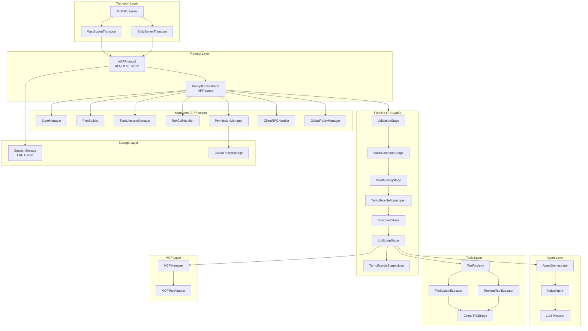

**Скоупы DI контейнера:**
- **APP scope** — синглтоны на всё время жизни сервера (LLM, ToolRegistry, менеджеры, pipeline)
- **REQUEST scope** — на одно WebSocket соединение (ClientRPCService, ACPProtocol)

**Менеджеры:**
| Менеджер | Ответственность |
|----------|-----------------|
| `StateManager` | Управление состоянием сессии |
| `PlanBuilder` | Построение планов выполнения |
| `TurnLifecycleManager` | Жизненный цикл prompt-turn |
| `ToolCallHandler` | Обработка tool calls |
| `PermissionManager` | Управление разрешениями |
| `ClientRPCHandler` | Обработка agent→client RPC |
| `GlobalPolicyManager` | Глобальные политики разрешений |

**Pipeline стадии:**
1. `ValidationStage` — валидация входных данных
2. `SlashCommandStage` — обработка `/help`, `/mode`, `/status`
3. `PlanBuildingStage` — построение плана
4. `TurnLifecycleStage(open)` — открытие turn
5. `DirectivesStage` — обработка директив промпта
6. `LLMLoopStage` — основной цикл LLM с tool calls
7. `TurnLifecycleStage(close)` — закрытие turn

## Background Receive Loop (Клиент)

Для избежания race condition при конкурентном доступе к WebSocket, клиент использует единый фоновый цикл получения сообщений:

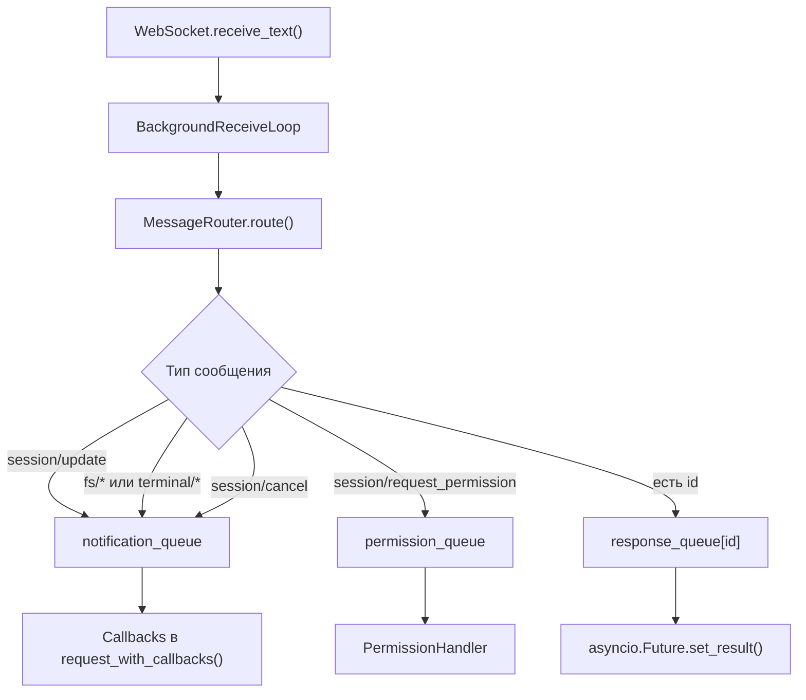

**Ключевые особенности:**
- **Единственный receive()** — избегает RuntimeError при конкурентном доступе
- **Три типа очередей:** response (per-request), notification (shared), permission (shared)
- **Graceful shutdown** — await stop() с 5-секундным таймаутом
- **Broadcast ошибок** — при разрыве соединения все ожидающие очереди получают уведомление

## Двухуровневая история

На сервере существует **двухуровневая система истории**:

| Аспект | SessionState.history | events_history |
|--------|----------------------|-----------------|
| **Содержание** | Message objects (user/assistant) | Structured events (started, added, completed) |
| **Использование** | Передача LLM для контекста | Восстановление state при session/load |
| **Обновление** | Централизованно в PromptOrchestrator | Через TurnLifecycleManager |
| **Размер** | Компактный (только сообщения) | Расширенный (все события) |

**ReplayManager** использует `events_history` для полного восстановления состояния сессии при `session/load`.

## MCP интеграция

Модуль `server/mcp/` обеспечивает подключение внешних MCP-серверов:

| Компонент | Описание |
|-----------|----------|
| `MCPClient` | Клиент для одного MCP-сервера с state machine |
| `MCPManager` | Управление несколькими MCP-серверами на сессию |
| `MCPToolAdapter` | Адаптация MCP инструментов к ACP ToolDefinition |
| `StdioTransport` | Запуск MCP-серверов через stdio subprocess |

**Именование MCP инструментов:** `mcp:server_id:tool_name` (namespace для избежания конфликтов)

## Маппинг имён инструментов

ACP протокол использует имена с `/` (например `fs/read_text_file`), но некоторые LLM провайдеры не поддерживают этот символ. Модуль `tools/mapping.py` обеспечивает двустороннюю конвертацию:

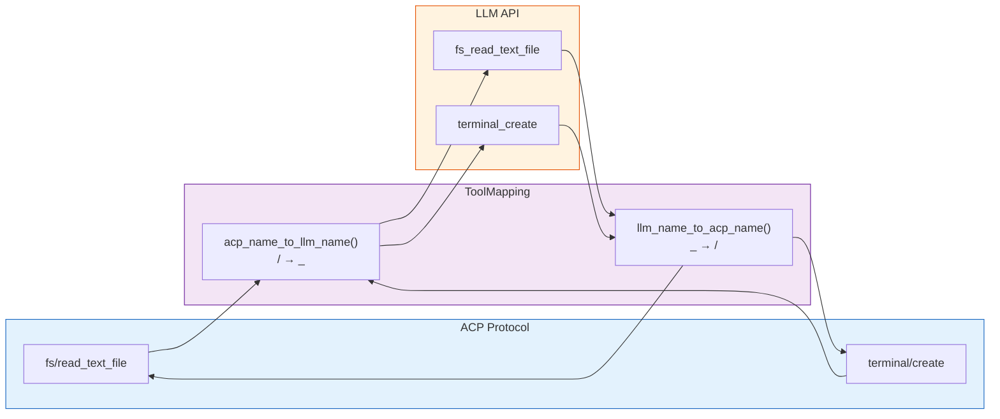

**Применение:**
- При отправке инструментов в LLM: `acp_name_to_llm_name()`
- При получении tool calls от LLM: `llm_name_to_acp_name()`

## Протокол ACP

Взаимодействие происходит через JSON-RPC 2.0:

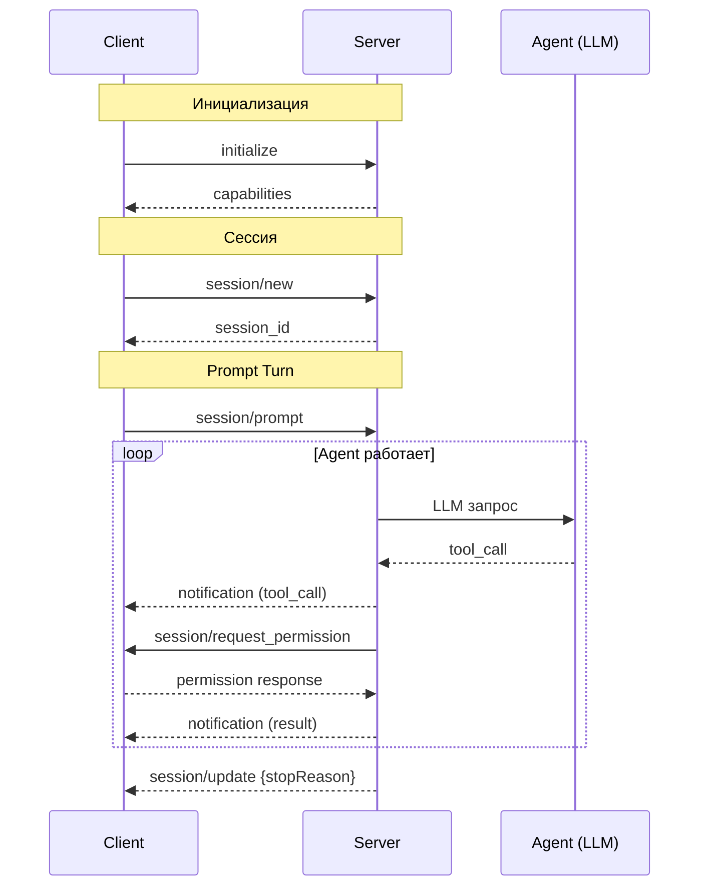

**Методы протокола:**
| Метод | Направление | Описание |
|-------|-------------|----------|
| `initialize` | C→S | Инициализация, обмен capabilities |
| `authenticate` | C→S | Аутентификация (API key) |
| `session/new` | C→S | Создание новой сессии |
| `session/load` | C→S | Загрузка существующей сессии |
| `session/list` | C→S | Список сессий |
| `session/prompt` | C→S | Отправка промпта |
| `session/cancel` | C→S | Отмена текущего промпта |
| `session/update` | S→C | Уведомление о ходе выполнения |
| `session/request_permission` | S→C | Запрос разрешения |
| `session/request_permission_response` | C→S | Ответ на запрос разрешения |
| `session/set_config_option` | C→S | Установка опции конфигурации |
| `session/set_mode` | C→S | Установка режима сессии |

## Агент и LLM

### Цикл обработки prompt

Полный путь запроса от пользователя до ответа LLM:

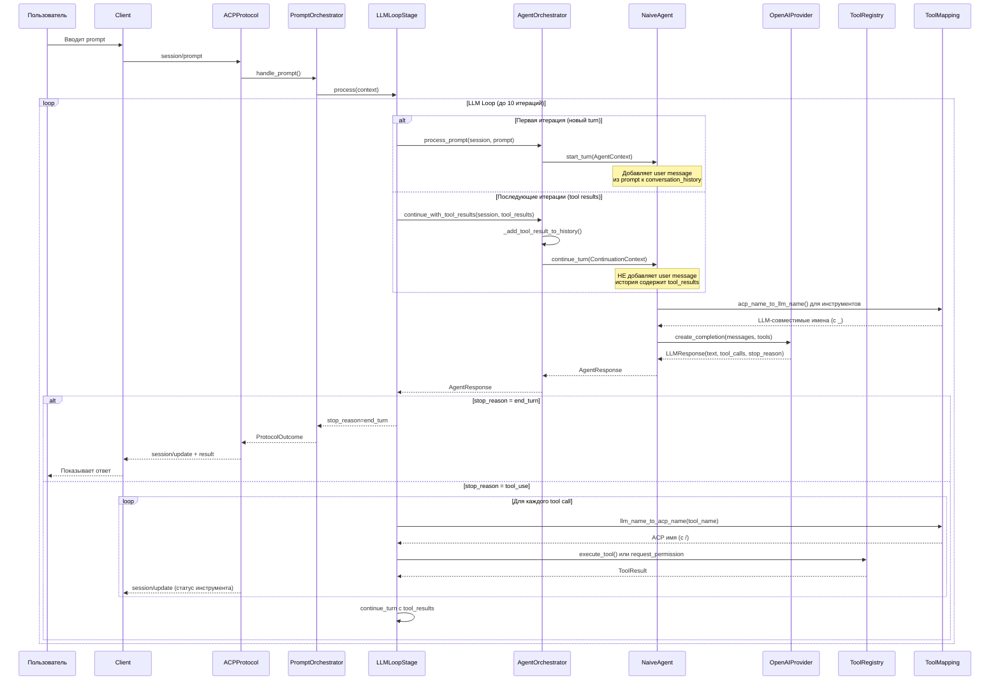

### LLM Loop — алгоритм

```mermaid
flowchart TD
    START([session/prompt]) --> HIST[Подготовить историю сообщений]
    HIST --> TOOLS[Получить список инструментов]
    TOOLS --> MAP1[acp_name_to_llm_name()\n/ → _]
    MAP1 --> CANCEL{Отмена\nзапрошена?}
    CANCEL -->|Да| CANCELLED([stop_reason = cancelled])
    CANCEL -->|Нет| LLM[Вызов LLM API]
    LLM --> PARSE[Разобрать ответ]
    PARSE --> HAS_TOOLS{Есть\ntool calls?}

    HAS_TOOLS -->|Нет| END_TURN([stop_reason = end_turn])

    HAS_TOOLS -->|Да| FOREACH[Для каждого tool call]
    FOREACH --> MAP2[llm_name_to_acp_name()\n_ → /]
    MAP2 --> POLICY{Политика}
    POLICY -->|allow| EXEC[Выполнить инструмент]
    POLICY -->|ask| PERM([Запросить разрешение\nПайплайн приостановлен])
    POLICY -->|reject| FAIL[Пометить failed]

    EXEC --> RESULT[ToolResult]
    FAIL --> RESULT
    RESULT --> MORE{Ещё\ntool calls?}
    MORE -->|Да| FOREACH
    MORE -->|Нет| MAXITER{Макс.\nитераций?}
    MAXITER -->|Да| MAX([stop_reason = max_turn_requests])
    MAXITER -->|Нет| CANCEL
```

### Отмена prompt

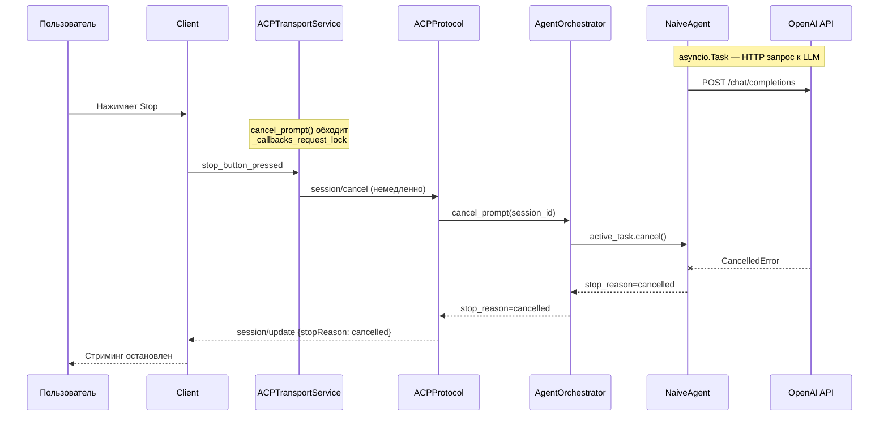

## Маппинг имён инструментов

ACP протокол использует имена с `/` (например `fs/read_text_file`), но некоторые LLM провайдеры не поддерживают этот символ. Модуль `tools/mapping.py` обеспечивает двустороннюю конвертацию:


**Применение:**
- При отправке инструментов в LLM: `acp_name_to_llm_name()`
- При получении tool calls от LLM: `llm_name_to_acp_name()`

## Потоки данных

### Prompt Turn

Цикл обработки пользовательского запроса:

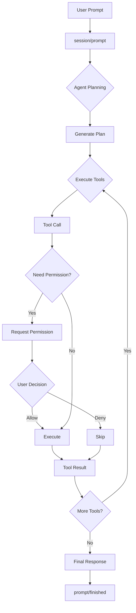

### Система разрешений

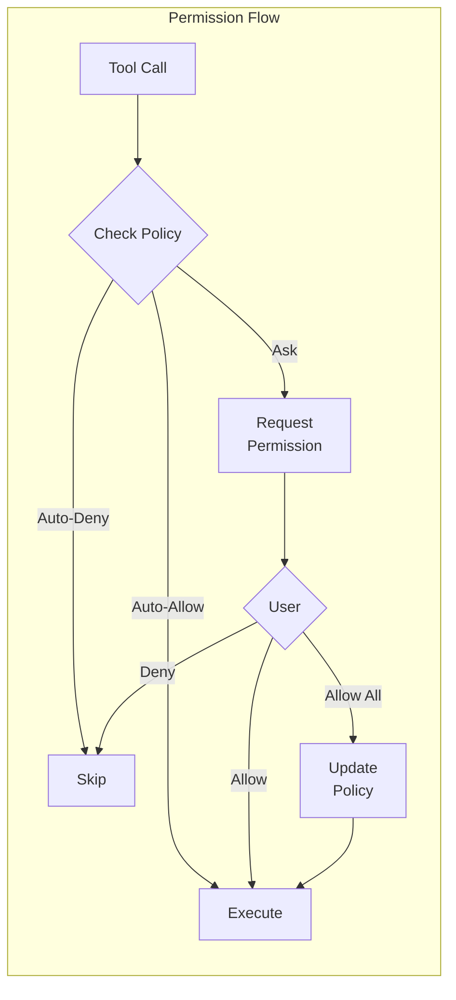

## Хранение данных

### Структура сессий

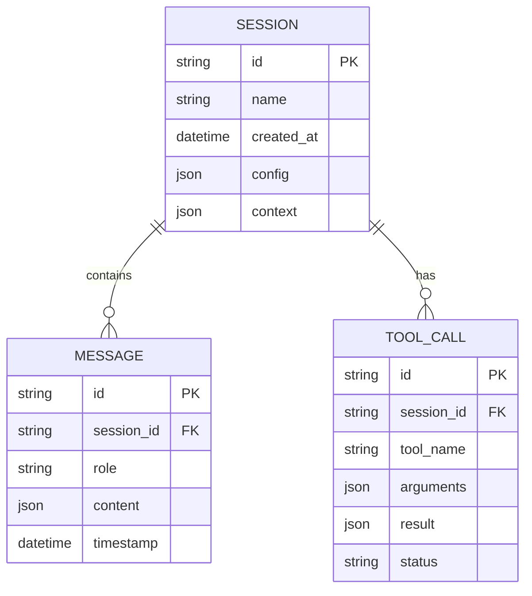

## Директории проекта

```
codelab/src/codelab/
├── shared/              # Общие модули
│   ├── messages.py      # JSON-RPC сообщения
│   ├── logging.py       # Структурированное логирование
│   └── content/         # Типы контента ACP
│
├── server/              # Серверная часть
│   ├── di.py            # Dishka DI контейнер
│   ├── config.py        # Pydantic конфигурация
│   ├── http_server.py   # HTTP/WebSocket сервер
│   ├── web_app.py       # Web UI (textual-web)
│   ├── rpc_holder.py    # ClientRPCServiceHolder
│   ├── protocol/        # ACP протокол
│   │   ├── core.py      # ACPProtocol (dispatcher)
│   │   ├── state.py     # SessionState, ToolCallState
│   │   ├── handlers/    # Обработчики методов
│   │   │   ├── auth.py
│   │   │   ├── session.py
│   │   │   ├── prompt.py
│   │   │   ├── permissions.py
│   │   │   ├── config.py
│   │   │   ├── prompt_orchestrator.py  # Главный координатор
│   │   │   ├── pipeline/               # 7 стадий pipeline
│   │   │   ├── slash_commands/         # /help, /mode, /status
│   │   │   └── ... (менеджеры)
│   │   └── content/     # Extractor, Validator, Formatter
│   ├── agent/           # LLM агент (NaiveAgent, Orchestrator)
│   ├── tools/           # Инструменты (registry, executors)
│   ├── storage/         # Хранилище сессий (LRU cache)
│   ├── mcp/             # MCP интеграция
│   ├── client_rpc/      # Agent→Client RPC
│   ├── llm/             # LLM провайдеры (OpenAI, Mock)
│   └── transport/       # WebSocket, stdio
│
└── client/              # Клиентская часть
    ├── domain/          # Domain Layer (entities, repos)
    ├── application/     # Application Layer (use cases)
    ├── infrastructure/  # Infrastructure Layer (DI, transport)
    │   ├── services/    # ACPTransportService, BackgroundReceiveLoop
    │   ├── handlers/    # FS, Terminal handlers
    │   └── events/      # EventBus
    ├── presentation/    # ViewModels (MVVM, 9 штук)
    └── tui/             # TUI компоненты (45 файлов)
        ├── app.py       # ACPClientApp
        ├── components/  # ChatView, Sidebar, FileTree, ...
        ├── navigation/  # NavigationManager
        └── themes/      # Dark/Light themes
```

## См. также

- [Введение](01-introduction.md) — общая информация о CodeLab
- [Сценарии использования](03-use-cases.md) — примеры применения
- [Спецификация ACP](../../Agent%20Client%20Protocol/protocol/01-Overview.md) — детали протокола
