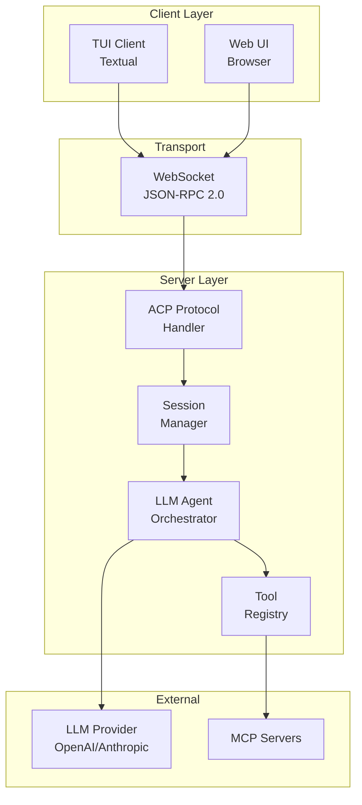
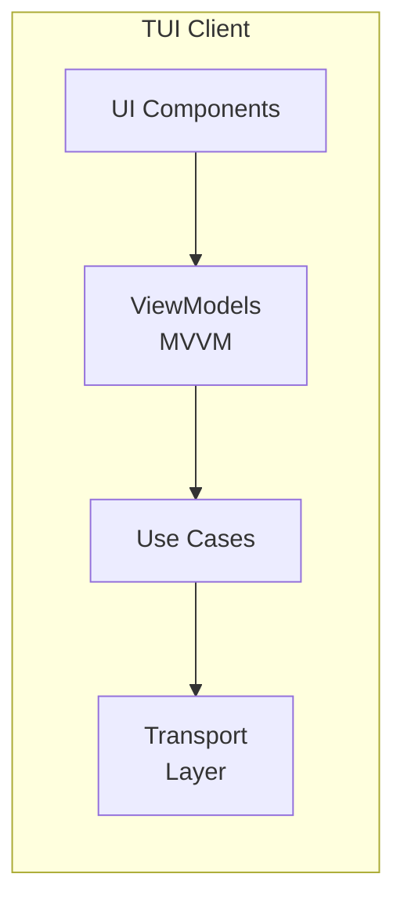
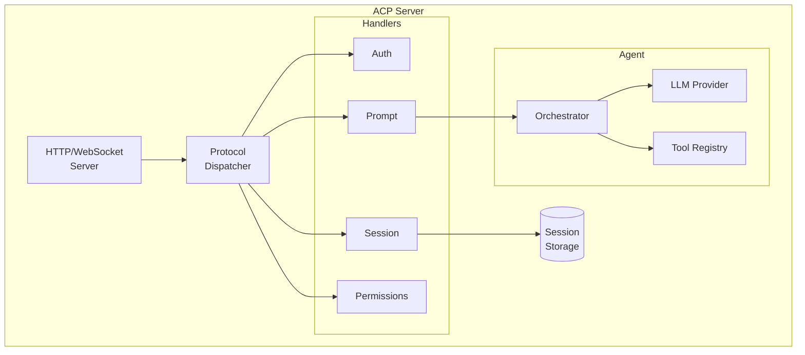
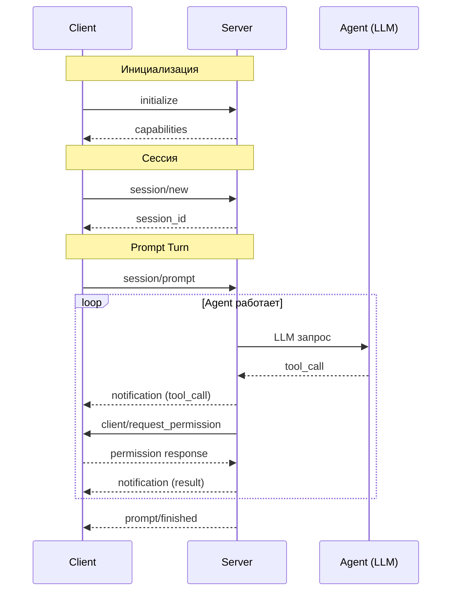
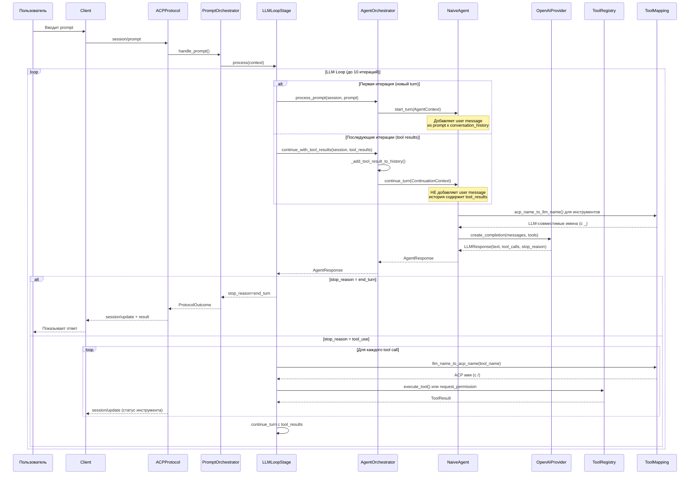
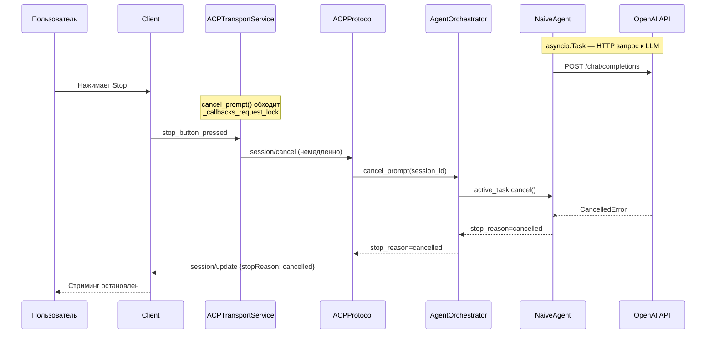
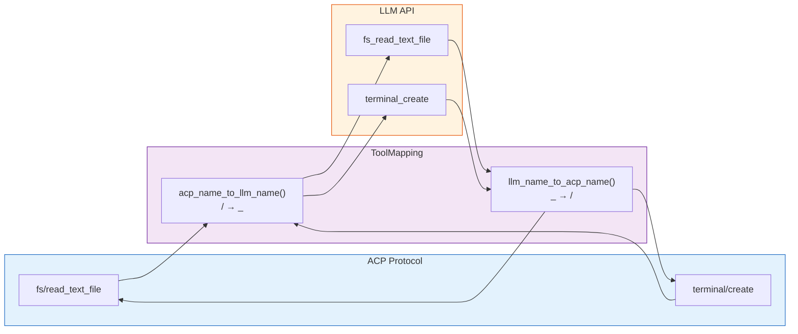
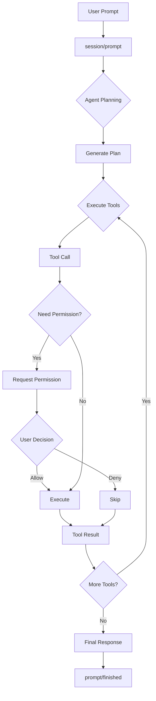
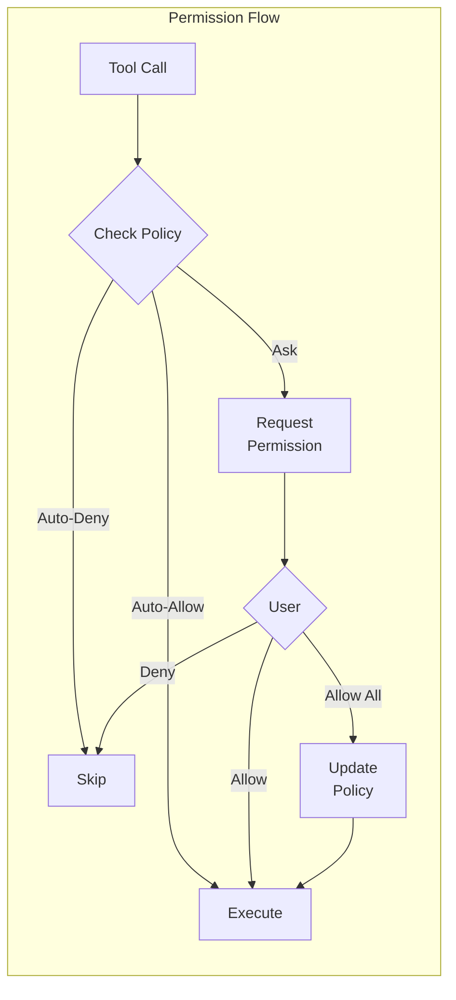
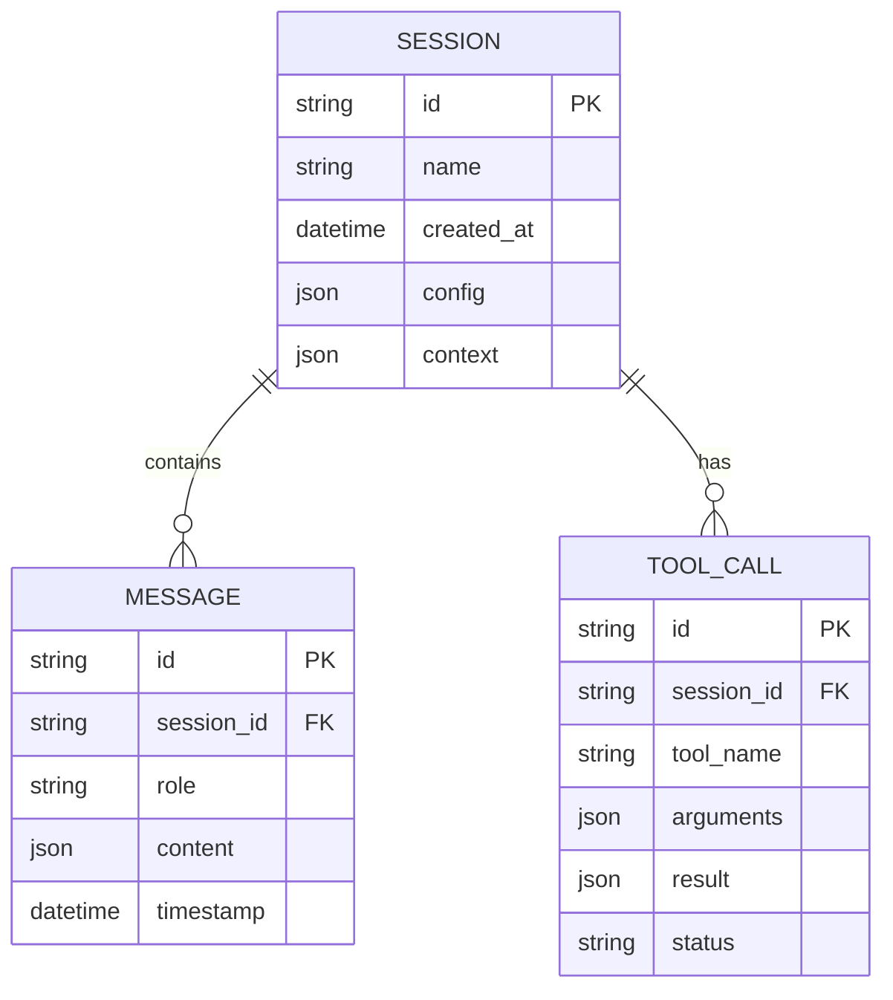

# Архитектура CodeLab

> Обзор архитектуры системы и взаимодействия компонентов.

## Общая архитектура

CodeLab реализует клиент-серверную архитектуру, определённую [Agent Client Protocol (ACP)](../../Agent%20Client%20Protocol/get-started/02-Architecture.md).



## Компоненты системы

### Клиент (Client)

Клиент предоставляет пользовательский интерфейс и обрабатывает запросы сервера:



**Слои клиента (Clean Architecture):**
- **Presentation** — UI компоненты (Textual widgets)
- **ViewModels** — логика представления (MVVM паттерн)
- **Application** — use cases, state machine
- **Infrastructure** — транспорт, DI, handlers

### Сервер (Server)

Сервер содержит AI-агента и обрабатывает протокол ACP:



## Протокол ACP

Взаимодействие происходит через JSON-RPC 2.0:



## Агент и LLM

### Цикл обработки prompt

Полный путь запроса от пользователя до ответа LLM:



### LLM Loop — алгоритм

```mermaid
flowchart TD
    START([session/prompt]) --> HIST[Подготовить историю сообщений]
    HIST --> TOOLS[Получить список инструментов]
    TOOLS --> MAP1[acp_name_to_llm_name()\n/ → _]
    MAP1 --> CANCEL{Отмена\nзапрошена?}
    CANCEL -->|Да| CANCELLED([stop_reason = cancelled])
    CANCEL -->|Нет| LLM[Вызов LLM API]
    LLM --> PARSE[Разобрать ответ]
    PARSE --> HAS_TOOLS{Есть\ntool calls?}

    HAS_TOOLS -->|Нет| END_TURN([stop_reason = end_turn])

    HAS_TOOLS -->|Да| FOREACH[Для каждого tool call]
    FOREACH --> MAP2[llm_name_to_acp_name()\n_ → /]
    MAP2 --> POLICY{Политика}
    POLICY -->|allow| EXEC[Выполнить инструмент]
    POLICY -->|ask| PERM([Запросить разрешение\nПайплайн приостановлен])
    POLICY -->|reject| FAIL[Пометить failed]

    EXEC --> RESULT[ToolResult]
    FAIL --> RESULT
    RESULT --> MORE{Ещё\ntool calls?}
    MORE -->|Да| FOREACH
    MORE -->|Нет| MAXITER{Макс.\nитераций?}
    MAXITER -->|Да| MAX([stop_reason = max_turn_requests])
    MAXITER -->|Нет| CANCEL
```

### Отмена prompt



## Маппинг имён инструментов

ACP протокол использует имена с `/` (например `fs/read_text_file`), но некоторые LLM провайдеры не поддерживают этот символ. Модуль `tools/mapping.py` обеспечивает двустороннюю конвертацию:



**Применение:**
- При отправке инструментов в LLM: `acp_name_to_llm_name()`
- При получении tool calls от LLM: `llm_name_to_acp_name()`

## Потоки данных

### Prompt Turn

Цикл обработки пользовательского запроса:



### Система разрешений



## Хранение данных

### Структура сессий



## Директории проекта

```
codelab/src/codelab/
├── shared/              # Общие модули
│   ├── messages.py      # JSON-RPC сообщения
│   ├── logging.py       # Структурированное логирование
│   └── content/         # Типы контента ACP
│
├── server/              # Серверная часть
│   ├── protocol/        # ACP протокол
│   ├── agent/           # LLM агент
│   ├── tools/           # Инструменты
│   ├── storage/         # Хранилище сессий
│   └── mcp/             # MCP интеграция
│
└── client/              # Клиентская часть
    ├── domain/          # Domain Layer
    ├── application/     # Application Layer
    ├── infrastructure/  # Infrastructure Layer
    ├── presentation/    # ViewModels (MVVM)
    └── tui/             # TUI компоненты
```

## См. также

- [Введение](01-introduction.md) — общая информация о CodeLab
- [Сценарии использования](03-use-cases.md) — примеры применения
- [Спецификация ACP](../../Agent%20Client%20Protocol/protocol/01-Overview.md) — детали протокола
