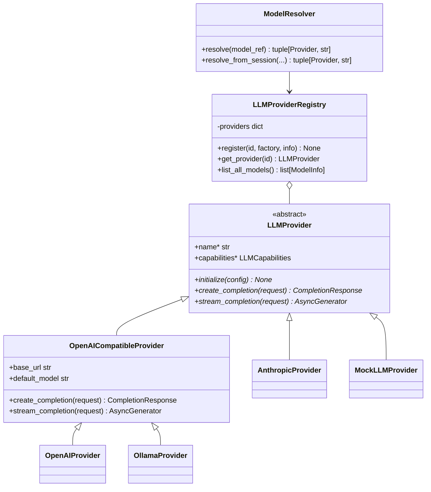
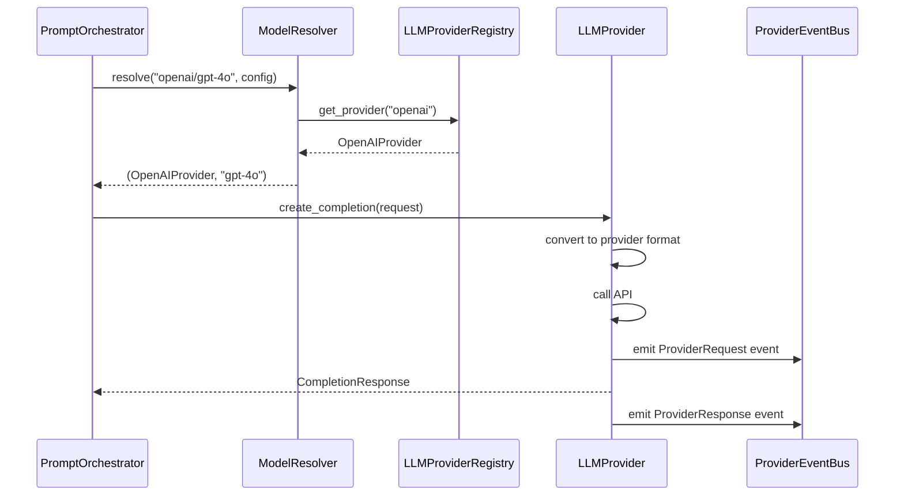
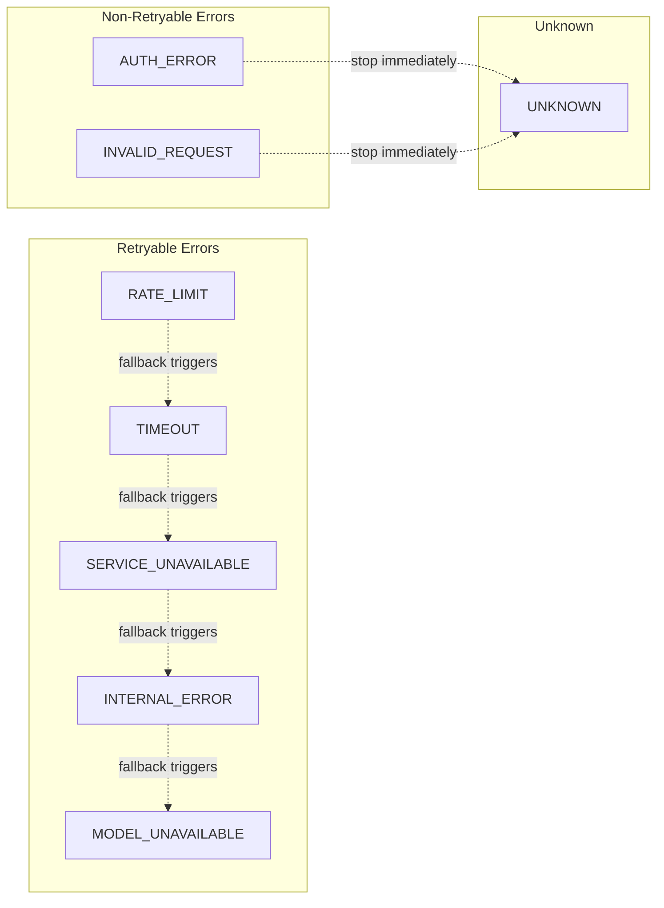
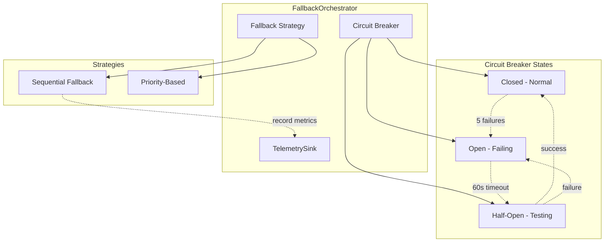

# LLM Reference

Справочная информация по LLM подсистеме CodeLab.

## Архитектура компонентов



## LLMProvider Interface

```python
class LLMProvider(ABC):
    @property
    def name(self) -> str: ...

    @property
    def capabilities(self) -> LLMCapabilities: ...

    async def initialize(self, config: LLMConfig) -> None: ...

    async def create_completion(self, request: CompletionRequest) -> CompletionResponse: ...

    async def stream_completion(self, request: CompletionRequest) -> AsyncGenerator[CompletionResponse, None]: ...
```

### Методы

| Метод | Описание |
|-------|----------|
| `name` | Уникальный ID провайдера (например, `"openai"`) |
| `capabilities` | Возможности провайдера |
| `initialize(config)` | Инициализация с конфигурацией |
| `create_completion(request)` | Выполнить completion запрос |
| `stream_completion(request)` | Выполнить streaming completion |

## LLMCapabilities

```python
@dataclass
class LLMCapabilities:
    supports_tools: bool = True
    supports_streaming: bool = True
    supports_function_calling: bool = True
    supports_vision: bool = False
    supports_system_prompt: bool = True
```

### Capabilities Matrix

| Провайдер | Tools | Streaming | Function Calling | Vision | System Prompt |
|-----------|-------|-----------|------------------|--------|---------------|
| OpenAI (gpt-4o) | ✅ | ✅ | ✅ | ✅ | ✅ |
| OpenAI (o3) | ✅ | ✅ | ✅ | ❌ | ✅ |
| Anthropic (Claude) | ✅ | ✅ | ✅ | ✅ | ✅ |
| OpenRouter | ✅ | ✅ | ✅ | ⚠️ | ✅ |
| Zen | ✅ | ✅ | ✅ | ❌ | ✅ |
| Go | ✅ | ✅ | ✅ | ❌ | ✅ |
| Ollama | ✅ | ✅ | ⚠️ | ⚠️ | ✅ |
| LMStudio | ✅ | ✅ | ⚠️ | ⚠️ | ✅ |
| Mock | ✅ | ✅ | ✅ | ❌ | ✅ |

## CompletionRequest

### Completion Lifecycle



```python
@dataclass
class CompletionRequest:
    model: str
    messages: list[LLMMessage]
    tools: list[dict[str, Any]] | None = None
    temperature: float = 0.7
    max_tokens: int = 8192
    stop: list[str] | None = None
    stream: bool = False
    extra: dict[str, Any] = field(default_factory=dict)
```

## CompletionResponse

```python
@dataclass
class CompletionResponse:
    text: str
    tool_calls: list[LLMToolCall] = field(default_factory=list)
    stop_reason: StopReason = StopReason.END_TURN
    model: str | None = None
    usage: dict[str, Any] = field(default_factory=dict)
    extra: dict[str, Any] = field(default_factory=dict)
```

## StopReason

```python
class StopReason(str, Enum):
    END_TURN = "end_turn"          # Модель завершила ответ
    TOOL_USE = "tool_use"          # Модель хочет вызвать инструмент
    MAX_TOKENS = "max_tokens"      # Достигнут лимит токенов
    STOP_SEQUENCE = "stop_sequence" # Встречена stop-последовательность
    ERROR = "error"                # Ошибка при генерации
    CANCELLED = "cancelled"        # Запрос отменён пользователем
    STREAMING = "streaming"        # Промежуточный chunk (только streaming)
    REFUSAL = "refusal"            # Модель отказалась отвечать
```

## LLMMessage

```python
@dataclass
class LLMMessage:
    role: str                      # "system", "user", "assistant", "tool"
    content: str | None = None
    tool_calls: list[LLMToolCall] | None = None
    tool_call_id: str | None = None
    name: str | None = None
```

## LLMToolCall

```python
@dataclass
class LLMToolCall:
    id: str
    name: str
    arguments: dict[str, Any] = field(default_factory=dict)
```

## ProviderErrorType

### Error Classification



```python
class ProviderErrorType(str, Enum):
    RATE_LIMIT = "rate_limit"           # Retryable
    TIMEOUT = "timeout"                 # Retryable
    AUTH_ERROR = "auth_error"           # Non-retryable
    INVALID_REQUEST = "invalid_request" # Non-retryable
    SERVICE_UNAVAILABLE = "service_unavailable"  # Retryable
    INTERNAL_ERROR = "internal_error"   # Retryable
    MODEL_UNAVAILABLE = "model_unavailable"      # Retryable
    UNKNOWN = "unknown"
```

## ProviderError

```python
class ProviderError(Exception):
    message: str
    error_type: ProviderErrorType
    provider_id: str | None = None
    retryable: bool  # Вычисляется из error_type
```

## AllProvidersFailed

```python
class AllProvidersFailed(Exception):
    errors: list[ProviderError]  # Все ошибки от провайдеров
    message: str
```

## ProviderEventBus

### События

| Событие | Атрибуты | Описание |
|---------|----------|----------|
| `ProviderInitialized` | `provider_id`, `model`, `base_url` | Провайдер успешно инициализирован |
| `ProviderFailed` | `provider_id`, `error`, `error_type` | Ошибка инициализации |
| `ModelsUpdated` | `provider_id`, `models` | Список моделей обновлён |
| `FallbackTriggered` | `from_provider`, `to_provider`, `error` | Активирован fallback |

### Использование

```python
from codelab.server.llm.events import event_bus, ProviderInitialized

async def on_provider_init(event: ProviderInitialized) -> None:
    print(f"Provider {event.provider_id} initialized with model {event.model}")

event_bus.subscribe(ProviderInitialized, on_provider_init)
```

## ModelInfo

```python
@dataclass
class ModelInfo:
    id: str                        # "gpt-4o"
    provider_id: str               # "openai"
    name: str | None = None        # "GPT-4o"
    description: str | None = None
    context_window: int | None = None
    max_output_tokens: int | None = None
    supports_tools: bool = True
    supports_streaming: bool = True
    cost_per_input_token: float | None = None
    cost_per_output_token: float | None = None

    @property
    def full_id(self) -> str:      # "openai/gpt-4o"
```

## ProviderInfo

```python
@dataclass
class ProviderInfo:
    id: str                        # "openai"
    name: str                      # "OpenAI"
    description: str | None = None
    base_url: str | None = None
    models: list[ModelInfo] = field(default_factory=list)
```

## LLMProviderRegistry

```python
class LLMProviderRegistry:
    def register(provider_id: str, factory: ProviderFactory, info: ProviderInfo | None = None) -> None: ...
    async def get_provider(provider_id: str) -> LLMProvider: ...
    async def create_provider(provider_id: str, config: LLMConfig) -> LLMProvider: ...
    def list_all_models() -> list[ModelInfo]: ...
    def get_provider_info(provider_id: str) -> ProviderInfo: ...
    def get_model_info(provider_id: str, model_id: str) -> ModelInfo: ...
```

## ModelResolver

```python
class ModelResolver:
    async def resolve(model_ref: str | ModelRef, config: LLMConfig | None = None) -> tuple[LLMProvider, str]: ...
    async def resolve_from_session(session_provider: str, session_model: str, config: LLMConfig | None = None) -> tuple[LLMProvider, str]: ...
```

### ModelRef

```python
@dataclass
class ModelRef:
    provider_id: str    # "openai"
    model_id: str       # "gpt-4o"

    @classmethod
    def parse(cls, value: str) -> ModelRef: ...  # "openai/gpt-4o" → ModelRef
    def is_fully_qualified(self) -> bool: ...
    def __str__(self) -> str: ...  # "openai/gpt-4o"
```

## FallbackConfig

### Fallback Architecture



```python
@dataclass
class FallbackConfig:
    enabled: bool = False
    strategy: str = "sequential"
    order: list[str] = field(default_factory=list)
    max_attempts: int = 3
    retry_on: list[str] = field(default_factory=lambda: ["rate_limit", "timeout"])
```

## CircuitBreaker

```python
class CircuitBreaker:
    def __init__(
        self,
        failure_threshold: int = 5,
        reset_timeout: int = 60,
        half_open_max_calls: int = 1,
    ): ...

    def is_circuit_open(self, provider_id: str) -> bool: ...
    def record_success(self, provider_id: str) -> None: ...
    def record_failure(self, provider_id: str, error: ProviderError) -> None: ...
```

## TelemetrySink

```python
class TelemetrySink(ABC):
    async def record_request(self, provider: str, model: str, latency_ms: float, success: bool) -> None: ...
    async def record_cost(self, provider: str, model: str, cost_usd: float) -> None: ...
```

### NoOpTelemetry (default)

```python
class NoOpTelemetry(TelemetrySink):
    # Silent pass-through — все методы no-op
```

## ModelDiscovery

```python
class ModelDiscovery(ABC):
    async def discover_models(self, provider_id: str) -> list[ModelInfo]: ...
```

### StaticDiscovery (default)

```python
class StaticDiscovery(ModelDiscovery):
    def __init__(self, models: list[ModelInfo]): ...
    # Возвращает статический список моделей
```
