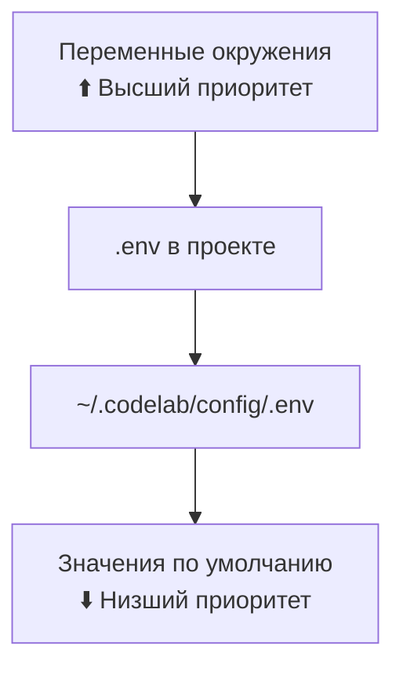

# Конфигурация

> Детальное руководство по настройке CodeLab.

## Обзор

CodeLab использует иерархическую систему конфигурации с приоритетами:



## Глобальная конфигурация

Файл `~/.codelab/config/.env` создается автоматически при первом запуске:

```bash
# CodeLab Configuration
# =====================

# === LLM Провайдер ===
CODELAB_LLM_PROVIDER=mock
# CODELAB_LLM_API_KEY=sk-your-key-here
# CODELAB_LLM_BASE_URL=https://api.openai.com/v1
CODELAB_LLM_MODEL=gpt-4o
CODELAB_LLM_TEMPERATURE=0.7
CODELAB_LLM_MAX_TOKENS=8192

# === Сервер ===
CODELAB_PORT=8765
CODELAB_HOST=127.0.0.1

# === Логирование ===
CODELAB_LOG_LEVEL=INFO
```

## Конфигурация проекта

Создайте `.env` в корне проекта для переопределения глобальных настроек:

```bash
# Проектная конфигурация
CODELAB_LLM_MODEL=gpt-4o-mini
CODELAB_LLM_TEMPERATURE=0.3
```

## Параметры конфигурации

### LLM провайдер

#### CODELAB_LLM_PROVIDER

Тип LLM провайдера:

| Значение | Описание |
|----------|----------|
| `openai` | OpenAI API (GPT-4, GPT-3.5) |
| `anthropic` | Anthropic API (Claude) |
| `openrouter` | OpenRouter (множество моделей) |
| `zen` | Zen API |
| `go` | Go API |
| `ollama` | Локальные модели через Ollama |
| `lmstudio` | Локальные модели через LMStudio |
| `mock` | Тестовый провайдер (без API) |

#### CODELAB_LLM_MODEL

Модель LLM в формате `"provider/model"`:

| Провайдер | Модели |
|-----------|--------|
| OpenAI | `openai/gpt-4o`, `openai/o3`, `openai/o4-mini` |
| Anthropic | `anthropic/claude-sonnet-4`, `anthropic/claude-opus-4` |
| OpenRouter | `openrouter/mistral-large`, `openrouter/llama-3.1` |
| Zen | `zen/zen-sonnet` |
| Go | `go/go-fast` |
| Ollama | `ollama/llama3.1:70b`, `ollama/mistral` |
| LMStudio | `lmstudio/local-model` |
| Mock | `mock/mock-model` |

#### CODELAB_LLM_BASE_URL

Custom endpoint для OpenAI-совместимых API:

```bash
# Azure OpenAI
CODELAB_LLM_BASE_URL=https://your-resource.openai.azure.com

# Local LLM (Ollama, LM Studio)
CODELAB_LLM_BASE_URL=http://localhost:11434/v1
```

#### CODELAB_LLM_TEMPERATURE

Креативность ответов (0.0-1.0):

| Значение | Использование |
|----------|---------------|
| 0.0-0.3 | Точные ответы, код |
| 0.4-0.7 | Сбалансированно |
| 0.8-1.0 | Креативные задачи |

#### CODELAB_LLM_MAX_TOKENS

Максимальная длина ответа в токенах:

```bash
CODELAB_LLM_MAX_TOKENS=8192  # По умолчанию
CODELAB_LLM_MAX_TOKENS=16384 # Для длинных ответов
```

### Сервер

#### CODELAB_HOST

Адрес привязки сервера:

| Значение | Описание |
|----------|----------|
| `127.0.0.1` | Только локальный доступ (безопасно) |
| `0.0.0.0` | Все интерфейсы (для удаленного доступа) |

#### CODELAB_PORT

Порт WebSocket сервера:

```bash
CODELAB_PORT=8765  # По умолчанию
```

### Логирование

#### CODELAB_LOG_LEVEL

Уровень детализации логов:

| Значение | Описание |
|----------|----------|
| `DEBUG` | Всё, включая JSON-RPC сообщения |
| `INFO` | Основные события (по умолчанию) |
| `WARNING` | Только предупреждения и ошибки |
| `ERROR` | Только ошибки |

### Директория данных

#### CODELAB_HOME

Путь к домашней директории CodeLab:

```bash
CODELAB_HOME=~/.codelab  # По умолчанию
CODELAB_HOME=/data/codelab  # Кастомный путь
```

## Конфигурация клиента

### TUI конфигурация

В файле `~/.codelab/config/tui.toml`:

```toml
[connection]
default_host = "127.0.0.1"
default_port = 8765
auto_reconnect = true
reconnect_delay = 3

[ui]
theme = "dark"
show_line_numbers = true
word_wrap = true

[history]
max_sessions = 100
max_messages_per_session = 1000
```

## Примеры конфигураций

### Разработка (Development)

```bash
# ~/.codelab/config/.env
CODELAB_LLM_PROVIDER=mock
CODELAB_LOG_LEVEL=DEBUG
CODELAB_PORT=8765
```

### Production с OpenAI

```bash
# ~/.codelab/config/.env
CODELAB_LLM_PROVIDER=openai
CODELAB_LLM_API_KEY=sk-...
CODELAB_LLM_MODEL=gpt-4o
CODELAB_LLM_TEMPERATURE=0.5
CODELAB_LOG_LEVEL=INFO
```

### Local LLM (Ollama)

```bash
# ~/.codelab/config/.env
CODELAB_LLM_PROVIDER=openai
CODELAB_LLM_BASE_URL=http://localhost:11434/v1
CODELAB_LLM_MODEL=codellama:latest
CODELAB_LLM_API_KEY=ollama
```

### Серверное развертывание

```bash
# /etc/codelab/.env
CODELAB_LLM_PROVIDER=openai
CODELAB_LLM_API_KEY=sk-...
CODELAB_HOST=0.0.0.0
CODELAB_PORT=443
CODELAB_LOG_LEVEL=WARNING
CODELAB_HOME=/var/lib/codelab
```

## Безопасность

### Защита API ключей

```bash
# НЕ коммитьте .env файлы!
echo ".env" >> .gitignore

# Используйте переменные окружения в CI/CD
export CODELAB_LLM_API_KEY=$SECRET_KEY
```

### Права доступа

```bash
# Ограничьте доступ к конфигурации
chmod 600 ~/.codelab/config/.env
```

## Проверка конфигурации

Для проверки текущей конфигурации просмотрите файлы:

```bash
# Глобальная конфигурация
cat ~/.codelab/config/.env

# Локальная конфигурация
cat .env
```

Или проверьте через переменные окружения:
```bash
env | grep CODELAB_
```

## Миграция конфигурации

При обновлении CodeLab:

1. Создайте резервную копию `~/.codelab/config/`
2. Обновите CodeLab
3. Проверьте новые параметры в документации
4. Добавьте новые параметры при необходимости

## TOML конфигурация

Помимо `.env` файлов, CodeLab поддерживает конфигурацию через TOML-файлы. TOML обеспечивает более структурированную настройку с поддержкой вложенных конфигураций, per-model параметров и fallback цепочек.

### Файлы TOML

| Файл | Назначение | Приоритет |
|------|------------|-----------|
| `~/.codelab/auth.toml` | Глобальные API keys | Низший |
| `codelab.toml` | Конфигурация проекта | Средний |
| `codelab.local.toml` | Локальные overrides | Высокий |

### Пример codelab.toml

```toml
[llm]
provider = "openai"
model = "openai/gpt-4o"
temperature = 0.7

[llm.providers.openai]
api_key = "${OPENAI_API_KEY}"

[llm.fallback]
enabled = true
order = ["openai", "openrouter", "ollama"]
```

> **Подробное руководство:** [TOML конфигурация](13-toml-configuration.md)

## MCP серверы

CodeLab поддерживает подключение MCP (Model Context Protocol) серверов для расширения возможностей агента. MCP серверы предоставляют дополнительные инструменты, ресурсы и промпты.

### Конфигурация в TOML

MCP серверы настраиваются в `codelab.toml`:

```toml
[[mcp.servers]]
name = "filesystem"
type = "stdio"
command = "npx"
args = ["-y", "@modelcontextprotocol/server-filesystem", "/project"]

[[mcp.servers]]
name = "playwright"
type = "stdio"
command = "npx"
args = ["@anthropic/mcp-playwright"]

[[mcp.servers]]
name = "github"
type = "http"
url = "https://api.githubcopilot.com/mcp/"
headers = [
  { name = "Authorization", value = "Bearer ${GITHUB_TOKEN}" }
]
```

### Типы транспортов

| Тип | Описание | Параметры |
|-----|----------|-----------|
| `stdio` | Запуск как subprocess | `command`, `args`, `env` |
| `http` | HTTP POST с JSON-RPC | `url`, `headers` |
| `sse` | Server-Sent Events | `url`, `headers` |

### Параметры retry

```toml
[[mcp.servers]]
name = "my-server"
type = "stdio"
command = "my-mcp-server"
max_retries = 5
initial_delay = 1.0
max_delay = 30.0
backoff_multiplier = 2.0
```

### Переменные окружения для MCP

```toml
[[mcp.servers]]
name = "database"
type = "stdio"
command = "mcp-server-db"
env = [
  { name = "DATABASE_URL", value = "${DATABASE_URL}" },
  { name = "DB_HOST", value = "localhost" }
]
```

### Health Check

CodeLab автоматически проверяет здоровье подключённых MCP серверов каждые 60 секунд и выполняет автоматическое переподключение при обнаружении проблем.

> **Подробное руководство:** [MCP серверы](14-mcp-servers.md)

## См. также

- [TOML конфигурация](13-toml-configuration.md) — полное руководство по TOML
- [MCP серверы](14-mcp-servers.md) — подключение и настройка MCP
- [Настройка сервера](03-server-setup.md) — параметры запуска
- [Разрешения](05-permissions.md) — политики безопасности
