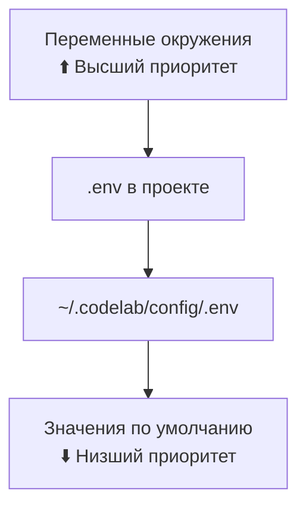

# Конфигурация

> Детальное руководство по настройке CodeLab.

## Обзор

CodeLab использует иерархическую систему конфигурации с приоритетами:



## Глобальная конфигурация

Файл `~/.codelab/config/.env` создается автоматически при первом запуске:

```bash
# CodeLab Configuration
# =====================

# === LLM Провайдер ===
CODELAB_LLM_PROVIDER=mock
# CODELAB_LLM_API_KEY=sk-your-key-here
# CODELAB_LLM_BASE_URL=https://api.openai.com/v1
CODELAB_LLM_MODEL=gpt-4o
CODELAB_LLM_TEMPERATURE=0.7
CODELAB_LLM_MAX_TOKENS=8192

# === Сервер ===
CODELAB_PORT=8765
CODELAB_HOST=127.0.0.1

# === Логирование ===
CODELAB_LOG_LEVEL=INFO
```

## Конфигурация проекта

Создайте `.env` в корне проекта для переопределения глобальных настроек:

```bash
# Проектная конфигурация
CODELAB_LLM_MODEL=gpt-4o-mini
CODELAB_LLM_TEMPERATURE=0.3
```

## Параметры конфигурации

### LLM провайдер

#### CODELAB_LLM_PROVIDER

Тип LLM провайдера:

| Значение | Описание |
|----------|----------|
| `openai` | OpenAI API (GPT-4, GPT-3.5) |
| `anthropic` | Anthropic API (Claude) |
| `mock` | Тестовый провайдер (без API) |

#### CODELAB_LLM_API_KEY

API ключ для выбранного провайдера.

```bash
# OpenAI
CODELAB_LLM_API_KEY=sk-...

# Anthropic
CODELAB_LLM_API_KEY=sk-ant-...
```

#### CODELAB_LLM_MODEL

Модель LLM:

| Провайдер | Модели |
|-----------|--------|
| OpenAI | `gpt-4o`, `gpt-4o-mini`, `gpt-4-turbo`, `gpt-3.5-turbo` |
| Anthropic | `claude-3-opus-20240229`, `claude-3-sonnet-20240229` |

#### CODELAB_LLM_BASE_URL

Custom endpoint для OpenAI-совместимых API:

```bash
# Azure OpenAI
CODELAB_LLM_BASE_URL=https://your-resource.openai.azure.com

# Local LLM (Ollama, LM Studio)
CODELAB_LLM_BASE_URL=http://localhost:11434/v1
```

#### CODELAB_LLM_TEMPERATURE

Креативность ответов (0.0-1.0):

| Значение | Использование |
|----------|---------------|
| 0.0-0.3 | Точные ответы, код |
| 0.4-0.7 | Сбалансированно |
| 0.8-1.0 | Креативные задачи |

#### CODELAB_LLM_MAX_TOKENS

Максимальная длина ответа в токенах:

```bash
CODELAB_LLM_MAX_TOKENS=8192  # По умолчанию
CODELAB_LLM_MAX_TOKENS=16384 # Для длинных ответов
```

### Сервер

#### CODELAB_HOST

Адрес привязки сервера:

| Значение | Описание |
|----------|----------|
| `127.0.0.1` | Только локальный доступ (безопасно) |
| `0.0.0.0` | Все интерфейсы (для удаленного доступа) |

#### CODELAB_PORT

Порт WebSocket сервера:

```bash
CODELAB_PORT=8765  # По умолчанию
```

### Логирование

#### CODELAB_LOG_LEVEL

Уровень детализации логов:

| Значение | Описание |
|----------|----------|
| `DEBUG` | Всё, включая JSON-RPC сообщения |
| `INFO` | Основные события (по умолчанию) |
| `WARNING` | Только предупреждения и ошибки |
| `ERROR` | Только ошибки |

### Директория данных

#### CODELAB_HOME

Путь к домашней директории CodeLab:

```bash
CODELAB_HOME=~/.codelab  # По умолчанию
CODELAB_HOME=/data/codelab  # Кастомный путь
```

## Конфигурация клиента

### TUI конфигурация

В файле `~/.codelab/config/tui.toml`:

```toml
[connection]
default_host = "127.0.0.1"
default_port = 8765
auto_reconnect = true
reconnect_delay = 3

[ui]
theme = "dark"
show_line_numbers = true
word_wrap = true

[history]
max_sessions = 100
max_messages_per_session = 1000
```

## Примеры конфигураций

### Разработка (Development)

```bash
# ~/.codelab/config/.env
CODELAB_LLM_PROVIDER=mock
CODELAB_LOG_LEVEL=DEBUG
CODELAB_PORT=8765
```

### Production с OpenAI

```bash
# ~/.codelab/config/.env
CODELAB_LLM_PROVIDER=openai
CODELAB_LLM_API_KEY=sk-...
CODELAB_LLM_MODEL=gpt-4o
CODELAB_LLM_TEMPERATURE=0.5
CODELAB_LOG_LEVEL=INFO
```

### Local LLM (Ollama)

```bash
# ~/.codelab/config/.env
CODELAB_LLM_PROVIDER=openai
CODELAB_LLM_BASE_URL=http://localhost:11434/v1
CODELAB_LLM_MODEL=codellama:latest
CODELAB_LLM_API_KEY=ollama
```

### Серверное развертывание

```bash
# /etc/codelab/.env
CODELAB_LLM_PROVIDER=openai
CODELAB_LLM_API_KEY=sk-...
CODELAB_HOST=0.0.0.0
CODELAB_PORT=443
CODELAB_LOG_LEVEL=WARNING
CODELAB_HOME=/var/lib/codelab
```

## Безопасность

### Защита API ключей

```bash
# НЕ коммитьте .env файлы!
echo ".env" >> .gitignore

# Используйте переменные окружения в CI/CD
export CODELAB_LLM_API_KEY=$SECRET_KEY
```

### Права доступа

```bash
# Ограничьте доступ к конфигурации
chmod 600 ~/.codelab/config/.env
```

## Проверка конфигурации

Для проверки текущей конфигурации просмотрите файлы:

```bash
# Глобальная конфигурация
cat ~/.codelab/config/.env

# Локальная конфигурация
cat .env
```

Или проверьте через переменные окружения:
```bash
env | grep CODELAB_
```

## Миграция конфигурации

При обновлении CodeLab:

1. Создайте резервную копию `~/.codelab/config/`
2. Обновите CodeLab
3. Проверьте новые параметры в документации
4. Добавьте новые параметры при необходимости

## См. также

- [Настройка сервера](03-server-setup.md) — параметры запуска
- [Разрешения](05-permissions.md) — политики безопасности
