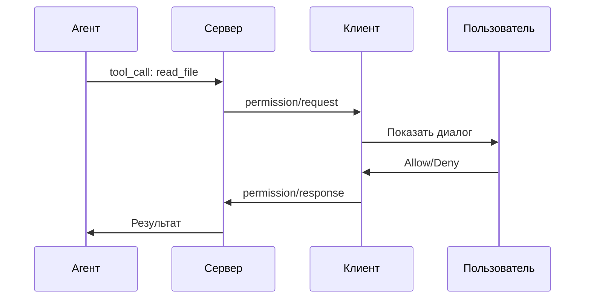
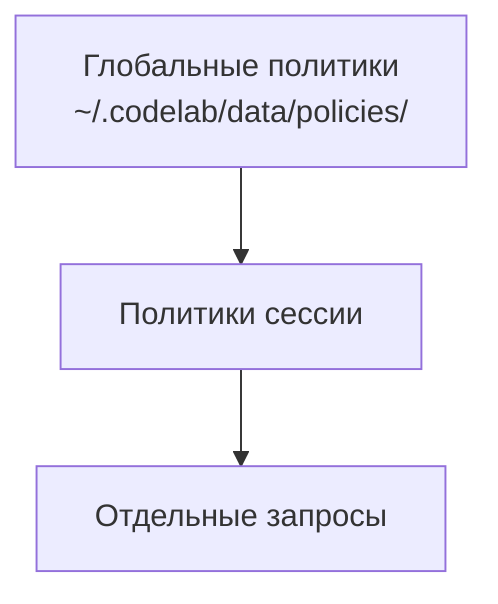

# Система разрешений

> Руководство по управлению разрешениями агента.

## Обзор

CodeLab использует систему разрешений для контроля доступа агента к ресурсам клиента: файловой системе и терминалу. Это обеспечивает безопасность и контроль пользователя над действиями AI.



## Типы разрешений

### File System

| Операция | Описание | Уровень риска |
|----------|----------|---------------|
| `read` | Чтение файлов | 🟢 Низкий |
| `write` | Запись/изменение файлов | 🟡 Средний |

### Terminal

| Операция | Описание | Уровень риска |
|----------|----------|---------------|
| `execute` | Выполнение команд | 🔴 Высокий |

## Диалог разрешения

При запросе агентом операции появляется диалог:

```
┌────────────────────────────────────────────────────────────┐
│  🔒 Запрос разрешения                                      │
│                                                            │
│  Операция: read_text_file                                  │
│  Путь: /project/src/main.py                                │
│                                                            │
│  [Allow]  [Allow All]  [Always Allow]  [Deny]             │
└────────────────────────────────────────────────────────────┘
```

### Варианты ответа

| Кнопка | Действие | Область |
|--------|----------|---------|
| **Allow** | Разрешить один раз | Только этот запрос |
| **Allow All** | Разрешить все похожие | Текущая сессия |
| **Always Allow** | Всегда разрешать | Глобально |
| **Deny** | Отклонить | Только этот запрос |

## Политики разрешений

### Уровни политик



### Глобальные политики

Сохраняются в `~/.codelab/data/policies/global_policies.json`:

```json
{
  "rules": [
    {
      "operation": "read",
      "pattern": "*.md",
      "action": "allow"
    },
    {
      "operation": "write",
      "pattern": "node_modules/*",
      "action": "deny"
    }
  ]
}
```

### Политики сессии

Действуют только в текущей сессии и сбрасываются при её закрытии.

## Паттерны путей

Политики поддерживают glob-паттерны:

| Паттерн | Описание |
|---------|----------|
| `*.py` | Все Python файлы |
| `src/**/*` | Все файлы в src и вложенных |
| `test_*.py` | Файлы начинающиеся с test_ |
| `!*.secret` | Исключение файлов |

### Примеры

```json
{
  "rules": [
    {
      "operation": "read",
      "pattern": "**/*.py",
      "action": "allow",
      "comment": "Читать все Python файлы"
    },
    {
      "operation": "write",
      "pattern": "src/**/*",
      "action": "allow",
      "comment": "Писать в src/"
    },
    {
      "operation": "*",
      "pattern": ".env*",
      "action": "deny",
      "comment": "Никогда не трогать .env файлы"
    }
  ]
}
```

## Терминальные разрешения

### Безопасные команды

Команды с низким риском могут быть разрешены по умолчанию:

```json
{
  "terminal_rules": [
    {
      "command_pattern": "ls *",
      "action": "allow"
    },
    {
      "command_pattern": "cat *",
      "action": "allow"
    },
    {
      "command_pattern": "python -m pytest *",
      "action": "allow"
    }
  ]
}
```

### Опасные команды

Рекомендуется всегда блокировать:

```json
{
  "terminal_rules": [
    {
      "command_pattern": "rm -rf *",
      "action": "deny"
    },
    {
      "command_pattern": "sudo *",
      "action": "deny"
    },
    {
      "command_pattern": "* > /dev/*",
      "action": "deny"
    }
  ]
}
```

## Режимы безопасности

### Paranoid Mode

Запрашивать разрешение на каждую операцию:

```json
{
  "mode": "paranoid",
  "default_action": "ask"
}
```

### Standard Mode (по умолчанию)

Спрашивать для write/execute, разрешать read:

```json
{
  "mode": "standard",
  "default_actions": {
    "read": "allow",
    "write": "ask",
    "execute": "ask"
  }
}
```

### Trusted Mode

Разрешать большинство операций (только для доверенных проектов):

```json
{
  "mode": "trusted",
  "default_action": "allow",
  "exceptions": ["rm *", "sudo *"]
}
```

## Управление политиками

Политики разрешений управляются через UI и сохраняются в сессии. Глобальные политики хранятся в `~/.codelab/data/policies/global_permissions.json`.

### Уровни политик

1. **Глобальные политики** — применяются ко всем сессиям
2. **Сессионные политики** — применяются только к текущей сессии
3. **Запрос разрешения** — спрашивает пользователя при каждом вызове

### Сброс политик

```bash
# Сбросить глобальные политики
codelab permissions reset --global

# Сбросить политики сессии
# (происходит автоматически при закрытии сессии)
```

### Экспорт/импорт

```bash
# Экспорт
codelab permissions export > policies.json

# Импорт
codelab permissions import policies.json
```

## Inline разрешения

В чате разрешения отображаются inline:

```
🤖 Агент: Мне нужно прочитать файл main.py
   
   ┌─ 🔒 read_text_file: src/main.py ─┐
   │ [✓ Allow] [✓ All] [✗ Deny]       │
   └──────────────────────────────────┘
   
🤖 Агент: Вот содержимое файла...
```

## Аудит действий

Все операции логируются:

```bash
# Просмотр последних операций
cat ~/.codelab/logs/codelab.log | grep "permission"
```

Формат лога:
```
2024-01-15 10:30:00 [INFO] permission.request operation=read path=/src/main.py
2024-01-15 10:30:02 [INFO] permission.response action=allow user_choice=allow_all
```

## Рекомендации по безопасности

### ✅ Рекомендуется

1. Использовать **Allow All** для безопасных операций (чтение документации)
2. Настроить глобальные политики для частых паттернов
3. Всегда проверять команды терминала перед разрешением

### ⚠️ С осторожностью

1. **Always Allow** для write операций
2. Разрешение команд с `sudo`
3. Операции над системными файлами

### ❌ Не рекомендуется

1. Trusted mode для незнакомых проектов
2. Разрешение `rm -rf`
3. Отключение системы разрешений

## Troubleshooting

### Слишком много запросов

Настройте политики для часто используемых путей:

```json
{
  "rules": [
    {"operation": "read", "pattern": "src/**/*", "action": "allow"}
  ]
}
```

### Агент не может работать

Проверьте, нет ли слишком строгих политик:

```bash
codelab permissions show | grep deny
```

## См. также

- [Инструменты](07-tools.md) — работа с файловой системой и терминалом
- [Сессии](06-sessions.md) — политики на уровне сессии
- [Архитектура разрешений](../../architecture/CLIENT_PERMISSION_HANDLING_ARCHITECTURE.md) — техническая документация
