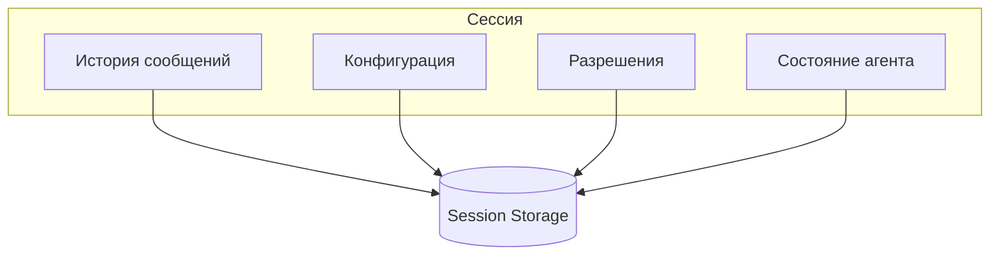
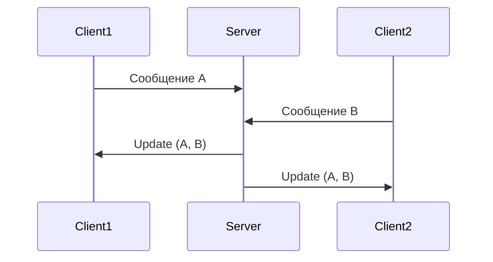

# Управление сессиями

> Руководство по работе с сессиями CodeLab.

## Обзор

Сессия — это контекст диалога с агентом, включающий историю сообщений, настройки и разрешения. CodeLab поддерживает множественные сессии с возможностью переключения.



## Создание сессии

### Через TUI

1. Нажмите `Ctrl+N`
2. Или нажмите кнопку "New" в Sidebar
3. Сессия создается с уникальным ID

### Через slash-команду

```
/new
```

### Автоматическое создание

При первом подключении к серверу создается новая сессия автоматически.

## Структура сессии

Каждая сессия содержит:

| Поле | Описание |
|------|----------|
| `id` | Уникальный UUID |
| `title` | Название (опционально) |
| `created_at` | Время создания |
| `updated_at` | Время последнего обновления |
| `messages` | История сообщений |
| `config` | Конфигурация сессии |
| `permissions` | Политики разрешений |

### Пример JSON сессии

```json
{
  "id": "550e8400-e29b-41d4-a716-446655440000",
  "title": "Рефакторинг main.py",
  "created_at": "2024-01-15T10:30:00Z",
  "updated_at": "2024-01-15T12:45:00Z",
  "messages": [
    {
      "role": "user",
      "content": "Помоги рефакторить main.py"
    },
    {
      "role": "assistant",
      "content": "Конечно! Давай посмотрим на код..."
    }
  ],
  "config": {
    "mode": "code"
  }
}
```

## Переключение сессий

### Горячие клавиши

| Клавиша | Действие |
|---------|----------|
| `Ctrl+J` | Следующая сессия |
| `Ctrl+K` | Предыдущая сессия |

### Через Sidebar

1. Откройте вкладку "Sessions" (`Ctrl+S`)
2. Кликните на нужную сессию
3. Контекст переключится

## Список сессий

Sidebar показывает:

```
Sessions
─────────────────────
● Текущая сессия (active)
  12:45 - Рефакторинг main.py
  
○ Другая сессия
  10:30 - Настройка тестов
  
○ Ещё одна сессия  
  09:15 - Документация
```

Индикаторы:
- ● — активная сессия
- ○ — неактивная сессия
- 🔵 — есть новые сообщения

## Сохранение и загрузка

### Автосохранение

Сессии сохраняются автоматически:
- После каждого сообщения
- При переключении сессий
- При закрытии приложения

### Место хранения

```
~/.codelab/data/sessions/
├── 550e8400-e29b-41d4-a716-446655440000.json
├── 660f9511-f30c-52e5-b827-557766551111.json
└── ...
```

### Ручная загрузка

При запуске клиент автоматически загружает предыдущие сессии.

## История сообщений

### Просмотр истории

История отображается в Chat View:
- Сообщения пользователя (справа)
- Ответы агента (слева)
- Tool calls с результатами

### Прокрутка

- `Page Up` / `Page Down` — постраничная прокрутка
- `Home` — к началу истории
- `End` — к последнему сообщению

### Очистка чата

```bash
Ctrl+L
```

Или:
```
/clear
```

> ⚠️ Очистка удаляет сообщения из отображения, но не из сохраненной сессии.

## Конфигурация сессии

### Режим работы

Сессия может работать в разных режимах:

| Режим | Описание |
|-------|----------|
| `code` | Работа с кодом |
| `chat` | Общение |
| `architect` | Планирование архитектуры |

### Изменение режима

```
/mode code
/mode architect
```

### Настройки сессии

```json
{
  "config": {
    "mode": "code",
    "temperature": 0.5,
    "max_tokens": 4096
  }
}
```

## Удаление сессий

### Через TUI

1. Выберите сессию в Sidebar
2. Нажмите `Delete` или `Backspace`
3. Подтвердите удаление

### Через командную строку

```bash
rm ~/.codelab/data/sessions/SESSION_ID.json
```

## Экспорт/Импорт

Сессии хранятся в `~/.codelab/data/sessions/` в формате JSON. Для резервного копирования:

```bash
# Резервное копирование
cp -r ~/.codelab/data/sessions/ /backup/sessions/

# Восстановление
cp -r /backup/sessions/* ~/.codelab/data/sessions/
```

Для просмотра содержимого сессии:
```bash
cat ~/.codelab/data/sessions/SESSION_ID.json | python -m json.tool
```

## Поиск по сессиям

### В TUI

Используйте фильтр в Sidebar:
1. Нажмите `/` в списке сессий
2. Введите текст для поиска
3. Отобразятся совпадающие сессии

### Критерии поиска

- По названию
- По содержимому сообщений
- По дате

## Лимиты

### Максимальное количество сообщений

По умолчанию: 1000 сообщений на сессию.

Изменить в конфигурации:
```bash
# ~/.codelab/config/tui.toml
[history]
max_messages_per_session = 2000
```

### Максимальное количество сессий

По умолчанию: 100 сессий.

```bash
[history]
max_sessions = 200
```

## Синхронизация

### Несколько клиентов

При подключении нескольких клиентов к одному серверу:
- Каждый видит актуальную историю
- Изменения синхронизируются через сервер

### Конфликты

При одновременном редактировании выигрывает последний:


## Лучшие практики

### ✅ Рекомендуется

1. **Именовать сессии** для легкой идентификации
2. **Разделять задачи** по сессиям
3. **Периодически архивировать** важные сессии

### ⚠️ Учитывайте

1. Большие сессии замедляют работу
2. История сессии передается LLM (токены)
3. Старые сессии занимают место

## Troubleshooting

### Сессия не сохраняется

Проверьте права на директорию:
```bash
ls -la ~/.codelab/data/sessions/
```

### Потеря истории

Проверьте резервные копии:
```bash
ls ~/.codelab/data/sessions/*.json.bak
```

### Медленная загрузка

Слишком много сессий. Удалите старые:
```bash
# Удалить сессии старше 30 дней
find ~/.codelab/data/sessions/ -mtime +30 -delete
```

## См. также

- [TUI клиент](01-tui-client.md) — интерфейс работы с сессиями
- [Разрешения](05-permissions.md) — политики на уровне сессии
