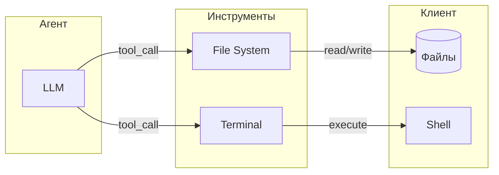

# Работа с инструментами

> Руководство по инструментам агента: File System и Terminal.

## Обзор

Инструменты (tools) позволяют агенту взаимодействовать с локальной средой клиента. CodeLab реализует два типа инструментов согласно ACP протоколу:



## File System

### Операции

| Операция | Описание |
|----------|----------|
| `read_text_file` | Чтение текстовых файлов |
| `write_text_file` | Запись/обновление файлов |

### Чтение файлов

Агент может читать содержимое файлов:

```json
{
  "tool": "read_text_file",
  "params": {
    "path": "src/main.py",
    "line": 1,
    "limit": 100
  }
}
```

**Параметры:**
| Параметр | Тип | Описание |
|----------|-----|----------|
| `path` | string | Путь к файлу (абсолютный или относительный) |
| `line` | int | Начальная строка (1-based, опционально) |
| `limit` | int | Максимум строк (опционально) |

**Отображение в UI:**

```
📖 read_text_file: src/main.py
   Lines 1-50 of 120
   ─────────────────────────
   1 │ #!/usr/bin/env python
   2 │ """Main module."""
   3 │ 
   ...
```

### Запись файлов

Агент может создавать и обновлять файлы:

```json
{
  "tool": "write_text_file",
  "params": {
    "path": "src/utils.py",
    "content": "def helper():\n    pass\n"
  }
}
```

**Параметры:**
| Параметр | Тип | Описание |
|----------|-----|----------|
| `path` | string | Путь к файлу |
| `content` | string | Новое содержимое |

**Отображение в UI (diff):**

```
✏️ write_text_file: src/utils.py
   ─────────────────────────
   @@ -1,3 +1,5 @@
   +def helper():
   +    pass
   +
    def main():
        ...
```

## Terminal

### Операции

| Операция | Описание |
|----------|----------|
| `terminal/create` | Создание терминала и выполнение команды |
| `terminal/output` | Получение текущего вывода |
| `terminal/wait_for_exit` | Ожидание завершения процесса |
| `terminal/kill` | Принудительное завершение процесса |
| `terminal/release` | Освобождение ресурсов терминала |

### Выполнение команд

Агент может запускать shell команды:

```json
{
  "tool": "terminal/create",
  "params": {
    "command": "python",
    "args": ["-m", "pytest", "tests/"],
    "cwd": "/project"
  }
}
```

**Параметры:**
| Параметр | Тип | Описание |
|----------|-----|----------|
| `command` | string | Команда |
| `args` | array | Аргументы (опционально) |
| `cwd` | string | Рабочая директория (опционально) |
| `env` | object | Переменные окружения (опционально) |

**Отображение в UI:**

```
🖥️ terminal/create: python -m pytest tests/
   Working directory: /project
   ─────────────────────────
   ===== test session starts =====
   collected 42 items
   
   tests/test_main.py ............ [100%]
   
   ===== 42 passed in 1.23s =====
```

### Получение вывода (terminal/output)

Для получения текущего вывода терминала:

```json
{
  "tool": "terminal/output",
  "params": {
    "terminal_id": "term-123"
  }
}
```

**Ответ:**
```json
{
  "output": "Building...\nDone!",
  "truncated": false,
  "exitStatus": {"exitCode": 0, "signal": null}
}
```

### Ожидание завершения

```json
{
  "tool": "terminal/wait_for_exit",
  "params": {
    "terminal_id": "term-123"
  }
}
```

**Ответ (только exitCode и signal):**
```json
{
  "exitCode": 0,
  "signal": null
}
```

### Принудительное завершение (terminal/kill)

```json
{
  "tool": "terminal/kill",
  "params": {
    "terminal_id": "term-123",
    "signal": "SIGTERM"
  }
}
```

### Освобождение терминала

```json
{
  "tool": "terminal/release",
  "params": {
    "terminal_id": "term-123"
  }
}
```

### Terminal Output Flow

По спецификации ACP `terminal/wait_for_exit` возвращает только `exitCode` и `signal` — без output. Для получения output используется отдельный метод `terminal/output`:

1. `terminal/output(terminal_id)` → output + is_complete + exit_code
2. Если `is_complete=True`: возвращаем результат
3. Если `is_complete=False`:
   - `terminal/wait_for_exit(terminal_id)` → exit_code + signal
   - `terminal/output(terminal_id)` → финальный output
   - Возвращаем output + exit_code + signal

## Tool Panel

Tool Panel отображает результаты выполнения:

```
┌─ Tool Panel ────────────────────────────────────┐
│                                                 │
│ 🖥️ python -m pytest tests/                      │
│    Status: ✅ Completed (exit code: 0)          │
│    Duration: 1.23s                              │
│                                                 │
│ 📖 read_text_file: src/main.py                  │
│    Lines: 1-50 of 120                           │
│                                                 │
│ ✏️ write_text_file: src/utils.py                │
│    Changes: +15 -3 lines                        │
│                                                 │
└─────────────────────────────────────────────────┘
```

### Навигация

- Используйте `Ctrl+T` для открытия Terminal Output modal
- Кликните на tool call для подробностей

## Разрешения инструментов

### File System

| Операция | Требует разрешение |
|----------|-------------------|
| `read_text_file` | Да |
| `write_text_file` | Да |

### Terminal

| Операция | Требует разрешение |
|----------|-------------------|
| `execute_command` | Да |
| `wait_for_exit` | Нет |
| `release` | Нет |

### Политики

Настройте автоматические разрешения:

```json
{
  "tool_policies": {
    "read_text_file": {
      "paths": ["src/**/*", "docs/**/*"],
      "action": "allow"
    },
    "execute_command": {
      "commands": ["pytest *", "npm test"],
      "action": "allow"
    }
  }
}
```

## Статусы выполнения

| Статус | Иконка | Описание |
|--------|--------|----------|
| Pending | ⏳ | Ожидает разрешения |
| Running | 🔄 | Выполняется |
| Completed | ✅ | Успешно завершено |
| Failed | ❌ | Ошибка выполнения |
| Cancelled | 🚫 | Отменено пользователем |

## Отображение результатов

### Текстовые файлы

С подсветкой синтаксиса и номерами строк:

```python
 1 │ #!/usr/bin/env python
 2 │ """Main module."""
 3 │ 
 4 │ def main():
 5 │     print("Hello, World!")
```

### Diff изменений

```diff
@@ -4,6 +4,8 @@
 def main():
-    print("Hello")
+    print("Hello, World!")
+    return 0
```

### Вывод терминала

```
$ pytest tests/
===== test session starts =====
platform linux -- Python 3.12
collected 42 items
...
===== 42 passed in 1.23s =====
```

## Ограничения

### Размер файлов

- Максимум 10 MB для чтения
- Максимум 1 MB для записи за раз

### Timeout команд

По умолчанию: 30 секунд.

Изменить в запросе:
```json
{
  "timeout": 60
}
```

### Буфер вывода

Максимум 1 MB вывода терминала сохраняется.

## Безопасность

### Защита путей

- Path traversal защита (`../` не разрешен)
- Только в пределах рабочей директории
- Системные файлы заблокированы

### Опасные команды

Автоматически блокируются:
- `rm -rf /`
- `sudo` без разрешения
- `chmod 777`

## Лучшие практики

### ✅ Рекомендуется

1. Читать файлы перед изменением
2. Делать небольшие изменения
3. Проверять команды перед выполнением

### ⚠️ Учитывайте

1. Большие файлы медленнее
2. Долгие команды требуют timeout
3. Параллельные tool calls не поддерживаются

## Troubleshooting

### Файл не найден

```
Error: File not found: src/missing.py
```

Проверьте:
- Путь относительно рабочей директории
- Файл существует
- Права на чтение

### Команда не выполняется

```
Error: Permission denied
```

Проверьте:
- Разрешение дано
- Команда доступна в PATH
- Права на выполнение

### Timeout

```
Error: Command timed out after 30s
```

Увеличьте timeout или используйте background режим.

## См. также

- [Разрешения](05-permissions.md) — политики инструментов
- [План агента](08-agent-plan.md) — планирование использования инструментов
- [Спецификация File System](../../Agent%20Client%20Protocol/protocol/09-File%20System.md) — протокол
- [Спецификация Terminal](../../Agent%20Client%20Protocol/protocol/10-Terminal.md) — протокол
