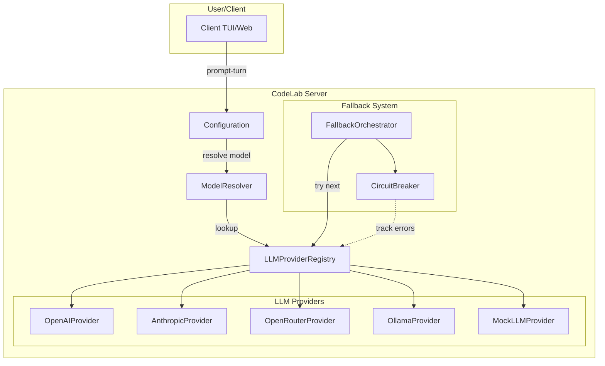
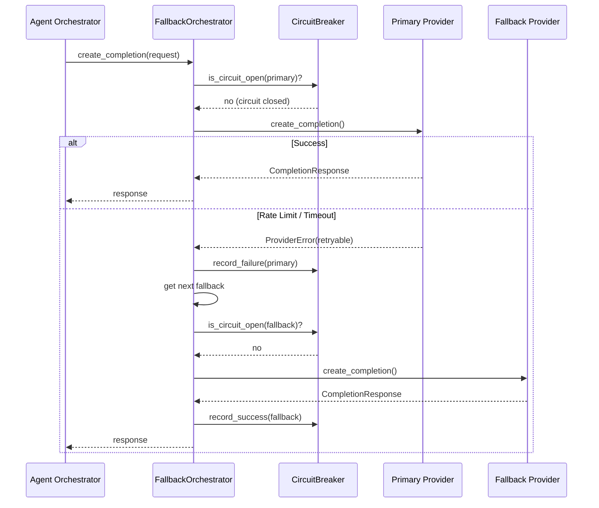

# Настройка LLM провайдеров

CodeLab поддерживает 8+ LLM провайдеров с возможностью переключения модели во время сессии.

## Архитектура LLM подсистемы



## Обзор провайдеров

| Провайдер | ID | API | Модели по умолчанию | Base URL |
|-----------|----|-----|---------------------|----------|
| **OpenAI** | `openai` | Chat Completions | `gpt-4o`, `o3`, `o4-mini` | `https://api.openai.com/v1` |
| **Anthropic** | `anthropic` | Messages API | `claude-sonnet-4`, `claude-opus-4` | `https://api.anthropic.com` |
| **OpenRouter** | `openrouter` | Chat Completions | `mistral-large`, `llama-3.1` | `https://openrouter.ai/api/v1` |
| **Zen** | `zen` | Chat Completions | `zen-sonnet` | `https://zen.opencode.ai/v1` |
| **Go** | `go` | Chat Completions | `go-fast` | `https://go.opencode.ai/v1` |
| **Ollama** | `ollama` | Chat Completions | `llama3.1:70b`, `mistral` | `http://localhost:11434/v1` |
| **LMStudio** | `lmstudio` | Chat Completions | local models | `http://localhost:1234/v1` |
| **Mock** | `mock` | N/A | `mock-model` | N/A |

## Формат модели

Все модели указываются в формате `"provider/model"`:

```
openai/gpt-4o
anthropic/claude-sonnet-4
ollama/llama3.1:70b
openrouter/mistral-large
```

Этот формат используется:
- В конфигурации (`codelab.toml`)
- В переменных окружения (`CODELAB_LLM_MODEL`)
- В CLI аргументах (`--llm-model`)
- При переключении модели mid-session через `session/set_config_option`

## Быстрая настройка

### OpenAI

```bash
export OPENAI_API_KEY="sk-..."
export CODELAB_LLM_PROVIDER=openai
export CODELAB_LLM_MODEL=openai/gpt-4o
codelab serve
```

### Anthropic

```bash
export ANTHROPIC_API_KEY="sk-ant-..."
export CODELAB_LLM_PROVIDER=anthropic
export CODELAB_LLM_MODEL=anthropic/claude-sonnet-4
codelab serve
```

### Ollama (локальная модель)

```bash
# 1. Установите Ollama: https://ollama.ai
# 2. Скачайте модель:
ollama pull llama3.1:70b

# 3. Запустите CodeLab:
export CODELAB_LLM_PROVIDER=ollama
export CODELAB_LLM_MODEL=ollama/llama3.1:70b
codelab serve
```

### Mock (для разработки)

```bash
export CODELAB_LLM_PROVIDER=mock
export CODELAB_LLM_MODEL=mock/mock-model
codelab serve
```

## TOML конфигурация

Создайте `codelab.toml` в корне проекта:

```toml
[llm]
provider = "openai"
model = "openai/gpt-4o"
temperature = 0.7
max_tokens = 8192

[llm.providers.openai]
api_key = "${OPENAI_API_KEY}"
base_url = "https://api.openai.com/v1"

[llm.providers.openai.models.gpt-4o]
context_window = 128000
max_output_tokens = 16384
```

### Приоритет конфигурации

1. CLI аргументы (высший приоритет)
2. Переменные окружения (`.env`)
3. `codelab.local.toml` (project-local, в `.gitignore`)
4. `codelab.toml` (проект, коммитится в git)
5. `~/.codelab/auth.toml` (глобальные API keys)

## Переключение модели mid-session

Вы можете переключить модель во время активной сессии:

```json
// session/set_config_option
{
  "sessionId": "sess_abc123",
  "configId": "model",
  "value": "anthropic/claude-sonnet-4"
}
```

Клиент получит обновлённые `configOptions` с новым списком доступных моделей.

## Настройка через CLI

```bash
codelab serve \
  --llm-provider openai \
  --llm-model openai/gpt-4o \
  --llm-api-key "$OPENAI_API_KEY" \
  --llm-temperature 0.7 \
  --llm-max-tokens 8192
```

## Fallback цепочка

При ошибках основного провайдера можно настроить автоматический fallback:

### Fallback Flow



```bash
codelab serve \
  --fallback-enabled \
  --fallback-strategy sequential \
  --fallback-order openai,openrouter,ollama
```

Или через TOML:

```toml
[llm.fallback]
enabled = true
strategy = "sequential"
order = ["openai", "openrouter", "ollama"]
max_attempts = 3
retry_on = ["rate_limit", "timeout"]
```

Fallback срабатывает только на retryable ошибки:
- `rate_limit` — превышен лимит запросов
- `timeout` — таймаут запроса
- `internal_error` — внутренняя ошибка провайдера
- `service_unavailable` — сервис недоступен

## Сравнение провайдеров

### OpenAI

**Плюсы:**
- Широкий выбор моделей
- Отличная поддержка tool calling
- Streaming completion
- Vision (GPT-4o)

**Модели:**
| Модель | Context | Max Output | Цена (input/output) |
|--------|---------|------------|---------------------|
| `gpt-4o` | 128K | 16K | $2.50 / $10.00 за 1M токенов |
| `o3` | 200K | 100K | $10.00 / $40.00 за 1M токенов |
| `o4-mini` | 200K | 100K | $1.10 / $4.40 за 1M токенов |

### Anthropic

**Плюсы:**
- Большое контекстное окно
- Отличное качество ответов
- Prompt caching
- Extended thinking (Claude 3.7+)

**Модели:**
| Модель | Context | Max Output | Цена (input/output) |
|--------|---------|------------|---------------------|
| `claude-sonnet-4` | 200K | 64K | $3.00 / $15.00 за 1M токенов |
| `claude-opus-4` | 200K | 32K | $15.00 / $75.00 за 1M токенов |

### OpenRouter

**Плюсы:**
- Доступ к множеству моделей через один API
- Прозрачное ценообразование
- Fallback между моделями

### Ollama

**Плюсы:**
- Локальное выполнение (без API costs)
- Приватность данных
- Широкий выбор open-source моделей

**Минусы:**
- Требует локальный сервер
- Зависит от ресурсов машины

### LMStudio

**Плюсы:**
- Локальное выполнение
- GUI для управления моделями
- Поддержка GGUF формата

### Zen / Go

**Плюсы:**
- Оптимизированы для CodeLab/OpenCode
- Интеграция с экосистемой

## Troubleshooting

### Провайдер не найден

```
ProviderNotFoundError: Provider 'xyz' not found in registry
```

**Решение:** Проверьте ID провайдера. Доступные: `openai`, `anthropic`, `openrouter`, `zen`, `go`, `ollama`, `lmstudio`, `mock`.

### API key не установлен

```
AuthenticationError: API key is required
```

**Решение:** Установите переменную окружения:
```bash
export OPENAI_API_KEY="sk-..."
```

Или укажите в `codelab.toml`:
```toml
[llm.providers.openai]
api_key = "${OPENAI_API_KEY}"
```

### Модель не найдена

```
ModelNotFoundError: Model 'unknown-model' not found for provider 'openai'
```

**Решение:** Проверьте название модели в документации провайдера. Используйте формат `provider/model`.

### Fallback не срабатывает

**Решение:**
1. Проверьте `--fallback-enabled`
2. Убедитесь что fallback провайдеры зарегистрированы
3. Проверьте `retry_on` — ошибка должна быть retryable
