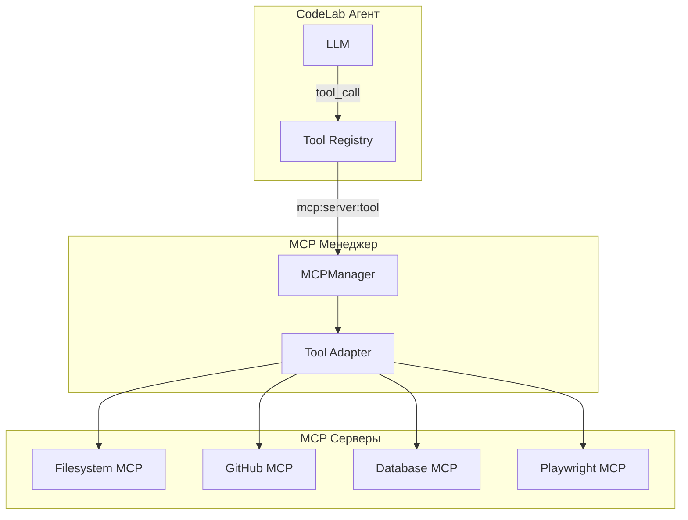
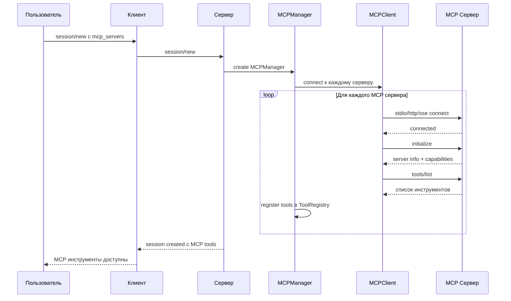
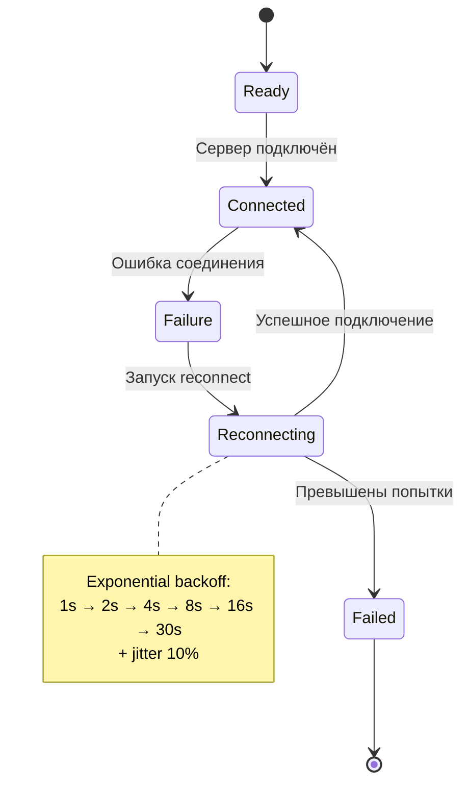
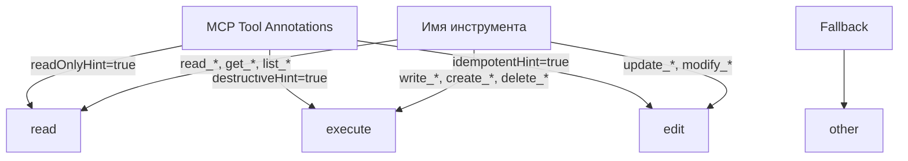

# MCP серверы

> Руководство по подключению и использованию MCP (Model Context Protocol) серверов в CodeLab.

## Обзор

MCP (Model Context Protocol) — это открытый протокол для подключения AI-приложений к внешним источникам данных и инструментам. CodeLab поддерживает MCP серверы, что позволяет агенту использовать дополнительные инструменты beyond встроенных File System и Terminal.



### Что дают MCP серверы

| Возможность | Описание |
|-------------|----------|
| **Инструменты** | Дополнительные инструменты (API, БД, веб-браузер) |
| **Ресурсы** | Доступ к данным через URI (файлы, API endpoints) |
| **Промпты** | Готовые шаблоны промптов для специфичных задач |
| **Уведомления** | Server push уведомления об изменениях |

### Архитектура MCP в CodeLab



## Подключение MCP серверов

### Через TOML конфигурацию

Самый удобный способ — добавить MCP серверы в `codelab.toml`:

```toml
[[mcp.servers]]
name = "filesystem"
type = "stdio"
command = "npx"
args = ["-y", "@modelcontextprotocol/server-filesystem", "/project"]

[[mcp.servers]]
name = "github"
type = "http"
url = "https://api.githubcopilot.com/mcp/"
headers = [
  { name = "Authorization", value = "Bearer ${GITHUB_TOKEN}" }
]
```

### Через сессию

MCP серверы можно указать при создании сессии через `session/new`:

```json
{
  "jsonrpc": "2.0",
  "id": 1,
  "method": "session/new",
  "params": {
    "mcpServers": [
      {
        "name": "filesystem",
        "type": "stdio",
        "command": "npx",
        "args": ["-y", "@modelcontextprotocol/server-filesystem", "/project"]
      }
    ]
  }
}
```

## Типы транспортов

### Stdio (стандартный ввод/вывод)

Запускает MCP сервер как subprocess. Наиболее распространённый тип для локальных серверов.

```toml
[[mcp.servers]]
name = "my-server"
type = "stdio"
command = "python"
args = ["-m", "my_mcp_server", "--stdio"]
env = [
  { name = "API_KEY", value = "${MY_API_KEY}" },
  { name = "DEBUG", value = "true" }
]
```

**Параметры:**
| Параметр | Тип | Описание |
|----------|-----|----------|
| `command` | string | Команда для запуска |
| `args` | array | Аргументы командной строки |
| `env` | array | Переменные окружения `[{name, value}]` |

### HTTP

Подключение к удалённому MCP серверу через HTTP POST с JSON-RPC.

```toml
[[mcp.servers]]
name = "remote-server"
type = "http"
url = "https://mcp.example.com/mcp"
headers = [
  { name = "Authorization", value = "Bearer ${API_TOKEN}" },
  { name = "Content-Type", value = "application/json" }
]
```

**Параметры:**
| Параметр | Тип | Описание |
|----------|-----|----------|
| `url` | string | URL MCP сервера |
| `headers` | array | HTTP headers `[{name, value}]` |

### SSE (Server-Sent Events)

Подключение через SSE для серверов, поддерживающих streaming.

```toml
[[mcp.servers]]
name = "streaming-server"
type = "sse"
url = "https://mcp.example.com/sse"
headers = [
  { name = "Authorization", value = "Bearer ${API_TOKEN}" }
]
```

> **Примечание:** SSE транспорт помечен как deprecated в MCP spec. Рекомендуется использовать HTTP транспорт.

## Популярные MCP серверы

### Filesystem MCP

Доступ к файловой системе с настраиваемыми ограничениями.

```toml
[[mcp.servers]]
name = "filesystem"
type = "stdio"
command = "npx"
args = [
  "-y",
  "@modelcontextprotocol/server-filesystem",
  "/project/src",
  "/project/docs"
]
```

### GitHub MCP

Взаимодействие с GitHub API.

```toml
[[mcp.servers]]
name = "github"
type = "stdio"
command = "npx"
args = ["-y", "@modelcontextprotocol/server-github"]
env = [
  { name = "GITHUB_PERSONAL_ACCESS_TOKEN", value = "${GITHUB_TOKEN}" }
]
```

### Playwright MCP

Автоматизация браузера.

```toml
[[mcp.servers]]
name = "playwright"
type = "stdio"
command = "npx"
args = ["@anthropic/mcp-playwright"]
```

### Database MCP

Подключение к базам данных.

```toml
[[mcp.servers]]
name = "postgres"
type = "stdio"
command = "npx"
args = ["-y", "@modelcontextprotocol/server-postgres"]
env = [
  { name = "DATABASE_URL", value = "postgresql://localhost/mydb" }
]
```

### Git MCP

Работа с Git репозиториями.

```toml
[[mcp.servers]]
name = "git"
type = "stdio"
command = "npx"
args = ["-y", "@modelcontextprotocol/server-git"]
```

## Именование MCP инструментов

MCP инструменты имеют namespaced имена для избежания конфликтов:

```
mcp:{server_id}:{tool_name}
```

**Примеры:**
- `mcp:filesystem:read_file`
- `mcp:github:create_issue`
- `mcp:playwright:navigate`

В интерфейсе CodeLab MCP инструменты отображаются с префиксом сервера:

```
🔧 [MCP:filesystem] read_file: /project/src/main.py
🔧 [MCP:github] list_repositories
🔧 [MCP:playwright] navigate: https://example.com
```

## Автоматическое переподключение

CodeLab автоматически восстанавливает соединение с MCP серверами при обрыве.



### Параметры retry

```toml
[[mcp.servers]]
name = "unreliable-server"
type = "http"
url = "https://unstable.example.com/mcp"

# Настройки переподключения
max_retries = 5          # Максимум попыток
initial_delay = 1.0      # Начальная задержка (сек)
max_delay = 30.0         # Максимальная задержка (сек)
backoff_multiplier = 2.0 # Множитель backoff
```

### Health Check

Каждые 60 секунд CodeLab проверяет состояние MCP серверов:

1. Проверка состояния клиента
2. Если не `READY` → запуск переподключения
3. Логирование результатов

## MCP ресурсы

MCP серверы могут предоставлять ресурсы — данные, доступные по URI.

### Просмотр ресурсов

Агент может запросить список доступных ресурсов:

```
Доступные ресурсы:
- config://app/settings (Application Settings)
- docs://api/reference (API Reference)
- data://users/list (User List)
```

### Чтение ресурсов

```json
{
  "tool": "mcp:server:read_resource",
  "params": {
    "uri": "config://app/settings"
  }
}
```

## MCP промпты

MCP серверы могут предоставлять шаблоны промптов.

### Список промптов

```
Доступные промпты:
- code-review (Review code changes)
- generate-tests (Generate tests for code)
- explain-code (Explain how code works)
```

### Использование промпта

```json
{
  "tool": "mcp:server:get_prompt",
  "params": {
    "name": "code-review",
    "arguments": {
      "code": "def hello(): ..."
    }
  }
}
```

## MCP уведомления

MCP серверы могут отправлять уведомления об изменениях:

| Уведомление | Описание |
|-------------|----------|
| `notifications/resources/list_changed` | Список ресурсов изменился |
| `notifications/tools/list_changed` | Список инструментов изменился |
| `notifications/prompts/list_changed` | Список промптов изменился |
| `notifications/message` | Текстовое сообщение от сервера |

CodeLab автоматически обрабатывает уведомления и обновляет доступные инструменты.

## Разрешения MCP инструментов

MCP инструменты проходят через ту же систему разрешений, что и встроенные инструменты.

### Kind inference

CodeLab автоматически определяет тип MCP инструмента для системы разрешений:



**Приоритет определения:**
1. **MCP ToolAnnotations** (`readOnlyHint`, `destructiveHint`, и т.д.)
2. **Эвристика по имени** (`read_file` → read, `execute_command` → execute)
3. **Fallback** → `other`

### Политики для MCP

```toml
[tool_policies]
# Разрешить чтение всех MCP инструментов
"mcp:*:read_*" = "allow"

# Запрашивать разрешение на запись
"mcp:*:write_*" = "ask"

# Запретить удаление
"mcp:*:delete_*" = "deny"
```

## Отображение в TUI

### Tool Panel

MCP инструменты отображаются в Tool Panel с иконкой и префиксом:

```
┌─ Tool Panel ────────────────────────────────────┐
│                                                 │
│ 🔧 [MCP:filesystem] read_file: src/main.py      │
│    Status: ✅ Completed                         │
│                                                 │
│ 🔧 [MCP:github] list_repositories               │
│    Status: ✅ Completed (15 repos)              │
│                                                 │
│ 🔧 [MCP:playwright] navigate                    │
│    Status: 🔄 Выполняется...                    │
│                                                 │
└─────────────────────────────────────────────────┘
```

### Permission Widget

```
┌────────────────────────────────────────────────────────────┐
│  🔒 Запрос разрешения                                      │
│                                                            │
│  Операция: [MCP:filesystem] write_file                     │
│  Путь: /project/src/main.py                                │
│                                                            │
│  [Allow]  [Allow All]  [Always Allow]  [Deny]             │
└────────────────────────────────────────────────────────────┘
```

## Troubleshooting

### MCP сервер не запускается

**Симптом:** Ошибка при создании сессии с MCP сервером.

**Проверка:**
1. Команда запуска корректна:
   ```bash
   npx -y @modelcontextprotocol/server-filesystem /project
   ```
2. Зависимости установлены:
   ```bash
   npm list -g @modelcontextprotocol/server-filesystem
   ```
3. Переменные окружения установлены:
   ```bash
   echo $GITHUB_TOKEN
   ```

**Решение:**
```bash
# Установка MCP сервера
npm install -g @modelcontextprotocol/server-filesystem

# Проверка запуска
npx @modelcontextprotocol/server-filesystem /project --stdio
```

### MCP сервер отключился

**Симптом:** Инструменты MCP сервера недоступны.

**Автоматическое восстановление:**
1. CodeLab обнаруживает отключение через health check
2. Запускает переподключение с exponential backoff
3. Обновляет список инструментов после подключения

**Ручная проверка:**
```bash
# Проверка логов
cat ~/.codelab/logs/codelab.log | grep "mcp"
```

### Инструменты MCP не видны агенту

**Симптом:** Агент не использует MCP инструменты.

**Проверка:**
1. Сервер подключён:
   ```
   MCP серверы: filesystem (5 tools), github (12 tools)
   ```
2. Инструменты зарегистрированы в ToolRegistry
3. Capabilities клиента поддерживают MCP инструменты

**Решение:**
- Пересоздайте сессию с MCP серверами
- Проверьте логи на ошибки инициализации

### Timeout при вызове MCP инструмента

**Симптом:** `MCP tool execution error: timeout`

**Причины:**
- MCP сервер медленно отвечает
- Сетевые проблемы (для HTTP/SSE)
- Сервер завис

**Решение:**
1. Увеличьте timeout в конфигурации
2. Проверьте доступность сервера
3. Перезапустите MCP сервер

## Безопасность

### Изоляция MCP серверов

- Каждый MCP сервер запускается в отдельном процессе
- Stdio серверы имеют ограниченный доступ к файловой системе
- HTTP/SSE серверы используют HTTPS

### Контроль доступа

- MCP инструменты проходят через систему разрешений
- Политики могут ограничивать доступ к конкретным инструментам
- Glob-паттерны для массового управления разрешениями

### API ключи

```toml
# НЕ храните API ключи в codelab.toml!
# Используйте переменные окружения:
env = [
  { name = "API_KEY", value = "${MY_API_KEY}" }
]
```

```bash
# Установите переменную окружения
export MY_API_KEY="your-secret-key"

# Или используйте .env файл
echo "MY_API_KEY=your-secret-key" >> .env
```

## См. также

- [Инструменты](07-tools.md) — встроенные инструменты
- [Разрешения](05-permissions.md) — система разрешений
- [Конфигурация](04-configuration.md) — настройка CodeLab
- [TOML конфигурация](13-toml-configuration.md) — формат конфигурации
- [MCP Protocol](../../Model%20Context%20Protocol/) — полная документация MCP
