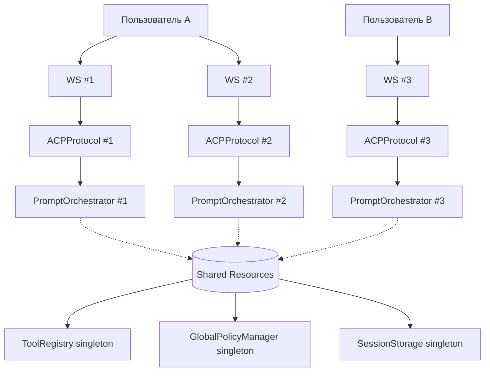

# 2.7 — Инжектировать `PromptOrchestrator` через конструктор `ACPProtocol`

**Статус:** ✅ Реализовано (`ref/inject-prompt`)  
**Файл:** `src/codelab/server/protocol/core.py`

---

## Проблема

`PromptOrchestrator` создавался заново при каждом вызове `execute_pending_tool`:

```python
async def execute_pending_tool(self, session_id: str, tool_call_id: str) -> LLMLoopResult:
    # Создавался при каждом вызове — нарушение DI-принципа
    orchestrator = prompt.create_prompt_orchestrator(
        tool_registry=self._tool_registry,
        client_rpc_service=self._client_rpc_service,
        global_policy_manager=self._global_policy_manager,
    )
    return await orchestrator.execute_pending_tool(...)
```

`PromptOrchestrator` — stateless агрегатор зависимостей. Создавать его при каждом вызове — это лишние накладные расходы и нарушение DI-принципа.

---

## Scope: Per-Connection

`PromptOrchestrator` имеет **per-connection scope**:

- **Каждое WebSocket-подключение** создаёт свой экземпляр `ACPProtocol`, а значит и свой `PromptOrchestrator`.
- **Не per-user**: один пользователь с несколькими подключениями получит отдельные оркестраторы на каждое.
- **Причина**: `PromptOrchestrator` держит зависимые сервисы (`ClientRPCService`), которые привязаны к конкретному соединению.

### Почему не per-user?

| Проблема | Per-Connection | Per-User |
|----------|----------------|----------|
| Race conditions при параллельных запросах | Нет | Возможны |
| Отмена запросов при disconnect | Простая | Сложная |
| Горизонтальное масштабирование | Без sticky sessions | Требует sticky sessions |
| Изоляция active_turn | Полная | Частичная |

### Диаграмма scope



Компоненты с **singleton scope** (общие для всех подключений):
- `ToolRegistry` — реестр инструментов
- `GlobalPolicyManager` — глобальные политики разрешений
- `SessionStorage` — хранилище сессий

Компоненты с **per-connection scope**:
- `ACPProtocol` — экземпляр протокола
- `PromptOrchestrator` — оркестратор обработки промптов
- `ClientRPCService` — сервис вызовов к клиенту (привязан к WS)

---

## Реализация

### Новые типы в `core.py`

В рамках рефакторинга добавлены типы для реестра обработчиков и middleware:

```python
from collections.abc import Awaitable, Callable
from typing import Protocol

# Тип обработчика метода: async-функция, принимающая сообщение и возвращающая outcome
MethodHandler = Callable[[ACPMessage], Awaitable[ProtocolOutcome]]


class MiddlewareFn(Protocol):
    """Протокол middleware для сквозной логики (логирование, метрики, auth-check).

    Middleware применяется в порядке onion pattern: первое в списке — внешнее,
    последнее — ближе к обработчику.
    """

    async def __call__(
        self,
        message: ACPMessage,
        next_handler: MethodHandler,
    ) -> ProtocolOutcome: ...
```

### Конструктор `ACPProtocol`

```python
class ACPProtocol:
    def __init__(
        self,
        *,
        require_auth: bool = False,
        auth_api_key: str | None = None,
        storage: SessionStorage | None = None,
        agent_orchestrator: AgentOrchestrator | None = None,
        client_rpc_service: ClientRPCService | None = None,
        tool_registry: ToolRegistry | None = None,
        prompt_orchestrator: PromptOrchestrator | None = None,  # ← инжекция
        middleware: list[MiddlewareFn] | None = None,           # ← middleware
    ) -> None:
        ...
        # PromptOrchestrator создаётся один раз, если не передан извне
        self._prompt_orchestrator: PromptOrchestrator | None = prompt_orchestrator

        # Middleware для сквозной логики (логирование, метрики, auth-check)
        self._middleware: list[MiddlewareFn] = middleware or []
```

### Метод `_get_prompt_orchestrator` (async)

Объявлен как `async` для единообразия с остальными методами протокола:

```python
async def _get_prompt_orchestrator(self) -> PromptOrchestrator | None:
    """Получить или создать PromptOrchestrator.

    Если передан явно в конструктор — использует его.
    Если нет — создаёт лениво при первом обращении.

    Returns:
        PromptOrchestrator или None, если tool_registry не настроен.
    """
    if self._prompt_orchestrator is not None:
        return self._prompt_orchestrator

    if self._tool_registry is None:
        return None

    self._prompt_orchestrator = prompt.create_prompt_orchestrator(
        tool_registry=self._tool_registry,
        client_rpc_service=self._client_rpc_service,
        global_policy_manager=self._global_policy_manager,
    )
    return self._prompt_orchestrator
```

### Обновление `execute_pending_tool`

```python
# БЫЛО:
orchestrator = prompt.create_prompt_orchestrator(  # ← каждый раз новый
    tool_registry=self._tool_registry,
    client_rpc_service=self._client_rpc_service,
    global_policy_manager=self._global_policy_manager,
)

# СТАЛО:
orchestrator = await self._get_prompt_orchestrator()  # ← переиспользуем
if orchestrator is None:
    logger.error(
        "orchestrator not configured for pending tool execution",
        session_id=session_id,
        tool_call_id=tool_call_id,
    )
    return LLMLoopResult(notifications=[], stop_reason="end_turn")
```

### Сброс кэша в `initialize_global_policy_manager`

```python
async def initialize_global_policy_manager(self) -> None:
    try:
        self._global_policy_manager = await GlobalPolicyManager.get_instance()
        await self._global_policy_manager.initialize()

        # Сбросить кэш, чтобы оркестратор пересоздался с новым policy manager
        self._prompt_orchestrator = None

        logger.info("GlobalPolicyManager initialized successfully")
    except Exception as e:
        logger.warning("Failed to initialize GlobalPolicyManager", error=str(e))
```

---

## Тесты

Четыре unit-теста покрывают жизненный цикл оркестратора:

```python
@pytest.mark.asyncio
async def test_orchestrator_created_once():
    """PromptOrchestrator должен создаваться единожды."""
    tool_registry = MagicMock(spec=ToolRegistry)
    protocol = ACPProtocol(tool_registry=tool_registry)

    orch1 = await protocol._get_prompt_orchestrator()
    orch2 = await protocol._get_prompt_orchestrator()

    assert orch1 is orch2  # один и тот же объект


@pytest.mark.asyncio
async def test_orchestrator_can_be_injected():
    """Внешний PromptOrchestrator должен использоваться вместо создания нового."""
    mock_orchestrator = MagicMock(spec=PromptOrchestrator)
    protocol = ACPProtocol(prompt_orchestrator=mock_orchestrator)

    result = await protocol._get_prompt_orchestrator()
    assert result is mock_orchestrator


@pytest.mark.asyncio
async def test_orchestrator_reset_after_policy_manager_init():
    """После инициализации GlobalPolicyManager оркестратор должен пересоздаться."""
    tool_registry = MagicMock(spec=ToolRegistry)
    protocol = ACPProtocol(tool_registry=tool_registry)

    orch_before = await protocol._get_prompt_orchestrator()
    assert orch_before is not None

    mock_gpm = AsyncMock()
    mock_gpm.initialize = AsyncMock()
    with patch(
        "codelab.server.protocol.handlers.global_policy_manager.GlobalPolicyManager.get_instance",
        return_value=mock_gpm,
    ):
        await protocol.initialize_global_policy_manager()

    orch_after = await protocol._get_prompt_orchestrator()
    assert orch_before is not orch_after  # пересоздан с новым policy manager


@pytest.mark.asyncio
async def test_get_prompt_orchestrator_returns_none_without_tool_registry():
    """_get_prompt_orchestrator возвращает None, если tool_registry не настроен."""
    protocol = ACPProtocol()

    result = await protocol._get_prompt_orchestrator()
    assert result is None
```
