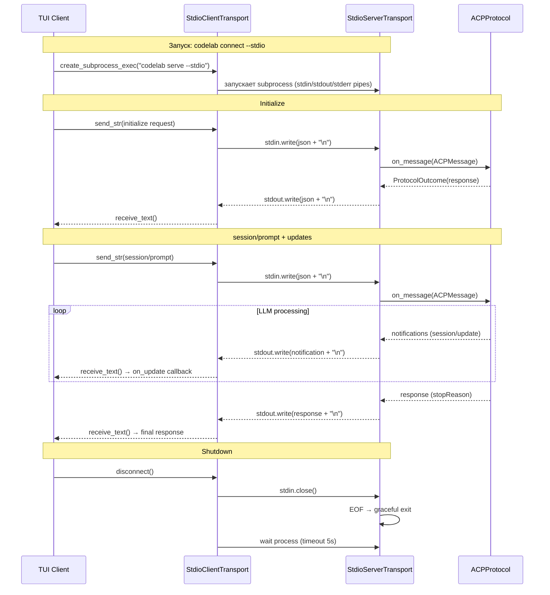

## Why

Спецификация ACP определяет stdio как **основной** транспорт: клиент запускает агент как subprocess, сообщения передаются через stdin/stdout в формате newline-delimited JSON-RPC. Текущая реализация поддерживает только WebSocket, что не соответствует спецификации и блокирует интеграцию с внешними клиентами (IDE plugins, VS Code extensions).

## What Changes

- **Сервер**: новый `server/transport/` пакет с абстракцией `AcpServerTransport` и реализациями `WebSocketTransport`, `StdioServerTransport`
- **Сервер CLI**: флаг `codelab serve --stdio` для запуска сервера в stdio режиме
- **Клиент**: новый `StdioClientTransport` — запуск агента как subprocess через `asyncio.create_subprocess_exec`
- **Клиент CLI**: флаг `codelab connect --stdio --agent-command "..."` для подключения через stdio
- **Local mode**: `codelab` без подкоманды запускает сервер как subprocess через stdio (вместо thread + WebSocket)
- **DI**: параметризация `ACPTransportService` для работы с любым `Transport`
- **Рефакторинг**: перенос WebSocket логики из `ACPHttpServer.handle_ws_request()` в `WebSocketTransport` — без изменения поведения

## Capabilities

### New Capabilities
- `stdio-transport`: поддержка stdio транспорта для сервера и клиента. Включает:
  - `StdioServerTransport` — чтение JSON-RPC из stdin, запись в stdout (newline-delimited)
  - `StdioClientTransport` — запуск subprocess, коммуникация через pipes
  - Graceful shutdown, signal handling, EOF обработка
  - Логирование ТОЛЬКО в stderr (stdout — чистый JSON-RPC)
  - asyncio.Lock для предотвращения race condition при записи

### Modified Capabilities
- `codelab`: изменение CLI (`serve --stdio`, `connect --stdio`), local mode переводится на stdio, транспортный слой сервера выделяется в отдельный пакет

## Impact

**Затронутые файлы сервера:**
- `server/transport/` — новый пакет (base.py, websocket.py, stdio.py, stdio_runner.py)
- `server/http_server.py` — делегирование в WebSocketTransport
- `server/cli.py` — новый флаг --stdio
- `codelab/cli.py` — флаги --stdio для serve/connect, изменение run_local()

**Затронутые файлы клиента:**
- `client/infrastructure/stdio_transport.py` — новый StdioClientTransport
- `client/infrastructure/services/acp_transport_service.py` — параметризация транспорта
- `client/infrastructure/client_config.py` — поля transport_mode, stdio_command, stdio_args
- `client/infrastructure/providers.py` — factory для stdio/websocket
- `client/infrastructure/container_factory.py` — новые параметры
- `client/tui/app.py` — поддержка stdio mode

**Новые тесты:**
- `tests/server/transport/test_stdio_transport.py`
- `tests/server/transport/test_websocket_transport.py`
- `tests/client/infrastructure/test_stdio_transport.py`
- `tests/client/infrastructure/test_stdio_acp_transport_service.py`

**Breaking changes:** Нет. Все новые опции опциональны, дефолтное поведение WebSocket сохраняется.

## Sequence Diagram: stdio transport flow

