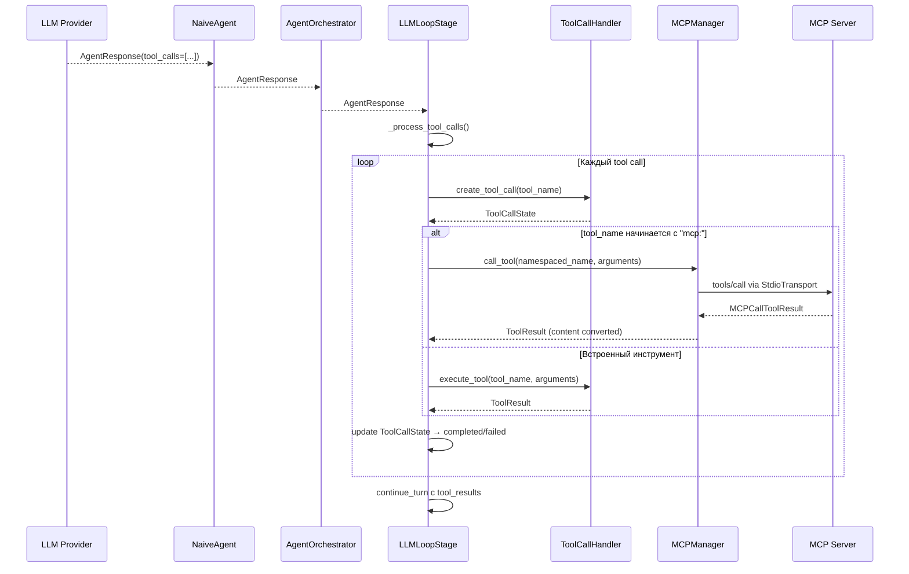
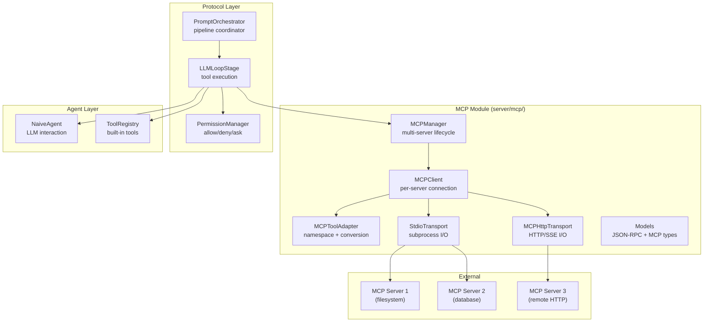

# Design: Complete MCP Integration

## Architecture

### MCP Tools в LLM Loop



### MCP Components



## Key Design Decisions

### 1. MCP Tool Namespace

MCP инструменты используют формат `mcp:{server_id}:{tool_name}` для уникальной идентификации. Это позволяет:
- Различать MCP инструменты от встроенных (filesystem, terminal)
- Поддерживать несколько MCP серверов с одинаковыми именами инструментов
- Легко маршрутизировать вызовы в `LLMLoopStage`

### 2. Content Conversion

MCP tool results содержат `content: list[MCPContent]` где MCPContent может быть:
- `MCPTextContent` → ACP `TextContent`
- `MCPImageContent` → ACP `ImageContent` (base64)
- `MCPEmbeddedResource` → ACP `EmbeddedContent`

Конвертация происходит в `MCPToolExecutor.execute()` перед возвратом `ToolResult`.

### 3. Auto-reconnect Strategy

- **Exponential backoff**: 1s → 2s → 4s → 8s → 16s (max)
- **Max retries**: 5 попыток
- **Health check**: periodic ping или monitoring subprocess exit
- **Graceful degradation**: если server не восстанавливается, удалить из active и notify

### 4. Notifications Flow

```
MCP Server → StdioTransport → MCPClient → MCPManager → PromptOrchestrator → Client
```

MCP notifications (`tools/list_changed`) обрабатываются в `_handle_message()` транспорта, передаются через callback в MCPClient, затем в MCPManager, который обновляет кэш инструментов и уведомляет PromptOrchestrator.

### 5. HTTP Transport

- aiohttp-based `ClientSession` для connection pooling
- POST для client→server messages
- SSE для server→client streaming (optional)
- Headers: Authorization, Content-Type из MCPServerConfig
