# OpenSpec: codelab (ACP-протокол)

## 1. Обзор проекта

**CodeLab** — унифицированная реализация Agent Client Protocol (ACP) для взаимодействия AI-агентов с редакторами кода. Проект объединяет ACP-сервер (интеллектуальный агент), TUI-клиент (терминальный интерфейс) и Web UI в едином Python-пакете.

**Домен**: AI Coding Agents, Протоколы взаимодействия агент-клиент, Инструменты для разработчиков.

**Техстек**:
- Python 3.12+, asyncio
- Pydantic 2.11+ (модели данных, сериализация)
- aiohttp 3.12+ (WebSocket транспорт)
- websockets, aiofiles
- structlog (структурированное логирование)
- openai (LLM провайдер)
- textual 0.66+ (TUI фреймворк)
- textual-serve (Web UI)
- ruff (линтер), ty (тайпчекер), pytest (тесты)
- uv (менеджер пакетов)
- dishka (DI контейнер)

## 2. Проектирование системы

### 2.1 Принципы архитектуры

1. **Модульность** — каждый компонент имеет единую ответственность.
2. **Расширяемость** — добавление новых компонентов не требует изменения существующих.
3. **Тестируемость** — все слои имеют интерфейсы для mock-объектов.
4. **Асинхронность** — полная async/await модель для всех I/O операций.
5. **Соответствие протоколу** — строгое следование спецификации ACP (документы в `doc/Agent Client Protocol/`).
6. **Пятислойная Clean Architecture** для клиента разделяет инфраструктуру, домен, приложение, презентацию и UI.

### 2.2 Высокоуровневая архитектура

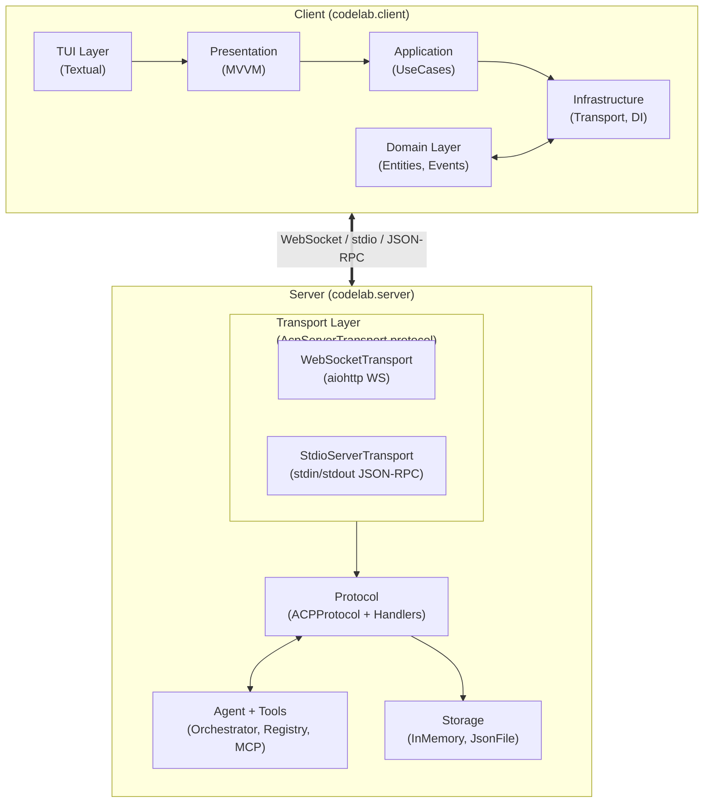

## 3. Структура проекта

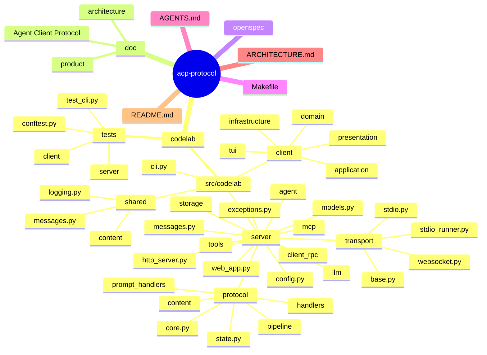

## 4. Ключевые компоненты и их ответственность

### 4.1 Server

| Компонент | Файл | Ответственность |
|-----------|------|-----------------|
| `ACPProtocol` | `core.py` | Диспетчер методов ACP, onion-pattern middleware, реестр обработчиков |
| `SessionState` | `state.py` | Pydantic-модель состояния сессии (history, active_turn, tool_calls, events_history) |
| `PromptOrchestrator` | `handlers/prompt_orchestrator.py` | Центральный координатор prompt-turn через Pipeline Pattern |
| `AgentOrchestrator` | `agent/orchestrator.py` | Управление LLM-агентом, конвертация SessionState ↔ AgentContext |
| `NaiveAgent` | `agent/naive.py` | Базовая реализация LLM-агента (агностична к провайдеру) |
| `SimpleToolRegistry` | `tools/registry.py` | Реестр инструментов агента |
| `ClientRPCService` | `client_rpc/service.py` | Асинхронный RPC сервис для Agent → Client вызовов (fs/*, terminal/*) |
| `ACPHttpServer` | `http_server.py` | WebSocket HTTP сервер на aiohttp, делегирование в WebSocketTransport |
| `AcpServerTransport` | `transport/base.py` | Протокол (ABC) транспорта сервера: `run(on_message)`, `send(message)`, `close()` |
| `WebSocketTransport` | `transport/websocket.py` | WebSocket реализация AcpServerTransport, deferred prompts, background tool execution |
| `StdioServerTransport` | `transport/stdio.py` | Stdio реализация AcpServerTransport, чтение JSON-RPC из stdin, запись в stdout (newline-delimited) |
| `run_stdio_server` | `transport/stdio_runner.py` | Функция запуска сервера в stdio режиме: DI контейнер, ClientRPCService, цикл обработки |
| `SessionStorage` | `storage/base.py` | ABC для хранилищ сессий (InMemory, JsonFile) |
| `MCPManager` | `mcp/manager.py` | Управление MCP серверами (подключение, инструменты) |

### 4.2 Client

| Компонент | Слой | Ответственность |
|-----------|------|-----------------|
| `Session`, `Message`, `Permission`, `ToolCall` | `domain/` | Сущности предметной области |
| Use Cases (`create_session`, `send_prompt`, `load_session`) | `application/` | Бизнес-сценарии |
| `UIConnectionStateMachine` | `application/` | Машина состояний UI |
| `DIContainer` | `infrastructure/` | Dependency Injection |
| `BackgroundReceiveLoop` | `infrastructure/` | Единственный receive() на WebSocket |
| `MessageRouter` | `infrastructure/` | Маршрутизация сообщений по очередям |
| `EventBus` | `infrastructure/` | Pub/Sub система событий |
| `ChatViewModel`, `SessionViewModel` | `presentation/` | ViewModels (MVVM) |
| Textual виджеты | `tui/` | Chat view, File tree, Permission modal |

### 4.3 Shared

| Компонент | Файл | Ответственность |
|-----------|------|-----------------|
| `ACPMessage` | `shared/messages.py` | Универсальная JSON-RPC 2.0 модель |
| `shared/logging.py` | `logging.py` | Настройка structlog с ротацией файлов |
| `TextContent`, `ImageContent`, `AudioContent`, `EmbeddedContent`, `ResourceLinkContent` | `shared/content/` | ACP Content Types |

## 5. Потоки данных

### 5.1 Prompt Turn (основной сценарий)

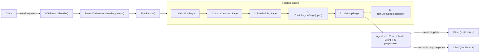

### 5.2 Permission Flow

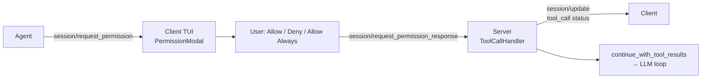

### 5.3 Client RPC (Agent → Client)

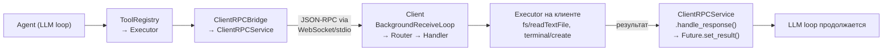

## 6. Модели данных

### 6.1 SessionState (серверная модель)

```yaml
SessionState:
  fields:
    session_id: str                    # Уникальный ID сессии
    cwd: str                           # Рабочая директория
    mcp_servers: list[dict]            # Конфигурация MCP серверов
    title: str | None                  # Заголовок сессии
    updated_at: str                    # ISO 8601 timestamp
    config_values: dict[str, str]      # mode, model и др. опции
    history: list[HistoryMessage]      # LLM контекст (user/assistant/tool сообщения)
    active_turn: ActiveTurnState | None # Текущий prompt-turn
    tool_calls: dict[str, ToolCallState] # Реестр tool calls
    available_commands: list[AvailableCommand] # Slash-команды
    latest_plan: list[PlanStep]       # План агента
    permission_policy: dict[str, str]  # Персистентные решения разрешений
    cancelled_permission_requests: set[JsonRpcId]  # Отменённые permission requests
    cancelled_client_rpc_requests: set[JsonRpcId]   # Отменённые client RPC
    runtime_capabilities: ClientRuntimeCapabilities | None  # Возможности клиента
    events_history: list[dict]         # История событий (для replay)
    mcp_manager: Any                  # MCPManager (runtime, не сериализуется)
```

### 6.2 ACPMessage (JSON-RPC 2.0)

```yaml
ACPMessage:
  fields:
    jsonrpc: "2.0"                    # Фиксированная версия
    id: str | int | None              # ID запроса/ответа
    method: str | None                # Метод (для request/notification)
    params: dict | None               # Параметры
    result: Any | None                # Результат (для response)
    error: JsonRpcError | None        # Ошибка (для response)
  methods:
    - request(method, params)         # Создать request
    - response(id, result)            # Создать успешный response
    - error_response(id, code, message) # Создать error response
    - notification(method, params)    # Создать notification
    - from_json(raw)                  # Десериализация
    - to_json()                       # Сериализация
```

### 6.3 Протокольные outcome

```yaml
ProtocolOutcome:
  fields:
    response: ACPMessage | None       # Финальный response
    notifications: list[ACPMessage]   # Поток промежуточных уведомлений
    followup_responses: list[ACPMessage]  # Отложенные JSON-RPC ответы
    pending_tool_execution: PendingToolExecution | None  # Ожидающее выполнение tool
```

## 7. API протокола ACP (реализованные методы)

### 7.1 Initialization

| Метод | Направление | Описание |
|-------|-------------|----------|
| `initialize` | Client → Agent | Согласование версии протокола и возможностей |
| `authenticate` | Client → Agent | Аутентификация (API key) |

### 7.2 Session Management

| Метод | Направление | Описание |
|-------|-------------|----------|
| `session/new` | Client → Agent | Создание новой сессии |
| `session/load` | Client → Agent | Загрузка существующей сессии |
| `session/list` | Client → Agent | Список сессий (с пагинацией) |
| `session/set_config_option` | Client → Agent | Установка опции конфигурации |
| `session/set_mode` | Client → Agent | Переключение режима (ask/code) |

### 7.3 Prompt Turn

| Метод | Направление | Описание |
|-------|-------------|----------|
| `session/prompt` | Client → Agent | Отправка промпта (основной метод) |
| `session/cancel` | Client → Agent | Отмена активного turn |
| `session/update` | Agent → Client | Поток уведомлений (notifications) |
| `session/request_permission` | Agent → Client | Запрос разрешения пользователя |
| `session/request_permission_response` | Client → Agent | Ответ на запрос разрешения |

### 7.4 Утилиты

| Метод | Направление | Описание |
|-------|-------------|----------|
| `ping` | Client ↔ Agent | Проверка соединения |
| `echo` | Client ↔ Agent | Echo тест |
| `shutdown` | Client → Agent | Завершение сервера |

## 8. Конфигурация

### 8.1 Переменные окружения

```yaml
LLM Provider:
  CODELAB_LLM_PROVIDER: "mock" | "openai" | "anthropic"  (default: mock)
  CODELAB_LLM_API_KEY: str (required for openai/anthropic)
  CODELAB_LLM_BASE_URL: str (optional, for custom API endpoints)
  CODELAB_LLM_MODEL: str (default: "gpt-4o")
  CODELAB_LLM_TEMPERATURE: float (default: 0.7)
  CODELAB_LLM_MAX_TOKENS: int (default: 8192)

Server:
  CODELAB_PORT: int (default: 8765)
  CODELAB_HOST: str (default: "127.0.0.1")
  CODELAB_WS_MAX_MSG_SIZE: int (default: 4MB)
  CODELAB_WS_HEARTBEAT_INTERVAL: float (default: 30.0)
  CODELAB_SESSION_CACHE_SIZE: int (default: 200)

Agent:
  CODELAB_SYSTEM_PROMPT: str (default: русскоязычный промпт-помощник)

Logging:
  CODELAB_LOG_LEVEL: "DEBUG" | "INFO" | "WARNING" | "ERROR" (default: INFO)
```

### 8.2 CLI команды

```yaml
codelab:                         # Локальный режим (сервер как subprocess + TUI через stdio)
  flags: [-v, --verbose]
  transport: stdio (сервер запускается как subprocess)

codelab serve:                   # Режим сервера
  flags: [--host, --port, --no-web, --stdio]
  поведение:
    - Без --stdio: WebSocket сервер на host:port
    - С --stdio: stdio транспорт (stdin/stdout), --host/--port игнорируются, Web UI отключается

codelab connect:                 # Режим клиента
  flags: [--host, --port, --cwd, --stdio, --agent-command]
  поведение:
    - Без --stdio: WebSocket подключение к host:port
    - С --stdio: запуск subprocess через StdioClientTransport
    - --agent-command: кастомная команда агента (default: "codelab serve --stdio")
```

## 9. Инструменты агента

### 9.1 Файловая система

| Инструмент | Описание | Capability |
|------------|----------|------------|
| `fs/read_text_file` | Чтение текстового файла с клиента | `fs.readTextFile` |
| `fs/write_text_file` | Запись текстового файла на клиенте | `fs.writeTextFile` |
| `fs/create_directory` | Создание директории | `fs.writeTextFile` |
| `fs/delete_file` | Удаление файла | `fs.writeTextFile` |
| `fs/delete_directory` | Удаление директории | `fs.writeTextFile` |
| `fs/list_directory` | Список файлов в директории | `fs.readTextFile` |
| `fs/move_file` | Перемещение файла | `fs.writeTextFile` |
| `fs/file_info` | Информация о файле | `fs.readTextFile` |

### 9.2 Терминал

| Инструмент | Описание | Capability |
|------------|----------|------------|
| `terminal/create` | Создание терминала и запуск команды | `terminal` |
| `terminal/output` | Получение вывода терминала | `terminal` |
| `terminal/wait_for_exit` | Ожидание завершения команды | `terminal` |
| `terminal/kill` | Отправка сигнала процессу | `terminal` |
| `terminal/release` | Освобождение ресурсов терминала | `terminal` |

### 9.3 План

| Инструмент | Описание |
|------------|----------|
| `update_plan` | Обновление/публикация плана выполнения задачи |

## 10. Правила разработки

### 10.1 Обязательные проверки

```bash
make check          # Линтер + тайпчекер + тесты
# или поэтапно:
cd codelab
uv run ruff check .           # Линтер
uv run ty check               # Тайпчекер
uv run python -m pytest       # Тесты (~1800)
```

### 10.2 Соглашения

- **Язык документации**: русский (кроме кода)
- **Типизация**: строгая, Python 3.12+ (type hints, Pydantic)
- **Стиль**: ruff (E, F, I, UP, B, SIM), line-length=100
- **Тесты**: каждое изменение должно быть покрыто тестом
- **Комментарии**: осмысленные, на русском языке
- **Архитектурная документация**: Mermaid диаграммы
- **Не изменять**: `doc/Agent Client Protocol/` (официальная спецификация)
- **Не нарушать**: соответствие протоколу ACP

## 11. Pipeline обработки prompt-turn (детально)

### 11.1 Архитектура Pipeline

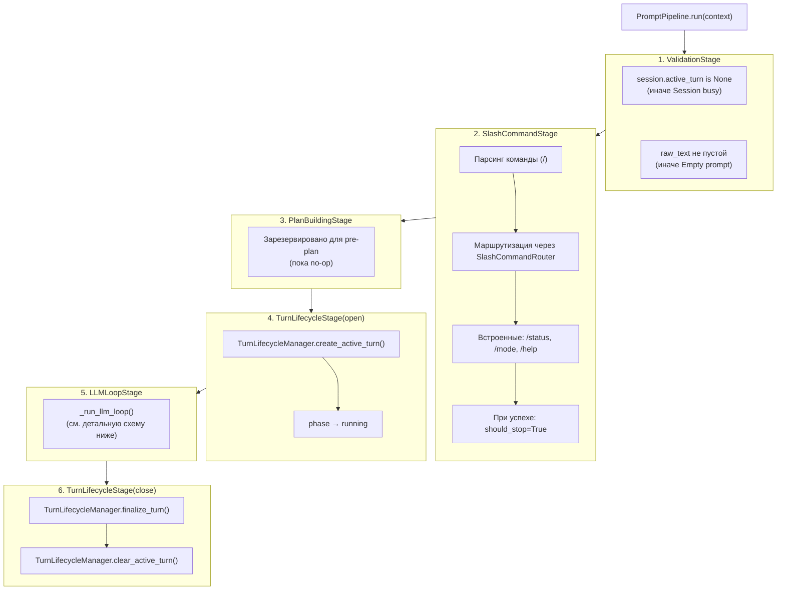

### 11.2 LLM Loop (детально)

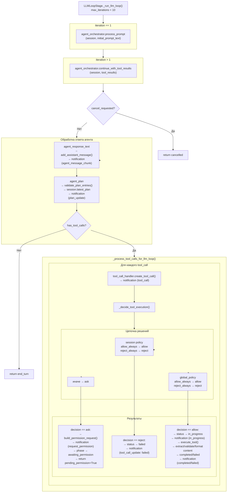

### 11.3 Tool Call State Machine

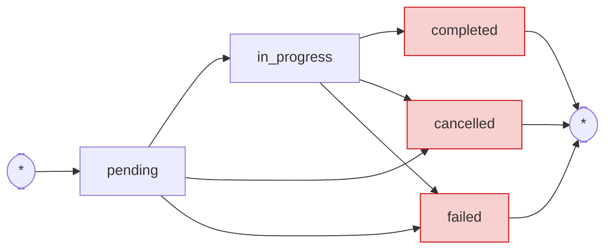

**ToolCallState поля:**

| Поле | Тип | Описание |
|------|-----|----------|
| `tool_call_id` | str | Уникальный ID |
| `title` | str | Отображаемое название |
| `kind` | str | read/edit/delete/move/search/execute/think/fetch/switch_mode/other |
| `status` | str | Текущий статус |
| `content` | list[dict] | Контент при завершении |
| `result_content` | list[dict] | Результат выполнения |
| `tool_name` | str \| None | Имя инструмента в registry |
| `tool_arguments` | dict | Аргументы для выполнения |
| `tool_call_id_from_llm` | str \| None | ID из LLM ответа |

### 11.4 Permission Decision Chain

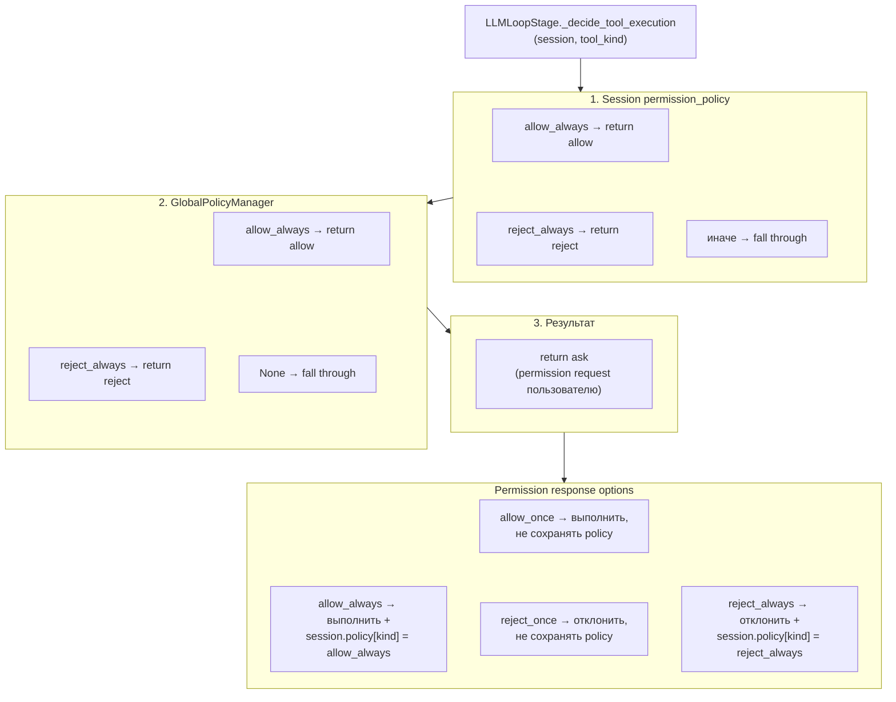

## 12. Turn Lifecycle

### 12.1 Фазы ActiveTurnState

```yaml
Фазы:
  running:                 # Turn активен, LLM обрабатывает
  awaiting_permission:     # Turn ожидает ответ пользователя
  awaiting_client_rpc:     # Turn ожидает RPC ответа от клиента
  completing:              # Turn завершается

Допустимые переходы:
  running → любая фаза
  awaiting_permission → running, completing
  awaiting_client_rpc → running, completing
  completing → completing (терминальная)

Stop reasons:
  end_turn           # Нормальное завершение
  max_tokens         # Достигнут лимит токенов
  max_turn_requests  # Достигнут лимит итераций (10)
  refusal            # LLM отказалась отвечать
  cancelled          # Отменено пользователем
```

### 12.2 Late Response Handling

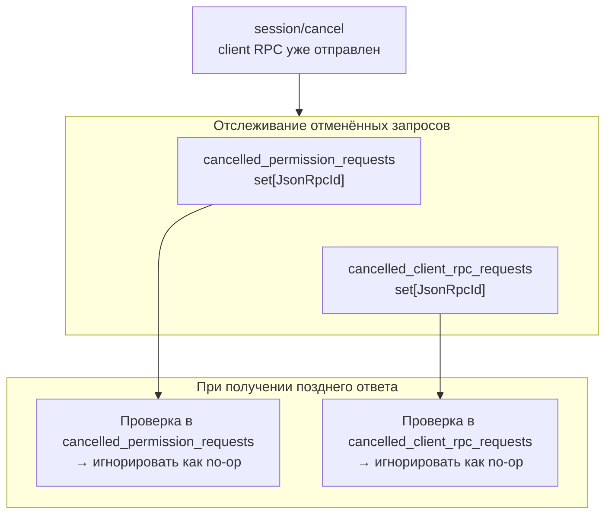

## 13. Контент (Content Types)

### 13.1 ACP Content Types

```yaml
TextContent:
  type: "text"
  text: str

ImageContent:
  type: "image"
  source:
    type: "base64"
    media_type: str  # "image/png", "image/jpeg"
    data: str        # base64-encoded

AudioContent:
  type: "audio"
  source:
    type: "base64"
    media_type: str  # "audio/wav", "audio/mpeg"
    data: str        # base64-encoded

EmbeddedContent:
  type: "embedded"
  content: Any       # Вложенный контент

ResourceLinkContent:
  type: "resource"
  resource:
    uri: str
    mimeType: str
    text: str
```

### 13.2 Pipeline обработки контента

```yaml
ContentExtractor:
  - extract_from_result(tool_call_id, result) → ExtractedContent
  - Извлекает контент из результата tool execution

ContentValidator:
  - validate_content_list(content_items) → (is_valid, errors)
  - Проверяет корректность структуры контента

ContentFormatter:
  - format_for_llm(extracted_content, provider="openai"|"anthropic")
  - Форматирует контент под конкретный LLM провайдер
```

## 14. Slash-команды

### 14.1 Встроенные команды

| Команда | Описание | Действие |
|---------|----------|----------|
| `/status` | Статус сессии | Показывает session_id, title, mode, history_length |
| `/mode` | Переключение режима | ask ↔ code |
| `/help` | Справка | Список доступных команд |

### 14.2 Архитектура

```yaml
CommandRegistry:
  - register(handler: CommandHandler)
  - get(name: str) → CommandHandler | None
  - list() → list[CommandHandler]

SlashCommandRouter:
  - route(name, args, session) → SlashCommandOutcome | None

CommandHandler (ABC):
  - name: str
  - description: str
  - async handle(args, session) → SlashCommandOutcome

SlashCommandOutcome:
  - notifications: list[ACPMessage]
  - should_stop: bool (default: True)
```

## 15. Хранилище сессий

### 15.1 SessionStorage (ABC)

```python
class SessionStorage(ABC):
    async def save_session(session: SessionState) -> None
    async def load_session(session_id: str) -> SessionState | None
    async def delete_session(session_id: str) -> bool
    async def list_sessions(cwd=None, cursor=None, limit=100) -> tuple[list[SessionState], str | None]
    async def session_exists(session_id: str) -> bool
```

### 15.2 Реализации

| Бэкенд | Файл | Назначение | Особенности |
|--------|------|------------|-------------|
| `InMemoryStorage` | `storage/memory.py` | Разработка и тесты | Быстрый, данные только в RAM |
| `JsonFileStorage` | `storage/json_file.py` | Production | Pydantic сериализация, по файлу на сессию, кэш в памяти, ротация |
| `GlobalPolicyStorage` | `storage/global_policy_storage.py` | Глобальные политики | JSON файл с permission policies |

## 16. Клиент (детальная архитектура)

### 16.1 Слои Clean Architecture

```mermaid
flowchart TB
    subgraph Domain["Domain Layer (domain/)"]
        D1["entities.py: Session, Message,\nPermission, ToolCall"]
        D2["repositories.py: SessionRepository,\nMessageRepository (ABC)"]
    end

    subgraph Application["Application Layer (application/)"]
        A1["use_cases/: create_session,\nsend_prompt, load_session"]
        A2["state_machine.py:\nUIConnectionStateMachine"]
        A3["dtos.py: SessionDTO, MessageDTO"]
    end

    subgraph Infrastructure["Infrastructure Layer (infrastructure/)"]
        I1["di_container.py, di_bootstrapper.py"]
        I2["transport.py, stdio_transport.py"]
        I3["services/: acp_transport_service,\nbackground_receive_loop,\nmessage_router, routing_queues"]
        I4["events/bus.py: EventBus"]
        I5["handlers/: fs/, terminal/"]
        I6["handler_registry, message_parser,\nplugins, repositories,\nclient_config, providers"]
    end

    subgraph Presentation["Presentation Layer (presentation/)"]
        P1["chat_view_model.py:\nChatViewModel (Observable)"]
        P2["session_view_model.py:\nSessionViewModel"]
        P3["permission_view_model.py:\nPermissionViewModel"]
        P4["file_system_view_model.py:\nFileSystemViewModel"]
    end

    subgraph TUI["TUI Layer (tui/)"]
        T1["app.py: ACPClientApp"]
        T2["components/: chat_view,\nfile_tree, prompt_input,\npermission_modal"]
        T3["navigation/manager.py"]
        T4["styles/, themes/, config.py"]
    end

    Domain --> Application --> Infrastructure --> Presentation --> TUI
```

### 16.2 BackgroundReceiveLoop — маршрутизация сообщений

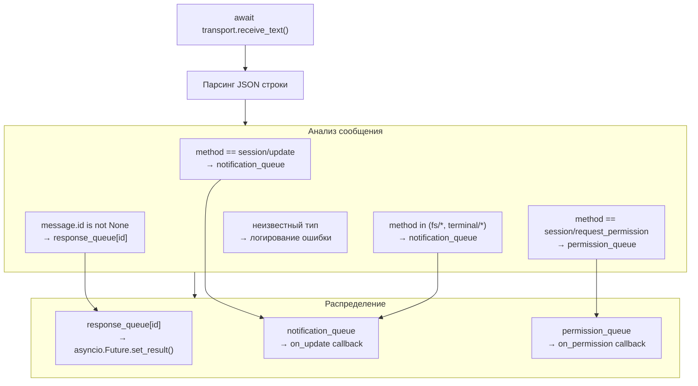

## 17. Тестирование

### 17.1 Структура тестов

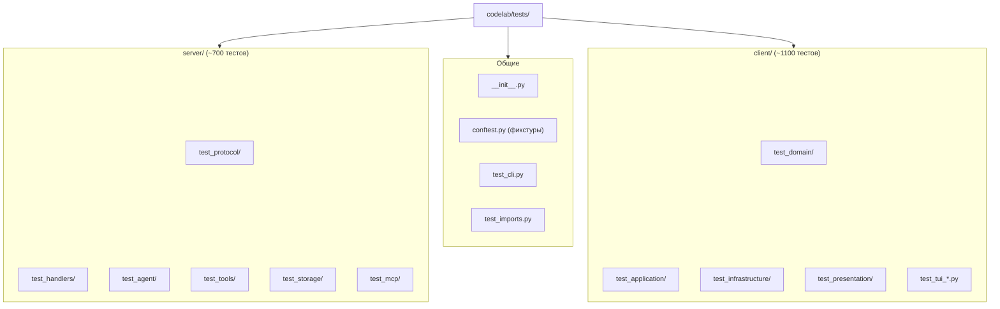

### 17.2 Конфигурация тестов

```yaml
pytest:
  pythonpath: ["src"]
  testpaths: ["tests"]
  asyncio_mode: "auto"

Команды:
  make check         # lint + typecheck + test (полная проверка)
  make test          # все тесты
  make check-server  # только серверные тесты
  make check-client  # только клиентские тесты
```

## 18. Обработка ошибок

### 18.1 Коды ошибок JSON-RPC

| Код | Значение | Описание |
|-----|----------|----------|
| `-32700` | Parse error | Ошибка парсинга JSON |
| `-32600` | Invalid Request | Невалидный JSON-RPC запрос |
| `-32601` | Method not found | Метод не найден |
| `-32602` | Invalid params | Невалидные параметры (включая пустой prompt) |
| `-32603` | Internal error | Внутренняя ошибка сервера |
| `-32000` | Initialize required | Не выполнена инициализация |
| `-32003` | Session busy | Сессия занята другим prompt-turn |

### 18.2 Client RPC Exception Hierarchy

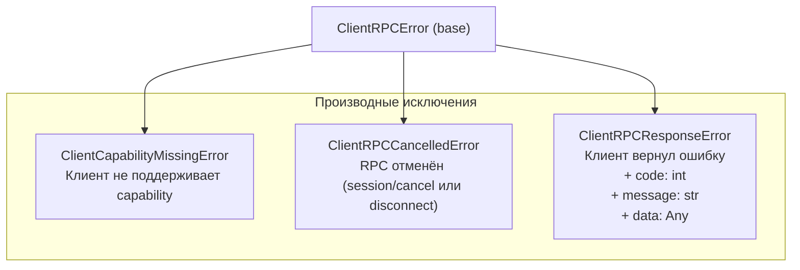

## 19. MCP (Model Context Protocol) интеграция

### 19.1 Компоненты

| Компонент | Файл | Назначение |
|-----------|------|------------|
| `MCPManager` | `mcp/manager.py` | Управление подключениями к MCP серверам |
| `MCPClient` | `mcp/client.py` | Клиент для stdio MCP сервера |
| `MCPServerConfig` | `mcp/models.py` | Конфигурация MCP сервера (name, command, args, env) |
| `ToolAdapter` | `mcp/tool_adapter.py` | Адаптация MCP инструментов в ToolDefinition |
| `StdioTransport` | `mcp/transport.py` | stdio транспорт для MCP |

### 19.2 Жизненный цикл

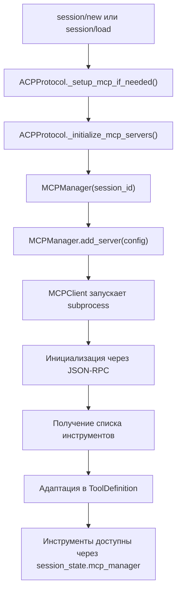

**Особенности:**
- MCPManager не сериализуется (exclude=True в SessionState)
- Пересоздаётся при session/load
- Graceful degradation при ошибке подключения
- Инструменты привязаны к сессии (не регистрируются в глобальном ToolRegistry)

## 20. LLM Провайдеры

### 20.1 Мульти-провайдер архитектура

Система поддерживает 7+ провайдеров через Registry паттерн:

```python
# Базовые интерфейсы
class LLMProvider(ABC):
    @property
    def name(self) -> str: ...
    @property
    def capabilities(self) -> LLMCapabilities: ...
    async def initialize(config: LLMConfig) -> None: ...
    async def create_completion(request: CompletionRequest) -> CompletionResponse: ...
    async def stream_completion(request: CompletionRequest) -> AsyncGenerator[CompletionResponse, None]: ...

# Registry — централизованная регистрация провайдеров
class LLMProviderRegistry:
    def register(provider_id: str, factory: ProviderFactory, info: ProviderInfo) -> None: ...
    async def get_provider(provider_id: str) -> LLMProvider: ...
    async def create_provider(provider_id: str, config: LLMConfig) -> LLMProvider: ...
    def list_all_models() -> list[ModelInfo]: ...

# Resolver — резолвит "provider/model" в конкретный провайдер
class ModelResolver:
    async def resolve(model_ref: str | ModelRef, config: LLMConfig) -> tuple[LLMProvider, str]: ...
```

### 20.2 Поддерживаемые провайдеры

| Провайдер | Базовый класс | Base URL | Модели по умолчанию |
|-----------|--------------|----------|---------------------|
| OpenAI | OpenAICompatibleProvider | https://api.openai.com/v1 | gpt-4o, o3, o4-mini |
| Anthropic | AnthropicProvider (Messages API) | https://api.anthropic.com | claude-sonnet-4, claude-opus-4 |
| OpenRouter | OpenAICompatibleProvider | https://openrouter.ai/api/v1 | mistral-large, llama-3.1 |
| Zen | OpenAICompatibleProvider | https://zen.opencode.ai/v1 | zen-sonnet |
| Go | OpenAICompatibleProvider | https://go.opencode.ai/v1 | go-fast |
| Ollama | OpenAICompatibleProvider | http://localhost:11434/v1 | llama3.1:70b, mistral |
| LMStudio | OpenAICompatibleProvider | http://localhost:1234/v1 | local models |
| Mock | MockLLMProvider | N/A | mock-model |

### 20.3 OpenAICompatibleProvider

Базовый класс для всех OpenAI-совместимых провайдеров:

```python
class OpenAICompatibleProvider(LLMProvider):
    def __init__(self, base_url: str | None = None, default_model: str = "gpt-4o"): ...
    # Конвертация CompletionRequest → OpenAI SDK формат
    # Конвертация OpenAI response → CompletionResponse
    # Поддержка streaming и tool calls
```

Наследники отличаются только `base_url` и `default_model`.

### 20.4 AnthropicProvider

Отдельная реализация через Anthropic Messages API:
- `max_tokens` обязателен в запросе
- Tool format: `input_schema` вместо `parameters`
- Поддержка prompt caching (`cache_control`)
- Extended thinking (Claude 3.7+)

### 20.5 Fallback система

```python
class FallbackStrategy(ABC):
    async def select_provider(candidates, request, context) -> LLMProvider: ...
    def on_success(provider_id: str) -> None: ...
    def on_failure(provider_id: str, error: ProviderError) -> None: ...

class SequentialFallback(FallbackStrategy):
    # Перебирает провайдеры по порядку
    # CircuitBreaker extension point

class FallbackOrchestrator:
    async def execute_completion(providers, request, context) -> CompletionResponse: ...
```

Конфигурация:
```yaml
fallback:
  enabled: false
  strategy: "sequential"
  order: ["openai", "openrouter", "ollama"]
  max_attempts: 3
  retry_on: ["rate_limit", "timeout", "internal_error"]
```

### 20.6 Model Discovery и Telemetry (Extension Points)

```python
class ModelDiscovery(ABC):
    async def discover_models(provider_id: str) -> list[ModelInfo]: ...

class StaticDiscovery(ModelDiscovery):
    # Static list моделей (MVP)

class TelemetrySink(ABC):
    async def record_request(provider, model, latency_ms, success) -> None: ...
    async def record_cost(provider, model, cost_usd) -> None: ...

class NoOpTelemetry(TelemetrySink):
    # Silent pass-through (MVP)
```

### 20.7 ProviderEventBus

Event bus для provider lifecycle событий:
- `ProviderInitialized` — провайдер успешно инициализирован
- `ProviderFailed` — ошибка инициализации
- `ModelsUpdated` — список моделей обновлён
- `FallbackTriggered` — активирован fallback

### 20.8 Формат моделей

Формат: `"provider/model"` (например, `"openai/gpt-4o"`, `"anthropic/claude-sonnet-4"`)

Переключение модели mid-session через `session/set_config_option`:
```json
{
  "sessionId": "session-123",
  "configId": "model",
  "value": "anthropic/claude-sonnet-4"
}
```

### 20.9 Формат сообщений

```yaml
LLMMessage:
  role: "system" | "user" | "assistant" | "tool"
  content: str | None
  tool_calls: list[LLMToolCall] | None  # только для role="assistant"
  tool_call_id: str | None              # только для role="tool"
  name: str | None                      # только для role="tool"

LLMToolCall:
  id: str
  name: str
  arguments: dict

CompletionRequest:
  model: str
  messages: list[LLMMessage]
  tools: list[dict] | None
  temperature: float = 0.7
  max_tokens: int = 8192
  stop: list[str] | None
  stream: bool = False
  extra: dict = {}

CompletionResponse:
  text: str
  tool_calls: list[LLMToolCall]
  stop_reason: StopReason  # end_turn, tool_use, max_tokens, stop_sequence, error, cancelled, refusal
  model: str | None
  usage: dict
  extra: dict

ModelInfo:
  id: str                    # "gpt-4o"
  provider_id: str           # "openai"
  name: str | None
  description: str | None
  context_window: int | None
  max_output_tokens: int | None
  supports_tools: bool = True
  supports_streaming: bool = True
  cost_per_input_token: float | None
  cost_per_output_token: float | None

  @property
  def full_id(self) -> str:  # "openai/gpt-4o"
```

## 21. Agent — внутреннее устройство LLM агента

### 21.1 Иерархия классов

```python
class LLMAgent(ABC):
    """Базовый класс агента."""
    async def initialize(llm_provider, tool_registry, config)
    async def process_prompt(context: AgentContext) -> AgentResponse
    async def cleanup()

class NaiveAgent(LLMAgent):
    """Простой агент с базовым циклом tool-calling."""
    - max_iterations: int = 5  # макс. итераций цикла
    - session_histories: dict[str, list[LLMMessage]]  # per-session контекст
```

### 21.2 AgentContext и AgentResponse

```yaml
AgentContext:
  session_id: str
  session: SessionState              # полное состояние сессии
  prompt: list[dict]                 # content blocks промпта
  conversation_history: list[LLMMessage]  # история из SessionState
  available_tools: list[ToolDefinition]   # инструменты (отфильтрованные)
  config: dict[str, str]             # config_values сессии

AgentResponse:
  text: str                          # текстовый ответ
  tool_calls: list[AgentToolCall] | None  # запрошенные LLM tool calls
  plan: list[dict] | None            # план выполнения (если есть)
  metadata: dict                     # метаданные
```

### 21.3 Алгоритм NaiveAgent

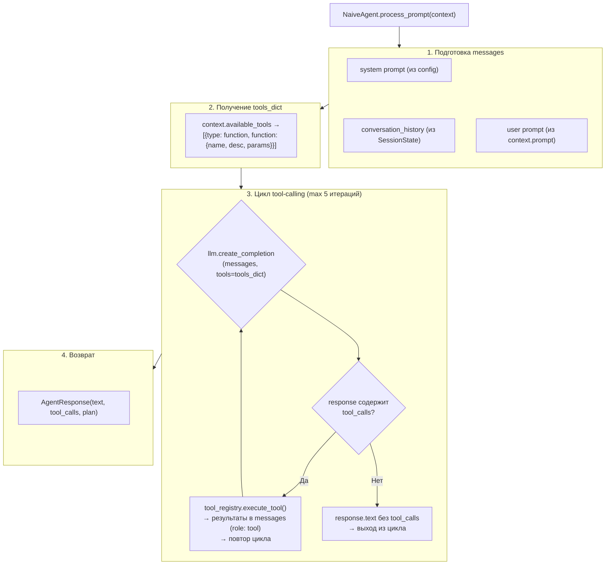

### 21.4 AgentOrchestrator — конвертер SessionState ↔ AgentContext

```yaml
AgentOrchestrator.process_prompt(session_state, prompt):
  1. _create_agent_context() — SessionState → AgentContext:
     - history → LLMMessage[]
     - prompt → форматированный текст
     - all_tools → filter_by_capabilities(runtime_capabilities)
  2. agent.process_prompt(agent_context)
  3. Возврат AgentResponse (НЕ модифицирует SessionState)

AgentOrchestrator._convert_to_llm_messages(history):
  - Парсинг history entry в LLMMessage
  - Поддержка форматов: {"role","text"}, {"role","content"}, {"role","tool_calls"}
  - Санитизация orphaned tool calls:
    - Если assistant сообщение имеет tool_calls, но tool результаты отсутствуют
    - Вставка synthetic: {"role":"tool", "content":"Error: Tool execution did not complete"}

AgentOrchestrator._filter_tools_by_capabilities(tools, capabilities):
  - runtime_capabilities is None → return [] (все инструменты недоступны)
  - fs/read_text_file → требует fs_read=True
  - fs/write_text_file → требует fs_write=True
  - terminal/* → требует terminal=True
  - иначе → исключается

AgentOrchestrator.continue_with_tool_results(session_state, tool_results):
  - Добавление tool results в session_state.history
  - Повторный вызов agent.process_prompt() без нового промпта
```

## 22. Обработчики протокола (handlers)

### 22.1 Auth Handler (`handlers/auth.py`)

```yaml
initialize(request_id, params, supported_protocol_versions, require_auth, auth_methods):
  Валидация:
    ├─ protocolVersion обязателен (integer)
    ├─ clientCapabilities обязателен (object)
    └─ clientInfo опционально (object)
  Согласование:
    ├─ Если requested_version in supported_protocol_versions → negotiated = requested
    ├─ Иначе → negotiated = supported_protocol_versions[-1] (последняя поддерживаемая)
    └─ Возврат agentCapabilities:
        ├─ loadSession: true
        ├─ mcpCapabilities: {http: false, sse: false}
        ├─ promptCapabilities: {image: false, audio: false, embeddedContext: false}
        └─ sessionCapabilities: {list: {}}
  Информация:
    ├─ agentInfo: {name: "codelab-server", title: "ACP Server", version: "0.1.0"}
    └─ authMethods: [...] (если require_auth)

authenticate(request_id, params, require_auth, auth_api_key, auth_methods):
  - Если require_auth=false → автоуспех ({}, True)
  - Валидация methodId ∈ known_method_ids
  - Если auth_api_key задан → валидация apiKey
  - Возврат (response, is_authenticated: bool)

parse_client_runtime_capabilities(capabilities) → ClientRuntimeCapabilities:
  - fs.readTextFile → fs_read: bool (strict True check)
  - fs.writeTextFile → fs_write: bool (strict True check)
  - terminal → terminal: bool (strict True check)
  - Возврат dataclass ClientRuntimeCapabilities(fs_read, fs_write, terminal)
```

### 22.2 Session Handler (`handlers/session.py`)

```yaml
session_new(request_id, params, require_auth, authenticated, config_specs, auth_methods, runtime_capabilities):
  - Проверка аутентификации (если require_auth)
  - Валидация params: cwd (абсолютный путь), mcpServers (list)
  - SessionFactory.create_session(cwd, mcp_servers, config_values, available_commands, runtime_capabilities)
  - Генерация sessionId (через SessionFactory)
  - Возврат {sessionId, configOptions, modes}

session_load(request_id, params, require_auth, authenticated, config_specs, auth_methods, storage):
  - Проверка аутентификации
  - Валидация params: sessionId (str), cwd (абсолютный путь), mcpServers (list)
  - Загрузка SessionState из storage
  - _cleanup_session_state() → отмена active turn, cancelled_permission_requests и т.д.
  - ReplayManager.replay_history() для восстановления уведомлений
  - Fallback: tool_calls из session.tool_calls если не были в events_history
  - Доп. уведомления: config_option_update, available_commands_update, session_info
  - Возврат ProtocolOutcome(response={configOptions, modes}, notifications=[...])

session_list(request_id, params, storage, page_size=50):
  - Пагинация через cursor (opaque, base64 encoded JSON {"index": N})
  - cursor → decode → start_index
  - Загрузка всех сессий из storage (пачками по 100), сортировка по updatedAt desc
  - Формат ответа: {sessions: [{sessionId, cwd, title, updatedAt}], nextCursor: str | None}

Вспомогательные функции:
  build_config_options(values, config_specs) → list[{id, name, category, type, currentValue, options}]
  build_modes_state(values, config_specs) → {availableModes, currentModeId}
  session_info_notification(session_id, title, updated_at) → ACPMessage
  build_default_commands() → list[{name, description, input?}]
```

### 22.3 Prompt Handler (`handlers/prompt.py`)

```yaml
session_prompt(request_id, params, storage, config_specs, agent_orchestrator, tool_registry, client_rpc_service, global_manager):
  1. Валидация sessionId (str), prompt (list, не пуст)
  2. validate_prompt_content(): проверка каждого content block
     - type "text": текст обязателен, макс 100_000 символов
     - type "resource_link": обязательны uri и name
     - остальные типы → ошибка
  3. Загрузка сессии из storage
  4. Проверка active_turn is None (если busy → ошибка -32002)
  5. Если передан agent_orchestrator:
     - create_prompt_orchestrator(tool_registry, client_rpc_service, global_manager)
     - orchestrator.handle_prompt(request_id, params, session, storage, agent_orchestrator)
     - Сохранение сессии в storage
  6. Если agent_orchestrator НЕ передан (legacy):
     - resolve_prompt_directives(params, text_preview) → PromptDirectives
     - slash-команды: /plan, /tool, /tool-pending, /fs-read, /fs-write, /term-run
     - structured overrides через _meta.promptDirectives
     - ReplayManager.save_user_message_chunk() / save_agent_message_chunk()
     - Client RPC flow (fs/terminal) или tool flow с permission chain
     - Deferred completion: если keep_tool_pending или permission_request или pending RPC
     - session.save() → storage

create_prompt_orchestrator(tool_registry, client_rpc_service, global_policy_manager) → PromptOrchestrator:
  1. Создаёт StateManager, PlanBuilder, TurnLifecycleManager, ToolCallHandler, PermissionManager, ClientRPCHandler
  2. PromptOrchestrator(state_manager, plan_builder, turn_lifecycle_manager, tool_call_handler, permission_manager, client_rpc_handler, tool_registry, client_rpc_service, global_policy_manager)
  3. Если client_rpc_service передан: регистрирует FileSystemToolDefinitions, TerminalToolDefinitions, PlanToolDefinitions в tool_registry
  4. Иначе: регистрирует только PlanToolDefinitions
  5. Slash commands: StatusCommandHandler, ModeCommandHandler, HelpCommandHandler
  6. PromptPipeline: [ValidationStage, SlashCommandStage, PlanBuildingStage, TurnLifecycleStage(open), LLMLoopStage, TurnLifecycleStage(close)]

session_cancel(request_id, params, storage):
  1. Валидация sessionId
  2. Загрузка сессии из storage
  3. create_prompt_orchestrator()
  4. orchestrator.handle_cancel(request_id, params, session)
     - Mark cancel_requested = true
     - Cancel active tool calls
     - Cancel pending permission requests (→ cancelled_permission_requests)
     - Cancel pending client RPC (→ cancelled_client_rpc_requests)
     - client_rpc_service.cancel_all_pending_requests()
     - TurnLifecycleManager.finalize_turn("cancelled")
     - Clear active turn
  5. Followup response: если был deferred prompt, отправляем {stopReason: "cancelled"}
  6. Сохранение сессии

complete_active_turn(session, *, stop_reason="end_turn"):
  - TurnLifecycleManager.finalize_active_turn() → ACPMessage response
  - Очистка active_turn

should_auto_complete_active_turn(session):
  - True если turn.phase == "waiting_tool_completion"
  - False если turn ожидает permission-response или нет active turn

Вспомогательные функции:
  extract_prompt_directives(text_preview, supported_tool_kinds) → PromptDirectives
  resolve_prompt_directives(params, text_preview, supported_tool_kinds) → PromptDirectives
  normalize_stop_reason(stop_reason) → одна из: end_turn, max_tokens, max_turn_requests, refusal, cancelled
  normalize_tool_kind(candidate, supported_tool_kinds) → str | None
  resolve_tool_title(kind) → str
  build_plan_entries(directives, text_preview) → list[dict]
  build_fs_client_request(session, session_id, directives) → PreparedFsClientRequest | None
  build_terminal_client_request(session, session_id, directives) → PreparedFsClientRequest | None
  build_executor_tool_execution_updates(session, session_id, tool_call_id, leave_running) → list[ACPMessage]
  build_policy_tool_execution_updates(session, session_id, tool_call_id, allowed) → list[ACPMessage]
```

## 23. Server Content Pipeline

### 23.1 ContentExtractor

```yaml
ContentExtractor.extract_from_result(tool_call_id, result: ToolExecutionResult) → ExtractedContent:
  - Если result.content не пуст → использовать как есть
  - Иначе → fallback: [{"type": "text", "text": text_content}]
    где text_content = result.output or (result.error if not result.success else "")
  - Асинхронный (async) метод
  - Возврат ExtractedContent(tool_call_id, content_items, has_content)

ContentExtractor.extract_batch(results: list[tuple[str, ToolExecutionResult]]) → list[ExtractedContent]:
  - Пакетное извлечение из нескольких результатов

ExtractedContent:
  tool_call_id: str
  content_items: list[dict]  # [{type, text}, {type, ...}]
  has_content: bool
```

### 23.2 ContentValidator

```yaml
ContentValidator.validate_content_list(content_items) → (is_valid: bool, errors: list[str]):
  - Проверка структуры: каждый элемент должен иметь "type" и соответствующее содержимое
  - Поддержка типов: text, diff, image, audio, resource, embedded
  - Возврат кортежа (валидно, [список ошибок])
```

### 23.3 ContentFormatter

```yaml
ContentFormatter.format_for_llm(extracted_content: ExtractedContent, provider="openai" | "anthropic") → dict:
  - OpenAI: конвертация в {role: "tool", tool_call_id, content: merged_text}
  - Anthropic: конвертация в {role: "user", content: [{type: "tool_result", tool_use_id, content}]}
  - Внутренний merge_content_items: объединяет content items в один текст
    (text → plain text, diff → ```diff блок, image → [Image: alt_text], audio → [Audio], embedded → рекурсивно, resource_link → [Resource: uri])
  - Возврат отформатированного dict для конкретного провайдера

ContentFormatter.format_batch_for_llm(extracted_contents: list[ExtractedContent], provider) → list[dict]:
  - Пакетное форматирование нескольких content items
```

## 24. Client RPC Models

### 24.1 File System

```yaml
ReadTextFileRequest:
  sessionId: str
  path: str
  line: int | None       # 0-based start line
  limit: int | None      # max lines

ReadTextFileResponse:
  content: str           # file contents

WriteTextFileRequest:
  sessionId: str
  path: str
  content: str           # content to write

WriteTextFileResponse:
  success: bool
```

### 24.2 Terminal

```yaml
TerminalCreateRequest:
  sessionId: str
  command: str
  args: list[str] | None
  env: dict[str, str] | None
  cwd: str | None
  outputByteLimit: int | None

TerminalCreateResponse:
  terminal_id: str

TerminalOutputRequest:
  sessionId: str
  terminalId: str

TerminalOutputResponse:
  output: str
  is_complete: bool
  exit_code: int | None

TerminalWaitForExitRequest:
  sessionId: str
  terminalId: str
  timeout: float | None

TerminalWaitForExitResponse:
  output: str
  exit_code: int

TerminalKillRequest:
  sessionId: str
  terminalId: str
  signal: str           # default: "SIGTERM"

TerminalKillResponse:
  success: bool

TerminalReleaseRequest:
  sessionId: str
  terminalId: str

TerminalReleaseResponse:
  success: bool
```

### 24.3 PendingRequest (внутренняя модель)

```yaml
PendingRequest:
  future: asyncio.Future[Any]       # для получения результата
  cancellation_event: asyncio.Event  # для координированной отмены
  method: str                       # имя RPC метода
  created_at: float                 # Unix timestamp
```

## 25. ReplayManager — воспроизведение сессий

### 25.1 Сохраняемые типы событий

```yaml
Типы sessionUpdate для events_history:
  user_message_chunk        # сообщение пользователя
  agent_message_chunk       # ответ агента (потоковый)
  tool_call                 # создание tool call {toolCallId, title, kind, status}
  tool_call_update          # обновление статуса {toolCallId, status, content?}
  plan                      # план агента {entries: [{description, priority, status}]}
  session_info              # метаданные сессии {title, updated_at}
  config_option_update      # изменение конфигурации {configOptions}
  current_mode_update       # смена режима {modeId}
  available_commands_update # обновление команд {availableCommands}
```

### 25.2 Алгоритм replay

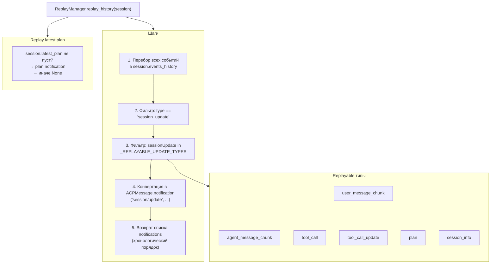

## 26. PlanBuilder — построение планов

### 26.1 Структура PlanEntry

```yaml
PlanEntry:
  content: str                  # описание/заголовок шага
  priority: "low" | "medium" | "high"  # приоритет (default: "medium")
  status: "pending" | "in_progress" | "completed"  # статус (default: "pending")
  description: str | None       # расширенное описание (необязательно, обрезается до 500 символов)

В сессии хранится как latest_plan: list[{title, description}]
```

### 26.2 PlanBuilder API

```yaml
PlanBuilder:
  should_publish_plan(directives: PromptDirectives) → bool:
    - True если publish_plan=True и plan_entries не пуст

  validate_plan_entries(raw_entries: Any) → list[dict] | None:
    - Проверка: raw_entries — непустой список
    - Каждый entry: обязателен content/title, опциональны priority (default: medium), status (default: pending)
    - Валидация priority ∈ {low, medium, high}
    - Валидация status ∈ {pending, in_progress, completed, cancelled}
    - Нормализация полей (обрезка content до 200 символов, description до 500)
    - Пропуск entry без content/title (continue)
    - Возврат list[dict{content, priority, status}] или None

  normalize_plan_entries(raw_entries) → list[dict] | None:
    - Alias для validate_plan_entries (обратная совместимость)

  build_plan_notification(session_id, plan_entries) → ACPMessage:
    - notification("session/update", {sessionUpdate: "plan", entries})

  extract_plan_from_directives(directives: PromptDirectives) → list[dict] | None:
    - Извлекает plan_entries из PromptDirectives и валидирует

  update_session_plan(session: SessionState, plan_entries) → None:
    - Обновляет session.latest_plan в формате [{title, description}]

  build_plan_updates(session, session_id, directives) → list[ACPMessage]:
    - Строит все plan-related notifications
    - Вызывает should_publish_plan → extract_plan_from_directives → update_session_plan → build_plan_notification
```

## 27. Client Application Layer

### 27.1 Use Cases

```yaml
UseCase (ABC):
  - execute(*args, **kwargs) → Any: абстрактный метод выполнения

InitializeUseCase(UseCase):
  Зависимости: TransportService
  execute() → InitializeResponse:
    - transport.connect()
    - send initialize request → получает server capabilities
    - Возврат InitializeResponse(protocolVersion, serverCapabilities, serverInfo)

CreateSessionUseCase(UseCase):
  Зависимости: TransportService, SessionRepository
  execute(request: CreateSessionRequest) → CreateSessionResponse:
    - Отправляет session/new с cwd и mcpServers
    - Получает sessionId, configOptions, modes
    - Сохраняет сессию в репозитории
    - Возврат CreateSessionResponse(sessionId, ...)

SendPromptUseCase(UseCase):
  execute(request: SendPromptRequest) → SendPromptResponse:
    - Отправляет session/prompt с текстом
    - Управляет потоком session/update notifications через callbacks
    - Обрабатывает permission requests через on_permission callback
    - Возврат SendPromptResponse(notifications, finalResponse)

LoadSessionUseCase(UseCase):
  execute(request: LoadSessionRequest) → LoadSessionResponse:
    - Отправляет session/load с sessionId
    - Принимает поток replay notifications
    - Восстанавливает сессию в репозитории
    - Возврат LoadSessionResponse(session, notifications)

ListSessionsUseCase(UseCase):
  execute(sessionId) → ListSessionsResponse:
    - Отправляет session/list
    - Возврат ListSessionsResponse(sessions, nextCursor)
```

### 27.2 State Machine

```yaml
UIStateMachine:
  Состояния (UIState enum):
    INITIALIZING       # инициализация соединения с сервером
    READY             # готов к работе, ожидание ввода пользователя
    PROCESSING_PROMPT # обработка prompt от пользователя
    WAITING_PERMISSION # ожидание разрешения пользователя на действие
    CANCELLING        # отмена текущей операции
    RECONNECTING      # переподключение к серверу
    ERROR             # состояние ошибки

  Переходы (_TRANSITIONS):
    INITIALIZING → {READY, ERROR, RECONNECTING}
    READY → {PROCESSING_PROMPT, WAITING_PERMISSION, CANCELLING, RECONNECTING, ERROR}
    PROCESSING_PROMPT → {READY, WAITING_PERMISSION, CANCELLING, RECONNECTING, ERROR}
    WAITING_PERMISSION → {PROCESSING_PROMPT, READY, ERROR, RECONNECTING, CANCELLING}
    CANCELLING → {READY, RECONNECTING, ERROR}
    RECONNECTING → {READY, ERROR}
    ERROR → {RECONNECTING, READY}

  Особенности:
    - can_transition(target): False если то же состояние
    - transition(target, reason, metadata): бросает StateTransitionError при недопустимом переходе
    - Уведомление слушателей через Callable[[StateChange], None]
    - reset(initial_state=INITIALIZING) → сброс в начальное состояние
```

### 27.3 DTOs

```yaml
InitializeResponse:
  protocolVersion: int
  serverCapabilities: dict
  serverInfo: dict

CreateSessionRequest:
  cwd: str
  mcpServers: list[dict]

CreateSessionResponse:
  sessionId: str

SendPromptRequest:
  sessionId: str
  text: str
  on_update: Callable  # callback для потока notifications
  on_permission: Callable  # callback для permission requests

SendPromptResponse:
  notifications: list
  finalResponse: dict | None

LoadSessionRequest:
  sessionId: str

LoadSessionResponse:
  session: Session
  notifications: list[ACPMessage]

ListSessionsResponse:
  sessions: list[SessionSummary]
  nextCursor: str | None
```

## 28. Client Presentation Layer (MVVM)

### 28.1 ViewModels (9 шт.)

```yaml
Observable[T]:
  - value: T                    # текущее значение
  - observers: list[Callable]   # подписчики на изменения
  - set(value) → нотификация всех observers
  - subscribe(callback) → unsubscribe

BaseViewModel:
  - logger: structlog
  - on_state_changed: Event     # событие изменения состояния

ChatViewModel:
  - messages: Observable[list[Message]]    # сообщения чата
  - is_processing: Observable[bool]        # флаг обработки
  - streaming_text: Observable[str | None] # потоковый текст
  - send_prompt(text)                      # отправка промпта
  - cancel_prompt()                        # отмена
  - clear_chat()                           # очистка
  - fs_executor, terminal_executor: опциональные executors для tool calls

SessionViewModel:
  - sessions: Observable[list[SessionSummary]]  # список сессий
  - active_session_id: Observable[str | None]
  - create_session(cwd) → sessionId
  - load_session(sessionId)
  - list_sessions()

PermissionViewModel:
  - pending_permission: Observable[PermissionRequest | None]
  - respond(optionId) → отправка решения
  - dismiss()

FileSystemViewModel:
  - current_path: Observable[str]
  - files: Observable[list[FileInfo]]
  - navigate(path)
  - refresh()

FileViewerViewModel:
  - current_file: Observable[str | None]
  - file_content: Observable[str | None]
  - open_file(path)
  - close_file()

TerminalViewModel:
  - terminals: Observable[dict[str, TerminalState]]
  - create_terminal(command)
  - write_input(terminalId, input)
  - kill_terminal(terminalId)

TerminalLogViewModel:
  - terminal_logs: Observable[dict[str, list[str]]]
  - add_log(terminalId, line)
  - clear_logs(terminalId)

PlanViewModel:
  - current_plan: Observable[list[PlanEntry]]
  - update_plan(entries)

UIViewModel:
  - connection_status: Observable[ConnectionStatus]
  - sidebar_tab: Observable[SidebarTab]
  - theme: Observable[ThemeType]
  - toggle_sidebar()
  - toggle_theme()
```

### 28.2 ViewModel Factory

```yaml
ViewModelFactory:
  register_view_models(container, session_coordinator, event_bus, logger, history_dir):
    Регистрирует 9 синглтонов:
    - UIViewModel
    - SessionViewModel
    - PlanViewModel (регистрируется до ChatViewModel, т.к. ChatViewModel зависит от PlanViewModel)
    - ChatViewModel
    - TerminalViewModel
    - FileSystemViewModel
    - FileViewerViewModel
    - PermissionViewModel
    - TerminalLogViewModel
  Все ViewModels получают зависимости через DI контейнер (Scope.SINGLETON).
```

## 29. Client TUI (Textual)

### 29.1 Компоненты (файлы в tui/components/)

```yaml
Компоновка (Layout):
  main_layout.py     # главный макет (header + content + footer)
  header.py          # верхняя панель: статус, сессия
  footer.py          # нижняя панель: горячие клавиши
  sidebar.py         # боковая панель: вкладки
  chat_view.py       # основной чат
  prompt_input.py    # поле ввода промпта
  container.py       # контейнер для компоновки
  panel.py           # базовая панель

Модальные окна:
  permission_modal.py       # запрос разрешения (Allow/Deny/Always)
  permission_request.py     # отображение запроса разрешения
  help_modal.py             # справка по горячим клавишам
  file_change_preview.py    # предпросмотр изменений файлов
  file_change_preview_modal.py  # модальное окно предпросмотра
  command_palette.py        # палитра команд

Панели:
  plan_panel.py         # план выполнения задачи
  tool_panel.py         # панель вызовов инструментов
  tool_call_card.py     # карточка tool call
  tool_call_list.py     # список tool call
  file_tree.py          # дерево файлов
  file_viewer.py        # просмотрщик файлов

Элементы чата:
  message_bubble.py     # сообщение (user/assistant)
  message_list.py       # список сообщений
  streaming_text.py     # потоковый текст
  markdown.py           # markdown рендеринг

Терминал:
  terminal_panel.py     # панель терминала
  terminal_output.py    # вывод терминала
  terminal_log_modal.py # лог терминала

Утилиты:
  toast.py              # уведомления (toast)
  spinner.py            # индикатор загрузки
  status_line.py        # строка статуса
  quick_actions_bar.py  # быстрые действия
  action_bar.py         # панель действий
  action_button.py      # кнопка действия
  search_input.py       # поиск
  tabs.py               # вкладки
  keyboard_manager.py   # управление клавиатурой
  permission_badge.py   # бейдж разрешения
  inline_permission_widget.py  # встроенный виджет разрешения
  progress.py           # прогресс
  collapsible_panel.py  # сворачиваемая панель
  context_menu.py       # контекстное меню
  session_turn.py       # информация о turn
  chat_view_permission_manager.py  # менеджер разрешений чата
```

### 29.2 ACPClientApp

```yaml
ACPClientApp(App[None], Textual App):
  CSS_PATH: "styles/app.tcss"
  BINDINGS: 18 горячих клавиш
    ctrl+q         → quit                # Выход
    ctrl+n         → new_session         # Новая сессия
    ctrl+r         → retry_prompt        # Повторить
    ctrl+b         → toggle_sidebar      # Sidebar
    ctrl+s         → focus_session_list  # Список сессий
    ctrl+j         → next_session        # Следующая сессия
    ctrl+k         → previous_session    # Предыдущая сессия
    ctrl+l         → clear_chat          # Очистить чат
    ctrl+h         → open_help           # Справка (контекстная)
    ?              → show_hotkeys        # Горячие клавиши
    ctrl+tab       → next_sidebar_tab    # Вкладка sidebar
    ctrl+shift+tab → previous_sidebar_tab# Предыдущая вкладка
    ctrl+`         → open_terminal_output# Терминал
    tab            → cycle_focus         # Переключить фокус
    ctrl+c         → cancel_prompt       # Отменить
    ctrl+p         → command_palette     # Палитра команд
    ctrl+t         → toggle_theme        # Переключить тему
    escape         → close_modal         # Закрыть

  Компоновка (compose):
    - HeaderBar (titlebar)
    - MainLayout (id="body"):
        - sidebar-column: Sidebar, FileTree (монтируются в on_ready)
        - main-column:
            - content-area: ChatView, PlanPanel (монтируются в on_ready)
            - dock-region: PromptInput, QuickActionsBar (монтируются в on_ready)
        - right-panel-column: ToolPanel (монтируется в on_ready)
    - FooterBar (статус-бар внизу)
    - ToastContainer (overlay)

  Инициализация конструктора:
    Параметры:
      host: str, port: int, cwd: str | None,
      transport_mode: str ("websocket" | "stdio"),
      stdio_command: str | None, stdio_args: list[str] | None
    DIBootstrapper.build(host, port, cwd, history_dir, transport_mode, stdio_command, stdio_args) → DIContainer
    resolve ViewModels: UIViewModel, SessionViewModel, ChatViewModel,
      PlanViewModel, FileSystemViewModel, TerminalLogViewModel,
      FileViewerViewModel, PermissionViewModel, TerminalViewModel (9 шт.)
    SessionViewModel.selected_session_id.subscribe → _on_selected_session_changed
    UIViewModel.sidebar_tab.subscribe → _on_sidebar_state_changed

  Инициализация on_ready:
    _mount_main_layout_children() → mount всех компонентов
    NavigationManager(self) → навигация по фокусу
    run_worker(_initialize_connection()) → async подключение к серверу

  Инициализация соединения (_initialize_connection):
    SessionCoordinator.initialize() → server_info
    set_connection_status(CONNECTED)
    register_permission_callback → show_permission_modal
    load_sessions_cmd.execute() → загрузка списка сессий

  Permission handling:
    InlinePermissionWidget в ChatView (основной метод)
    PermissionModal (fallback при недоступности ChatView)

  NavigationManager:
    Управление фокусом между компонентами
    Навигация по сессиям (next/previous)

  ThemeManager:
    ThemeType.LIGHT / ThemeType.DARK
    Переключение тем (toggle_theme action)

  TUIConfigStore:
    Конфигурация TUI (connection params и т.д.)
    resolve_tui_connection(host, port) → resolved_host, resolved_port

  Завершение (on_unmount):
    - transport_mode == "stdio": graceful shutdown subprocess (close stdin, wait, terminate)
    - Остановка BackgroundReceiveLoop
    - Очистка ресурсов
```

## 30. Client Infrastructure Services

### 30.1 Транспортный протокол (Transport)

```yaml
Transport (протокол):
  - send_str(data: str) → отправка строки
  - receive_text() → str → получение строки
  - is_connected() → bool → проверка соединения
  - __aenter__() / __aexit__() → async context manager

WebSocketTransport:
  - connect() → установка WebSocket соединения
  - disconnect() → закрытие
  - send_str(data) → отправка через ws.send_str()
  - receive_text() → получение через ws.receive_str()
  - is_connected() → bool

StdioClientTransport:
  файл: client/infrastructure/stdio_transport.py
  - __aenter__() → asyncio.create_subprocess_exec(command, *args, stdin=PIPE, stdout=PIPE, stderr=PIPE)
  - __aexit__() → close stdin, wait (timeout 5s), terminate/kill if needed
  - send_str(data) → запись в stdin subprocess (data + "\n")
  - receive_text() → чтение из stdout queue (asyncio.Queue, timeout 30s)
  - is_connected() → проверка: process.returncode is None
  - _stdout_reader: фоновая задача чтения stdout → queue
  - _stderr_reader: фоновая задача чтения stderr → только логирование
```

### 30.2 ACPTransportService (параметризованный)

```yaml
ACPTransportService:
  - __init__(transport: Transport) → принимает любой Transport (не создаёт внутри)
  - connect() → вызов transport.__aenter__()
  - disconnect() → вызов transport.__aexit__()
  - send(data) → вызов transport.send_str(data)
  - receive_text() → вызов transport.receive_text()
  - is_connected() → вызов transport.is_connected()
  - request_with_callbacks(method, params, callbacks) → JSON-RPC request с callbacks
  - _permission_handler: PermissionHandler (опционально)

create_websocket_transport_service(host, port) → ACPTransportService:
  - Factory функция для обратной совместимости
  - Создаёт WebSocketTransport, оборачивает в ACPTransportService
```

### 30.2 BackgroundReceiveLoop

```yaml
BackgroundReceiveLoop:
  Зависимости: WebSocketTransport, MessageRouter, RoutingQueues
  lifecycle:
    start() → запуск asyncio.Task (если уже запущена, игнорирует)
    stop() → graceful shutdown (5s таймаут, затем cancel)
    is_running() → bool

  loop (_receive_loop):
    while not should_stop:
      json_message = await transport.receive_text()
      message = json.loads(json_message)
      routing_key = router.route(message)
      if routing_key.queue_type == "response":
        queues.put_response(request_id, message)
      elif routing_key.queue_type == "notification":
        queues.put_notification(message)
      elif routing_key.queue_type == "permission":
        queues.put_permission_request(message)

  Использует RoutingQueues для распределения сообщений:
    - put_response(id, message) → asyncio.Future[id]
    - put_notification(message) → очередь on_update callback
    - put_permission_request(message) → очередь on_permission callback
    - broadcast_connection_error(e) → все pending Future получают ошибку

  Диагностика:
    messages_received: int
    messages_routed: int
    errors_count: int

  Обработка ошибок:
    - ConnectionError → broadcast всем очередям, выход из loop
    - CancelledError → выход из loop
    - Остальные Exception → выход из loop с ошибкой
```

### 30.3 MessageRouter

```yaml
MessageRouter:
  route(message: dict) → RoutingKey:
    Приоритет маршрутизации (важен порядок):
    1. method == "session/update" → RoutingKey("notification")
    2. method == "session/request_permission" → RoutingKey("permission")
    3. method.startswith("fs/") or method.startswith("terminal/") → RoutingKey("notification")
    4. message_id is not None → RoutingKey("response", request_id=message_id)
    5. method == "session/cancel" → RoutingKey("notification")
    6. иначе → RoutingKey("unknown")

  RoutingKey:
    queue_type: str    # "response", "notification", "permission", "unknown"
    request_id: JsonRpcId | None

  Вспомогательные методы:
    is_response(message) → bool
    is_notification(message) → bool
    is_permission_request(message) → bool
```

### 30.4 EventBus

```yaml
EventBus:
  - publish(event: DomainEvent) → отправка всем подписчикам (asyncio)
  - subscribe(event_type, handler) → callback при событии
  - unsubscribe(event_type, handler)
  - clear() → удаление всех подписчиков

  Доменные события (DomainEvent, dataclass frozen, ABC):
    SessionCreatedEvent(aggregate_id, occurred_at, session_id, server_host, server_port)
    SessionInitializedEvent(aggregate_id, occurred_at, session_id, capabilities)
    SessionClosedEvent(aggregate_id, occurred_at, session_id, reason)
    SessionLoadedEvent(aggregate_id, occurred_at, session_id, from_storage)

    PromptStartedEvent(aggregate_id, occurred_at, session_id, prompt_text)
    PromptCompletedEvent(aggregate_id, occurred_at, session_id, stop_reason)
    PromptCancelledEvent(aggregate_id, occurred_at, session_id, reason)

    PermissionRequestedEvent(aggregate_id, occurred_at, session_id, action, resource, permission_id)
    PermissionGrantedEvent(aggregate_id, occurred_at, session_id, permission_id, action)
    PermissionDeniedEvent(aggregate_id, occurred_at, session_id, permission_id, action)

    ErrorOccurredEvent(aggregate_id, occurred_at, error_message, error_type, session_id)
    ConnectionLostEvent(aggregate_id, occurred_at, session_id, error_message)
    ConnectionRestoredEvent(aggregate_id, occurred_at, session_id)

    ToolCallStartedEvent(aggregate_id, occurred_at, session_id, tool_name, tool_use_id)
    ToolCallCompletedEvent(aggregate_id, occurred_at, session_id, tool_name, tool_use_id, result)
    ToolCallFailedEvent(aggregate_id, occurred_at, session_id, tool_name, tool_use_id, error_message)
```

### 30.5 DIContainer

```yaml
DIContainer:
  Scope: SINGLETON | TRANSIENT | SCOPED
  регистрация:
    register(interface, implementation, scope=Scope.SINGLETON) → регистрация класса/factory/instance
    _registrations: dict[type, Registration]
    _singletons: dict[type, instance]

  разрешение:
    resolve(interface) → implementation

  ContainerBuilder:
    register_singleton(interface, instance) → упрощённая регистрация
    build() → возвращает готовый DIContainer

  DIBootstrapper.build(host, port, cwd, history_dir, transport_mode, stdio_command, stdio_args) → DIContainer:
    Порядок регистрации:
    1. EventBus (singleton)
    2. Transport (singleton):
       - transport_mode == "websocket" → WebSocketTransport(host, port)
       - transport_mode == "stdio" → StdioClientTransport(stdio_command, stdio_args, cwd)
    3. ACPTransportService (singleton, с transport)
    4. InMemorySessionRepository (singleton)
    5. FileSystemExecutor (singleton, с base_path)
    6. FileSystemHandler (singleton)
    7. TerminalExecutor (singleton)
    8. TerminalHandler (singleton)
    9. SessionCoordinator (singleton, с transport + session_repo + permission_handler=None)
    10. PermissionHandler (singleton, с coordinator + transport)
    11. Обновление зависимостей: SessionCoordinator._permission_handler и ACPTransportService._permission_handler
    12. ViewModelFactory.register_view_models() → 9 ViewModels (все SINGLETON)

### 30.6 ClientConfig (transport поля)

```yaml
ClientConfig:
  transport_mode: str = "websocket"    # "websocket" | "stdio"
  stdio_command: str | None = None     # команда для запуска агента (напр. "codelab")
  stdio_args: list[str] | None = None  # аргументы (напр. ["serve", "--stdio"])
  host: str                            # адрес сервера (для websocket)
  port: int                            # порт сервера (для websocket)
  cwd: str | None                      # рабочая директория (для stdio subprocess)
```
```

## 31. Критические архитектурные решения (ADRs)

1. **SessionStorage ABC** — абстракция хранилища с InMemoryStorage (dev) и JsonFileStorage (prod), возможность Redis/PostgreSQL бэкендов
2. **BackgroundReceiveLoop** — единственный `receive()` на WebSocket для предотвращения race conditions
3. **PromptOrchestrator Pipeline** — паттерн Pipeline для обработки prompt-turn (6 стадий: Validation → SlashCommands → PlanBuilding → TurnLifecycle(open) → LLMLoop → TurnLifecycle(close))
4. **Двухуровневая история** — SessionState.history (LLM контекст, компактный) + events_history (replay, расширенный, все события)
5. **ClientRPCService с asyncio.Future** — асинхронные RPC вызовы к клиенту с поддержкой отмены через cancellation_event
6. **Фильтрация инструментов по ClientRuntimeCapabilities** — инструменты доступны только если клиент их поддерживает (согласно ACP: omitted = UNSUPPORTED)
7. **MCP интеграция per-session** — MCP серверы привязаны к сессии, не сериализуются (пересоздаются при load)
8. **Permission политики** — двухуровневая цепочка: session policy → global policy → ask
9. **GlobalPolicyManager (Singleton)** — кэширование глобальных политик с asyncio.Lock thread-safety
10. **Orphaned tool call sanitization** — восстановление повреждённой истории при session/load (добавление synthetic error для orphaned tool_calls)
11. **Late response handling** — cancelled_permission_requests / cancelled_client_rpc_requests сеты для детерминированного игнорирования поздних ответов
12. **Deferred prompt completion** — completion через background asyncio.Task с возможностью отмены через session/cancel в течение 50ms окна
13. **Pipeline stage error isolation** — каждая стадия pipeline ловится через try/except, ошибка превращается в error_response + should_stop без краха всего pipeline
14. **Clean Architecture 5 слоёв на клиенте** — строгое разделение: Domain → Application → Infrastructure → Presentation → TUI, зависимости направлены внутрь
15. **MVVM с Observable** — Presentation слой через ViewModel + Observable паттерн для реактивного UI
16. **DIContainer с bootstrapper** — централизованное управление зависимостями через DI контейнер с явным bootstrapper для инициализации
17. **EventBus для слабой связанности** — Pub/Sub система для коммуникации между слоями без прямых зависимостей
18. **AcpServerTransport протокол** — серверный транспорт абстрагирован через Protocol с методами run/send/close. Позволяет добавлять новые транспорты (stdio, SSE, gRPC) без изменения ACPProtocol и handlers. WebSocketTransport и StdioServerTransport — две реализации.
19. **Stdio как основной транспорт** — `codelab` без подкоманды (local mode) теперь запускает сервер как subprocess через stdio вместо thread + WebSocket. Это соответствует спецификации ACP и упрощает интеграцию с IDE plugins.
20. **Параметризация ACPTransportService** — клиентский сервис транспорта принимает любой объект Transport через конструктор, а не создаёт WebSocketTransport внутри. Factory функции обеспечивают обратную совместимость.

## 32. Транспортный слой сервера

### 32.1 Протокол AcpServerTransport

```python
class AcpServerTransport(Protocol):
    async def run(
        self,
        on_message: Callable[[ACPMessage], Awaitable[ProtocolOutcome]],
    ) -> None:
        """Основной цикл транспорта. Читает сообщения, вызывает on_message."""
        ...

    async def send(self, message: ACPMessage) -> None:
        """Отправить сообщение клиенту (response, notification, RPC request)."""
        ...

    async def close(self) -> None:
        """Graceful shutdown транспорта. Идемпотентен."""
        ...
```

Протокол определяет минимальный интерфейс для любого транспорта сервера.
Реализации: `WebSocketTransport`, `StdioServerTransport`.

### 32.2 WebSocketTransport

```yaml
WebSocketTransport:
  файл: server/transport/websocket.py
  зависимости: aiohttp WebSocketResponse, DI AsyncContainer, AppConfig
  методы:
    - run(on_message): цикл чтения WS сообщений, обработка initialize, session/prompt в фоне
    - send(message): отправка через ws.send_str() с asyncio.Lock
    - close(): закрытие WS соединения
  особенности:
    - Deferred prompt tasks: session/prompt без response → background task с 30s timeout
    - Prompt request tasks: session/prompt выполняется в фоне, не блокируя receive-loop
    - ClientRPCService: создаётся с callback на отправку через WS
    - Cleanup при disconnect: отмена prompt tasks, active turns, pending RPC requests
    - ws_send_lock: asyncio.Lock для предотвращения interleaving JSON
```

### 32.3 StdioServerTransport

```yaml
StdioServerTransport:
  файл: server/transport/stdio.py
  зависимости: sys.stdin, sys.stdout, asyncio
  методы:
    - run(on_message): цикл чтения из stdin (StreamReader.readline), парсинг JSON-RPC
    - send(message): запись в sys.stdout.buffer + flush, с asyncio.Lock
    - close(): установка флага _closed
  особенности:
    - newline-delimited JSON-RPC: каждое сообщение завершается \n
    - asyncio.Lock (_send_lock): защита всех записей в stdout
    - Логирование ТОЛЬКО в stderr: stdout содержит исключительно JSON-RPC
    - Signal handlers: SIGTERM, SIGINT → graceful shutdown
    - EOF обработка: пустая строка от readline → завершение цикла
    - Parse error: отправка {"jsonrpc":"2.0","id":null,"error":{"code":-32700,...}}
    - sys.stdout.reconfigure(line_buffering=True)
```

### 32.4 Функция run_stdio_server

```yaml
run_stdio_server(storage, config, require_auth, auth_api_key):
  файл: server/transport/stdio_runner.py
  шаги:
    1. Создание DI контейнера (make_container)
    2. Создание StdioServerTransport
    3. Создание ClientRPCService с callback на transport.send()
    4. Установка ClientRPCService в ClientRPCServiceHolder
    5. Создание REQUEST scope, получение ACPProtocol
    6. Настройка protocol._send_callback = transport.send
    7. Запуск transport.run(on_message=protocol.handle_and_process)
    8. Cleanup: отмена pending RPC, закрытие DI контейнера
  особенности:
    - Web UI не запускается
    - Все JSON-RPC через stdin/stdout
    - Agent→Client RPC тоже через stdout (тот же канал)
```

### 32.5 Sequence: stdio transport flow

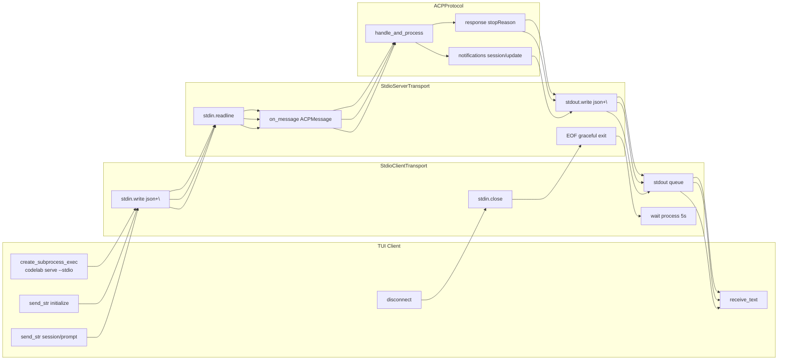
